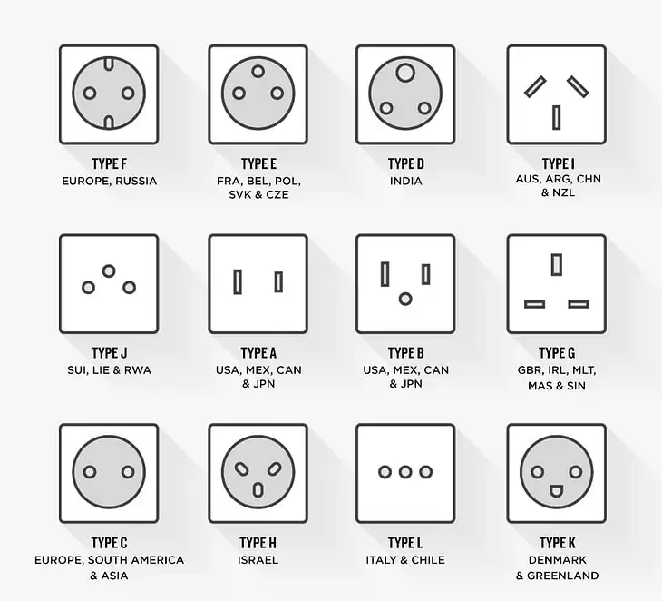

# Description and ToDo


**ToDo**


- [ ] Format to markdown

- [ ] Translate ever

- [ ] Translate all

- [ ] Sort


# Maps, tools and worldwide stuff

cities and ambitious http://www.paulgraham.com/cities.html https://ideanomics.ru/articles/923

**maps**

https://goo.gl/maps/x3bGyoqcfSWg5xUX8

Mapy.cz

https://www.sygic.com/travel

https://www.komoot.com/

http://www.cityspy.info/index.php/home just great maps over the Europe

Map.me

Organic Maps - https://organicmaps.app/ онлайн и офлайн карты, навигация.

HERE WeGo - maps and navigation

hoodmaps.com funny meme maps

Поиск билетов в разных странах: самолеты, поезда, автобусы, маршрутки, паромы

Moovit - https://moovitapp.com все варианты транспорта в одном месте.

rome2rio - https://www.rome2rio.com/ планирование маршрута и бронь билета.

12go - https://12go.co/en поиск транспорта и покупка билета.

Omio - omio.com билеты на поезд, автобус и самолет.

@Bussy_bot — tg билеты на автобусы по международным маршрутам

https://flightaware.com/

https://www.flightlist.io/index.php

Wise: https://wise.com/invite/ih

Honey: https://www.joinhoney.com

Skyscanner

Airfare Watchdog 

Secret Flying: https://www.secretflying.com/

Google Flights: https://www.google.com/flights

American Express Platinum Referral (for 60,000 points!): http://amex.ca/share/cHRISGanGb?CPID=...

Airhelp: https://www.airhelp.com/en/


Карта с авторскими блогами о жизни эмигрантов https://www.google.com/maps/d/u/0/viewer?hl=en&ll=39.81224131501931%2C56.09040536888404&z=3&fbclid=IwAR0aFFQceaUMimrGJALeM1Du9RB1qa0P5JvSkX94BF4-vn2NcUdkmlcGYUA&mid=1JGjMQmg_xNK4aInGlgXgb_ppBwfq8yng

mundraub.org

**sim**

They can charge extras if you use the phone less in the operator's country than in the roaming: https://digital-strategy.ec.europa.eu/en/faqs/roaming-questions-answers


https://www.super.ee

esimdb.com database esim
https://esim.holafly.com International eSIM plans for travel abroad

**internet**

https://drimsim.com/en - esim, 5g, cost depends on location. all of the setinng in app

https://birka.uk/esim/ - DreamSim's analogue.

https://unisim.net/prices/ - another analogue of DreamSim, but quite expensive.

https://mobimatter.com/ - Mobimatter is a digital channel for telecom services, enabling consumers to find and buy the best mobile offers through their favorite e-commerce platforms. No calls, internet only. cashback system. sometime cheaper than Airalo.  promo DJVAG66440

https://www.airalo.com/ - Airalo the most popular one esim aggr. really nice app cashback system. Promo code ALEXAN6942

https://etravelsim.com/ - there are even 100GB plans here.

https://www.airhubapp.com/ - there are plans with unlimited traffic and seemingly reasonable prices.

A good aggregator of different offers https://esimdb.com/.

**call**

https://www.openphone.com/- ref code https://www.openphone.com/referral/jWCqnAz

https://hushed.com/ - seems cheaper than openphone

**festivals, competitions, and links for the services**

https://www.top500bars.com/ https://www.instagram.com/top500bars/

Москва, Санкт-Петербург, Екатеринбург, Сочи, Казань.https://bar-challenge.roullet-cognac.com/

Mediabarmen https://www.mediabarmen.ru/ https://t.me/mediabarman независимый медийный конкурс для молодых барменов

https://t.me/hedowins про вино

Worldwide https://www.negroniweek.com/

http://bahfest.com/ BAHFest comics SMBC https://www.facebook.com/BAHFest/


michelin guide https://guide.michelin.com/en/ru/restaurants

WG fest https://vk.com/wgfest_ru https://www.instagram.com/wgfest/ https://worldoftanks.com/en/news/game-events/wargaming-fest-2019/

Art https://www.teamlab.art/

Austria, Worldwide  Arts Electronica fest  - https://ars.electronica.art/news/en/


https://www.fuckupnights.com

wearedevelopers.com

https://www.demoparty.net/ - https://twitter.com/demoparties https://social.cologne/@demoparties https://www.reddit.com/user/demoparty_net demo party events over the world

meetup.com

https://wearecommunity.io/ - community over the world

fosdem.org - FOSDEM is a two-day event organised by volunteers to promote the widespread use of free and open source software.

https://events.linuxfoundation.org/

https://www.ai-expo.net/northamerica/

https://events.linuxfoundation.org/kubecon-cloudnativecon-europe/


hackathon.io - hackathon  online/offline events

Scala events

Scala Conferences: 
* Functional Scala (UK/Remote)
* LambdaConf (USA) 
* Typelevel Summits (Misc.) 
* Scala by the Bay (USA) 
* flatMap (Norway) 
* Scala Up North (Canada) 
* Scala Days (USA, Europe) https://www.youtube.com/@ScalaDaysConferences scala days conf
* Scala World (UK)
* Scala Swarm (Portugal)
* Scala.io (France)
* Scalar (Central Europe) 
* Scala Sphere (Poland)
* nescala (USA)
* LX SCALA (South-West Europe)
* ScalaConf (Russia)

DS-events all over the world:

• Feb • WAICF - World Artificial Intelligence Cannes Festival • Cannes, France https://worldaicannes.com/

• Feb • Deep Learning Summit• San Francisco, USA https://ai-west-dl.re-work.co/

• Mar • MLconf • New York City, USA https://mlconf.com/event/mlconf-new-york-city/

• Apr • Computer Vision Summit • San Jose, USA https://computervisionsummit.com/location/cvsanjose

• Apr • SIAM International Conference on Data Mining (SDM23) • Minneapolis, USA https://www.siam.org/conferences/cm/conference/sdm23

• May • ICLR - International Conference on Learning Representations • online https://iclr.cc/

• May • World Data Summit• Amsterdam, The Netherlands https://worlddatasummit.com/

• May • The Data Science Conference • Chicago, USA https://www.thedatascienceconference.com/

• Jun • The AI Summit London • London, UK https://london.theaisummit.com/

• Jun • Machine Learning Week • Las Vegas, USA https://www.predictiveanalyticsworld.com/machinelearningweek/

• Jun • The Event For Machine Learning Technologies & Innovations • Munich, Germany https://mlconference.ai/munich/

• Jul • DELTA - International Conference on Deep Learning Theory and Applications • Rome, Italy https://delta.scitevents.org/

• Jul • ICML - International Conference on Machine Learning • Honolulu, Hawai’i https://icml.cc/

• Aug • KDD - Knowledge Discovery and Data Mining • Long Beach, USA https://kdd.org/kdd2023/

• Sep • RecSys – ACM Conference on Recommender Systems • Singapore, Singapore https://recsys.acm.org/recsys23/

• Oct • Enterprise AI Summit • Berlin, Germany https://berlin-enterprise-ai.re-work.co/

• Oct • AI Everything 2023 Summit • Dubai, UAE https://ai-everything.com/home

• Oct • AI in Healthcare Summit • Boston, USA https://boston-ai-healthcare.re-work.co/

• Oct • Marketing Analytics & Data Science (MADS) Conference • Denver, USA https://informaconnect.com/marketing-analytics-data-science/

• Oct • Data2030 Summit 2023 • Stockholm, Sweden https://data2030summit.com/

• Nov • Deep Learning Summit • Montreal, Canada https://montreal-dl.re-work.co/

• Dec • The AI Summit New York • New York, USA https://newyork.theaisummit.com/

• Nov • Data Science Conference • Belgrade, Serbia •https://datasciconference.com/

• Dec • NeurIPS • https://nips.cc/

• Dec • Data Science Summit • Warsaw, Poland • https://dssconf.pl/


https://freewalkingtour.com/find-a-tour


Koachella ~ burning man

https://biohackathon.dk/ - Copenhagen Bioinformatics Hackathon - 2021 Protein Edition

https://www.lambdadays.org/lambdadays2022

gob market online https://nerdsbayfair.com/

**blogs and channels**

https://staskulesh.com/ - блог о Новой Зеландии, Чили, Китае, Шотландии и вообще


**Apartments**

airbnb

booking

https://slowhop.com - find Apartments and houses


**housesitting**

> https://vas3k.club/post/16960/

https://www.nomador.com/

https://www.housecarers.com/

http://www.luxuryhousesitting.com/

https://www.mindmyhouse.com/

https://www.trustedhousesitters.com/


**Sport and travel**

BeMoreYou - runing club and mental health https://linktr.ee/bemoreyou  https://www.bemoreyoucommunity.co.uk/ https://www.instagram.com/bemore.you/

https://kamchatka.camp/adults - как детский летний лагерь , но для взрослых

http://extremegeorgia.ge/

https://www.antonskischool.com.ua/

Лимуд

https://russiantravelgeek.com/ - туры по миру https://t.me/russiantravelgeek

https://veloschengen.ru/ велошенген


https://www.komoot.com tracks


ROAD TRIPS AROUND THE WORLD UA/GB/PL https://www.instagram.com/vabo_trips 10% of the booking to support UKRAINE


Iceland and over the world ru-lang tours https://www.instagram.com/nonametravelblog

World wide tours https://www.viator.com/


**Bike**

https://www.bike-components.de/

bike24.com

https://www.sq-lab.com/en/ergonomics/sqlab-measurement-concepts/sit-bone-measurement/ - как померять жопу

**ES coffee**

Gardelli Coffee https://shop.gardellicoffee.com Обычно очень вкусные зерна и классный декаф. Хотя, однажды, взял у них кофе из Бразилии и сильно плевался, не смог допить.

La Cabra https://www.lacabra.dk Тоже считаются одними из топовых обжарщиков в Европе. Брал несколько зерен, остался доволен.

April Coffee Roasters https://www.aprilcoffeeroasters.com Летом у них был коллаб с CoffeeCircle, очень понравилось. Думаю и остальные зерна должны быть на уровне.


**relocation**

salaryaftertax.com - taxes by country

https://www.passportindex.org 

https://abroadunderhood.ru/

https://gambala.notion.site/Guide-36afb22b1de147c789a59b03b04282a9

https://ivarus.notion.site/ivarus/80025a7936f54b149d19d7b4d0c88b29

https://relocate.me/net-pay-calculators/

https://gsl.org/en/

numbeo.com

**work**

glassdor.com

https://logocytes.substack.com/p/solving-immigration-with-zero-policy?sd=pf

t.me/@g_jobbot

https://layoffs.fyi/ - в целом тут видно, где увольняют больше всего


**gov**

EU SIS 

https://edps.europa.eu/sites/edp/files/publication/16-11-07_sis_ii_guide_of_access_en.pdf

https://polisen.se/en/services-and-permits/police-record-extracts/schengen-information-system-sis--request-information/


https://www.fragomen.com/ - immigration service

https://www.aegee.org/ student association


taxes over the world https://taxsummaries.pwc.com/


**visas**

Job Seeker Visa Nations:
Germany

New zeland - https://www.immigration.govt.nz/new-zealand-visas/visa-lists/all-work-visas

australia -https://immi.homeaffairs.gov.au/visas/employing-and-sponsoring-someone/sponsoring-workers/learn-about-sponsoring/visa-options

canada

ireland https://www.irishimmigration.ie/coming-to-work-in-ireland/what-are-my-work-visa-options/applying-for-a-long-stay-employment-visa/employment-visa/

france - Special case work visas Talent Passport

netherlands
Austria
Japan
Spain

**education**

Школа анимации Poudriere http://www.poudriere.eu/en

Мероприятия RSVP https://www.rsvp-popup.com/


**strange subscription**

Bokksu: https://www.bokksu.com jp food 

Cocoa Runners: https://cocoarunners.com chocolate, coffee, whiskey. free for UK 

Perky Blenders: https://perkyblenders.com

Pasta Evangelists: https://pastaevangelists.com

Earth and Wheat Bread Box: https://www.earthandwheat.com

Brixton Wine Club: https://www.brixtonwineclub.com

The Cake Tasting Club: https://www.thecaketastingclub.com

Three Month World Spice Subscription: https://www.notonthehighstreet.com/thespicery/product/three-month-world-kitchen-subscription 

Three Month Freakshake Subscription: https://www.notonthehighstreet.com/honeywellbakes/product/three-month-freakshake-subscription 

**Stores**

Small cute things

https://flyingtiger.com/

empik.com

Bookdepository.com

https://www.healthlabs.care/

https://littlefinland.de/en/ - finland goods over eu

Финские дроны avartek.fi/?page_id=287


**tips**



**to sort**

https://latanadelpolpoinfo.wixsite.com/trattoriadimare have to go there smażony płace


# South Korea/Южная Корея.

https://www.reddit.com/r/southkorea/

https://www.reddit.com/r/koreatravel/

Ссылка в чат - https://t.me/+DRpohP4-57UxOTRi

before

Korea Electronic Travel Authorization 2 year, multy (just print it)

* заполненный опросник https://www.k-eta.go.kr/

* скан или фото основного разворота загранпаспорта (если фото, то с четким изображением без бликов и посторонних элементов);

* электронная фотография формата 3,5х4,5 см на белом фоне (можно автопортрет, сделанный на телефон, но с хорошим освещением и фокусировкой, без теней на лице.


before the board Q code - https://cov19ent.kdca.go.kr/cpassportal/biz/beffatstmnt/main.do?lang=en  (several days-hours before)


Граждане РФ могут пребывать в Южной Корее без визы/внж до 60 дней подряд, но не более 90 дней за период в 180 дней.2


Есть частная страховка и государственная обязательная. Частная выплачивает по факту - заболели - пошли в больницу - оплатили счета - загружаете сканы в приложение - получаете выплату. Государственная обязательная - позволяет экономить до 60-70% на всех медицинских услугах. К примеру, прием врача без гос страховки обойдется в 30-40 USD, а со страховкой - в 10-12.


В государственную страховку можно вписать супруга и детей - и платить чуть повышенную стоимость. Частные - делаются на каждого человека отдельно.


Влияет, причем очень сильно. Но говорить ли о факте заболевания, или нет - здесь лучше посоветоваться со страховым агентом. Если что - обращайтесь.


P.S. У меня два вида частного страхования - один возвращает до 90% от потраченной суммы, продлевается каждый год. Другой - онкологические заболевания, к примеру при онкологии выплачивается ~35k USD + 1k-20k в зависимости от вида онкологии.

Итого, если я иду в больницу - обследование + прием врача + таблетки = 150 USD, минус госстраховка = 40USD, минус частное страхование = 10USD.


Best times weather-wise are spring (March-May) and fall (September-November). weather is nice, trees are greener and flowers are everywhere.

Feb - cold. Jun - better


**apartments**

airBnB is still a thing here 

booking 

agoda

hotels.com works great too, but you might be overcharged. 

**maps**

Download some apps: "South Of Seoul" for TripAdvisor-like stuff and it has all kinds of stuff to do. 

Waze works for navigation 

Naver Maps - had great public transit routing. https://map.naver.com/

**lang**

Papagao -  best translator between Hangul and English.

예약 - это расписание запуска и остановки котла

**food**

Mango Plate app

корейские кафе не пускают поесть, если ты один -> все столики минимум на 4-х и все блюда рассчитаны на компанию. Ну либо ты доплачиваешь за 3 места и сидишь один

just in case youre vegan

https://veganseoul.com/

Just thinking about what foods (tasty ones) you can look for as a vegan:

bibim naeonmyun or jjolmyeon and ask for no egg

bibimbap with no egg or meat

Japchae with no meat

I'm sure there are kimbaps at kimbap places that'll have it without egg or meat

Soon tofu (served like this: https://mp-seoul-image-production-s3.mangoplate.com/1743214_1655885733616853.jpg)

kong guksu (soy milk and noodles) - one of my fav foods of all times

kong bijji (ground soybeans soup) - but not 100% sure if you can find it without a meat based broth

buchujeon (chive pancake) - Also one of my all-time favorite foods

dotori mukbap - acorn jelly on rice, sometimes with a seaweed based broth (ask for no egg)


**services**

market global

ssg.com 

global versions of ticketing sites like melon, interpark, yes24.


shop online

Coupang Gmarket Musinsa - like Taobao/aliexpress

most online retailers like Coupang, Musinsa, etc. require a phone number linked to an ARC (alien registration card) that is issued to long-term visa holders. Tourist visa or K-ETA are unable to apply for an ARC, there most online shopping will be quite restricted, if not impossible.


**transport**

transit is EXTREMELY inconvenient in places outside big cities.


https://www.seoul-airport.com/transportation.php

https://english.visitkorea.or.kr/enu/TRP/TP_ENG_2_1.jsp


**tips**

Korean people can act like rasists, just dont't mind

Use 2 hands to give|recive anything. Using one hand is rude

## Сеул/Seul

Ссылка в чат - https://t.me/+gx7-lCA3Ko8xYjNi

Fire fest -> too much peple arould. Really crowd


**tatoo**

https://www.instagram.com/oonloooooooo/

**apartments**

staying close to the Gyeongui Line Forest Park. It's a beautiful safe green space for toddlers to run around. This park borders Hongdae and Yeonnam.

staying in places like Gangnam or Hongdae.

Myeong-dong is a great central location to stay in Seoul. Lots of stuff close by

The Hamilton Hotel is currently under investigation due to the Itaewon tragedy that occurred on Halloween, I'd recommend staying elsewhere.

Dragon Hill Lodge in Yongsan. It's a nice western-style hotel put on by the DoD for travelers and walking distance to Itaewon amd the subway to everywhere else.


**to go**

War Memorial

National Museum

Seoul National University

Namdaeumun Market

Seoul Tower

Namsan Park Observatory

Yonsei University

Gwanghwamun Palace

Gyeongbokgung Palace

Gamcheon Culture Village

Haedong Yonggungsa Temple

Jagalchi Market

Busan Tower

Biff Square

COEX Mall

Starfield Library

Dongdaemun Market

Dongdaemun Design Plaza

Korea University


**clubs**

Yeah Aura is really bad. I don't get how it is so popular among koreans. All I'm seeing is people in suits spending hundreds on tables lmao

From my memory most clubs in Hongdae have pretty small dance floors. It really depends how early you go there. B1 / A:tension / XX dance floors are also pretty small but still a lot of fun if you are into HipHop.


"CakePop" got a pretty big dancefloor if you're into the music they are playing. Club is pretty new and got a cool design. I think it's where Cocoon was originally? NB2 floor is pretty big too if i remember correctly.

На Итэвоне кругом одни бары и клубы, а там только алкоголь

**food and drinks**


[Dugahun](https://map.naver.com/v5/entry/place/33315120?id=33315120&c=14134912.3184590,4519857.2918631,15,0,0,0,dh)- Dinner option. avg $105, but lunch is only about $50. http://www.dugahun.com/

Mr Ahns -  you can make a reservation online.


Born and bred - kbbq, if you have unlimited budget 

chaggo 43  - kbbq

wangbijib  - kbbq

경천애인2237 - kbbq

Doma Hongdae - kbbq. it's extremely popular so make a reservation through Instagram. 

춘자 - really good sushi place over by Korea university for dinner, there’s a  if you’re into that. is also really popular among students for snacks and drinking. There’s also a really popular Japanese place that always has lines, but it’s worth the wait.

Greem cafe - https://instagram.com/greem_cafe

The Bread Blue (near Sinchon Station) - vegan bakery

24h

This is all twenty four hour cafes I could find on their websites. There were a lot so I just wrote them as branch names, couldn't be specific.


Ediya (mangwon station - don't open twenty four on Sundays)

Tom n toms in Seoul, south part (Apgujeong, Apgujeong rodeo street, Nonhyeon, Nonhyeon 1st, Gangnam baroseum, Jamsil saenae, Bangi, Munjeong Rodeo, Seoul national university station, Nangok sageori, Sindorim, Mokdong, Gangseo district office)

Seoul north part (DMC, Shichon rotary, Mapo dohwa, Seongkyunkwan university station, Janghanpyeong station, Janghan 1st, Gwangjin hwayang, Konkuk univ., Wangsimni centlas, Wangsimni station, Hanyang university station, Gongneung station, Changdong, Nowon)


Tom n toms near Seoul (Taepyeong, Jeongja, Guri)

Tom n toms black (Apgujeong, Cheongdam, 그레이트 (in Gui), Sangbong megabox)

Egg tom tom (Yeoksam)

Tom's covery (Cheongdam)


Angelius (Konkuk university station, Guro digital station, Gangnam station, Suyu station, Bulgwang station, Seolleung gold rose, Isu station)


Hollys (Gangnam station 2nd, Sinelim sageori, Hongdae station exit 2, Noryangjin, Seoul national university sageori, Konkun university station, Dangsan station, Gubeundari station, Asia seonsuchon, Mokdong yesurinhoegwan)


투썸 (Nowon cultural street)

**anime**

ANIME CLUB 부산 애니메클럽 https://maps.app.goo.gl/qiJBmXqyZq5L8tGF8?g_st=ic

애니메이트 부산점 https://maps.app.goo.gl/Ww2ga9E8eZ7u2KtMA?g_st=ic


Source (there can be updates one day so pls double check it)

https://www.tomntoms.com/store/domestic_store_search.html

https://m.angelinus.com/shop/shop.html

https://www.ediya.com/contents/find_store.html#c

https://m.hollys.co.kr/store/korStoreDetail2.do

https://mo.twosome.co.kr/so/storeList.do?scope=all


## Пусан

Ссылка в чат - https://t.me/c/1776072744/3802


# Ch

Alipay tour pass for china pay and transport

Джифубао - слово для алипея 
Didi - такси удобное

Жилье опция принимать иностранцев
Trip.com или чунар

Без VPN ничего не работает. Но спросить местных какие работать

Лучше местную китайскую симку. По всему миру симки могут не работать

Китайское приложение карт Amap строит пеший маршрут с учётом теней — можно пройти чуть дольше, но зато меньше на палящем солнце.

**tips** 

Типичные Китайские имена типа российского Иван Петрович Сначала фамилия потом имя. Li Si, Wang Wu, Zhang San


# JP

**before trip**

https://vas3k.blog/world/japan/

Если шиканёшь и напишешь, что «хочешь пожить в рёкане и посетить онсен» — то дальше, наверное, даже не читают, ты по-умолчанию свой. Шаришь.

**Metro**

проездной - маст-хев.

Частная JR (как правило в пределах Токио надземная)

Государственная (в пределах Токио, как правило подземная), что как раз и зовется "Токио метро" (https://en.wikipedia.org/wiki/Tokyo_Metro)

Toei Subway (https://en.wikipedia.org/wiki/Toei_Subway)

Особняком еще можно сказать стоит одна ветка:

Yurikamome (https://en.wikipedia.org/wiki/Yurikamome)

Pasmo/suica удобны тем, что они работают на всех.

Исключения (в районе Токио):

Несколько специальных поездов-рапидов, из важных для туристов - один из них идет с аэропорта Нариты и на него нужен дополнительный билет с автомата в любом случае.


JR Pass — универсальный проездной на поезда по всей стране на 7-14-21 дней. 

JR Pass:

+ Позволяет кататься по всей стране за фиксированную сумму

- Стоит неприятно дорого, около 40 евро в день

- Практически бесполезен в Токио. Работает только на линиях JR (Japan Railways), а в Токио метро поделено на несколько компаний и на них вам будет просто нельзя (или придется покупать проездной).

- За пределами городов некоторые «туристические» ветки тоже частные


Карточка-кошелек:

+ Хороша в городе. Сколько ездишь — столько и платишь

+ Работает по всей Японии вне зависимости от места покупки

+ Можно покупать кофе в автоматах

- Платишь за каждую поездку, может выйти в копеечку и придётся постоянно пополнять

На некоторых станциях метро есть даже специальные будки, куда вы можете сесть с ноутбуком, чтобы провести «экстренный рабочий созвон»


**money**


При всей киберпанковости и прогрессивности Японии, кеш в ней сильно обязателен. Ваши «мастеркарды» будут принимать только в больших магазинах и конбини, так что в половине мест скорее всего придётся платить именно кешем.


Так что снимите сразу тыщ 50 иен (350 евро), для начала хватит, зато на комиссии сэкономите.


**Culture tips**


Что делает администрация парка? Анализирует цветение сакуры и составляет календарь когда и откуда нужно фотографировать сакуру так, чтобы ваша фотография получилась самой идеальной для каждого конкретного месяца.

На полу рисуют маркеры. Если ты стоишь не там — твоя фотография заранее не идеальна и на тебя все косятся. Дурак наверное.


рисуем на платформе специальные линии по которым все должны строго ходить, чтобы не стукаться.


в музеях мы нарисуем стрелочки как ходить что бы вы достаточно полно насладились отражением закатного солнца в весеннем пруду.


на улице, на уголках бордюра резиновые накладки - это действительно удобно


stuff usually shout to you (especially in Isekaya)

organised dating parties are popular Asekia - group dating for completely strangers


**car**

Процесс снятия тачки в Японии ничем не отличается, кроме одного нюанса — тут всё тяжко с иностранными правами. Японцы почти всегда требуют «международную» книжечку с полным переводом на японский.

Израильские права, оказывается, принимаются без всяких переводов.

**Food**

Два самых популярных конбини — Seven-Eleven и Family Mart. 

В большинстве ресторанов либо меню с картинками, либо на входе висят специальные «макеты» блюд.

Пластиковый рамен — топ сувенир


**shop**


https://www.cando-web.co.jp - 100Y shop C очень, очень широким выбором и нормальным качеством

Daiso - all for home 

Don Quixote - all for home

BOOKOFF — крупнейшая японская сеть б/у товаров. https://www.bookoff.co.jp/inbound/

**Что везти с собой**

* Ножи

* кемпинг гаджеты от Snow Peak, Nanga или Montbell

* Любые гаджеты - всё электронное стоит в Японии дешевле. Но аккуратнее с питанием ибо в Японии сеть на 110 вольт, а всё, что питается от условного USB или 12 вольт можно смело брать.

* Кимоно. суровые кимоно из толстенной шерсти, ультра-мягкие шелковые халатики, можно найти киберпанковые кимоно для вечеринок или поездок на Burning Man. по ценам типа 200 иен (это меньше двух евро) за обычные или 2000 иен (14 евро) за прям классные.

* Инструменты. Например Makita. Как опция еще кожу, химию для неё, инструменты по коже. И японскую пилу. И хигоноками (igonokami ( 肥後守) is a type of folding pocket knife)

* 100-иенники, всратые сладости, матча


*такс-фри* 

Если вы иностранец — его тут сразу вычитают из цены товара прям в магазине и ничего не надо возвращать «потом». Просто покажите паспорт на кассе (работает не везде)

## Tokyo/Токио/東京


несколько туристических точек притяжения — Сибуя, Кабукичё, Синдзюку.

Если вы не знаете где это — просто сохраняйте названия в заметки, на месте найдёте, а лишних названий тут точно не будет.


Кол-во и качество отелей в Токио таково, что выиграша в стоимости не будет, а вот потери во времени и цене проезда - будут заметны.


*Кабукичё*

Главный район киберпанка, кошкодевочек и драг-дилеров всего Токио.


Don Quijote (или просто «донки») — самый знаменитый сетевой магазин Японии, где продают отборную трешанину. Это даже не описать словами, нужно идти и смотреть самому.


Champion Bar —https://goo.gl/maps/1Vh4QNBQfUdBSpHM7. Он скрыт в подворотнях, но там куча мини-барчиков на 3-5 человек, куда приходят в основном пообщаться с барменом.

Другая сторона. Узкие улицы с мини-барчики. Но почти во всех есть «charge» — то есть плата за вход с человека. Так что особо не побархопишь


*Янака*

Полная противоположность трешу и нуару ночного Кабукичё.


Янака — это старый район с кладбищем, маленькими домиками и локальными лавками со свежей рыбой и электроинструментами. Туда нужно идти в будний день и наслаждаться его обитателями, локальной жизнью и тихой атмосферой маленькой Японии.


*Одайба*

Одайба — новый насыпной остров в бухте Токио с ультра-современными домами. В смысле они и появились там, потому что раньше на этом месте было море, а японцы решили насыпать там земли, потому что строить в Токио было больше негде.


Кто-то едет туда посмотреть на огромного Гандама. Кого-то привлекает полностью автоматизированная (да, без машинистов) ветка метро на колёсах Yurikamome. Есть просто любители современных Японских районов с красивыми набережными и Статуей Свободы на одной из них.


*Джингумае и улица Такешита

*Возьмите вот эту точку — станция Омоте-Сандо https://goo.gl/maps/v21VnzoYTGPqTMbH9 и проведите круг радиусом примерно с километр. Вот все эти улицы и подворотни обязательны для исследования.


Это район для шоппинга.


Вастрик, ты ебанулся, мы же тут потные айтишники, а ты нам шоппинг?


Да, потому что оно того стоит. Японский шопинг вообще другой. Вы охуеете от киберпанковости происходящего и совершенно другой моды. То, что раньше вы могли найти разве что у дизайнеров на Etsy или на фотках в Pinterest, тут висит прямо на улицах.


целиться в галерею Лафорет https://goo.gl/maps/18GpHUancmqGdrVf9 и улицу Такешита. Там куча маленьких магазинов всяких местных дизайнеров, где можно урвать себе стильные киберпанковые мантии по цене обычного худи. Ребят из Москвы может оно и не удивит, у них таких магазинов было много, но мы из Европ здесь просто внутренне орём от восторка.


Ну а улицу Такешита легко запомнить потому что она на латинице «Take Shit» Street.


Не знаю специально было это сделано или нет. Но в чеках от покупок очень смешно выглядит.


*Залезть на администрацию в Синдзюку*

Обязательно уделите один из вечеров в Токио, чтобы залезть на одно из зданий местной администрации, которое так и называется — Tokyo Metropolitan Government Building. https://goo.gl/maps/aMUsJp9zEGNdo9bz6


Это бесплатно! Здание правительства, а значит всё уплочено из налогов!


На входе вас встретят очень милые японцы, которые бесконтактно (!) досмотрят ваши сумки и отправят на лифте на высоту 200+ метров, откуда открывается вид на город на все 360 градусов.


Крайне рекомендую подгадать время и приехать за 30-50 минут до заката. Тогда вы увидите Токио днём с высоты, потом увидите закат над Фудзи (да, отсюда её тоже видно, что редкость для Токио), а потом покажут и ночные огни огромного мегаполиса.


Да, всё через стекло, но всё равно это офигенно красиво и абсолютно бесплатно.


В качестве доната, можете купить там в сувенирной лавке прикольные стикеры с регионами Японии, в которых собираетесь побывать. Потом наклеите их в альбом, так все японцы делают. Нет стикера — считай не побывал!


*Йокогама*

Нет, это не шины. Это соседний от Токио город, куда легко добраться за 40 минут на экспрессе. Много веков Йокогама была чуть ли не единственным портом, куда разрешали заходить иностранным кораблям. Морякам разрешали ночевать в городе, но не покидать его. Так Япония держала свою изолированность от остального мира.

Именно из Йокогамы японцы аж только в 19 веке узнали про такие вещи как, например, хлеб, мороженое и уличное освещение.

Сейчас там можно гулять, есть прикольный китайский квартал, а на набережной тоже стоит огромный Гандам, на которого даже можно залезть.
В горных деревушках всегда можно найти традиционные японские отели — рёканы, где вам прямо на входе выдают тапочки и кимоно, а потом вы во всём этом великолепии идёте в онсен, где моетесь и потом лежите набираетесь силы земли в этом самом горячем источнике. После рекомендовано навернуть саке из чайничка.
Сами онсены бывают очень разными. Какие-то делают прямо на улице, с красивыми видами, другие напоминают просто большой горячий бассейн в помещении. Их объединяет одно — в онсены принято ходить полностью голыми.


Заклеиваем тату лентой, чтобы пустили в японскую баню
Если онсен публичный, то есть там моются и другие японцы, в нём чаще всего будут запрещены татуировки. Татуировки в Японии считаются знаком Якудз, потому их придётся заклеить специальной лентой, которую нужно заранее купить в магазине или любой аптеке.
В приватных онсенах, которые вы бронируете только на свою компанию, таких правил нет.


Японский гриль — это когда тебе выдают кучу сырого мяса, в центре стола ставят гриль и ты жаришь всё это себе сам.

**food**

The Restaurant of Mistaken Orders/ Ресторан ошибочных заказов (〒116-0012 Tokyo-to, Arakawa-ku, Higashi Oku 1-1-4) http://www.mistakenorders.com/en/home.html


Hub British Pub chain - uk Fish and Chip
Malins Fish and Chip Shop - uk Fish and Chip
Hobgoblin Pub - Fish and Chip


## 京都/Киото


Киото — один из старейших городов Японии, который больше 1000 лет подряд вообще являлся её столицей. Хоть он и находится в 30 минутах езды от большой красивой Осаки, здесь стоит отдельно остановиться на пару дней.


Если в Токио едут ради киберпанка, в Осаку ради шоппинга и «вайба настоящего города», то в Киото едут ради истории. Здесь просто нелегальное количество храмов, гейш и прочих садов камней на квадратный метр.


Напиши в гугле «Япония» и фотографии из Киото, наверное, будут занимать примерно половину картинок в выдаче.


Но так как я не умею красиво рассказывать про достопримечательности, я снова просто приложу свой топ мест, куда надо сходить. А там вы и без меня всё нагуглите в других статьях.


Киото строили как по линейке, как и все старые японские города.


2. Рынок Нисики

Локальный рынок, где продают всё — от устриц на гриле до кроссовок и украшений. Рекомендую залипнуть, всё попробовать и накупить сувениров.


Именно здесь мы купили себе классный японский нож.


3. Храм лисицы

Точнее бога Инари, но лисы считаются его посланниками.


Это тот самый храм с тысячами оранжевых ворот. Ворота ведут прям на гору, так что в самом начале пути обычно куча турья, а ближе к середине подъема уже почти никого нет и можно красиво фоткаться.


4. Храм Киёмидзу-дэра

Один из самых популярных и фотографируемых храмов в Японии.

После осмотра еще рекомендую спуститься вниз и погулять по окружающим. Если повезет с погодой — там 10 инстаграмов из 10

А еще в Киото находится штаб-квартира Nintendo. 


## 大阪/Осака


Киберпанк посмотрели, историю посмотрели, теперь время насладиться настоящим городом. По крайней мере именно первое впечатление от Осаки было именно таким. Она в разы меньше Токио, от того она менее корпоративно-хаотичная, а скорее более чилловая и понятная. Уже на третий день я даже начал ориентироваться в городе.


Осака так же была единственным городом Японии, где нам удалось просто так случайно заобщаться со случайными японцами в барах. Они были крайне в говно, но очень хотели узнать какой город нам понравился больше — Токио или Осака.


Когда я сказал, что Осака душевнее, они на радостях нажрались еще больше и один японец сказал что-то типа «Да. Токио. Люди там. Сухие такие. Знаешь. А Осака. Хорошие люди. Открытые очень».


После чего японец упал и его унесли друзья.


Ну в общем идею мы уловили.


В следующий раз я познакомился в караоке с молодым японцем-учителем английского языка из деревни. Всё началось с разговоров о жизни, а закончился вечер тем, что он меня тащил за руку в комбини в соседнем районе, чтобы показать «самое настоящее японское уличное бухло, которое пьют все студенты».


**1. Шоппинг вокруг Namba и Shinsaibashi**


Осака вообще изначально город торговцев и моряков. Она даже появилась просто потому что Киото нужен был морской порт. Потому в Осаке есть вот этот чуточку интернациональный и свободный вайб, а одно из исторических главных развлечений — разнузданное потреблядство :)


Но раз я поставил его на первое место, значит что-то в этом есть.


Южный центр Осаки — это один большой торговый центр. Они накрыли улицы крышами между домов и превратили их единое пространство, где куча ресторанов, магазинов, караоке и прочего.


Здесь реально можно залипнуть на пару дней, рассматривая гаджеты, традиционные тарелочки, странную одежду и еду. Но будьте осторожны, а то не успеете посмотреть «классические достопримечательности» из других гайдов.


**2. Набережная Dotonbori**


Центр ночной жизни Осаки. Тут происходит весь трэш и угар. Паб-кроулить в пятницу нужно здесь, да. Обязательно попробуйте такояки из уличных лотков. Тут они максимально свежие и трушные. ?


Именно здесь мы и встретили Рождество, которое японцы тоже празднуют 25 декабря. С Рождеством у японцев вышло весьма интересно. Они вообще не понимают как его встречать. Все эти Иисусы и Санта Клаусы — это чисто заморская фишка, которой в Японии никогда не было. Но им она так понравилась, что ну очень стараются.


Даже придумали этому название — Курисумасу. И да, это официальное слово :)


Получается красиво, но иногда вот так https://mobile.twitter.com/sweet_foxtato/status/1470096747124903942. Ну, не разобрались пока ребята. Не нам их винить.


Традиционный же рождественский ужин в Японии — это поход с друзьями в KFC. И это не шутка. Kurisumasu ni wa Kentakkii! https://www.techinsider.ru/editorial/755303-pochemu-v-yaponii-kurochka-iz-kfc-schitaetsya-tradicionnym-rozhdestvenskim-blyudom/


**3. Kuromon Market — рынок, где надо ужраться морепродуктами**


Лучшее место для завтраков. Огромный рынок с морепродуктами и свежим японским вагю, которое прямо при вас разделывают, готовят и выдают на тарелочке с мисо-супом. Мы жили рядом и ходили сюда каждый день, чтобы перепробовать все виды крабов, гребешков, лососей и японских коров,


**4. America Mura — Американская деревня**


Один из примечательных https://goo.gl/maps/ZM3gaSFSREQSgRq69 районов Осаки так и называется — американская деревня. Она так называется потому что с 1970-х, когда Япония начала немного восстанавливаться после Второй Мировой, здесь был район молодых и свободных хипстеров, куда сюда хлынуло очень много товаров из США.


America Mura — одно из немногих мест в Японии, где их любовь к самоизоляции немного дала трещину. Тут много вывесок на английском, американских машин, которые чудом помещаются в узкие японские улочки, есть даже кофейни.


Очень забавный микс культур,


**5. Nara — деревня с оленями на улицах**


В получасе езды от Осаки находится деревня Nara https://goo.gl/maps/cjAHtMLfqTwRM4nB9, знаменитая тем, что там по улицам ходят олени. Их много, больше тысячи, и они сконцентрированы вокруг большого парка в центре.


Олени наглые, могут укусить вас за жопу. Особенно если вы держите руки в карманах, тогда они думают, что вы прячете там еду.


Нара заботится о здоровье оленей, так что всем подряд кормить их нельзя, а нужно покупать специальные хрустяшки на улице у бабушек за 200 иен. Олени их обожают.


# Iceland

Iceland ru tours https://www.instagram.com/nonametravelblog

**job**

www.alfred.is - An Icelandic job board offering job opportunities in various fields.


# Norway

**job**

www.finn.no - A Norwegian job board providing job listings and services


# Finland

HSL – покупка билетов на общественный транспорт. Дешевле, чем у водителя и в автомате. Маршруты, расписания — всё в нём.

MobilePay – популярная и простая штука для перевода денег с карты на карту, нужно только знать номер телефона человека.

Foodora – для заказа еды из ресторанов.

Yango – переобутое «Яндекс.Такси». Цены ниже, чем в Uber. Если есть российское приложение, переустанавливать не надо, всё будет работать и в Хельсинки.

Helsinki Bikes – для аренды велосипедов; посмотреть, где ближайшая станция, сколько там великов, составить маршрут.

Northern Lights Aurora Alerts – искателям северного сияния. Показывает вероятность его появления, следит за солнечным ветром, ну и погодное заодно.

Yle Areena – телевидение и радио в смартфоне, приложение в десятке самых популярных после стандартных мессенджеров.

VR Mobile – старенькое, но рабочее приложение для покупки билетов на электрички и поезда по Финляндии.


Map of every public sauna in Finland https://www.reddit.com/r/MapPorn/comments/6hxek9/map_of_every_public_sauna_in_finland_1200x1018/


Shaman's Terva Tar-flavored Liqueur 21% is a true Finnish specialty. The taste is fine smoky and slightly sweet, associated with campfire, summer scent and sauna.


Всё о ВНЖ

— Я получил оффер, что дальше? Процесс получения финского ВНЖ
Я получил оффер, что дальше? Процесс получения финского ВНЖ

Надеемся, этот пост скоро пригодится участникам прошедшей ярмарки вакансий 😉

Как сейчас дела обстоят с другими визами в Финляндию расскажем в следующих постах.

Какие документы вам понадобятся для заявки на resident permit

— Действующий загранпаспорт. Если срок вашего паспорта заканчивается раньше, чем через 2 года, желательно заранее получить дополнительный.
— Гражданский паспорт.
— Фотография не старше 6 месяцев.
— Контракт или оффер компании, куда вы устраиваетесь на работу.
— Оригинал диплома и его нотариальный перевод. Важно: апостилировать не нужно. Если диплома по специальности у вас нет, подтвердить квалификацию можно с помощью копии трудовой с переводом, контрактов на английском языке, вашего CV. 
— Если вы едете с семьёй, вам понадобятся свидетельства о браке и о рождении детей. Необходимо апостилировать оригиналы этих документов, сделать нотариальные переводы и их в свою очередь апостилировать в минюсте. Вы также можете переехать с партнёром в "гражданском" браке, для этого необходимо доказать минимум 2 года совместного проживания. 

Заполнение заявки на ВНЖ

Заявка заполняется на сайте Enterfinland.fi. Если вы едете с семьёй, обязательно подавайтесь вместе в один день, так как воссоединение рассматривается значительно дольше, до полугода. Подробнее читайте в этом посте. А также смотрите нашу подробную видео-инструкцию по заполнению. 

После подачи забронируйте слот на сайте посольства/консульства для подтверждения личности. Это тоже желательно делать всей семьёй в один день, чтобы ваши заявки случайно не "открепились". В этом посте читайте что делать, если это всё-таки произошло. Если слотов нет, пишите напрямую на электронную почту. 

Одобрение заявки занимает до 2 недель. Карточку отправят вам службой доставки или можно будет забрать в визовом центре. Раньше доставка занимала примерно неделю, сейчас срок может быть больше.

После получения ВНЖ вам обязательно пригодится наша подборка статей для переезжающих. В ней подробные посты о том, как подготовиться, что вас ждёт после прибытия, какие документы нужно будет оформлять и многое другое. 

— Все опции подачи на ВНЖ (fast track, visa D)
Финляндия продолжает выдавать ВНЖ для специалистов за 3 дня по fast track

ВНЖ выдаются в прежнем режиме. Есть несколько вариантов:

1. Стандартная подача на ВНЖ. 
Официально одобрение заявки до месяца, по опыту людей из нашего чата решение приходило от нескольких дней до недели. Из плюсов: консульский сбор оплачивается российской картой или наличными в визовом центре. ВНЖ можно забрать в визовом центре или заказать курьером на дом. От момента одобрения заявки до доставки карточки может пройти от недели до месяца. Из минусов: очереди на подтверждение личности.
2. ВНЖ + fast track (выбираете опцию при подаче заявки). Одобрение до двух недель, на деле может быть несколько дней. Оплатить заявку нужно сразу на сайте при подаче, принимаются только иностранные карты. Так что если работодатель не может оплатить за вас пошлину, придётся заручиться поддержкой друзей с заграничной карточкой. После подачи фаст треком необходимо подтвердить личность в течение 5-ти дней, пишите после заполнения в посольство/визовый центр, чтобы вам своевременно выделили слот. Fast track — ваша гарантия ускоренного рассмотрения.
3. ВНЖ + fast track + visa D. Одобрение по такой опции может быть на следующий день, также на следующий день вы получаете паспорт с вклеенной визой Д. Сразу после одобрения ВНЖ вы можете въезжать в Финляндию и получать карточку уже на месте.  Сбор за визу D 95е.

Важно! Если вы переезжаете по ВНЖ с семьёй, все этапы переезда лучше проходить одновременно: подачу заявки на визу, подтверждение личности в консульстве, переезд, получение документов непосредственно в Финляндии. Иначе отдельные процессы для вашего супруга/супруги могут растянуться до нескольких месяцев.

Для родственников и друзей, подающих на визы по приглашению, заявления принимаются в любые дни, кроме понедельника. Квота на такие визы 80% от общего количества. Кроме [стандартных документов](https://finlandabroad.fi/web/rus/kak-podat-na-vizu#%D0%9F%D0%B5%D1%80%D0%B5%D1%87%D0%B5%D0%BD%D1%8C%D0%BE%D0%B1%D1%8F%D0%B7%D0%B0%D1%82%D0%B5%D0%BB%D1%8C%D0%BD%D1%8B%D1%85%D0%B4%D0%BE%D0%BA%D1%83%D0%BC%D0%B5%D0%BD%D1%82%D0%BE%D0%B2%D0%B8%D0%BF%D0%BE%D1%80%D1%8F%D0%B4%D0%BE%D0%BA%D0%BF%D0%BE%D0%B4%D0%B0%D1%87%D0%B8%D0%B7%D0%B0%D1%8F%D0%B2%D0%BB%D0%B5%D0%BD%D0%B8%D1%8F) нужно будет приложить приглашение в свободной форме, содержащее имя и фамилию приглашающего, контактные данные, дату рождения, адрес, номер паспорта, цель и продолжительность путешествия. По сообщениям из чата, родственникам такую визу могут дать либо до конца действия загранпаспорта, либо до конца срока ВНЖ.

— Как подать на ВНЖ находясь в Финляндии


— Сколько времени занимает одобрение ВНЖ специалиста, если подаваться в Финляндии

— Что делать, если при совместной подаче на ВНЖ отвязалась заявка семьи

— Переезд по студенческому ВНЖ
Поступление в финский вуз

Иностранцам в Финляндии можно учиться бесплатно, если язык обучения финский или шведский. В нашем случае язык программы формально шведский, но все предметы на английском и французском. Шведский преподают отдельно с нуля, по нему обязательно набрать определённое количество кредитов во время учёбы. 

Ищите программы, похожие на ваше предыдущее образование, а требования к финскому/шведскому минимальные или отсутствуют. Бывают программы на финском (особенно на технические направления), где на входе требования к языку A1, а обучение проходит на английском. 
Программы можно искать на сайте opintopolku.fi/konfo/en/

Мария поступила в Åbo Akademi на магистратуру по французской филологии. Для этого достаточно было отправить перевод российского диплома бакалавра и копию сертификата на знание французского языка. Никаких дополнительных документов, экзаменов и собеседований. Заявку подали в марте, в конце июня пришло уведомление о поступлении. В начале сентября уже были в Финляндии.

Единственный минус переезда на основании учёбы — необходимо показать наличие определённой суммы на счете. Студентам - 6720е, их супругам - 8400-12000е. Счёт в рублях в банке РФ подходит, главное, чтобы сумма в эквиваленте была не меньше. 

Студентам в Финляндии можно работать до 30 часов в неделю. Супругам студентов ограничений нет. ВНЖ даётся: студентам - на всё время обучения, супругам - только на первый год, потом нужно продлять.

Подача на ВНЖ

— 2.08 - подача заявки и подтверждение личности 
— 6.08 - на enterfinland появилась информация что документы получены
— 18.08 - пришло положительное решение
— 5.09  - забрали карточки ВНЖ.

Переезд в Финляндию

Если вы едете из Москвы и у вас нет детей/домашних животных, то рекомендую посмотреть поезд Москва-Сортавала с остановкой в Выборге. Он гораздо дешевле Сапсана, особенно если брать билеты незадолго до отправления. Единственный минус — поезд приезжает в 4 утра, а автобус из Выборга в Финляндию отправляется около 10. 6 часов пришлось сидеть на вокзале. 
Когда покупали билеты на поезд, терминал в Лаппеенранте отказался принимать нашу узбекскую карту. Мы скачали приложение и легко купили билеты онлайн (с той же самой узбекской картой 😊).

Квартиру сняли с помощью организации, которая предоставляет жильё студентам. Для этого нужно письмо о поступлении в ВУЗ. Такая организация есть в каждом городе. Снимаем однушку 35 кв.м. относительно недалеко от центра города за 470е. Вся коммуналка включена в стоимость.

— Статистика одобрений ВНЖ в Финляндии

https://tilastot.migri.fi/index.html


ежедневную информацию о свежих новостях в Финляндии вы можете отслеживать на общественном канале YLE https://yle.fi/uutiset/osasto/novosti/ на русском языке.

Подборка блогеров о Финляндии на русском языке https://intofinland.ru/блоги

Ютуб-блоги:

Сейчас наверное самый популярный YuraPapu https://www.youtube.com/user/yuraPaPu Юра раскрывает на канале актуальные для него и финнов темы и рассказывает о своей жизни в этой стране.

Второй хороший влогер Илья, работает учителем русского языка https://www.youtube.com/channel/UC-byIm563iMJsCYZ0t-qwmQ/videos Вам будет интересно посмотреть, например, на каких вакансиях работают русско-язычные и в каких городах. Как финны относятся к русским и другие сюжеты.

Еще полезные ссылки
http://www.doska.fi – работа, жилье, животные и пр

https://finland.fi/ru/ / - культура, искусство, общество

https://novosti.fi – новости на русском

https://www.visitfinland.com/ru/ - туризм

https://www.lomarengas.fi/ru /- аренда дач и коттеджей на отпуск


интернет магазины в Финляндии и ЕС.

k-ruoka.fi, foodie.fi продукты из магазинов с доставкой на дом

zalando.fi, bubbleroom.fi, nelly.com next.fi одежда – EU 

emmy.fi брендовая одежда second-hand

k-rauta.fi все для строительства или ремонта дома

motonet.fi все для машин, мотоциклов, рыбалки

tokmanni.fi, karkkainen.com все для дома и не только 

jysk.fi, asko.fi, isku.fi, ikea.fi, sotka.fi мебель и прочий дизайн дома

cocopanda.fi, lyko.fi, eleven.fi косметика и парфюм – EU 

lastenturva.fi, lastentarvike.fi, jollyroom.fi все для родителей в ожидании пополнения в семье и для малышей

verkkokauppa.com, gigantti.fi, power.fi бытовая техника, телефоны, компьютеры 

stockmann.fi, sokos.fi одежда, косметика, парфюм

iittala.fi, arabia.fi посуда

bonusapteekki.fi, yliopistonverkkoapteekki.fi, nettiapteekki.fi аптека

mulletoi.fi всякая ерунда 

totalli.com, nettiauto.com машины из разных магазинов на одном сайте

nettivene.com лодки и катера

bikester.fi велосипеды

freska.fi уборка дома

ifolor.fi printerpix.fr печать фотографий

foodexplore.com доставка мяса из Италии

amazon.de, amazon.se – EU (ассортимент примерно как на нашем озоне, единственное при возврате вы оплачиваете почтовые услуги)

viinikauppa.com, alkojuomat.com алкоголь – EU

MobilePay - оплата по номеру телефона, перевод сразу на счет получателя

Wilma - школьное приложение для родителей и детей в старших классах

Maisa - здравоохранение

ABC mobiili - заправка и мойка машин

Nordea, OP, Danske, S Mobiili - банковские приложения 

Wolt и Foodora - доставка еды

Yango и Taksini - такси (yango это кстати наш Яндекс)

HSL -- общественный транспорт в регионе Хельсинки

EasyPark и Parkman - парковка 

VR Mobiili - жд

ResQ - еда со скидкой

Budbee и OmaPosti-  доставка товаров до дома из интернет-магазинов

112 Suomi - в случае чп связь со службой спасения (тревожная кнопка, спасатели прибудут по вашим координатам)

Vivino - винишко

Plantnet - посмотреть что за растения растут во дворе

Tomtom Amigo навигатор

Whim - передвижение. Тут всё: и автобусы, и такси, и велосипеды 

Zadaa - продажа вещей

Tori - финский Авито

**job**

www.te-palvelut.fi - A Finnish employment agency providing job opportunities

**language**

Подборка YouTube-каналов для изучения финского языка

https://www.youtube.com/@FinnishWithAnna/videos: Канал от носителя языка и преподавательницы финского 

https://www.youtube.com/@ParasSuomi1/: Канал "Самый лучший финский" от преподавательницы из Петербурга 

https://www.youtube.com/@FinnishPainter : Канал художницы, которая снимает обучающие, но расслабляющие видео с таймлапсами своих работ 

https://www.youtube.com/@ekaterina-andryushina/: Видео про грамматику и слова от русско-финской преподавательницы

https://www.youtube.com/@enjoyfinnish : Канал онлайн-школы финского языка Кристины Салмела про грамматику, фонетику и лексику финского языка

https://www.youtube.com/watch?v=yDY-dQP7_yI&list=PL458Sc_kHUoe4KXdn10VPGzDgFkgGunjV&index=4 : Мини-курс "Финский самостоятельно для начинающих"

https://www.youtube.com/@aurasfinnishlessons7626 : Небольшой и старенький канал, но с интересными и понятными видео 

https://www.youtube.com/@polinaiavorska5377/ : Мини-курс "Диалог с финном". Сценки для повседневного общения в супермаркете, в кафе, на улице и другие

https://www.youtube.com/@KatChatsFinnish : На этом канале можно учить финский в формате мини-влогов

## Lappeenranta 


**to go**


Музей авиации рядом с аэропортом.

Old Park,

Kissing Park Vanha puisto 

Pusupuisto


Mikkeli


Mikkeli Cathedral

Harjun hautausmaa

Naisvuori Observation Tower Naisvuoren näkötorni

Mikkeli Headquarters Museum Website


## Helsinki


**food and drinks**


Cafe Regatta https://www.facebook.com/caferegatta

mumin kafee kruununhaka


**to go**


geek content

Retromaga

fantasiapelit - manga

sarjakuvakeskus - art comics etc

computer and game console museum

Sugoi japan games

huonekalujen kirppis stuff

moomin остров музей


Kouvola

Flipperiseura hopeakuula ry - pinboll


# Estonia

**Apartments**

for one night - one mounth:

Airbnb

Booking

for a long period:

kv.ee

city24.ee


**food delivery**

bolt food

wolt

**maps**

apple/google/maps

**transport**

Общественный транспорт

https://transport.tallinn.ee/#tallinna-linn/map/ru

Личный транспорт

Bolt Drive

Citybee

Elmo rent

**online store**

IKEA относительно маленькая, есть DEPO. Есть смысл зайти туда оффлайн

1a.ee

Kaup24.ee

**med**

Synlab (анализы)

Qvalitas (мед центр)

Сервис частных объявлений

okidoki.ee

**job**

www.cv.ee - A leading job board in Estonia offering job listings

Сервисы рекомендаций: чатик вастрик.прибалтика

https://www.youtube.com/c/JuliusRou размеренный про Таллинн, Эстонию и все эти культурные штуки

https://www.youtube.com/c/WKADPictures про урбанистику и политику, но с отличными роликами про районы.


**events**

Иванов день на 24 июня. Тоже какая то тусня происходит.

## Tallinn

**to go**

for several days buy tallinn card - public transport, museums and attractions, discounts 

https://loodusegakoos.ee/ru

https://ru.wikiloc.com/marshruty/pokhod/estonia https://www.instagram.com/visitestonia/ tourist information of Estonia. 

https://www.instagram.com/visittallinn/  and https://www.visittallinn.ee/


Robotex International fest https://robotex.international/ там будут гонки автономных роботов.


old town

game club|caffee

RPG mini fest

rpg tavern -  русскоязычное нри собщетво  https://www.facebook.com/rpgtavernest https://rpgtavern.ee


**food and drinks**


Põhjala — можно сходить на экскурсию на пивзавод, на котором варится пиво Põhjala, считающееся крафтовым. Побухать в их тап-рум, закусив зачётными сэндвичами. Закупить их мерч и/или их пиво в магазе находящемся в том же здании. Пёрсонал фэйфорит из пива - Virmalised и Orange Gose.Opium Lounge — суши и кальянTexas — текила, пиво и орешкиBeer House — их пиво + мясные блюдаPööbel — простой рестик вроде харчовни, с простой едой, но готовят очень вкусно. хороший выбор пива.St. Vitus — бар с большим выбором пиваTbilisi — грузинский ресторан, аппрувнутый грузинамиKolmas Draakon на Ратушной — закос под старинную эстонскую харчовню.Sigmund Freud — бар с довольно хорошим выбором крепкого алкоголя.Karjase sai — оч вкусня булочная в районе Копли, заканчивается всё максимально быстро, поэтому ехать прямо с утраThe Kurze — дагестанская кухняVegMachine — в здании балтийского рынка, брать Laetud Friikad, кайфоватьPlatz — в районе Ротермани, вкусно пообедать в центре за недорого

T35 Topellier— классное место для завтрака

Ристикхейна кафе— уютная кофейня

Värav - Coffee and Toast— микро-домик с тостами и соками


**club**


Основные тусовочные места это Старый город и Телискиви, в них самая большая концентрация баров, клубов и ресторанов. Можно устроить паб/клаб кроул, передвигаясь от одного места к другому и зависая там, где понравилось больше всего. Можно зайти в Labor Baar и пропустить шоты которые подаются в пробирках. Переместиться в Baila Baar где крутят испано-ориентированную попсу и танцуют сальсу и всё такое. Сходить на Peatus и затусить меж двух старых ж/д вагонов. Спуститься в подвал Highlander Scottish Pub и отведать дипфрайд марс бар запивая его сингл молт виски. И если после этого захочется погрустить - пойти в Depeche Mode Baar, где играют только музыку депешей и ничего больше. И всё это реально за один вечер/ночь.Для любителей всяких технохаусов можно посоветовать следить за такими клубами как Hall и 911 (потому что находится по адрессу Тулика 9/11, а не то, что вы подумали).Халль косит под немецкий Бергайн и там часто бывают тусовки на 2-3 суток. Клуб старается быть прям тру андерграунд. Там три этажа в советской не реставрированной заброшке, и терасса сколоченная из хлама. Музыкальные направления - в основном жосское техно, но на третьем этаже могут играть сладенький хаус, а на терассе - буги-вуги (или эйсид-техно, как получится).911 - клуб который как бы сам по себе и этим достаточно андеграундный. Там тоже могут случаться тусычи по двое суток нон-стоп. Музыка варьируется, могут играть гоа транс, прогрессив хаус, и всякие разные техно.


## Tartu


Маленький город. Когда-то был административным центром(?)

Национальный музей https://www.erm.ee


# Latvia

**job**

www.cv.lv

## Рига/Riga

Артдокфест - фест документального кино

Архитектура  модерн

Лица на стенах

Hsyrb


# Lithuania


**links**

https://romantic-yarrow-a2b.notion.site/3a743d61b13a45a0a9ac28c82deba05d

https://docs.google.com/document/d/1aWVawTdLNRhTLhNKMa8gqwKDpt19_ZBu_Y-tC34dXjU/edit#heading=h.z0xgs6w3z8ua

https://vas3k.club/question/11459

https://vas3k.club/guide/11787/


Гайды по Вильнюсу/Литве:

https://www.lietuvon.lt/ - Интерактивная гугл-карта с достопримечательностями Литвы

https://www.youtube.com/c/LithuaniaExplained/


**gov**

ОФИЦИАЛЬНЫЙ ГОС. САЙТ НОВОСТЕЙ О COVID-19, ПРАВИЛА КАРАНТИНА, ПОРЯДКА ВЬЕЗДА/ВЫЕЗДА (использовать переводчик с литовского) https://koronastop.lrv.lt/

ГОС-УСЛУГИ ОНЛАЙН https://www.epaslaugos.lt/portal/en


**med**

https://www.medicina.lt/ru/veiklos - КАТАЛОГ МЕДИЦИНСКИХ УСЛУГ (АПТЕКИ, ПОЛИКЛИННИКИ и т. д.)

ЗАКАЗ ЛЕКАРСТВ ОНЛАЙН (нерецептурные)

https://eurovaistine.lt

https://camelia.lt

https://benu.lt


**apartments**

НЕДВИЖИМОСТЬ (покупка-продажа, аренда), основные главные литовские порталы: 

https://ru.aruodas.lt/

https://domoplius.lt/ru/

https://ru.ntzemelapis.lt/ (тоже самое что aruodas.lt, тольк с визуализацией обьектов на карте).

https://ru.skelbiu.lt/skelbimai/nekilnojamasis-turtas/


**transport**

АВТОМОБИЛИ (покупка-продажа)

https://ru.autoplius.lt/

https://ru.autogidas.lt/

Cars and so on

city bee

uber, bolt

**services**

ОБЩИЕ ПОРТАЛЫ ОБЪЯВЛЕНИЙ

https://alio.lt/

https://skelbiu.lt/

УНИВЕРСАЛЬНЫЕ ОНЛАЙН-МАГАЗИНЫ (по типу амазона, но только литовские):

https://pigu.lt/ru/

https://varle.lt/

https://rde.lt/home/ru/


КОМПЬЮТЕРНАЯ ТЕХНИКА ОНЛАЙН-МАГАЗИНЫ

https://skytech.lt

https://kilobaitas.lt

https://varle.lt


ОНЛАЙН МАГАЗИНЫ ОБУВИ

https://sizeer.lt

https://eavalyne.lt

https://danija.lt

https://este.lt

https://famclub.lt


ОДЕЖДА ОНЛАЙН МАГАЗИНЫ

https://aboutyou.lt

https://asos.com

https://zalando.lt

https://vinted.lt


best bet is online bookstores 

knygos.lt 

kriso.lt 

knyguklubas.lt

knygynas.biz

sena.lt


ФИЗИЧЕСКИЕ (НЕ ОНЛАЙН) МАГАЗИНЫ ЭЛЕКТРОНИКИ И БЫТОВОЙ ТЕХНИКИ

https://topocentras.lt 

https://elektromartk.lt 

https://euronics.lt


**job**

https://ru.skelbiu.lt/skelbimai/paslaugos-darbas/siulo-darba/

https://darbo.lt

https://cvonline.lt

https://cvbankas.lt - A Lithuanian job site offering job opportunities in various fields.

https://cvmarket.lt

https://workinlithuania.lt


**food**

Готовая еда/ресторанные блюда:

https://food.bolt.eu

Магазинные продукты:

https://barbora.lt

https://lastmile.lt

https://www.rimi.lt/e-parduotuve/ru


**banks and money**

БАНКИ

https://www.seb.lt/eng

https://www.swedbank.lt/private/d2d/start

https://www.luminor.lt/en/private/internet-bank

https://sb.lt/ru


ОНЛАЙН БАНКИ

https://www.revolut.com/en-LT

http://www.paysera.lt/


ДЕНЕЖНЫЕ ПЕРЕВОДЫ

https://paysend.com/

https://transferwise.com/


**events**


March 11 is Lithuania Independence Restoration Day


## Vilnius

Городское самоуправление города ВИЛЬНЮС https://vilnius.lt/ru/


https://vilniuskojoms.lt/ - пешие маршруты Вильнюса

https://www.govilnius.lt/ - GO Vilnius, официальный вебсайт о туризме и бизнесе в Вильнюсе

https://www.pamatyklietuvoje.lt Vacations.html - гайд по Вильнюсу

https://34travel.me/post/vilnyus - гайд по Вильнюсу от 34travel

https://vilnius100km.lt/ - специальный 100-километровый маршрут вокруг Вильнюса


home internet provider:

Telia

Penki 


iki в Литве это как żabka в Польше


Gay pride https://www.facebook.com/BalticPride/


**bar**

Nomads cocktails bar (5, Didžioji g) - great seasonal cocktail bar, equipped with locally sourced ingredients and modern techniques https://www.facebook.com/nomadsbar

Alchemikas (Islandijos g. 1) - cocktail bar with 80s vibe https://www.facebook.com/bar.alchemikas/

Drops - quite cheap cocktail bar https://www.facebook.com/DropsBarVilnius/  https://menu.drops.lt/

Cheers pub (Trakų g. 7) — самый самый любимый бар. Там всегда были лучшие и любимые бармены, которые наливали лучшие коктейли по запросу "хочу вкусненько", когда было грустненько, они наливали даже без запроса. Там можно тусить в смешных шапках, играть в настольный футбол, читать книжку в уголке. Короче, каждый раз приходишь туда, как домой. https://www.facebook.com/cheerspubvilnius/

Mojitos Casa de Cuba Bar (Lithuania, Totorių g. 11) - кубинский бар. Коктейли тут, может, не самые прекрасные, но танцы есть http://mojitos.lt/

Balzac, кофе, вино искусное фисташковое мороженое в In vino, там же рядом по пятницам и субботам есть кафушка, где по вечерам играет джаз.

Špunka (Etmonų g. 3) - крафтовый бар, один из первых в Užupis, хозяин сам стоит за баром. https://spunka.lt/

Nisha Craft Capital (L. Stuokos-Gucevičiaus g. 9) - beer

Šnekutis http://jususnekutis.lt/ for traditional beers and foods. And try a "kepta duona su sūriu" (fried bread with cheese and garlic), an absolute must with beer.

rePUBlic (Vilniaus g. 27) - http://www.pub.lt/ 

BIX (Etmonų g. 6) - http://www.bix.lt/ 

Bukowski Bar (Visų Šventųjų g. 7) - https://www.facebook.com/bukowskipub/ 

Peronas (Geležinkelio g. 6) - https://www.facebook.com/peronasbaras/ 

Plus Plus Plus (Gedimino pr. 9, Trakų g. 2, PC Mada, Viršuliškių g. 42, PPC Ozas, Ozo g. 18 and gastrobar Vilniaus g. 39 ) - bar. allow smoking of electronic cigarettes, the menu items are incredibly cheap and the taste is good. The motto of the restaurant is "friendly to your wallet" and they are truly super friendly to your wallet.

Haze - best bar of Vilnius

Alus Namai - beer to go https://alausnamai.lt 


**food**

La Boheme (Šv. Ignoto g. 4) - restaurant сюда классно ходить на свидания с вином и богемно есть богемную еду. Для наибольшей богемности и торжества гедонизма у ребят есть антресолька с "кроватями", где тоже можно есть еду. https://www.laboheme.lt/

Trinity - restaurant/bar https://www.trinityvilnius.lt/  по отзывам больше тусовый


Meat Lovers— тут классные бургеры и вкуснейший холодный борщ 

Halės Mėsainis - burgers


Borsch - Ukranian place


Chachapuri (georgian) - nothing fancy but delicious.

Namaste India (Indian) - nothing fancy but delicious.


Monstro pizza bar, very Berlin-like cozy small place with Napoli-style pizza.


Baklažanų suktinukai ( eggplant rolls with walnut filing) 

Sokoti Chinkali (with porcini mushrooms) 

Megruli Chachapuri. And their caramel cake …

Downtown Foodhall, Paupio turgus & Hales turgus would be the closest to “street food” (we don’t really have that here). 


Better not eat on pilies street (it’s mainly tourists)

Cili pica & LaCrepe - avoid (nothing interesting, very generic & average food)

Šnekutis http://jususnekutis.lt/ for traditional beers and foods. And try a "kepta duona su sūriu" (fried bread with cheese and garlic), an absolute must with beer.

O’Learys - american restaraunt with ~7 arcades games


Etno Dvaras - vegeterian

Sultenė ( Konarskio 21) - with vegeterian https://www.facebook.com/Sulten%C4%97-767513550088990/


Uptown Bazaar (Kauno str. 16) - food court


**Asian food**


https://manojaponija.lt (online shopping only)

https://thaihouse.lt (online shopping only)

https://kuroneko.lt (online shopping available)

https://assorti.lt (online shopping available)

https://misogero.lt (online shopping only)

https://eastanbul.lt (online shopping available)

https://candypop.lt (online shopping available)

https://asia-food.lt (always under construction; useful for contact info only)

ajurveda24.ltA lot of India-type spices


**Coffee**


Crooked Nose & Coffee Stories (V. Kudirkos g. 6) https://crooked-nose.com/

Taste Map Rockit (Gynėjų g. 14C) https://www.tastemap.lt/


**clubs**


Techno, a bit harsher type of it - Kablys and Elastica clubs, depending on the event, it can vary from a very strong and fast paced techno to drum and bass and similar events, so I recommend checking the event before going to avoid getting to a party where the music is not to your liking.


A bit lighter type of techno, the one that you can actually dance to - 1986_gallery_ and Opium. The owners are the same, the locations are just different, so some DJs play in both of these places on different events, gallery is a very industrial place, pretty cool, but depending on the amount of people and season, can get pretty hot in there. Opium - when I went to the clubs it was my favorite place and went there probably every 2 weeks, but that was a year or so ago, when I was into clubbing.

Pakilimas is in two months and Techno po tiltu is on 20th of May.


Peronas, small cool place outdoors with a place to chill and the spot itself is cool.

Orkaitė


**to go**

HUMANA LT - Second Hand Clothing store https://www.humana.lt/

Dominikonu 14 (Dominikonu 14 ) - interior, art, fashion, accessories, jewelery, beauty, taste

Moonplay - its a new gaming centre that is supposed to have lots of different activities with arcades being one of them

Padelio tenisas


Humanitas (Universiteto g. 4) book store in the center has an abundance of literature in English. You can look there, it has some good things. It is just near the cathedral. https://www.humanitas.lt/ 

Glance (Lydos g. 4-58) - strange suits and crazy european clothes https://glanceconceptstore.lt/ 


**To see and walk**

UŽUPIS - On 1 April 1998, Uzupis – an artistic, rebellious neighbourhood in the centre of Vilnius – declared itself an independent republic with its own flag, currency, president and anthem. The territory’s 41-article Constitution is displayed in several languages along Paupio Street, enumerating its citizens’ many liberties, such as ‘the right to have no rights’ and the ‘right to celebrate or not celebrate their birthday’. Uzupis holds its Independence Day celebrations every 1 April, which also happens to be the only day that you can get your passport stamped as you enter the republic.

Užupio kiemas

UŽUPIS-2, alternatyvus meno centras

Constitution of the Republic of Užupis (Paupio g. 3A)

Pilies Gatve

Stroll along the Neris River

produce at Hales Market

Stand on Stebuklas miracle tile

Check out the street art

Putin/Trump Mural - it's gone. other mural

Jewish Quarter is a particular pretty section of the city's old town, full of tiny cobbled streets, cute cafes and pretty little doors. Paper lanterns sway in the breeze, and on a warm summer's day, people sit out hidden beneath colourful parasols. 

Explore the Karaim culture


Cathedral Square

Bell Tower of Vilnius Cathedral


Palace of the Grand Dukes of Lithuania (Katedros a. 4) https://www.valdovurumai.lt/

Gates of Dawn (Aušros Vartų g. 14) http://ausrosvartai.lt/

Kablys Amusement center


Energetikos ir technikos muziejus музей автомобильной техники - https://www.etm.lt/ все в очень крутом состоянии, почти все ездит, можно покататься на многих экспонатах. 

небольшой аэродром частной мелкой авиации - если погода ок, то на выходные много людей летают и с радостью показывают/рассказывают за свои самолетики.

MO muziejus | MO Museum - Museum of modern & contemporary Lithuanian art, with lectures, film screenings & concerts. https://mo.lt/

Nacionalinė dailės galerija  NDG Museum (Konstitucijos pr. 22) - www.ndg.lt

Contemporary art center

Vilnius Picture Gallery https://www.lndm.lt/vpg/

Museum of Occupations and Freedom Fights

Jewish Cultural and Information Centre (Asmenos g. 10)

Church of St. Theresa http://ausrosvartai.lt

Lithuanian Diaspora Art Museum

Arsenal museum 

Museum of illusions

Palace museum

Toy museum (Šiltadaržio g. 2) - www.zaislumuziejus.lt

TV tower (Sausio 13-osios g. 10) - https://tvbokstas.lt/ If the weather is clear. Great panoramic view.

Justiniškės - sovet architecture

Pučkoriai Park

Three Crosses Monument  Circa-17th-century monument featuring 3 crosses on a hill & a lookout point with city views.


Vilna Gaon Jewish State Museum

St. Anne’s and Bernardine Church Complex

вокруг Вильнюса много красивых троп, например Dukštai educational trail.

Sanatorija Nemunas

Verkiai Regional Park

Посмотреть закаты можно на холме у "дома с татухой" или забраться на гору Трёх Крестов, там тоже показывают отличные.

Open-air Museum of the Centre of Europe Парк Европы — классный. Там можно гулять по лабиринту из старых телевизоров, рассматривать странные скульптуры и волосатые камни, залезать на арт-объекты и бегать в хомячковом колесе.

day trip to Trakai (Castle and surroundings).В Тракае нужно обязательно наесться кибинаев (пирожков с мясом) — они там, почему-то лучшие. А вот цеппелины пробовать даже не стоит. Нигде.

Если в Тракае всё уже посмотрено, можно заехать в Бельмонтас— это маленькая, но гордая туристическая деревенька. Мельнички, водопадики, ресторан, красивые деревянные домики, прудик с уточками, вот это всё. Но рядышком там можно похайкать и посмотреть отличные виды.

Гора крестов— это тоже интересно, если любишь такие развлечения. На фотках выглядит более внушительно, чем вживую, но опыт интересный. Главное, не нарваться на очередную огромную группку туристов.

Если любишь заброшки и есть время отойти от первоначального плана городов, то можно заехать в Друскининкай и посмотреть санаторий Nemunas. Не знаю, насколько сейчас туда получится забраться, правда, но несколько лет назад было не супер-сложно и атмосфера внутри стоила перелезания через все подоконники и заборы.


Около Вильнюса Тракайский замок на острове, внутри может быть много туристов (хотя вряд ли по нынешним временам). + прогулка на лодке вокруг замка, где заодно расскажут его историю. 

Поворотный мост в порту Клайпеды - его поворачивают вручную, открывая путь для лодок, а потом снова для пешеходов. Это происходит раз в час, но надо смотреть расписание.


## Kaunas

**food** 

Grill London - наверно самое бюджетное из хороших мест и вкусный литовский холодный борщ - шалтибарщи/saltibarsciai

Mangal 

Casa Della Pasta

Soul

Prezo kepyklėlė (топ пекарня и кибинис самая вкусная литовская еда как по мне, после saltibarsciai)


**to drink**

Если любите пиво, обязательно попробуйте литовский вишню крик (Vyšnių Kriek) и Волфас.

O kodėl ne? (сидеть на улице в парке на верху холма среди деревьев и фонариков 

Republic - из-за атмосферы "настоящего" паба и выбора пива, ещё норм 

REBELS

Baking Mad Hidden Lab - особенно если вы фанат Breaking Bad 


**To see and walk**

лесопарк Panemunės šilas (Panemunė pinewood), Он весь в велодорожках и проехав через него можно попасть в центр города через район Шанчяй (Šančiai) и набережную.

Ąžuolyno parkas (Ажуолинас, это рядом с кампусом Каунассого Технического универа).

Лайсвес Алея в центре, старый город с замком (Kauno Pilis). 


## Palanga/Паланга


Очень красивый старинный курортный город.


**food**

Vandenis с большой террасой литовская и международная кухня. Вообще большая часть едален в Паланге достаточно хороши

Pajurio kepyklėlė (Ganyklų 6) - отличная пекарня


**To see and walk**

ботанический парк. Произведение паркового искусства вокруг дворца Тышкевичей. В самом маленьком дворце находится музей янтаря и часто проходят камерные концерты - иногда внутри, иногда на веранде. Но самое интересное именно парк, очень красивый, с уютными уголками, прудами, партерами, скульптурами и фонтанами. В нем же расположена Бирутина горка - высокая заросшая дюна, на которой когда-то было языческое святилище. С нее открывается вид на море. Кстати, можно выйти из парка и пройтись вдоль моря по пляжу (они в Паланге чистые и живописные), а можно по деревянной настланной дорожке параллельно морю в дюнах.


большой пирс, который выходит далеко в море. Всеобщее любимое место для наблюдения за закатами, но хуже он от этого не стал. Переходит в улицу Basanavičiaus - вот на нее заходить точно не стоит, это курортная улица в худшем смысле. Хотя там есть нормальные рестораны, вроде 1925 cо внутренним двориком.


костел Вознесения Девы Марии. - эстетичный псевдоготический кирпичный Неочевидная вещь: там можно подняться на колокольню, откуда открывается вид на город.

велосипедная дорожка от Клайпеды и почти до латышской границы.ю через леса вдоль моря. 


**to go**

спа в спа-отеле Palanga, а также общедоступный недорогой, но чистый бассейн с сауной.


Šventoji/Швянтойи


Паланга для бе... тех, кто любит отдых попроще и подешевле. Находится к северу от оной. В само поселение заходить неинтересно, но там есть:

фотогеничный заброшенный пирс, ищите на карте Šventosios senasis molas;

ресторан Nendrinė pastogė (Miško tak. 24, Palanga - хотя это уже далеко от Паланги) с красивой территорией.


Curonian Spit National Park/Куршская коса


На нее можно с машиной (есть паром).


Юодкранте - живописная рыбацкая деревушка с красивыми домиками и стильной набережной. Там же есть Гора ведьм с приятными деревянными скульптурами литовских мифологических существ.


Нида - большая дюна Парнидис, виды просто фантастические. Можно подъехать на машине наверх и дальше идти пешком, а можно дойти пешком снизу, из города вдоль залива по красивой дороге (ориентируйтесь на карте на "Образовательная тропа Парнидис"), и подняться на дюну по деревянной лестнице. 

Совет: поищите чуть в стороне от вершины скульптуру Сартра, который там был. 

дом Томаса приятная кондитерская Gardumėlis (Pamario g. 3, Nida). По пути к дюне огромный трон великанши Неринги. Если ехать в сторону Ниды в какой-то момент по правую руку будет мертвый лес с гнездами бакланов - у них ядовитый помет, убивающий деревья.

Манна: даже если как писатель он вам параллелен, заглянуть стоит - это вторая лучшая видовая точка в Ниде.

купаться на косе очень хорошо, и море глубже, чем, например, в Паланге. Клайпедские, например, переезжают на "пешем" пароме в Смильтине, переходят косу и идут на Смильтинский пляж. 

В самой Смильтине есть крестьянская усадьба под открытым небом, а также рыбацкий корабль советских времен, вытащенный на берег и превращенный в музей.


## Klaipėda/Клайпеда

просто погулять в небольшом, но симпатичном историческом центре, который начинается за Биржевым мостом. Дойдите до порта и "пешего" парома - если идти по улице Žvejų, то можно посмотреть на мостик, который разводят вручную, и скульптуру черного призрака


**food**

Pas Francesco (Turgaus g. 20) - хорошая, итальянистая пицца


# Poland

путь хардкорного цебуляка https://programistanaswoim.pl/

путь труъ правого цебуляка https://www.youtube.com/c/S%C5%82awomirMentzen

путь понаеха https://sobolevbel.github.io/jdg/

**med**

частные (тут все зависит от города, профильного врача)

medicover.pl

luxmed.pl на  стоматологию много ругаются

enel.pl

государственные

nfz.gov.pl

https://www.znanylekarz.pl  part of https://www.docplanner.com  поиск частного врача по разным городам и профилям с отзывами

Centrum Medyczne SUPERMED - вроде ок стоматология

https://www.myheritage.pl/dna

https://warsaw.ai/

https://pytechsummit.pl/

Intel Extreme Masters


Food tends to be sour


https://cocktailfestival.pl/  Święto kultury koktajlowej w całej Polsce https://www.instagram.com/worldclass_cocktailfestival/

Wine fest https://www.winnicaturnau.pl/en/points

Gin wek https://www.instagram.com/ginweek_pl https://restaurantclub.pl/ginweek https://www.facebook.com/ginweekpl/


Winery


DO NOT go to any kind of strip clubs. Its scams. - feat by Reddit /krakow


Wholesaler https://www.selgros.pl/

службы доставки продуктов и еды https://www.frisco.pl https://www.carrefour.pl http://glovoapp.com ubereats и https://www.pyszne.pl everli.com  polskikoszyk.pl 

markets - netto.pl tesco.pl auchan lidl everli.com 

https://www.sushisklep.pl/ https://www.sushisklep.pl/kategoria-produktu/produkty-do-sushi/

https://sloneczko-sklep24.pl/ , https://targroch.pl - vegan 

агрегаторы/интернет магазины 

https://www.ceneo.pl/

skapiec.pl

еще https://cenowarka.pl/, очень  странный сайт (вроде как оригинально немецкий), там почти нет польских магазинов, но есть всякие другие европейские

empik.com своя развитая сеть + как агрегатор продает)

https://allegro.pl/

https://www.temu.com/

https://wszystko.pl/

banggood.com

mediaexpert.pl

euro.com.pl


Cashback service goodie.pl by default for millenium bank clients; bonusway.pl

Лайфхак для всей Польши - сервис https://finebite.co/pl/ Ходишь в рестораны со скидкой 50% под обещание оставить рецензию. Там очень симпатичная подборка ресторанов и повара стараются, когда узнают, что из файнбайта пришел.


Косметика, химия и подобное  hebe.pl ezebra.pl rossman

Аналог галамарта - Fresh или акции в yusk. мб half price,  tk-maxx https://www.tkmaxx.com/uk/en/ или family home

https://jysk.pl - типа ikea мебель и бытовая мелочь и не мелочь

Perfumeria https://lulua.pl/ w Krakowie – przy malowniczej ulicy Józefa 22 i w samym centrum Katowic – ul. Staromiejskiej 21.

Одежда https://www.zalando.pl https://www.vinted.pl (used and handmade)

music https://riff.net.pl https://www.minotaurguitarstraps.com/

auto otomoto.pl

индийская https://www.littleindia.pl 

японская https://japanstore.pl https://www.sklepuquina.pl/

cosplay shop - cosplaycraft.pl

apple service https://imad.pl

Vape https://vape-up.com/ https://www.instagram.com/vape.and.roll/ https://www.instagram.com/vapepolandofficial/ https://www.facebook.com/VapeKingPolska

Vape liquids https://www.instagram.com/aromachemeu/ https://www.aromachem.eu/  https://www.facebook.com/bemyjuicelab/

miod i inni https://pasiekisadowskich.pl/


ebeer.pl - order a beer online, 24/7


https://www.coffeedesk.pl - order fresh coffee

javacoffee.pl - order fresh coffee


https://shroom.it/index.php


Sport - Polarsport (дорого, но качественно sportisimo.pl

BOARDSLIDE Snowboard Sklep Serwis Wypożyczalnia (Swoboda 4) - сноубордическая экипировка всякая https://boardslide.pl/ 


https://goingapp.pl/ - афиша на концерты и нерегулярные мероприятия


**Language**

Poland language test https://certyfikatpolski.pl/ certyfikatSU

Языковая школа https://together-school.pl

Varia Center of Polish Language (Piotra Michałowskiego 2/3) - https://www.varia-course.com/ https://www.facebook.com/VariaPolishCenter/  good polish classes

Szkoła języków obcych · Nauka i Kursy · ProfiLingua https://www.profi-lingua.pl/. Eng точно норм

Online https://www.popolskupopolsce.edu.pl/kurs-jezyka-polskiego

Agata Sosnowska +48-883-936-282 говорите, что от меня (Roman Dryndik) PS Я ничего с этого не получаю, просто мы в хороших отношениях.


Словари — https://ru.glosbe.com/ru/pl , https://babla.pl , https://context.reverso.net sjp.pwn.pl

Проверка произношения — https://ru.forvo.com

Проверка грамматических форм, Викисловари https://en.wiktionary.org , https://pl.wiktionary.org deepl.com

Список самых важных слов польского языка — http://chtenye.org/files/lang-files/polish/lista-wyrazow.pdf 

Лексика польского языка по группам —https://internetpolyglot.com/russian/lessons-pl-ru

Сайт с грамматикой — https://tutpl.ru

Грамматика Юнаковской А.А. «Современный польский язык» http://chtenye.org/files/lang-files/polish/yunakovskaya-polskiy.html 


Общение с носителями —

https://hinative.com

go-polish.co.uk

popolskupopolsce.edu.pl


Сайты с фильмами и сериалами на польском языке (online)

cda.pl

ekino-tv.pl

serialnet.pl/Paczamy.pl

VideoPenny.net

superfilm.pl

Youtube-канал superfilm.pl

Rutracker: Польское кино: списки + анонсы НОВЫХ раздач


Mówiąc Inaczej  https://www.youtube.com/user/PamikuPL

https://www.youtube.com/channel/UC_7P


learning Polish, best resources in order:

1. realpolish.pl

2. Clozemaster

3. Duolingo

4. Memrise


**Books**

Классный блог про переводную польскую фантастику - fantlab.ru/community652

cda.pl — польский сайт, на котором Вы найдете собрание роликов, фильмов, сериалов и мультфильмов в хорошем качестве (как на языке оригинала с субтитрами, так и дублированные польским переводом).


**Информационные порталы**

Polityka.pl

Noizz.pl 

interia.pl 

gov.pl

https://pl.m.wikipedia.org/wiki/PESEL


**Где искать жилье в Польше (надолго)**

Сайты:

olx.pl

gumtree.pl

gratka.pl

okolica.pl

szybko.pl

otodom.pl

nieruchomosci-online.pl

airbnb.pl

klikmapa.pl (сервис с онлайн-картой)

morizon.pl (сервис с онлайн-картой)

Группы в социальных сетях:

Warszawa wynajmę mieszkanie/pokój, szukam mieszkania/współlokatoraWynajem mieszkanie / pokój w Warszawie Warszawa – pokoje mieszkania wynajem https://www.facebook.com/groups/wynajemwarszawa/ 

Как получить прописку в Польше https://mojafirma.org/kak-poluchit-propisku-v-polshe


**Где найти отель, хостел**

airbnb.com

Booking.com

nocuj.com.pl

hotellook.by

nocowanie.pl на ночь ?! вроде как имеются непосредственно контакты с хозяевами

Самый главный нюанс договора аренды квартиры https://chechannel.com/rent-agreement-poland/

Wynajem mieszkania – Q&A z prawnikiem https://www.morizon.pl/blog/wynajem-mieszkania-pytania-do-prawnika/

Поиск квартиры - olx.pl otodom.pl Двушки 1500-3000 злотых в месяц плюс залог плюс коммуналка(конец 2021)


**Поиск работы в Польше**

https://www.olx.pl/praca/

https://www.praca.pl/

https://www.pracuj.pl/ - A Polish classifieds website with job listings across industries.

https://pl.jooble.org/

https://www.gumtree.pl/

Profit4you

justjoin.it

linkedin.com

nofluffjobs.com - для айтишников, вакансии с более высокими ставками чем на linkedin

goldenline.pl


Прокси/бизнес инкубатор - https://mojafirma.org  https://twojstartup.pl/

чтобы посчитать что на руки будет https://www.bankier.pl/narzedzia/kalkulator-placowy


**Gov services**


https://pacjent.gov.pl/

mazowieckie.pl — сайт Мазовецкого воеводского управления в Варшаве (Мазовецкий ужонд). Именно в нем все иностранцы решают проблемы с легализацией, трудоустройством, приглашениями и др. в Варшаве.

https://fundusze.uniqa.pl/int2uniqa/tfi/uniqa/Logoff.app, 70% от суммы платежей можно вернуть только 

SIS 

https://uodo.gov.pl/en/625/1263#:~:text=Article%2043%20of%20the%20SIS,of%20their%20application%20being%20rejected

https://www.gov.pl/web/gov/sprawdz-swoje-punkty-karne найти штрафы за пдд

Sworn translator - https://arch-bip.ms.gov.pl/pl/rejestry-i-ewidencje/tlumacze-przysiegli/lista-tlumaczy-przysieglych/search.html?City=Krak%C3%B3w&Language=13  www.tlumaczenia-columbus24.pl

http://lotosh.1gb.ru/articles/polmanual.html#_Toc481328790

https://puesc.gov.pl/

https://rspo.gov.pl/ - Wyszukiwarka szkół i placówek oświatowych Ministerstwa Edukacji i Nauki


**Biuro rachunkowe**

https://www.piaseckigagala.pl

https://taxeo.pl/ - там английский\польский, цены - на скрине. не могу сказать что мега круто и кажется они иногда усложняют некоторые процессы - но пока что вроде норм..

info@oskarwa.pl русскоязычные, очень крутые по части проконсультировать, доволен услугами и всем рекомендую, негативных отзывов пока не слышал


**Banks**

вот табличка с банками, правда для беларусов и хз на сколько актуальная ) https://docs.google.com/spreadsheets/d/1c7wAYTjBs1WsDZ-04aj-vrCtITxMyizKuP69W0qS0AM/edit#gid=0


**transport**

грузоперевозки — https://www.vezetvsem.ru/ Dpd, fedex

Yanosik - google maps для польши

jakdojade.pl — спланируй поездку на общественном транспорте; Как варианты для просто купить билет - Skycash, iMKA, zBiletem, bank app etc

zbiletem.pl - общественный транспорт

biletylotnicze.pl – сайт, который поможет подобрать билет на самолет

polskibus.com – автобусный перевозчик с недорогими билетами и частыми распродажами - объединился с flixbus

e-podroznik.pl – внутренние и международные расписания: автобусы, поезда, общественный транспорт в одном месте

билеты на поезд в Польше Intercity.pl

стандарты поездов, Intercity (IC) попроще, там куча разных типов поездов с разными вариантами компоновки вагонов. Express Intercity (EIC) и Express Intercity Premium (EIP) это поезда классом выше, стоят дороже. Причём EIP это всегда скоростные. EIP и EIC более менее одинаковая компоновка — https://www.intercity.pl/pl/site/dla-pasazera/informacje/nasze-pociagi/express-intercity-premium/rozklad-miejsc-w-pociagach-express-intercity-premium.html. На поезда EIC и EIP всегда нужно брать билеты заранее, а не у кондуктора. Есть ещё стандарт TLK — дно днищенское, но иногда других вариантов нет. Тут можно посмотреть конфигурации поездов (искать по номеру поезда) —    https://www.vagonweb.cz/razeni/?lang=pl

intercity.pl и pkp.pl оба сайта принадлежат национальному перевозчику (PKP) и там продаются билеты только на их поезда. Есть ещё куча локальных жд перевозчиков в воеводствах, на такие поезда на koleo.pl.

могут продать билет без места (редко, но случается и вроде только в поездах TLK и IC). Они об это пишут перед покупкой, но если не знать, что такое вообще может быть, но можно не заметить предупреждения У региональных перевозчиков часто вообще все билеты продаются без мест, но там это менее критично

Поезда часто опаздывают, вокзалы ремонтируют. Я слежу за обновлениями тут (на сколько поезд опаздывает, с какого перрона отправление итд) — https://portalpasazera.pl/ У них там и ссылки на приложения есть. Если поезд опаздывает, пересадка на другой, то сразу к кондуктору — он может тебе выдать другой билет (бесплатно) или попросить чтобы другой поезд тебя подождал (поэтому задержка одного часто тянет за собой задержку нескольких других)


Личный транспорт:

traficar.pl

easyshare.pl

panekcs.pl


www.bikeatelier.pl - велики

https://mbike.pl/ - магазин сервис


Waszawa, aerotunel, Katowice, Poznań https://monstertruckpoland.pl/  - погонять на траках


http://lotnictwo.net.pl/ - aero forum

http://www.goldwings.pl/ - flight school


**Tours**

mapa-turystyczna.pl - 

https://freewalkingtour.com/find-a-tour

Mapa grupy polskie zamki dwory i pałace

https://www.google.com/maps/d/u/0/viewer?mid=1T1lxsZ2ERXPK0xAtsnYuPZ6NjTBUO2B5&ll=51.06400642573614%2C20.245218223043132&z=6&fbclid=IwAR2T6N-HZLs74eDDk6mBjjCQQmnq9KpxTtNpuQkCeljZ51HB3PXXemtkQakРускоязычный канал про польшу в поездках https://t.me/popolsku https://www.instagram.com/popolsku.w.podrozy/

Чернуха из польши по русски https://t.me/poland_time

https://t.me/poland_media

noclegowo.pl – простой и удобный сайт: жмешь на достопримечательность, которую хочется посетить – и он отображает на карте ближайшие места, где можно остаться на ночлег

free walking tour -  https://freewalkingtour.com/find-a-tour/

Tours from PL https://wowtriptours.pl/ https://www.instagram.com/wowtrip_pl/ https://t.me/wowtrip https://www.facebook.com/wowtrippl/

czasdzieci.pl — сайт, на котором можно найти информацию о кружках, развлечениях и событиях в городах Польши для детей


disco polo in Poland as cuntry in USA

У местных есть поговорка "что посмотреть в Братиславе? -Вену

Покататься по стране по маленьким пивоварням. Каждое село варит свое и части интересное. С винами и водками все тоже неплохо

Grodzisko Owidz (Rycerska 1) - open air museum http://owidz.pl/

1 November All Saints' Day - все как будто вымирает, на кладбищах красиво. В Варшаве на Повонзки рекомендуют вечером сходить .

11 November Poland independency day - try St. Martin's croissant (Polish: Rogal świętomarciński) is a croissant with white poppy-seed filling traditionally prepared in Poznań and some parts of Greater Poland region on the occasion of St. Martin's Day (11 November).

tlusty czwartek - dounats day

29-30 November - In Poland, the holiday Andrzejki is celebrated on the night of the 29th through 30 November. Traditionally, the holiday was only observed by young single girls, though today both young men and women join the party to see their futures. https://polandunraveled.com/polish-st-andrew-day-andrzejki/

https://www.instagram.com/kwartalnikprzekroj/


https://www.facebook.com/smacznytarg - events and festival

Festiwal Kawy - Polska https://www.facebook.com/festiwalkawypolska/ https://www.instagram.com/festiwal_kawy/ 

Tattoo fest https://convention.tattoofest.pl/

digital dragons fest https://digitaldragons.pl

Juwenalia Student AGH fest https://www.facebook.com/Juwenalia.AGH 

https://f3.infoshare.pl/ - IT fest

https://2022.confitura.pl/#home

https://www.mysticfestival.pl/ music fest

https://polandbusinessrun.pl/ running 

https://ml.dssconf.pl/en/ ML conf. usually Waszaw

https://www.codeeurope.pl/  - The largest programming conference in Poland

https://pik.plus/ - Punkt Informacji Kulturalnej – Wrocław, Poznań, Kraków, Warszawa, Łódź, Katowice, Gdańsk i Toruń

https://culture.pl/

https://www.utgard.sk/program https://www.facebook.com/utgardfestival

https://polandrockfestival.pl/ - Pol'and'Rock Festival

JoyRide - club rowerowy https://linktr.ee/joyridepl https://mtbacademy.pl/ https://www.youtube.com/c/JoyRidePL https://www.facebook.com/BikeParkKluszkowce  https://joyride.pl/ https://www.instagram.com/joyridepl 


## Krakow


**events and links**

Krakow guide from Reddit https://www.reddit.com/r/krakow/

https://docs.google.com/document/d/11dIkVPR_YwEQWmAgvhodViZM7IkZsNmbuXKIXDCt3pQ/editKrakow city guide https://www.inyourpocket.com/krakow

Event Krakow https://t.me/eventsinkrakow - сборная соляянка из fb постов

RU сообщество в Кракове https://www.facebook.com/groups/krakowlubimy

Краковское IT пиво https://t.me/it_krakow

Noc muzeow w Krakowie https://pik.krakow.pl/noc-muzeow-w-krakowie/

Noc Poezji https://krakowskienoce.pl/noc_poezji2022

Noc Ksiegarn https://nocksiegarn.pl

Noc poezji https://krakowskienoce.pl/258602,artykul,noc_poezji.html

noc teatrow https://krakowskienoce.pl/258587,artykul,noc_teatrow.html

Noc jazzu https://krakowskienoce.pl/258594,artykul,noc_jazzu.html

Noc tancu https://krakowskienoce.pl/258590,artykul,noc_tanca.html

https://patchlab.pl - morden art fest

Festival akordeonowy https://krakowskifestiwalakordeonowy.pl

HIVECON 2.0 KRAKOWSKIE PLANSZÓWKI - https://hivecon.pl/

jewishfestival.pl

http://festiwalromski-krakow.pl/ fest Kultury Romskiej

https://bombamegabitowa.com/ Festiwal Przyszłości Bomba Megabitowa. Lem's festival

coinsconference.org Collaborative innovation networks, or COINs conf

https://oeaf.pl/wydarzenia/ - Open Eyes Art Festiwal


https://linktr.ee/frontspot.poland Community of JavaScript enthusiasts from Poland Quiz https://wearecommunity.io/communities/SLUyMJHFOE


Unsound – вот тут (https://www.papermag.com/see-you-there-unsound-2654968669.html) можно немного прочитать о лайнапе этого года https://www.unsound.pl/en/archive/en/dp-authentic.html

Krakow Live Festival– В 18 году был там на Кендрике Ламаре, Stormzy, Die Antwoord, A$AP Rocky и Jessie Ware. Проходит обычно в августе https://livefestival.pl/

Beer week fest - https://www.facebook.com/beerweek.festival/

HYPE HOP FESTIVAL beer fest https://www.facebook.com/events/1001025000570267 

ekotyki - ярмарка эко штук

Старый клепаж - ярмарка, по выходным фестивали и прочие

sound fest https://www.facebook.com/events/s/drum-and-bass-silence-sound-se/348784943531596/

https://www.facebook.com/livefestival/ krakow live festival https://livefestival.pl/


Juwenalia Student AGH fest Krakow http://www.juwenalia.krakow.pl/ https://www.facebook.com/JuwenaliaKrakowskie

Krakowskie szkoły Artystyczne https://www.ksa.edu.pl

One More Beer Festival

magnificon - manga and anime fest https://www.facebook.com/miohi

Ryucon anime fest https://www.facebook.com/funcubeevents https://konwenty-poludniowe.pl/redakcja/polityka-prywatnosci 

Event list https://www.instagram.com/goodtime.monty/ https://t.me/montygram https://linkin.bio/goodtime-monty

https://pik.krakow.pl

https://kbf.krakow.pl/en/  https://www.instagram.com/kbf.krakow/

https://www.krakow.pl/

http://cracowartweek.pl/ - art fest

krakowskienoce.pl

filharmoniakrakow.pl

Festiwal Herbaty "Czaisz?" https://www.facebook.com/events/723574988701302 https://czajowniakrakow.pl/festiwal_herbaty

.krakowskifestiwalkomiksu.pl - comic fest

https://hackyeah.pl/ - stationary hackathon in Europe


**med**


PCR/COVID test https://medicina.pl/test-covid-19

Artdentina | Centrum stomatologii (Ślusarska 8/lu5) - price a little bit higher than in luxmed. Friendly, nice service and quality https://artdentina.pl/

3G DENTIST Dental Clinic (Kielecka 1) - some staff speak eng, and some not. professional and nice. https://3gdentist.eu/ 


Контакты психотерапевтов в Кракове - 

http://pracowniazsensem.pl/osoby-wspolpracujace/ есть русскоговорящие

https://www.b17.ru/psiholog/krakov/


**apart**


https://t.me/home_Krakow


Vienna House Easy Cracow (Przy Rondzie 2) - really nice place to stay  http://www.viennahouse.com/easy-cracow/


**gov and documents**


Knuplerz&Knuplerz - notariusz po polski i po angelski


https://www.krakowdlamieszkancow.com/ - Kraków dla Mieszkańców Razem działamy dla dobra Krakowa i jego mieszkańców. Walczymy z betonowaniem, udzielamy bezpłatnych porad prawnych i monitorujemy działania władz miasta.


**tattoo, piercing and body modification studios**


Blackmood https://www.instagram.com/blackmood_studio/ https://linktr.ee/blackmood_studio

Piersing shop https://piercingroom.pl/

W19 - studio, bar, shop https://w19.pl// Ok at least  for small fast tattoo


**Bikes**

Tomar Sport (Częstochowska 6) – sklep i serwis rowerowy Modlnica – rowery Unibike, Trek, Giant, Marin, Kross, Kellys. https://sklep.tomarsport.pl  норм сервис. умеют в инглиш, дорого. Лучше заранее записаться. Летом сделать то в наглый способ почти без шансов. Зимой вообще свободно было. Из бонусов: Кофем поят если попросить

Можно посмотреть бу в Rowery Holenderskie Niemieckie Używane

https://mbike.pl/ - sklep/servis


Bike school 

Now I don't know if they have a course in English, but the highest regarded schools in Kraków are Małopolska Szkoła Motocyklowaand Krakowska Szkoła Motocyklistów

OES Ośrodek Szkolenia Kierowców - выучится на права, можно на английском. Экзамен на польском или с переводчиком


**Vets**


http://modernvet.pl This is where I go. They speak English and you can make appointments online on their website

https://multivet.com.pl

http://salamandra-vet.pl

http://www.dobryweterynarz.pl

https://luxvet24.pl  - 24h vet


braces

https://www.3gdentist.eu/en/ - flexible 

https://dentystakliny.pl/kontakt/


Сдать стекло - https://swiatoze.pl/butelki-zwrotne-w-biedronce-siec-wprowadza-swoj-system-kaucji/


Лайконик - Раз в году, в четверг после праздника Тела Господня, на площади у монастыря сестёр св. Норберта собирается толпа. Все ждут главного героя – Лайконика, начинающего гарцевать именно здесь. Это мужчина, переодетый вождём татар, сидящий на коне (его нынешнее одеяние было спроектировано ещё Станиславом Выспянским). Вместе с сопровождавшей его капеллой «мласкотов» (местных музыкантов) он передвигается по маршруту: улица Косцюшко, ул. Звежинецкая, ул. Францисканская и ул. Гродская, в конце-концов добираясь до Главной площади Рынок. Там городские власти передают ему символическую дань, а Лайконик выпивает за благополучие Кракова. Эта традиция связана с легендой, согласно которой жители Звежиньца, сплавщики леса по Висле, спасли Краков от разрушения, а его жителей – от смерти. Они дали отпор нашествию татар. После победы они пошутили над жителями Кракова – переоделись в татарские одежды, измазали лица сажей и на «трофейных» лошадях въехали в город, притворяясь татарским отрядом. Когда выяснилось, что это была шутка, благодарные жители Кракова устроили в честь сплавщиков пир на всю округу.

https://krakow.mid.ru

http://www.krakow.so.gov.pl/krajowy-rejestr-karny,m,m1,193,80


**bar**


Mercy Brown, Floriana Straszewskiego 28 - cocktailman recommedndation. Coctails and swing. 50 Best Discoveries 2021 Cocktail Bar of the Year 2017 & 2018 Burlesque, live jazz, come & sink into special atmosphere http://mercybrown.pl/ https://www.instagram.com/mercybrownkrk https://www.ebilet.pl/miejsce/mercy-brown/

alchemia - Jazz bar https://alchemia.com.pl/

TRZCINA Bar (Beera Meiselsa 22) - nice coctail bar https://www.facebook.com/trzcinabar/

Sababa | Cocktail Bar (Szeroka 2) - Выглядит как клёвый бар с классикой, авторскими коктейлями и адекватными бартендерами https://www.facebook.com/SababaCocktails/ https://www.instagram.com/sababacocktails/

Kraina szeptów - recommended for cocktails/ https://www.facebook.com/Kraina.Szeptow.Krakow 

Gin Mill (Jozefa Dietla 49) - 5.0 on gmaps, small cozy bar, charming bartender with tremendous knowledge about Gin. They have a huge variety of Gin from all over the world. Great cocktails with . totally worth it  https://www.facebook.com/GinMillKrk 

William Rabbit & Co - recommended for cocktails. https://www.williamrabbit.pl/  If you choose Rabbit be aware that this is one of this secret places (prohibition style). First go to Bożego Ciała 12, 31-059 Kraków, there should be Hawaiian restaurant called "Hilo". There is an intercom in the doorstep of the restaurant you have to use it so then someone will come get you. If you'll get confused just ask in the restaurant. It is the same owner.

Infuzja Cocktail Bar (Pędzichów 23) - one of the top rated bars in Krakow. https://www.facebook.com/INFUZJA.KRK

The Trust (Węgłowa 3) - nice cocktail bar

Secret bar on the dor next to barbershop Better cut (kupa 2)

Vouge Bar (Pasaż Bielaka 31/043) - recommended for cocktails

Cosmic game pub (Karmelicka 27) - https://cosmicgames.pl/

Cybermachina Game Pub ul. Stolarska 11 - brewpab http://cybermachina.pl  https://www.facebook.com/Cybermachina 

Absynt cafe ul. Miodowa 28 Kazimierz - cosy nice place with absent lovers. Very friendly and helpful Bartender. The drinks are unique and tasty. Absinthe is definitely worth a try  https://www.facebook.com/absyntcafe

Free pub ul. Slawkowska 4 - 

Trambar cocktails ul. Stolarska 5 - niebo

Hawajskie Niebo w Gębie (Krakowska 20) - Hawaii tiki cocktail bar and restaurant. more about appearance than content.  https://hawajskieniebowgebie.pl/

St. John Cocktail Club Św. Jana 1 - gin bar

Lindo bar Sławkowska 23 - gay bar, fun, dance

AntyCafe ul. Slawkowska 12 - https://antycafe.pl 

TAG Podwale 7 St. First floor - The classy ambient, with dark walls, funky paintings and a lounge style sitting area, makes the strongest impression. But it is not just show without substance. Cocktails are well made, not watery, with classics and their variations. Staff is very professional and attentive. It is hard to find and easy to miss, watch for the light on the pavement: that's where the entrance is.  https://www.facebook.com/tag.cocktails/ http://www.tagcocktails.com/ 

Whisky Bar Egon (Urzędnicza, 26) - https://www.facebook.com/whiskybaregon

stary port - https://www.facebook.com/staryport.krakow

Trelkovski cafe

Pijana Wisnia (Grodzka 10) - Ukrainian cherries (Homemade cheery liquor.) Friendly service. 

Propaganda Pub (Kazimierz area. Ul Miodowa 20) - Top place and even has a dartboard.

Cocktails & Songs

Neon bar (Brzozowa 18) - good coffee and cocktails. Decent price.

Mr. Black (Szewska 21/6 2nd Floor) - good cocktails bar https://www.facebook.com/bar.mr.black/ 

Square and equopia best bars for bartenders

Siedem miliardów uśmiechów, a Twój jest moim ulubionym (Józefa 0/0) - coctail bar https://www.facebook.com/7miliardowusmiechow a bottle of cider in the skull

Huki Muki (Floriańska 26) - милый паб-бар-клуб бюджетный https://www.facebook.com/hukimukikrakow/

The Legends Club (plac Szczepański 3) - nice affordable dancing/music bar

Schizofrenia (Topolowa 42) - Klubokawiarnia. Lovely decor, friendly staff. variety of cocktails, own craft beer. Mainly locals but very friendly to tourists https://www.facebook.com/klubschizofrenia

Bania Luka - Między wódką a zakąską (plac Szczepański 6) - nice cheap bar https://www.facebook.com/BaniaLukaKrakow/ http://banialuka.com/  VERY cheap shots/drinks/greasy food and usually any location is full with people about to go out (and other tourists you might meet)

Pijalnia - Ambassada Sledzia - VERY cheap shots/drinks/greasy food and usually any location is full with people about to go out (and other tourists you might meet)

B.O.H.O - coffee and bar

Propaganda (Miodowa 20) - One of the oldest pubs in the former Jewish district, playing ska, reggae, punk & rockabilly music. https://pubpropaganda.business.site/ 

movida (Mikołajska 9) - standard, predictably good cocktails. + food  https://www.movida-bar.pl

Nowa Prowincja

Dobry Kumpel, -  it’s underground but super chill and they have great music.VERY cheap shots/drinks/greasy food and usually any location is full with people about to go out (and other tourists you might meet)

Kolanko no6 (ul. Józefa 17) - drinki na ciepło, wino, grog i piwo. http://www.kolanko.net/ https://www.facebook.com/kolanko.numer.szesc 

Bunkier (pl. Szczepański 3a) - świetny krupnik na ciepło, grog, miód dwójniak i kilka innych. https://bunkiercafe.pl/ https://www.facebook.com/bunkiercafe 

Camera Cafe (Wiślna 5/1) – gratka dla kinomanów. Lokal w klimacie kinowym a do tego szeroki wybór napojów na ciepło, zarówno z i bez dodatku alkoholu. Szczególnie warte polecenia: Motyw – grzany cydr z pomarańczą, cytryną, jabłkami z dodatkiem cynamonu i kardamonu; Elektra – aromatyczny miód pitny na gorąco z cytryną i goździkiem. https://cameracafe.com.pl/ https://www.facebook.com/cameracafekrakow/ https://www.instagram.com/camera.cafe.wislna/

Schizofrenia (Topolowa 42) – bardzo klimatyczny lokal z koncertami. Z grzańców znajdziecie tutaj grzane piwo, cydr, czerwone wino, białe wino, grog. Chyba najbogatsza ilość bakalii, owoców i przypraw dodawana do trunków na ciepło z oferty krakowskich lokali https://www.facebook.com/klubschizofrenia/


Cafe Szafe (Felicjanek 10) - nice and cosy place. Works all night. Great hot drinks. Chess lessons and tourneers https://www.facebook.com/KawiarniaCafeSzafe/ . Place for foreigners

DutchPoint Kraków (Karmelicka 3) - a good place for foreigners. Especially dutch. https://www.dutchpointkrakow.nl/

Sekta (Nowa 3/3) - бар ребят из России Украины и Беларуси. good drinks and music. Friendly staff bar and art space, created by enthusiasts. It is all about vibe, music and drinks. https://www.facebook.com/sektabar https://www.instagram.com/sektabar

Pijana Wisnia/Пьяная Вишня, кстати, известная Львовская франшиза

Międzymiastowa (Rynek Główny 34) - fusion cooking plus cocktails http://miastowa.com/ 

Zaraz Wracam Tu (Miodowa 51a) - Из разряда дёшево напиться и шотиков. И иногда концерты потанцевать

BUSZ (Mikołajska 13/14) - Rośliny Kawa Koktajle Wino  Warsztaty http://www.buszkrakow.pl https://www.instagram.com/buszkrakow/ https://www.facebook.com/buszkrakow/

Osiem miliardów uśmiechów, a Twój jest moim ulubionym. Mexicano cartel (Bożego Ciała 5) - fancy cocktails https://www.facebook.com/8miliardowusmiechow/. Owner stole idea from Siedem miliardów uśmiechów

Siedem miliardów uśmiechów, a Twój jest moim ulubionym (Krakowska 20) - great vibes and delicious cocktails https://siedemmiliardowusmiechow.pl/

Puszka Pandory Cocktail BAR & More (Szpitalna 36) - cocktail bar with a cosy atmosphere in the centre of Kraków. Without crowds and noise. Great drinks. https://puszka-pandory-cocktail-bar-more.business.site/ 


**wine**


Stoccaggio (Krupniczej 9) - przychodzimy, czyli degustacja. jest też niezły wybór win - Piemont – Lombardia – Toskania – Abruzzo – Veneto – Sardynia – Sycylia – Korsyka – Douro – Alentejo – La Rioja – Pais Vasco – Argentyna – Nowy Jork – Kalifornia - Poland - chiński. jedzenia - karta jest krótka, ale głodni zostaną nakarmieni https://sites.google.com/view/stoccaggio-wine-bar/ https://www.instagram.com/wine_bar_stoccaggio https://www.facebook.com/StoccaggioWineBar 

Flamaro (Krupniczej ) - wine bar. Держат французы

WINE&more Błonia kawiarniowiniarnia (Wejście od ulicy, Józefa Kałuży, Aleja Marszałka Ferdynanda Focha 1) - sklep z winem, czekoladą, piwem, herbatami i innimi delikatesami. Degustacja win.  https://winemore.pl/ https://www.facebook.com/winemoreblonia/ https://winemoreblonia.business.site/

kondrat (Dolnych Młynów 9) - wine shop.

Krako Slow Wines (Lipowa 6F) - https://www.instagram.com/lipowa6f.krakoslowwines/ https://www.facebook.com/lipowa6f/ 

Dzikię wino - wine bar Old town

BARaWino Ul Mostowa 1 - wine bar

Miro Winiarnia (Rynek Podgórski 13) - Bar i Sklep z winem, który zmienia się w winiarnię | degustacje | własny import uzupełniony butelkami z całego świata https://www.instagram.com/mirowiniarnia https://www.facebook.com/MiroRynekPodgorski/ 

Cwane Wino Wine Bar (Bożego Ciała 10) - https://www.facebook.com/profile.php?id=100083108841774


**beer**

Teatime brewpub (Jozefa Dietla 1) - Pub quiz is on every Monday at 8pm. Don’t know about the Mbassy though. точно есть орешки) и с десяток своих кранов с прикольными механическим насосами

BroPub by Brokreacja (11 Stradomska) - pub https://bropub.pl/  https://untappd.com/v/bropub-by-brokreacja/6733637

Świat Piwa. Beer Shop & Bistro - https://untappd.com/v/swiat-piwa-beer-shop-and-bistro/10317523 shop list - http://tinyurl.com/listofbeers

Strefa piwa - beer store & bar. около 20 кранов

Beer Street - beer, pizza, some cocktails. Darts. https://www.facebook.com/beerstreetcracow https://www.instagram.com/beerstreetcracow https://beerstreetkrakow.business.site https://beerstreet.ontap.pl/. Co-food place with burgers.

CK Browar (ul. Podwale 6-7) - good pub https://ckbrowar.pl/en/welcome/ сортов 7 своего, разная еда

Browar Górniczo-Hutniczy (in AGH obviously) brews its own beer!

BaniaLuka might not have the best atmosphere, but the beer is cheap and it is a great place for meeting people

Artefakt Cafe (Dajwór 3) - http://artefakt-cafe.pl/

Viva la Pinta (Floriańska 13) - beer in the city center. some food, snack http://www.vivalapinta.pl/

Пауза бар - удобные диваны иногда клевое пиво, вино, эли прикольные

Eszeweria bar (Józefa 9) - cash only.Cosy pub-bar. Great place for a coffee or a beer. They have a nice garden inside, full of plants.  unofficial page - https://www.facebook.com/Eszeweria-unofficial-146450105459053/

multi qlti  (Szewska 21) - beer, pizza, bottle shop https://www.facebook.com/multiqlti  https://multi-qlti-tap-bar.ontap.pl/ 

BaniaLuka (plac Szczepański 6) - Из разряда выпить подешевле https://www.facebook.com/BaniaLukaKrakow/  http://banialuka.com

Craftownia (Świętego Wawrzyńca 22) - nice, enough place for big company https://craftownia.ontap.pl/ https://www.facebook.com/craftownia.krakowski.wielokran

Nalej Se (Tadeusza Romanowicza 4) - пивная с самообслуживанием https://nalejse.pl/ https://www.instagram.com/Nalejse/ https://www.facebook.com/Nalejse/

Omerta (Kupa 3) - omerta.com.pl  крафт пиво, 2 бара, some food

Nowy Kraftowy, plac Nowy 8 - beer, cider or prosecco. pizza and burgers. nice beer bar with a big outdoor area and friendly staff. https://www.facebook.com/nowykraftowy/ https://nowy-kraftowy.ontap.pl/ https://www.instagram.com/nowykraftowy

Szklanki (Jakuba 19) - bar with a good amount of beers and wines on draft

BeerGallery - Luxury (Świętego Tomasza 30) - great small Belgian beer pub. Owner and staff - beerfuns.  https://www.beergallery.pl https://www.facebook.com/BeerGalleryLuxury/ https://beergalleryluxury.business.site/

House of Beer (Świętego Tomasza 35) - Traditional venue for draft & bottled beers from Poland, Belgium, Lithuania, & German breweries. https://houseofbeerkrakow.com. bottle shop два бара кранов по 10, бургеры, крылышки

WezzeKrafta (Dajwor 16) -  возвращается крутое заведение с крафтовым пивом, которое задавало моду в Кракове до пандемии (площадку бывшей мануфактуры отдали под застройку). Cześć! Jesteśmy krakowskim multitapem, ulubionym miejscem spotkań lokalsów. Mamy piwo kraftowe i pizzę neapolitańską. Na pewno znajdziesz coś dla siebie! https://facebook.com/wezzekrafta/ https://wezze-krafta.ontap.pl

Kufle i Widelce - beer, food. Kraftowe parowanie piwa z jedzeniem. each Monday language exchange club. http://kufleiwidelce.pl/ https://www.facebook.com/KufleiWidelce

Weźże krafta - пицца и около 20 кранов

Stara zajezdnia - своё пивко несколько сортов и разнообразная еда

BGH - непонятно до скольки основная кухня, но кесадилья и наггетсы подольше доступны, сортов с 5 на кране. Варят прям в университете

Techies - тако, сэндвичи, гдет 15 кранов. Топ оформление места + кикер, пул и наст.теннис

Hala lipowa - так себе фудкорт + 20 кранов https://www.halalipowa.pl/

Placek wolnica - хорошая крафти пицца и штук 5 кранов пивка

Fabryczna 13 - фудкорт, вроде есть крафт https://fabryczna13.pl/

Mr. Pancake. Но это с большего про инста стилёк а не алкоголь))

Browar Nowa Wytwórnia (Fabryczna 13) - beer, ribs + burgers, wine, cocktail and so on. https://nowawytwornia.pl/ https://www.instagram.com/nowawytwornia/


wezze crafta, nowy kraftowy, multi-qulti, szklanki - заведения одной сети, поэтому в один день там будут одинаковое пиво на кранах


**food and drinks**

Żarówka (Floriańska 20) - good bagels. Cosy place for a brunch. hipster paradise decore. Service might be a bit slow. Nice garden https://www.facebook.com/%C5%BBar%C3%B3wka-Cafe-574692409320283/ 

Cukiernia francuska Nad & Greg (Rynek Podgórski 11) - bakery near the church. has the best variety of croissants http://cukiernia-nadgreg.pl/en/

Chimney Cake Bakery - cake 

Awiteks — сеть пекарен. Хлеб лучше магазинного, есть выпечка, пирожные, кофе и советского вида бутерброды. https://www.awiteks.pl/

Buczek — аналог Awiteks. Есть кулинария. https://piekarniabuczek.pl/

Handelek - локальные пекарни, булки лучше Awiteks/Buczek

Zaczyn - локальные пекарни, булки лучше Awiteks/Buczek

Pochlebstwo - локальные пекарни, булки лучше Awiteks/Buczek

Dobra Pączkarnia - good place for breakfast donut place dobrapaczkarnia.pl 

Meho Cafe | ogrodek kawiarniany (Krupnicza 26) - клевый дворик

Obwarzanek - to try

Skinny Creme (Świętego Jana 2) - тут цветные кофеи и десерты и все фоткаться для инстаграмчика https://www.facebook.com/Skinnycremecafe 


Good Lood — сеть морожениц, собирающая десятиметровые очереди даже в дождливые дни.


Bajkolód — неприметный вагончик с филадельфийским мороженым (без яиц). более интересное, чем пломбир.


Bagelmama — место, специализирующееся на бейглах (они прекрасны). Там редко бывает людно, но при этом у них довольно высокие позиции в TripAdvisor и оценки на Google Maps.

Pistachio Box (Łobzowska 6) - desserts, cakes, coffee, lemonade https://pistachiobox.pl/


Velour Cake Studio (Dobrego Pasterza 120) - завтраки около Крокуса/Серенады https://www.facebook.com/velourcakestudio

mo-ja (Starowiślna 14) - Laid-back hangout serving breakfast, sandwiches, soups & pasta dishes, plus desserts, coffee & wine. http://www.cafemoja.pl/ 

CiastoLina (Zwierzyniecka 14) - десерты, пироги и торты, инглиш брекфест https://www.facebook.com/people/CiastoLina https://www.instagram.com/caffe_ciastolina Gossip (Świętego Jana 30) - https://www.facebook.com/gossipcafekrakow  Gossip Vege Bistro (Zwierzyniecka 4) - https://www.facebook.com/gossipcafezwierzyniecka/  https://gossipcafekrakow.business.site/ https://www.instagram.com/gossipcafe breakfast in Cracow. Coffee, homemade cakes, tarts and Polish dumplings. Cozy space, friendly staff, animals always very welcome:) from Monday to Friday we serve breakfasts for 10 PLN


Pimiento Argentino Restaurant (Józefa 26) - стейки и очень вкусное вино https://pimiento.pl/en/ 


Garden Grill Straconka - panstwo mamę ukrainkii borsch https://www.facebook.com/grillbielsko/

Soup culture (Świętego Sebastiana 10) - https://www.soupculture.pl/

Starka Restaurant (Józefa 14) -  Intimate, warmly decorated 2-room restaurant & bar with hearty modern dishes & extensive vodka menu. https://www.starka-restauracja.pl/

Restauracja Po Krakosku (Plac Wolnica 12) - https://www.facebook.com/pokrakoskurestauracja/ www.pokrakosku.com.pl 

Nova Resto. Bar Estery 18, 31-056 - Contemporary venue with conservatory, Modigliani-inspired art, daily newspapers & global cuisine. Pretty place, tase Beef Wellington https://novarestobar.pl/

Zapiekanki od 1980 roku, Sienna 3 - Shoud try Zapiekanka

Milkbar tomasza, (swietego tomasza 24)

Bar Mleczny Targowy (aleja Ignacego  Daszyńskiego 19) - Milk bar. 

Golonkarnia Golonka Tadeusza Kościuszki 42 -  (pork knuckles) at Restauracja

Pod Wawelem - Polish 'traditional' restaurant

Ogniem i mieczem is the best restaurant I know for polish food.

Kielbaski Pod Hala Targowa (Grzegórzecka) - sausage recommended https://maps.app.goo.gl/ZZS7XacRB4JTjzxv8https://www.facebook.com/KielbaskiZPodHaliTargowej

Morskie Oko' which has better quality of food but not the same ambience if you are a tourist.

Sioux (Rynek Główny 22) - https://www.facebook.com/restauracjasioux  миленький ресторан, на -1 этаже картины

Krupnicza will sell you the best Reuben of your life.

Pod Temidą - Bar mleczny. советуют. Говорят вроде как довольно бюджетно, много и вкусно. Разве что кофе не очень

Flisak - Bar mleczny. its like time stopped there in the 80/90s.

Żaczek - Bar mleczny.

Zabłocie 13 (Zabłocie 13) - клевый журек и бургеры https://www.facebook.com/zablocie13/ http://zablocie13.pl/

Zapiekanki Piecyk (plac Nowy 4B/16) - best Zapiekanki

Restauracja Ukraińska Chutorok (Czapskich 1, 31-110) - судя по вывеске и сайту на украинском - держат украинцы http://www.chutorok.pl/

Przystanek Pierogarnia | Stary Kleparz (Rynek Kleparski 13) - офигенные пироги с мясом и борщ с ушками з меньсем

Restobistro -  еда как в Milk bar, но в солнечную погоду за столиком на крыше клевый вид

Drukarnia

Karakter restaurant

Шава: jamra jamra
Kebab: Petarda kebab na placu nowym, luna kebab, mazaya falfel(без мяса турецкие блюда), vegab
Бургеры: burgerija dąbska, beef burger bar ul.warszauera, antler ul. Wislna, farma vegan ul wislna
Тайские: taj ul. Miodowa, ul szpitalna.
Вьетнамские: hang hai kapelanka 15a, miodowa, stradomska, silver dragon
Индийские: bhajan cafe, hello india
Такосы: mexican food nowy kleparz, tio malo
Pierogi: uczta krakowska, przystanek pierogarnia
Столовки: himera на swiętej anny
Пицца: пиццатопия

Pierogi MR Vincent (Bożego Ciała 12 / Lea 114 / Skośna 10 a / Dywizjonu 303 62C) - polish pierogi https://www.facebook.com/pierogivincent https://www.instagram.com/pierogimrvincent 

Restauracja Rodzinna | Manufaktura Pieroga Mateczny (Marii Konopnickiej 71) - restauracja z tradycyjną polską kuchnią https://manufakturapieroga.pl/ https://www.instagram.com/manufakturapieroga/  https://www.facebook.com/profile.php

Sławkowska 1 - polskie bistro & restauracja (Sławkowska 1) - http://www.slawkowska1.pl/

Bar & Grill Na Kazimierzu (plac Nowy 4) - https://www.facebook.com/GrillNaKazimierzu/ https://haveabite.in/place/grill-na-kazimierzu-w-krakowie/

Mangal Restauracja () - азербайджанские блюда, кофа варят на песке и красиво подают. Но медленно готовят и часто путают


Muhabbet (Brzozowa 15) -  веганское/вегетарианское меню + крафтовое пиво и клевые красивые коктейли. Отдельно утреннее и вечернее. + сезонное. https://www.facebook.com/muhabbetkrakow/ 

Cafe Mini (Grodzka 45) - завтраки весь день, омлеты и шакшуки вечером

Karakter in Kazimierz. I highly recommend their beef skirt steak with shrimp if that's your thing. And their almond mousse with mango is to die for!

Chałka in Kazimierz - place for breakfast. challa bread with homemade jams

HEVRE -  beautiful place with great history, I had breakfast there and is was delicious but I saw it was packed all day, especially on the evening

Szara - a high-end place well worth the splurge

Mazaya Falafel - https://www.facebook.com/mazayafalafelPilsudskiego/ https://www.facebook.com/falafelmazaya https://mazaya-falafel.com/ https://www.instagram.com/mazayafalafel/

Hamsa - израильская кухня, вкусная шакшука и хумусы + коктейли. утро буфет 35zł  

Sababa (Szeroka 2) - cocktails and Near East food https://www.facebook.com/SababaCocktails/


nota resto - modern euro; you should make a reservation before visiting,


steak burger (Grodzka 6) - говорят прикольное место и тирамису классное https://www.instagram.com/steakburgergrodzka6 https://goralskiepraliny.pl/. Вкусно, но внешний вид так себе и меню затасканные(

Moo Moo Steak & Wine (Sienna 9) - https://www.moomoo.com.pl/en_index.html

Pimiento Argentino Grill (Józefa 26) - стейки и бургеры. В меню заявлено даже вагю и кобе https://pimiento.pl/en/

Gruba Buła (Świętego Wawrzyńca) - норм бургеры и крафт https://gruba-bula-burgery.business.site

Filthy (Węgłowa 2 ) - Filthy burgers with fries and a craft beer + vege option. Everything including the buns, sauces etc is made from scratch in hous. The place is cosy with great informal vibe. https://www.instagram.com/filthy_fried_food/


Oyster and Prosecco bar (Grodzka 51) - sea food, frog legs and other strange dishes. affordable alcohol options. https://www.instagram.com/prosecco_oyster_bar https://www.facebook.com/Prosecco-Oyster-Bar-105243654698379/ 


Minoas Greek Tavern — очень похоже на греческую еду в Греции. Дороже среднего, но порции огромные и всегда бывает десерт в качестве комплимента. вымогают сервис +10%, если большой стол. Из плюсов - угощение вначале (гренки) и в конце (йогурт).


Smaki Gruzji (Józefa Dietla 33) - грузинская кухня. Вроде как прм грузинцы владельцы и повора https://restauracja1.wixsite.com/smakigruzji-2014

Georgian Khachapuri (Stare Miasto, 30) - грузинска кухн. вроде вкусно

Chinkalnia Mostowa 14, 31-061 - https://www.khinkalnya.com/ - прям клевые хачапури и хинкали, рядом мост с фигурками, норм завтрак после  12-14

Tbilisuri Restaurant (Beera Meiselsa 5) -  хинкали, хачапури, тархун — брать строго здесь. https://www.facebook.com/Tbilisuri/


U Szwagra - кебабы https://uszwagra24.pl/ вкусно, иногда круглосуточно. Иногда круглосуточная доставка

jerusalem kebab -  норм шава

gemuse kebab - норм шава

Kebab pod 13, на казимеже

в Galerii Krakowskiej нравится. Там на верху есть Berlin Kebab

у пана Вишни перекрёсток Wołowa и Dekerta


bar lam hong - несколько филиалов. типичная китайская столовая с немного европейской адаптацией. В некоторых есть въетнамские позиции. https://www.barlamhong.pl/

Jinling Dumpling (Józefa Dietla 39) - Top notch Chinese food, with an emphasis on Cantonese dishes it seemed. few tables and open kitchen http://foodjinling.com/menu.html

URARA SUSHI & HOT POT (Świętego Tomasza 4) - chinese hot pot https://urarasushi.pl/

Hua he (Wielopole) - hot pot https://huahesushi.pl

KuKu Taiwanese Food & Bubble tea 台灣麵食 (Szewska 6) - Taiwanese restaurant. Great food and bubble tea


Baozi House Dajwór 25c, 33-332 - asian din sums LGBT friendly http://dimsumhouse.pl/


Tata sushi, one of the best (reddit). Delivery or pickup only

Youmiko (Józefa 2) - и на заказ и зайти ок. Вкусно https://www.youmikosushi.pl/ . Опционально - упить полкило кимчи.

Edo Sushi + delivery. Воркшопы от их шефа познавательные про хореку

Сушипак - https://sushipak.pl/ru/  говорят долго везут но это того стоит. Краков, Варшава,Познань, Вроцлав.

sushi hero (Marka Stachowskiego 4) - норм доставка суши. Вкусн https://sushihero.pl/ . Много кто рекомендует, много у кого при доставке первыми вспоминают

Sushi 77 - https://www.77sushi.com/

Nova susi https://online.forgastro.pl/wh-17a1480b16cf6304b22ece8d8e9af0f7/menu

Bluefin krakow - норм суши + доставка. Много кто рекомендует, много у кого при доставке вторыми вспоминают

Sushi Craft + delivery sushicraft.pl

Katsu sushi - норм суши

Akita ramen (Węgłowa 4/LU 10) - looks ok. Small, popular place

Ramen people

doskoi Kraków (Karmelicka 54/2 and Hala Lipova 4D) - Japanese Food is authentic and  tasty. The service is friendly.  karaage, katsu curry and rice recommenden. + carry Japanese teas and beers + shop. https://www.facebook.com/doskoikrakow/


Sohn/SLCO in Zabłocie. They have kbbq https://www.facebook.com/sohn.krk https://byseoulkid.com 

THE BAP (PL, Lucjana Rydla 32) - korean restaurant near Bonowice. taste bibimbup https://www.instagram.com/thebap_krk/ https://www.facebook.com/thebapkrk 

CHOI'S Korean Chicken & Cupbop - small but taste menu  https://www.facebook.com/choischickencupbop 

taj krakow (Miodowa 19, Szpitalna 9, Dworcowa 4 v Katowice ) - говорят прям клевая корейская кухня. Еще и бар http://taj.menu/ 


Pho Hot (Węgłowa 2, 31-063 Kraków) - good viet food

wietnam - try pho soup

Mekong (Miechowska 18) - nice viet food https://www.mekong.pl/


Taste of India Józefa Dietla 46, 31-039 - indian food https://tasteofindia.com.pl/

Himalayan treasure - The guys working there are amazing and the food is super delicious and authentic.  butter chicken for lunch is awesome

Hot Chilli (Pijarska) - indian, is the only place where I've seen actual Indians eaten in.

Curry up - cheap and ok

Bombay Curry Indian Restaurant (Pijarska 9) - Colorful, functional dining room with the emphasis on dishes from northern India, plus some pizzas. http://www.bombaycurry.pl/en/ 


Del Jero (Starowiślna 29) - Mexican take out food with handsome owner.

It’s small, barely can sit, no toilet but it serves the best Mexican food. https://www.facebook.com/profile.php?id=100070738311052&ref=page_internal

Polo loko (CZYSTA 9 / CZYŻÓWKA 35A) and  Puente and taqueria - taste mexican food https://meksykwkrakowie.pl/ https://www.instagram.com/pocolocokrakow/ https://www.facebook.com/pocoloco.krakow 

Tio Malo - ask for lengua tacos with salsa verde (and lots of it!) and a slice of lime for each taco

Taco Mexicano (Poselska 20) - taste and spicy https://tacomexicano.pl/ 

Tex mex - taste and spicy

Los Gorditos (Augustiańska 24/LU2) - отличное кафе с мексиканской кухней напротив Akita ramen https://www.losgorditos.pl/

molam - great thai food in poland

Puente on plac nowy


Dominium by Domino's - норм вкусная пицца на тонком тесте

Power pizza (Długa 28, ul. Szafrana 5) - ok for ordering pizza for company https://www.power-food.pl

I h"ate" PIZZA (Zielona 1C)  - https://www.facebook.com/ihatepizzabolechowice

Da Grasso (Starowiślna 32) - пахнет вкусно https://www.dagrasso.pl/krakow-stare-miasto 

ITALIANO PIZZA & PASTA (Sienna 6) - https://italianokrakow.eatbu.com/

Trattoria degusti (Floriańska 28) - говорят клевый итальянский ресторан https://www.facebook.com/TrattoriaDegusti/ Вкусная пицца

Pizzatopia - 3 точки в Кракове, пицца конструктор

Restauracja Concept 13 - pizza and pasta

NOLIO — сертифицированная неаполитанская пицца в Кракове. Сесть практически нереально из-за перманентной очереди на вход, как опция Wolt. nolio.pl

N’PIZZA — сестра NOLIO. Сделана той же командой, но менее популярна, там гораздо проще найти свободное место. npizza.pl

pizzeria00 - great napoletana pizza

La Grande Mamma - good Italian food at reasonable prices

By the Way(Juliusza Lea 16A) - a really great Italian restaurant. Italians approved


Euskadi — баскский рестик с хамоном, чоризо, тапасами и всем вот этим. Дороговато, но вкусно. basque cuisine


Café Lisboa (Dolnych Młynów 3/4) - Portuguese restaurant desserts, wine https://www.cafelisboa.pl/


zazie (Józefa 34) - french cousine Laid-back venue over 2 levels including a cellar, with French bistro-style classics & themed decor. http://www.zaziebistro.pl/ 


Krowazywa  - Vegan place in the main square


Best cafes to bring a laptop and work for a few hours? - Nowa Prowincja, Cheder, Tekrura, Massolit (on Felicjanek), Pojnarówka, Wesoła, Kawa (on Romanowicza), DeRevolutionibus, Okna Café and Cytat Café


Food places that aren't tourist traps but are located in the city centre - I can recommend Chimera, Massolit Cafe, Magia Cafe, Pizzatopia, Muhabbet, Cheder. I

f you like foodtracks check out those at the Judah Square (Wąska Street x Świętego Wawrzyńca Str). It's great to see all those tourist attractions like Wawel Castle, Main Square and Kazimierz district, but if you'd like to have more "inhabitant-like" experience go see Podgórze district, it's right across the river and you'll get some Austria-Hungarian vibes (interesting historical buildings: town hall, neogothic St. Joseph's church, Krakus Mound). It's pretty neglected though.


Bąkowo Zohylina Niźnio ( Józefa Piłsudskiego 6, 34-500 Zakopane)  Котелок с гуляшом и филе из оленины в грибном соусе просто прекрасны http://www.niznio.zohylina.pl/


Wilczy dół (Szpitalna 22) - bar/tawerna restauracja z wiedżmina/The Witcher vibe


**lgbt**


bars/clubs:

https://www.facebook.com/LindoKrakow/

https://www.facebook.com/Club-Papuga-348566072497292/

https://www.facebook.com/KlubCiemnia/

https://www.facebook.com/ZooKlubMuzyczny

cruising, men-only:

https://www.facebook.com/KlubBlueXL/

https://www.facebook.com/twierdzakrakow/

LaF https://www.facebook.com/LaF.Klub/

Pozytywka - Pub · Cocktail bar https://www.facebook.com/klub.pozytywka/

Teatr Cabaret https://www.facebook.com/klubkabaret/ https://clubcabaret.pl https://www.instagram.com/club_cabaret_krk

Papuga - Gay bar · Dance club & nightclub https://www.facebook.com/Club-Papuga-348566072497292


**Clubs and music**


Awaria (Mikolajska 9) - underground(?) klub, bar.  Live music. https://www.facebook.com/klub.awaria/

Prozak - club

Piękny Pies (plac Wolnica 9) - night club  LGBTQ+ friendly https://www.facebook.com/KlubPieknyPies/

zoo club (Józefa 6) - LGBTQ+ music. in the historical Kazimierz district. ; 3 roomy lounges seating up to 100 people; and a dance floor whose stage hosts DJs and drag queens. 


**coffee and tea**


Somnium Cafe and Bar https://www.facebook.com/SomniumCafeBarCracow/ фантастическое место с вкуснейшим кофе, свежими десертами. Все это можно попробовать лежа на антресоли.

Body Espresso Bar (ul, Dolnych Młynów 3/1) - неплохой кофе https://www.facebook.com/body.espressobar/

Tociekawa- Specialty Coffee ( Długa 37) - Laid-back coffee shop dispensing a variety of hot & cold drinks, plus cakes & snacks. https://www.facebook.com/tociekawa/  https://www.instagram.com/tociekawa_dluga_krakow/

Kawa Romanowicza has good beans but it is expensive.

Cafe Lisboa, Karma and Velour were also good.

Wesoła Cafe (Rakowicka 17) http://wesolacafe.pl/  good coffee

knitted coffee (ul. Przemyslowa 4, Św. Wawrzyńca 16, Starowiślna 38) - good coffee and shop, speciality coffee https://www.knittedcoffee.pl/ https://www.instagram.com/knittedcoffee/ 

Karma Kawiarnia/Karma Coffee Roastery (Ul. Krupnicza 12/3)- fresh coffee https://www.karmaroasters.com/ зерна и альернатива + симпатичный вид

Cheder (ul. Józefa 36 ) - https://www.chedercafe.pl/rezerwuj-stolik coffee, food+vegan, симпатичный вид

Coffee Garden (ul. Józefa 11) - https://www.facebook.com/coffee.garden.cracow/  кофе классика и альтернатива, сладости, минималистичный интерьер + зелень, симпатичный вид

Kawiarnia Literacka (Krakowska 41) - https://www.facebook.com/kawiarniaLITERACKAkrakowska41 кофе, посидеть с ноутом ок, куча книг, иногда музыканты играют

SZKLARNIA kawa książki kwiaty — кофейня с веганскими десертами.

Cytat Café (Miodowa 23)- book, coffee. тоже посидеть с ноутом ок https://www.facebook.com/CytatCafe

www.przyjacielekawy.pl fresh coffee to order

Urban Coffee — у них две точки, но пускай будет эта. Кофе, торты ("Спартак" хорош), лёгкие бейгели.

karma coffee roastery (Krupnicza 12/3) - coffee shop/cafe https://www.karmaroasters.com/  https://www.instagram.com/karmacoffeeroastery

Przestrzeń Pełna Czasu (Świętego Wawrzyńca 19, lokal usługowy numer 90)— хюгге-магазин, коворкинг, и, по совместительству, кофейня. https://www.przestrzenpelnaczasu.pl

Chimney Cake Bakery — сеть с трдельниками, которые тут никто, почему-то, не знает под именем "трдельник".


Bubble kingdom (Juliana Dunajewskiego 2) - nice please with food, kimchi and bubble tea https://www.facebook.com/bubblekingdomkrk 

MISS TI 蒂小姐 (Krupnicza 12) - boba tea, milk tea


Niebieskie Migdały. Herbaciarnia () - https://www.niebieskie-migdaly.pl/


Tea store - https://fiveoclock.eu https://warsztatherbaty.pl

Eherbata -  the most popular store in Cracow is eherbata https://eherbata.pl

Teasome -Drugi sklep to teasome, jest prowadzony przez moich znajomych i mają tam fajne herbatki

czajownię - herbaciarnie i sklep  большая чайная карта. По совместительству кальянная.

czarkę - herbaciarnie i sklep dużo ale w czajownia też pracują moi przyjaciele i to super ludzie bardzo dobrze znają się na herbacie


**Other places**


MTG place to play

Magic caffee (Torfowa 7 Floor 1) - https://magiccafe.pl/

Shop Gracz - place and game shop https://shopgracz.pl/

Dragonus - place and game shop https://dragonus.pl/

Vanaheim - place and game shop https://vanaheim.pl/pl/


Runa Game Cafe & Pub (Brzozowa 4) - game bar pub

Domówka Cafe - game bar pub shop https://www.facebook.com/domowkacafe http://domowkacafe.pl

R'lyeh - If you're into board games/ table top RPG & like Lovecraft's novels you should check out the R'lyeh. Definitely unique place, worth checking out if you like this sort of stuff :)  https://rlyehcafe.pl/https://www.instagram.com/rlyeh_cafehttps://www.facebook.com/rlyehcafe

Boardowa Boardgame Cafe(Topolowa 52) - Game caffee http://boardowa.pl https://www.facebook.com/Boardowa


AFK eSports & Gaming Cafe (Toruńska 5) - Café Bar Video game. Pierwsza w Krakowie kawiarnia z grami komputerowymi i planszowymi. Transmisje na żywo z turniejów gier komputerowych. Napoje, przekąski i niezwykła atmosfera. https://www.facebook.com/afkkrakow


The Leaky Cauldron / Dziórawy Kocioł (Grodzka 50/1) - Harry Potter cafe and book/stuff shop. Beautiful place. Taste butter beer. https://dziorawykociol.pl/ https://www.facebook.com/dziorawykociol/ https://www.instagram.com/dziorawykociol/ . 

Ministerstwo Tajemnic (Kanonicza 11/1) - Harry Potter cafe. Beautiful place. https://www.facebook.com/ministerstwoTajemnic/


Cat Café Kociarnia (Lubicz 1) - cat caffee https://www.kociakawiarniakrakow.pl/ https://www.facebook.com/kociakawiarnia

Rabbit caffee


Forum Przestrzenie () - https://www.forumprzestrzenie.com/ https://www.facebook.com/forumprzestrzenie 

Hala Forum - food/bar/dance hall + atraction park near the Hala Forum

Hala lipowa - https://www.halalipowa.pl/

Targ Pietruszkowy (Kalwaryjska 9-15) - https://targpietruszkowy.pl/en/


La Casa del Habano Krakow (Sławkowska 26) - cigar shop and club


Mall - Galeria Bronowice. Galeria Krakowska

Azian food and stuff store (Ślusarska 3) -  https://www.sushisklep.pl

Asia Deli - Azian food and stuff store

Taniealkohole (Kobierzyńska 61A, 30-363 Kraków) - duży wybór nieoczywistych trunków http://taniealkohole.pl/

Korean shop on Rajska 22 

Kuchnie Swiata in Galeria Krakowska https://www.kuchnieswiata.com.pl/ 

Dubai Food -  widziałam jakieś na pewno spices, food and so on https://dubaifood.pl/

Esnaf - Delikatesy Tureckie (Krzywa 13) - https://www.esnaf.pl 

Hello India na Filipa przy Starym Kleparzu

Little India (Starowiślna 38/lok.c) - indian store https://www.littleindia.pl 

Welcome India (Świętego Filipa 3) -  Sklep indyjski https://welcomeindia.pl/en

cosmetic and hairstyle - https://www.hairstore.pl hebe.pl https://www.rossmann.pl

Factory Kraków (profesora Adama Rożańskiego 32) - outlet mall. free bus. https://krakow.factory.pl

M1 shop center

tk-maxx - аналог familia https://www.tkmaxx.com/uk/en/

Lipka Maria. - hat shop Pracownia modniarska, kapelusze, czapki 12 429 41 05 https://maps.app.goo.gl/eBN5G83u3wrewMY9A

Hurtownia Tkanin Ares Sp. z o.o., (Leonida Teligi 24) - bags and fabrics https://tkaniny.biz/

Chiński Market (PL, Bratysławska 2) - bags, and chinise stuff


Taniealkohole na kobierzyńskiej mają bardzo duży wybór alcohol

Bimberek i Piwko - Sklep z wyszukanymi alkoholami (Przemiarki 23) - https://www.facebook.com/bimberekipiwko https://godziny-otwarcia-teraz.pl/0202883/Bimberek_i_Piwko

Доставка пива. Большая часть - глобально-польские, поэтому доставка через пару дней. В Кракове более-менее живой ebeer.pl и магаз от варшавской пивоварни Inne Beczki (есть в glovo) - привозят в тот же день. У некоторых краковских пивоварен тож доставка есть (Lubicz, например), но выбор такой себе.


Kocyk — небольшая сеть алкомаркетов с хорошим выбором продуктов и графиком работы.

Zabka - Polska 

Sklep Szambelan (Bracka 9) - local/handmade  liquer store http://www.szambelan.pl/pl/


VCP - e papierosy, CBD sklep Kraków (Lubicz 3) - vapeshop near galeria krakowska  https://vapeclubpoland.pl/

Hookan and e-sig - https://cartel-hookah-krk.com/


Perfumeria https://lulua.pl/ w Krakowie – przy malowniczej ulicy Józefa 22 i w samym centrum Katowic – ul. Staromiejskiej 21.

Galilu neoperfumeria Kraków (Sienna 1, Rynek Główny 6) - Perfumeria https://www.galilu.pl/


Massolit at Felicjanek 4 - Second hand book shop

atom-comics - comics and book store https://www.atomcomics.pl/  

Yatta - anime/manga shop Yatta.pl


second hand

Textile House on Starowiślna, there are few on Starowiślna that are nice.

Facebook group called "SecondHandy w Krakowie"

Balice

sklep antykwariat (Józefa 12)


Kika - kino https://kina.krakow.pl/ 


Tytano (Dolnych Młynów 10) - bar cluster. http://dolnemlyny.pl/  https://www.facebook.com/DolnychMlynow10 https://www.instagram.com/tytano/


Pumptrack (al. Jana Pawła II, Airmen Park) - https://zzm.krakow.pl/zzm/parki/230-park-lotnikow-polskich.html open 24/7. No light at night. Nice place for riding a bike. Scooter will do as well.


Fortress (Racławicka 60) - Climbing Centre http://cwf.pl/

Avatar Centrala Ruchu (Sikorki 21A ) - Climbing Centre https://myavatar.pl/

Reni Sport (Szymona Szymonowica 83) - Climbing Centre http://renisport.pl/

CUBE Baldy & Kawa (Centralna 41A ) - sport complex https://www.facebook.com/CubeBaldyKawa/ events, lectures


VRepublic (ul. Przemysłowa 4/457) - https://vrepublic.pl/ mostly for group VR game for 1-2h

VR Studio (Jozefa Dietla 50 Floor -1) - https://www.vrstudio.pro/en/ good for single play


Gameescape 

Lost Souls Alley (Floriańska 6) -  http://lostsoulsalley.pl/ квеструм


Pinball museum - IMHO just one time fun. play on pinball machines and  vintage videogames


BAD AXE (ul. Basztowa 10) - https://madaxe.pl/ axe throwing club тир на топорах для компании, можно приносить свое пиво

axenation (Grodzka 46 Krakow, Warszava, Szczecin) - http://axenation.com/en/home-page/ axe throwing club 


Shooting


Racing Kart - http://www.racingkart.pl/


Nordic spa (Cholerzyn 361, 32-060, Kraków) - https://nordicspakrakow.pl/ - spa, grill, chill


оцифровать пленку Nowak Photo Krakow - Kodak Express


Toast master - https://www.facebook.com/ToastmastersKrakow/ https://toastmasterskrakow.pl/ polish public speaking club

Stakkato Art (Ślusarska 9) - art space https://www.facebook.com/stakkatoart

Techie's (Na Zjeździe 11) - Gastropub with events https://www.facebook.com/techies.krakow https://techies.ontap.pl/

findyourway (Krasienskiego 17) - art space. ru revents  https://www.instagram.com/findyourway.krk/


Impart Outlet - Second hand https://www.facebook.com/IMPART


**Museum and so on**


Auschwitz-Birkenau Museum

Oskar Schindler's Enamel Factory

Schindler's factory

Galicia Jewish Museum (ul. Dajwór 18) - Galicia Jewish Museum http://galiciajewishmuseum.org/en/

Executioner Museum (Rynek Główny 29) - крошечный но интересный http://kacianora.com.pl/

Archeological Museum

National Museum|Museum Narodowe

Centrum Edukacji Przyrodniczej na Ruczaju | Te Ceter of Csience and Education

Stained Glass Museum / Muzeum Witrazu (Zygmunta Krasińskiego 23)- https://stainedglass.pl/ . Studio, under the supervision of the artistic director Piotr Ostrowski, new works are still created. More information about orders and realisations is available at zelenski.pl  and piotrostrowski.art

Czorsztyn (https://goo.gl/maps/MbKbMyQBjqtm27jm9 34-440) - Czorsztyn is a village in Poland, in Lesser Poland Voivodeship, Nowy Targ County. The village lies in Pieniny, the mountain range on the current Polish-Slovak border. It is famous for the ruins of a 14th-17th-century castle, which was the scene of the Kostka-Napierski Uprising in 1651

Kopiec Kościuszki/Kościuszko Mound (al. Waszyngtona 1) - Artificial mound built in 1820 to commemorate Tadeusz Kosciuszko, a military hero. https://www.kopieckosciuszki.pl/

https://energylandia.pl/en/

KopalniaSoli „Wieliczka” - https://www.kopalnia.pl/

free walking tour on krakow -  https://freewalkingtour.com/find-a-tour/krakow/

Cat Museum - In the main square

Saint Mary's Basilica / Kościół Mariacki In the main square - https://mariacki.com/en/

Wax Museum - In the main square

Muzeum Inżynierii Miejskiej - музей трамвая

Rynek Underground (Rynek Główny 1) - https://muzeumkrakowa.pl/oddzialy/rynek-podziemny

MOCAK Museum of Contemporary Art in Krakow - современное искусство https://www.mocak.pl

MONOCITY GALLERY (Tadeusza Romanowicza 19) - art galery https://www.instagram.com/monocity.gallery

Музей японского искусства manggha.pl

Krakowska linia Musealna - линия олдвого транспорта

Музей авиации

Музей иллюзий/Muzeum Iluzji Kraków / Museum of Illusions Kraków (Floriana Straszewskiego 15) - https://krakil.pl/

Van Gogh Alive - The experience (Jana Nowaka-Jeziorańskiego) - https://wystawavangogh.pl/

Polish Poster Art Gallery (Ul. Stolarska 8/10) - https://cracowpostergallery.com/en/

Galeria Autorska Andrzeja Mleczki (ul. św. Jana 14)

Teatr Stary

Teatr lalki - theatre of dolls

Teatr Stu

Kino Ars - cinema

Под главной площадью есть симпатичный мультимедийный музей средневековья с красивыми 3д анимациями и движущимися портретами

be happy Museum (karmelicka 3) - https://behappymuseum.com

The Czartoryskich Museum - free on Tu

Kraków Philharmonic

Live Bagel Museum of Kraków (Ignacego Paderewskiego 4) https://www.muzeumobwarzanka.com/


main market square

sukiennice  Kraków Cloth Hall (Rynek Główny 1/3). Museum on the top

A walk by the Riverside

walk Stare Podgórze

A walk through Bernatka Footbridge

Walk Around The Wawel Cathedral

crosswalk on Zabłocie

Kropiec Kraka

Krakus Mound - great view 

Kraków Barbican - Defense gateway from 1490s, once linked to the city walls, now part of the city's Historical Museum. https://muzeumkrakowa.pl/oddzialy/barbakan

Old Kraków Town Hall - free on Mondays

hike to Kosciuszko Mound. Great view from the top. Cafe on site.

Punkt widokowy na Zakrzówek - Place like this is almost impossible to find in other cities.

zakopane - is a beautiful mountain town and you can ski. But maybe it will be easy to ski in Alps

хорошая погода то отцовский парк

Kosciuszko's mound & Wolski forest

Podgórze district, Krakus mound & Liban quarry

Zakrzówek (there are some renovations in progress so keep in mind access can be restricted.)

Nowa Huta district - музей района сходить на экскурсию. Там даже еще была заводская столовая с оловянными и алюминиевыми ложками, аутентичным ремонтом и толстой хамовитой теткой на раздаче.

NCK (Nowa Huta Cultural Centre) - right near the Reagan's Square. An art gallery with a permanent Beksiński exhibition!

плохая погода -  соляные шахты в величке

Величка переоценена. В бохне (https://bochnia-mine.eu) круче и меньше толпы.

The Ghetto Heroes Square - рядом мини музей

Парк Лема - филиал инженерного музея на открытом воздухе. Там много классных наглядных экспериментов и вообще симпатичный парк, чтобы погулять пару часиков https://www.ogroddoswiadczen.pl/

Краковский зоопарк хорош. Имхо - стоит того, чтобы его посетить.    

Костел Св.Франциска Сальского

Дом под глобусом 

Барбакан 

Збручский идол 

Площадь Вольница 

Мост Отца Бернатка 

Костел Св.Юзефа 

Голгофа ПОДГУРСКА

Fort 50 Prokocim / Fort główny artyleryjski 50 "Prokocim" (Kazimierza Kostaneckiego) - http://www.fortyck.pl/

Zwierzyniec - decjusz park and Gallery - young artist works

Bienczyce - smog 2

czyzyny - tank on the street

mistrzejowice - only rotating dome in Poland


**Ski snowboard**


Go Skiing Kraków ul. Mariana Domagały 25, 30-741 Kraków  https://goskiing.com.pl/ Крытый склон, на котором можно пройти обучение или повысить свои навыки.


Sport Arena Myślenice (40 км от центра города) ul. Jodłowa 1 F, 32-400 Myślenice https://zima.sportarenamyslenice.pl/ Несколько трасс для спуска, крытый каток, есть возможность взять снаряжение в аренду или пройти обучение.


Podstolice SKI (18 км от города) Podstolice 260, 32-020 Wieliczka http://podstolice-ski.pl/index.html Короткие трассы. Есть аренда, уроки катания с инструктором, мини-зоопарк и парк развлечений.


Siepraw Ski (30 км) Kawęciny 11, 32-447 Siepraw http://siepraw-ski.pl/ Подойдет для начинающих и детей. Короткие трассы, доступна аренда, есть возможность пройти обучение.


**Aero**


AirPoint - Flight Simulator Experience (Warszawa | Kraków | Gdańsk) - simulator Airbus boeing https://airpoint.eu/


klub krakowski (Lotnisko Pobiednik Wielki 32-125 Pobiednik Wielki) - flight school (http://www.goldwings.pl/), festivals http://www.aeroklubkrakowski.pl/ https://www.facebook.com/aeroklubkrakowski1928


## Zakopane


Termy Szaflary, Osiedle Nowe 20, 34-424 Szaflary - descent price


## Katowice


https://pik.katowice.pl/


## Nowy Sącz


Winnica Fritz - https://winnicafritz.pl/index.php wines, beautiful place, very nice owners, passionate

Winnica Grono (Stańkowa 6, 33-314 Stańkowa) - winery https://www.facebook.com/WinnicaGrono/


## Lubin


**to walk**


старый город один из наиболее уцелевших после войны, с него можно попасть на замок, а если пройти дальше - на Майданек. 

От замка в сторону Майданек есть милый старый спальный квартал

Park Ludowy - его пару лет назад перестроили и вышло даже лучше, чем было.

Поля северного Чехова около Ашана, но туда лучше ехать весной, 

Рацлавицкие аллеи как продолжение Краковского пшедмещча


## Lodz


piklodz.pl

Piotrkowskiej ul - to walk

Музей книжного искусства

технический музей лучше чем в варшаве


## Gdansk/Gdańsk


https://pik.gdansk.pl/


отель, чтобы перележать напротив аэропорта в Гданьске до вылета: http://www.booking.com/Share-vVjirjC

самый простой способ добраться до аэропорта из центра гданьска - это автобус 210 он идёт вот отсюда: https://goo.gl/maps/BcqjhhkqLpbtrJHe9

Билет на автобус из Калининграда до Гданьска можно купить онлайн на сайте автовокзала avl39.ru , (через кассу напрямую чуть дешевле).


**Language** 

free cources - Centrum Wsparcia Imigrantów i Imigrantek (Gdyńskich Kosynierów 11, 80-852 Gdańsk) https://cwii.pl/jak-wspieramy/kursy-polskiego/


**food**

бургеры в гданьске:

SurfBurger Garncarska (Garncarska 30) - https://surfburger.pl/

Original Burger (Długa 47/49) - https://www.facebook.com/original.burger


Sphinx - restourant, https://www.sphinx.pl/ , a lot of promo, ok for a big company, reasonable price for food/drinks


**bar**

Bar Pod Rybą (Piwna 61/63) - http://barpodryba.pl/en/

No To Cyk (Chlebnicka 2) - brewpub works till 2am, nice to a big company. drinks and snacks https://www.facebook.com/notocyk https://www.instagram.com/notocykgdansk 


**club**

B90 Club (Elektryków, 80) - атомный клубешник b90.pl


Crane. Branch of the National Martime Museum (Szeroka 67/68) - главная достопримечательность nmm.pl

European Solidarity Centre (pI. Solidarności 1) - колыбель польской демократии https://www.ecs.gda.pl/

Музей второй мировой


## Gdynia


Nothing to do. Buut you can walking around, take a walk along the pier and visit local museums


Музей эмиграции

ресторан в Мариотте. Лучшая кухня в регионе имхо


## Sopot


Курортный город. Летом - как закопана зимой - съезжаются все.

Language 

free cources - Sopockie Centrum Integracji i Wsparcia Cudzoziemców (Młyńska 11, 81-713 Sopot) https://m.facebook.com/sciiwc (работают очень приятные люди, готовые помочь)


Seafood Station - норм ресторан есть доска с разными морепродуктами https://www.seafoodstation.pl/


 ##Torun


https://piktorun.pl/

https://vas3k.club/guide/14976/


Красивая набережная и открыточный вид на город со стороны вокзала

Музей Коперника

Żywe Muzeum Piernika (ul. Rabiańska 9) - Музей пряника и сделай сам https://muzeumpiernika.pl/ https://www.instagram.com/muzeumpiernika/ https://www.youtube.com/channel/UC-wT5-bOEJ3tmW50GS7cOzQ https://www.facebook.com/MuzeumPiernika

Симпатичный костел


## Malbork


Malbork Castle - https://zamek.malbork.pl


## Żywiec


Небольшой городок

Скататься в горы Zar, где катаются на лыжах и прочем. Летают на парапланах

Прогуляться по городу тоже ок

Пивной завод местного везде представленного пива Zywiec. Можно сходить туда на экскурсию и напробоваться пива


## Pszczyna


Прогуляться по паркам

Сходить в район где старые дома и ремесленный центр - посмотреть на всякие орудия и методы производства

Дворец-музей


## Warszawa

Варшава IT пиво - https://t.me/WarsawITBeer

 lang exch https://t.me/@tandemwarsawinternational Tandem calendar can be consulted from every device at http://calendar.tandeminternational.waw.pl


Барахолки

https://t.me/baraholkawarszawa

https://t.me/baraholkawawpl

[PL] https://instagram.com/slownik_warszawski - куда сгулять с варшаве с картинками 

https://instagram.com/warsaw_independent_bookfair books

https://pik.warszawa.pl/

Warsaw.here обычно делает брейкдаун активностей на выходные

https://www.the-warsaw.com

@truewarsaw проверенный В черной польше не все линки актуальные 

Beer fest https://warszawskifestiwalpiwa.pl/

Wine fest https://wineexpopoland.pl/en/

https://ppffw.pl/ Post Pxrn Film Festival


**Остановиться**

среднего уровня недорого - mercure warszawa grand

если что - на all.accor.com если зарегаешься - 10% скидки дают

Solec 24 кворкинг, спортзал, номера

Hit Hotel - одно из самых бюджетных мест было по booking.com  в тот момент с учётом времени заселения (смотрел не хостел) . Обошёлся порядка 50 долларов за ночь, номер большой, душ, туалет, большая кровать. стол стул все дела, телевизор большой. Близко к центру города. насчёт. завтрака хз, переночевал и выселился.

Motel One Warsaw-Chopin: https://www.booking.com/Share-mb6E9Z Booking.comBooking.com  по соотношению цена /качество ok


**beer**

In Side. Pub (Nowy Świat 23) - мега-помойковый бар со своим шармом, места на улицею фотки из гугла для референса https://maps.app.goo.gl/dCdShuyyPEciZ5xN7


Jabeerwocky (ul. Nowogrodzka 12) - brewpub bottleshop merch. beer, food https://www.jabeerwocky.com/pl/puby/warszawa 

Cuda na kiju. - kraft beer Дверь в дверь находится коктейльный бар Zamieszanie. https://cuda.pizza/ https://www.facebook.com/CudaNaKijuMultitapBar 

Drugie dno - kraft beer http://drugiedno.pl/en/homepage/ 

PiwPaw Beer Heaven (Foksal 16) - good beer bar

Karma (Aleja 3 Maja 15) - bar and community and art space https://instagram.com/karma7warsaw

UWAGA piwo (Żelazna 51/53) - nice bar kraft beer https://uwaga-piwo.business.site/ 

Belgian Elephant Pub (Freta 19) - great Belgian style pub with enough space for 4-6ppl company. Great variety of beers and nice food. http://www.elephantbelgianpub.pl/ 


**food**


Atelier Amaro - мишленовкий ресторан, сет меню, молекулярная кухня

Senses - мишленовский ресторан,итальяно-эксперементальная кухня


Ave Pizza — пицца

Cassa di Tuzza (https://goo.gl/maps/CQzxKV8A4vaNYhJv6) Очень крутая неополитанская пицца, обязательно попробуйте лимонад, если он будет, он того стоит

Tutti Santi (https://g.page/Pizzeria-Tutti-Santi?share)

OL3 (https://goo.gl/maps/MR57dWAuBY4k3QPV8) Мега хипстерская/вегитарианская пиццерия. Очень вкусная сырная пицца.

Pizza Boyz (https://goo.gl/maps/EC1nbLaCnkT1xwf97)

Pizzaiola (https://g.page/Pizzaiolo-Krucza?share)

Zagrywki (https://g.page/zagrywki?share) Это не пиццерия, а место с игровыми автоматами, мини гольфом и баром, но пицца тут тоже очень вкусная (особенно пепперони)

Maka i Woda (https://g.page/MakaiWoda?share)

Spacca Napoli Powiśle (Ludna 1A) - Italian style affordable and really tasty restaurant. If you want to really feel do be in Italy  let you step in. Pizza, salats, hot chocolate, pasta, wine - just good. https://spaccanapoli.pl/rezerwacja/ https://www.facebook.com/SpaccaNapoli-Powi%C5%9Ble-102877548180932


Zapiecek - сеть национальной польской кухни

Bar mlechny - Pod Chochelką (Oczki 4, на территории больницы, можете угореть с мраморной плиты эпохи Николая II на кириллице в углу слева от кассы), Sady (Krasińskiego 36), Biedronka (Grójecka 79), Rusałka (Floriańska 14)

Pyzy, Flaki Gorące - За углом у Абсурда "легендарное", как они сами называют себя, да и количество народа это подтверждает, заведение с пызами - клецками с мясом. Тут же можно съесть жутко жирный журек. Все подается в банках, ковыряется вилкой.

SETKA — уютно-советско-польское

Zapiecek

marche

Beer Station PUB Centrum (Lwowska 17) - Это сетевая штука, именно центральная - своя атмосфера, можно музыкантов встретить и вообще змагарский притон. Драники охуенные. http://www.beerstation.pl/

Mleczarnia Jerozolimska (Freta 17) - https://www.facebook.com/Mleczarnia.Jerozolimska/ https://mlecznebary.pl/pl/ 

Być może (Dobra 22/24) - bistro. Good for breakfast & brunch http://www.bycmoze.com.pl/ https://www.facebook.com/bycmozewarszawa?paipv=0&eav=AfZnq_2FRBKmRfJzDAX0ZcH7C8XXdsclWc3dH0ostSaKS0BJYPhB0R3fZATWmTLmPrw&_rdr


Señor Lucas taquería (Poznańska 16) - best takos and Mexican cuisine is served in this intimate, informal venue with a terrace & a take-out option. https://www.facebook.com/senorlucasmexican/


Pastrami Powiśle (Solec 50)   https://goo.gl/maps/qcLUHLkUJ3X8JJZm9 - Клевая шакшука, но только наличка https://www.facebook.com/PastramiPowisle

SHUK mezze & bar (Grójecka 107) - cosy and taste. Classic Middle Eastern & Mediterranean food is served in this casual restaurant & bar. https://www.shuk.pl/ 

Centrum Zarządzania Światem (Stefana Okrzei 26) - just nice place. Industrial, brick-lined restaurant & bar serving creative cocktails & hearty international fare. https://www.facebook.com/centrumswiatacom https://www.centrumswiata.com 


specjały regionalne (nowy. Świat 44) - as a tourist way

pasibus - норм бургеры. сеть

Barn Burger (Zlota 9) - прям рекомендовали

dobra buła - прям рекомендовали

Fox Burger Najlepszy burger w Polsce 100% Wołowiny 791 567 779 https://goo.gl/maps/sz7wULheyyo24L5AA

Max premium burgers - норм замена маку

Soul Food (https://goo.gl/maps/tFMftfF8EmTYtJyw9) Есть в Хала Кошики и в Электроуне Повисле


#Koszykowa47 (Koszykowa 47) - nice restaurant https://www.koszykowa47.pl/


Mięsny (Walecznych 64) - Стейки и винчик топ.https://www.instagram.com/miesnydeli

Lezzet Restauracja ModernTurkishRestaurant (Wiertnicza 94) - в плане мяса  очень ок https://g.page/lezzetrestaurantpl  https://issuu.com/lezzetrestauracja/docs/menu2021

Koneser grill (Ząbkowska 27/31) - не дешевое но мясо гуд http://konesergrillwarszawa.pl/


сети Kebab King или Amrit — один кебаб слющай да

шаурма с монетки - норм средняя

шаурма в виталюре на правды напротив титана.

KAFRA KEBAB (Piękna 9a) - good kebab https://kafrakebab.pl/ 


Shahi curry — индийское

Best of India Restauracja Indyjska 575 599 002 https://maps.app.goo.gl/puZTeDHCVR9PzyZG8


Onesushi - вроде неплохие, и по цене адекватные https://onesushi.pl/

Lagos Sushi

Soto Sushi

Art Sushi (https://goo.gl/maps/4ikLVSsigvZRW7g1A)

Izumi Sushi (https://goo.gl/maps/3DrpV9wiWTzbfEtHA) Их в городе несколько, тут относительно высокий ценник


Miss Kimchi — корейское

k-bar (Piękna 28/34) - неоновый просто прикольный, еда - хз, скорее так себе https://www.facebook.com/kbarpiekna/

Home-BBQ Korean Restaurant (Bakalarska 11 / BA 09) - nice korean BBQ https://homebbq.pl/

MEI Kuchnia Koreańska (Solec 81B, wejście od, Leona Kruczkowskiego) - https://www.facebook.com/mei.restauracja/

Koreanka Grill (Koszykowa 59 lok. 36 domofon nr 36, wejście w bramie) - около кошики (в варшаве), с заходом через домофон, маленькое и забито корейцами https://www.facebook.com/KoreankaGrill.Koszykowa https://www.instagram.com/koreanka.grill  Противоречивые отзывы.

Restauracja Gangnam (Kolejowa 47B/u6) -https://restauracja-gangnam.business.site https://www.facebook.com/Gangnam-Restaurant-116938766423420


Raj w Niebie (Nowy Świat 21) - poke https://www.facebook.com/rajwniebie/

Poke Bowl Chmielna (Chmielna 28A) - poke  https://pokebowlchmielna.wixsite.com/website 


Taco bar — мексиканское

El Popo (Senatorska 27) - nice Mexican restaurant https://www.kregliccy.pl/elpopo https://www.facebook.com/restauracja.el.popo


China Hotpot (bakalarska 11, Lok BA15) - хороший хот пот в азиатском квартале https://halabakalarska.pl/asian-town/china-hotpot/ https://www.facebook.com/chinahotpot999/ https://www.instagram.com/chinahotpot_warsaw/

Harbińskie Pierożki (Al. Wilanowska 363, lok. 45) - https://www.facebook.com/profile.php?id=100066606495224


В Польше значительная вьетнамская диаспора, поэтому обязательно забежите в какой-нибудь chińczyk (пол. «азиатская жральня»). Если лень искать, то Asia Tasty около вышеупомянутой Hali Gwardii. У них же есть свой вьетнамский магазин в соседней двери.


Falla wawa - tasty vegan restaurant https://www.instagram.com/falla_wawa/ https://www.facebook.com/FALLA.wawa/

Psota - Веганский бар, который держит пара ребят с парой собачек. Собачки иногда гуляют по бару и радуют посетителй. Бар работает только в уикенд, и то не всегда - нужно ловить момент.

Nancy Lee https://www.facebook.com/NancyLeeCafe/  https://www.instagram.com/nancyleecafe - nice vegan food and coffee  Веганское кафе на южной Праге подает бомбические завтраки и варит отличный кофе. Рекомендую покушать и идти гулять в парк Skaryszewski. Пройдя парк, зайти в еще одно место с хорошим кофе: Hałas находится на краю Саски, "саксонского" района с двух-трехэтажными домиками и атмосферой загнивающей Европы. Тут можно заодно купить винил или конопляное масло, покушать, правда, нечего.


SAM (Twarda 4) (https://g.page/CitySamCosmopolitan?share) - Их тоже сеть. Good food, perfect for breakfast or a lunch. They have good coffee too


At the end of the rainbow (https://goo.gl/maps/qBTz7oGpqQpy2aus6) Мороженное говорят отличное место

Lody Prawdziwe (https://goo.gl/maps/DFtu4eLKREEdiqGEA) Мороженное говорят отличное место


Waff'love (https://goo.gl/maps/cSuZFYNvchs7SQsL7) Тут вафли как с картинок, с огромным количеством сливок и мороженного, очень вкусно


Slodki Slony (https://goo.gl/maps/aLPiLnDZ4YPrxh7W6) В этой кондитерской хозяйка местный Ивлев, снимается в местных аналогах таких же шоу

Smaki Warszawy (https://g.page/smakiwarszawypoznanska?share) еще есть одна на Жалибоже. цукерния

Karmello (https://goo.gl/maps/79AprxDhe6NEQjPRA) Тоже есть шоколандных кондитеских (Обязательно попробуйте там горячий шоколад с мятой)

Aromat — небольшая сеть из трёх пекарен. Наливают кофе, где-то делают завтраки.

Prochownia Żoliborz — почиллить на раскладном стуле в зелёном парке с лёгким бухлишком.

A. Blikle - dobra cukiernia. jednej z najstarszyh w Warszawie. Spróbować kultowych pączków


Hala Gwardii — довольно простецкий фудкорт/рынок в относительном центре, здесь можно вкусно перекусить.


**bars**


W Oparach Absurdu -  руинпаб - подранный шик, куча алкоголя, много людей, регулярно какие-то концерты то балканской музыки, то еще какого треша.


Offside - буквально до ноября был классный панк-бар , куда съезжались маргиналы (в хорошем смысле слова) со всей Варшавы


Chmury - Бар в стиле Твин Пикс находится чуть дальше на северной Праге, в дворике с еще парой пабов и одной из главной концертных площадок города Hydrozagadka, хотя и в самом "Хмуром" есть подвал, где проходят концерты и вечеринки. Тут постоянно некий движ, что внутри, что снаружи. Стоит внимания бар Skład Butelek в стиле "квартира со свечами". Тут же есть хостел, куда можно въехать и отлично тусить неделю, не покидая двор.

Koneser - 100% джентрификейтед квартал, а скорее полностью перестоенный бывший завод водки. Тут же есть музей водки, отель Moxy, много кофеен и едален без особой души, но с неплохим уровнем сервиса. Район огорожен стеной и кольями, чтобы держать осаду алкашей внешней Праги :) За углом - ресторан русской кухни Skamejka и милое молдавское мини-кафе Veranda.

Klubokawiarnia Towarzyska - Это уже на Саске (южная Прага) - студенческая, но чистая кафешка почиллить с бокалом. Пиццу можно заказать в соседней Колежанке. Вообще вся улица Francuska на Саске стоит променада, закончить который можно на песчаном берегу Вислы. Через Вислу в летнее время ходит бесплатный паром, если с Праги захочется экстренно бежать.

Warmut (Marszałkowska 45/49) - бар с макетом Варшавы на потолке, коктейли и еда, есть веганские опции


Zamieszanie - коктейльный бар

El Botellón. Cantina y Cóctel Bar. (Solec 18) - Valencian restaurant. a lot of Spain people. http://www.elbotellon.pl/ 

Weles Bar (Nowogrodzka 11) - Secluded spot offering craft cocktails & bar bites in a stylish venue with antique wooden bar. https://www.instagram.com/welesbar/ fancy cocktails, live music/ events https://emenago.com/inner/cart/1084/57529074feb46b8de5a237b04fb79026/pl

Kita Koguta (Krucza 6/14) - Hip venue with eclectic murals, offering creative cocktails, bar bites & a lively after-dark scene. http://kitakoguta.pl/

Foton (Wilcza 9a) - https://www.facebook.com/foton.bar/ 

Woda Ognista (Wilcza 8) - fancy cocktail bar, creative menu. Top500 https://www.facebook.com/WodaOgnistaBar https://www.instagram.com/woda_ognista/


Pacyfik (Hoża 61) - Trendy, retro-style bar specializing in tequila, mezcal & eclectic Latin American fare. http://pacyfik.bar/ https://www.instagram.com/barpacyfik/ https://www.facebook.com/barpacyfik/

Klubojadalnia Młodsza Siostra (Dobra 14/16) - really nice comfort bar with cofee https://www.facebook.com/mlodszasiostra89/


zagrywki (Nowy Świat 4a) - https://zagrywki.pl http://instagram.com/zagrywkibar http://facebook.com/zagrywkibar


bardzo bardzo - fank/music events http://www.bardzobardzo.pl/ 


**coffee**

польско-британская сеть кофеен Green Caffe Nero - на посидеть поработать идеально

Na Bank

Balance

Ministry of Coffee (https://g.page/MinisterstwoKawy?share)

Lucullus https://goo.gl/maps/nYF6YBNG3SjCdpFJA больше кондитерская

Forum (https://goo.gl/maps/pR8xwg5JEkcBkbmo7) - cosy friendly place with several really tasty vegan options, interesting coffee based on season and alternative coffee

Proces Kawki (Księdza Ignacego Kłopotowskiego 23/25) -  kawiarnia i palarnia kawy, https://www.facebook.com/proceskawki/ https://proceskawki.pl

Fat White (Gen. W. Andersa 6/LU2) - One of good go-to cafes. cozy atmosphere, nice interior with many interesting details. https://www.facebook.com/FatWhiteCoffee/ (https://g.page/FatWhiteCoffee?share)

Fawory (Adama Mickiewicza 21) (https://g.page/Fawory?share) - breakfast, coffee https://www.facebook.com/kawiarniafawory

STOR (Tamka 33) - https://www.facebook.com/storcafe/menu https://stor.cafe/ 

Wrzenia Swiata (https://goo.gl/maps/YpFMD1k4r1LzdecVA) Оооочень милое место, в котором совмещены книжный и кофейня

Relax (https://g.page/RelaxNaWilczej?share)

Coffe Desk (Próżna 7) (https://g.page/coffeedesk-prozna?share) Их сеть, в центре находится несколько штук https://kawiarnia.coffeedesk.pl/

Secret Life (https://goo.gl/maps/k6puCj6K1twQq6n96)

Sweet & Blossom (https://g.page/sweetblossomcafewarszawa?share)

Byc Moze (https://goo.gl/maps/6rzFFZgRc9gwjshPA) Их в городе две, но мне нравится именно эта. Знаменита в первую очередь как пекарня. Там вкусная еда (особенно Croque madame).

Piekarnia Aromat (Sienna 39) - coffee and delicious croissant https://www.aromatpiekarnia.pl/ 

Wrzenie Świata (Konstantego Ildefonsa Gałczyńskiego 7) - caffee coffee and books https://wrzenie.pl/


HAŁAS Vinyl+Coffee (Elsterska 10) - greate one http://halas.cafe/  https://www.instagram.com/halas.cafe/  https://www.facebook.com/halas.warsaw


**club and party**


Klubojadalnia Młodsza Siostra - Анклав Праги на левом берегу! Находится в дворике-парковке, молодежь пьет пиво, часто какие-то мероприятия и сейшны.


бар "План Б" на Plac Zbawiciela - пьют, танцуют и знакомятся. Добрая половина посетителей иностранцы, которые постоянно живут в Варшаве.

https://www.google.com/maps/place/Plan+B/@52.2199982,21.0165668,17z/data=!3m1!4b1!4m5!3m4!1s0x0:0x9df190651e310069!8m2!3d52.2199982!4d21.0187555

клуб Метрополис - Наверное, это самый известный гей-клуб Варшавы. Вход ~ 20 зл. Тусовка после часу ночи https://www.google.com/maps/place/Metropolis+Warszawa/@52.2339347,21.0092849,17z/data=!4m12!1m6!3m5!1s0x471eccf4cde1f5b3:0x4b248a4a317af9c5!2sMetropolis+Warszawa!8m2!3d52.2339347!4d21.0114736!3m4!1s0x471eccf4cde1f5b3:0x4b248a4a317af9c5!8m2!3d52.2339347!4d21.0114736?hl=en

Voodoo Club - БДСМ клуб, мероприятия пару раз в месяц


Мозгобоечка паб квиз Группа в фб "Мозгобойня в Варшаве" каждую среду на метро Ратуш Арсенал паб " У толстой Катьки", в 19.00


**tattoo**

Underdog - https://www.facebook.com/underdogtattoostudio/ https://www.instagram.com/underdogtattoostudio


**to go**


Crux Boulder - climbing wall (Hoża 51) - http://www.crux.boulder.pl/


CIC (Chmielna 73) - coworking space на паработать отлично https://cic.com/warsaw 

Еще в торговых центрах некоторых фудкорты проапгрейдили под коворкинг во время короны, точно такое есть в CH Reduta и CH Targówek, там не то что розетки, а даже микроволновки есть 


Yatta - anime/manga shop Yatta.pl

Japonia Centralna (Zwycięzców 42, Saska Kępa) — магазин c большим выбором японских товаров


https://halabakalarska.pl/targowisko/


La Casa Del Habano (Nowy Świat 7) - premium cigar shop/place https://premiumcigars.pl/


Fabryka Norblina - Кафешки-магазы. Общественное пространство. Сделано ультрамодно

Elektrownia Powiśle - Кафешки-магазы. Общественное пространство. https://elektrowniapowisle.com/

Fabryka Konesera 

Hala Koszyki     - реконструированные торговые ряды, по формату чем-то напоминают Даниловский рынок в Москве, но без самого рынка. Кухня на любой вкус, модненький бар, место тусовок.

Hala Gwardii - довольно простецкий фудкорт/рынок в относительном центре, здесь можно вкусно перекусить.

Bazar Olimpia Блошиный рынок в Варшаве - это такой вайб начала 2000. «Молодой человек, у меня в машине зеркало, пойдёмте посмотрите, вам так идёт». «Ааааа-покупаем-ягоду чернику-клубнику-по-16 злотых-вкусная-сладкая». «Мне кило лытки и вот ещё положите», «Кащья, почем колечки эти, по 20?».

Hala Targowa Mirowska (wschodnia)(plac Żelaznej Bramy 1) https://wolt.com/en/pol/warsaw/venue/jaja-owickie


Улица, на которой находятся две последние кафешки, Брестская, считается одной из самых криминальных в городе, про нее ходят легенды, часто ее патрулирует полиция, во дворы нужно заходить осторожно


ulica Chmielna


saską kępę 

Park Skaryszewski 

Ogród Działkowy


Plac Konesera

Парк Лазенки (Łazienki Królewskie) — варшавский Централ-парк, лёгкие города. 

Pałac na Wyspie, памятник Шопену, пр.

Улица Krakowskie Przedmieście от ул. Świętokrzyska в сторону Королевского замка. Пройдите мимо красивых костёлов и Президентского дворца к Замковой площади.

С Замковой площади по ул. Świętojańska выйдите на рынок Старого города и посмотрите на одну из двух русалок — символ Варшавы. Высока вероятность, что зимой здесь будет каток, а вокруг можно будет выпить глинтвейна.\Bulwary Wiślane) от моста Świętokrzyskiego до моста Gdańskiego. У станции метро Centrum Nauki Kopernik посмотреть на вторую варшавскую русалку.

Здание театра и национальной оперы (Teatr Wielki — Opera Narodowa) Teatr Narodowy

Park Saskiego/Ogród Saski/Saski park + Plac Saskiego

Могила неизвестного солдата (Grób Nieznanego Żołnierza) с вечным огнём и караулом в Саксонском саду у площади Пилсудского. Когда-то здесь стоял Собор Александра Невского и Саксонский дворец. Дворец разнесли немцы (именно его часть сегодня является Могилой неизвестного солдата), а огромный Собор поляки снесли сами, чтобы не напоминал им о русификации.

Zamek Królewski

Stadiom Narodowy

Pałac Pręzydencki

Музей польской водки 

Музей неона

Частный музей польского дьявола

Музей варшавского восстания

Национальный музей

Polski Akademia Nauk

Центр науки Коперник (Centrum Nauki Kopernik) — интерактивный научный музей.

Nowy świat -  place with cafe. One of the oldest streets in Warsaw

Королевский дворец Яна III Собеского в Вилянуве (Pałac w Wilanowie). Прекрасный дворцово-парковый комплекс. В октябре-ноябре в саду проходят световые представления

Храм Провидения Божего (Świątynia Opatrzności Bożej) — памятник гигантомании религиозности, в народе прозванный «соковыжималка». В идеале посетить в разумное время, чтобы иметь возможность зайти внутрь и посмотреть на костёл, из которого получился бы не самый плохой ночной клуб.

Музей Варшавского восстания (Muzeum Powstania Warszawskiego). Достаточно новый интересный интерактивный музей. половина просто про Вторую мировую войну.

Музей истории польских евреев (Muzeum Historii Żydów Polskich POLIN). Современный и неплохой, но может быть скучноват

Музей POLIN

Muzeum Fryderyka Chopina and plac near the museum 


Сад библиотеки Варшавского университета (Ogród Biblioteki UW). Открыт с апреля по октябрь, включая вход на крышу, где располагается самый настоящий сад, да ещё и смотровая площадка в сторону Вислы. Рекомендую исследовать все дорожки и посидеть где-нибудь с книгой. Вход бесплатный.

Ботанический сад Польской академии наук (Ogród Botaniczny PAN). Располагается ближе к выезду из города, но того стоит, даже в прохладное время года. Огромная территория, тысячи видов растений, крытая оранжерея с тропическим климатом.

Музей денег Национального банка Польши (Muzeum Pieniądza NBP). Современный интересный лёгкий музей, в котором есть всё про деньги. Гвоздь программы: комната с УФ-лампами и прочим оборудованием для определения фальшивых купюр (они же в наличии), самое то весело провести время. Вход бесплатный, оплачиваю ваш визит своими налогами, не благодарите. Во времена коронавируса страдает от очередей на вход.

Музей неоновых вывесок (Muzeum Neonów). Находится на другом берегу. Внутри обширная экспозиция спасённых неоновых вывесок эпохи ПНР, когда Варшаву полировали как могли.

Кладбище на Повонзках (Cmentarz Powązkowski). Самое известное кладбище Польши. Здесь похоронены как выдающиеся деятели, так и не очень. Для атмосферы рекомендуется приходить в осенний день, идеально 1 ноября вечером, когда любое польское кладбище будет гореть миллионом свечей.

Площадь Шарля Де Голля. Здесь стоит один из значимых варшавских ориентиров — пальма, которую установили в 2002 году как временый арт-объект. Штош, нет ничего более постоянного ,чем временное. Прямо на площади расположено бывшее здание ЦК ПОРП, где по иронии судьбы после революции 1989 г. расположилась первая варшавская биржа, а сегодня можно со вкусом прибухнуть в нескольких барах.

Площадь Конституции и улица Marszałkowska. Здесь очаровательная архитектура эпохи соцреализма, на которую администрация Варшавы забила и даже не пытается отмывать от многочисленных граффити.

Aleje Ujazdowskie. Красивая широкая солидная улица посольств и прочего официоза. Также можно зайти в Park Ujazdowski.

Plac Krasińskich. Здесь можно посмотреть на интересное здание Верховного суда (Sąd Najwyższy) и цветных пегасов перед дворцом Красиньских, которые тоже начинались как временный арт-объект.

Посольство Северной Кореи. Одна из немногих северокорейских дипмиссий в Европе. Характерный бетонный параллелепипед с доской о достижениях солнцеликих при входе.

мусульманский центр культуры (такая хайтек мечеть, не такая крутая как в дюссельдорфе, но тоже клево), а еще рядом есть вот такая штука (ее лучше самому увидеть, это круто): https://www.google.com/maps/place/52%C2%B013'27.7%22N+20%C2%B057'58.7%22E/@52.224354,20.9607713,15z/data=!4m6!3m5!1s0x471ecb600d663969:0x4e5f18f2b231a5e!7e2!8m2!3d52.2243557!4d20.9663129


Her Hair Ignacja - salon fryzjerski цирюльня


PIWOmaniaK (al. Jana Pawła II 61) - beer store  http://www.piwomaniak.com/ 


Biblioteka Publiczna w Dzielnicy Wola m.st. Warszawy. Wypożyczalnia nr 32 (al. Solidarności 90) - comics library, club, art space/ https://www.bpwola.waw.pl/ 


Pumptrack Wola (Park, Księcia Janusza) - Great place for bikes and scooters of all sorts. Medium sized, gets challenging when 15 ppl are exercising on it. 


## Posnań


pik.poznan.pl

https://zaparzaj.pl/o-festiwalu/ - tea fest

https://pyrkon.pl anime fest


**avia**


https://www.smartaviation.eu/en/


## Cieszyn


https://swietoherbaty.pl/pl/o-festiwalu/ tea fest


## Wrocław/Вроцлав


pik.wroclaw.pl

http://www.zamek.wroclaw.pl/projekty/festiwal-herbaty-czaisz/czaisz/ tea fest

Dni Fantastyki - dnifantastyki.pl https://www.instagram.com/dnifantastyki/ https://www.facebook.com/DniFantastyki

https://vas3k.club/guide/16857/


**food**

Ziemniakomat (Bobrza 2a)

pasibus - норм бургеры

Butchery & Grill (Sukiennice 6) - great place. Good for meetings with friends. Taste meat and good drinks https://www.butcheryandgrill.pl/

**beer**

Szynkarnia (Świętego Antoniego) - Great place for craft beer. Nice options on tap and also good variety of cans available in the fridges, both local and imported. Food was also super. https://szynkarnia.com.pl/


**to go**

https://wystawavangogh.pl/


панорама Рацлавицкой битвы

hydropolis


Колейково - если любишь модели городов в миниатюре

Зоопарк - если интересно и есть время

Рынок - дефолт

Катедра + Тумский  - дефолт 2

Хала столетья - если в субботу либо в пятницу можно еще и показ фонтана посмотреть

Японский сад - рядом с халой сейчас не сезон но посмотреть можно

Sky Tower - смотровая площадка билеты лучше купить заранее прийдя туда так как лифт ездит группами по расписанию и туристы раскупают можно совместить с посещением колейково

Барная улица на Богуславскего - локальная зона с минимумом туристов и вкусным крафтовым пивом

Здание университета - мне чем то напоминает Эрмитаж со стороны реки

Вокзал (вечером) - неожиданно красиво с подсветкой

Графитос светящийся вечером на променаде - очень интересная задумка с религиозным контекстом

Променада - погулять и в солнечную погоду посмотреть на рыбок:)

Стадион - любителям футбола можно сгонять посмотреть на стадик

Неоновый дворик - если нравятся неоновые вывески можно зайти посмотреть


--

https://in-poland.com/samye-neobychnye-interesnye-muzei-v-polshi/


# Czechia/Czech Republic

> HONEST GUIDE channel https://www.youtube.com/channel/UCt7oj318jVQi7vRbc1bNjJA

Mapy.cz – подробная карта Чехии, можно выбрать пешеходные туристические маршруты с обозначенными достопримечательностями.

Idos – маршруты общественного транспорта. Выстраивает путь от остановки или адреса с точностью до минуты с пересадками и картой пути.

PID Lítačka (PID Info) – приложение для покупки проездных на общественный транспорт онлайн. Кроме этого в приложении можно построить маршрут, найти на карте остановку и посмотреть справочную информацию по общественному транспорту.

Taxify – приложение по заказу такси. Цены стоит сравнивать с Uber, иногда могут различаться почти в 2 раза!

Rekola – приложение по аренде велосипедов, которые можно найти на улицах города. Необходимо привязывать банковскую карту. Первые 15 минут – бесплатно.

Pivovary (cz/sk) – поиск пивоварен по Чехии и Словакии.

Slevomat – скидочные купоны в музеи, рестораны, на различные услугу. Ближайший аналог российского biglion, только на чешском языке.

Lingea Russian-Czech Dictionary – хороший русско-чешский словарь (увы, платный), так как Google и «Яндекс» с переводом не справляются, можете даже не пытаться.

**Weather**

В Июле тут открывается филиал Израиля, температура 30 и низкая влажность. Сентябрь-Ноябрь тут очень обычно, местами дождит, возможно ветер, солнца маловато. Декабрь-Февраль неплохо: снежок, солнечно, температура +/- 0. Март-Апрель зависит, переходный период, солнца больше, но может дождить. Идеальное время Май-Июнь, тепло, солнечно и вообще хорошо. В Декабре стоит приехать ради рождественских ярмарок - их тут много, и они очень ламповые и разнообразные. Летом каждые выходные в городе проходят многочисленные фестивали: пива, сидра, бургеров, кухни разных народов. В общем, всего, что можно выпить или съесть.

**Language**

Films and so on

Jízda тут прям пахнет той свободой, которая появилась в Чехии сразу выхода из ссср-зависимости и очень много всяких чешских пасторальных картин.
Samotáři - это картина скорее про Прагу, как там живёт и чувствует себя молодежь. Фильму двадцать лет, сейчас ко всему этому добавились современные технологии типа мобильников/интернетов, но в целом картинка наверняка такая же
Cesta z města и вторая часть Cesta do lesa - два фильма про глубинку, как там живут люди, что делают и чем занимаются пражаки, когда едут на выходные на дачи :)
Евротрип - так это чисто по фану: большая часть снималась в Чехии (Прага и окрестности), и прикольно увидеть это с другой стороны :)


https://uloz.to/

https://sites.google.com/site/fluentczech/

https://www.filmovyprehled.cz/cs/film-online

https://www.youtube.com/channel/UCYaOg_rguYLsHrz2IjlvnGQ

https://www.ceskatelevize.cz/ivysilani/

https://prirucka.ujc.cas.cz/

Сайты для просмотра фильмов и cериалов:

ivysilani.cz

iprima.cz

voyo.nova.cz

Сайты с субтитрами:

titulky.com

podnapisi.net

Radio https://www.mujrozhlas.cz/zive/radiozurnal

Youtube

https://www.youtube.com/channel/UCN_8eCxfVH68XoRimh7BY9A/videos

https://www.youtube.com/c/TadyKovy/videos

https://www.youtube.com/user/JmenujuSeMartin/videos

https://www.youtube.com/c/TomsGamingLife/videos

the honest guide. Eng, but a little bit of Chezh exist https://www.youtube.com/channel/UCt7oj318jVQi7vRbc1bNjJA

Chanel from authors of the honest guide https://www.youtube.com/channel/UCkCOI8G0lFa9zRX6gsIdvHw

Czech with a Praguer https://www.youtube.com/channel/UCuJKVUquKAyMQa4JQpqSwmQ


**Специально для музыкантов**

muziker.cz (много скидок)

kytary.cz

music-city.cz

bici.cz

thomann.de (доставка из Германии, многим нравится, большой ассортимент, конкурентные цены)

hudebnibazar.cz (главная доска объявлений по поиску музыкантов и продаже оборудования и инструментов)

bandzone.cz (главная социальная сеть для местных музыкантов и слушателей, обязательно стоит завести там профиль своей группы)


**Переночевать**

airbnb

booking

Жильё надолго:

sreality.cz (в основном с комиссией агента, сервис бесплатный)

bezrealitky.cz (только без комиссии, сервис платный)


**Job**

https://www.jobs.cz/en/

linkedin

https://www.uradprace.cz/  Kontakty Vyberte okres podle trvalého bydliště nebo místa podnikání. Living working

www.prace.cz - A Czech Republic job site providing job opportunities


**Доставка продуктов (онлайн-супермаркет)**

rohlik.cz

kosik.cz

Не онлайн


Вьетнамские магазины, они же večerka, обычный набор продуктов, цены чуть выше, но обычно в шаговой доступности — это плюс. В туристическом центре цены во вьетнамках могут быть сильно выше.


Penny, Albert, Tesco express для повседневного питания.


Žabka тоже самое, ассортимент меньше и всё чуть дороже, но очень удобные часы работы 6-23 и можно купить кофе to go.


Tesco/Kaufland гипермаркеты, есть вообще всё.


**Готовая еда**

damejidlo.cz (есть сервис с очень быстрой доставкой продуктов, но ассортимент слабее, чем у сервисов выше)

wolt.com (доставки продуктов нет, но техподдержка вроде как лучше чем в damejidlo)


**Карты и навигаторы**

- google maps

mapy.cz


**Общественный транспорт**

karta.litacka.cz (проездной, можно прикрепить к телефону или любой банковской карте)

pid.cz (официальный сайт службы ОТ, есть очень точное приложение по всем аспектам транспорта в городе в реальном времени; в гугл карты в целом интегрировано, но иногда он что-то упускает) mapa.pid.cz - maps with locations

if the tram has the yellow bumper yellow front it means that it has air conditioning

metro


**Личный транспорт/такси**

uber

bolt

Liftago

каршеринг Anytime (местный делимобиль, сервис отличный, очень рекомендую, могу поделиться пром-кодом)

каршеринг Car4way (каршеринг со сложным получением доступа через визит в офис и залог, я не осилил)


**Интернет-магазины**

alza.cz (электроника и всё-всё-всё, быстрая доставка за день и выдача в шоуруме 24/7)

mall.cz, czc.cz (конкуренты послабее) 


**Сервис частных объявлений**

bazos.cz


**Медицина** 

В целом - все неплохо, кроме того, что очень длинные очереди на некритичные приемы. Почти все по страховке, что не по страховке, не сказать, чтобы сильно дорого было. Врачей много русско и англоговорящих. Но если потребуется именно к чешскому врачу и что-то сложное объяснять, то есть хороший медицинский переводчик


Карта мероприятий https://goout.net/en/


Water fountain - free water. mapy.cz - shows where to find water (pitko)

Free toilet - Prague city hall

Story of 2 Sewer System - 2 diff companies round and square

Early Bird Special Prague Towers - discount 50% for towrs


## Prague

Есть уютный чатик в телеге https://t.me/+lbwUe1s1AZlkYjUy датасатанистов. вроде частенько собираются в чайной www.yicha.co

Остановиться ненадолго Hostel Elf https://www.hostelelf.com/ 

Vinobraní - праздник сбора винограда в сентябре. В разных местах в разные дни проходят фестивали, рекой льется молодое вино - Burčák. Специфический слабоалкогольный напиток, крайне коварный


**food**

The Globe Bookstore and cafe Pstrossova 6, Prague 1 110 00 Czech Republic

Lehká hlava Boršov 280/2 - vegetarian restaurant

Cafe Slavia 2, Smetanovo nábř - Mirrored dining room for Czech or international dishes with live piano music each evening.

Café Louvre Národní 22 - http://www.cafelouvre.cz/ Elegant 100-year-old cafe with large windows & separate Czech breakfast, lunch & dinner menus.

Café Neustadt Karlovo nám. 23 - A popular place for locals with nice beer and a selection of tasty small dishes http://www.cafeneustadt.cz/

Jazz Dock Janáčkovo nábř. 3249/2 - http://www.jazzdock.cz/ Cool lounge bar for live jazz music in a modern glass building that feels like it is on the river.

Cat Café Vodní 567/7 - http://www.facebook.com/kocicicikavarna/

Kozička Kozí 918/1 - http://www.kozicka.cz/

James Dean Prague 1, V Kolkovně 922 - 50s-style diner with red leather booths, celebrity motifs & a menu of burgers, steaks & sandwiches. http://www.jamesdean.cz/

Burrito Loco  Masná 620 - burritoloco.cz

Kavárna Čekárna 8, Vratislavova 30 - cafe kavarnacekarna.cz

Jídelna Světozor: https://goo.gl/maps/MMSNC3aD9zZRhmVX9 - (workers-class cafeteria)

U Červeného páva: https://goo.gl/maps/62E7A7ESGahz6weC6 - hidden, tasty!

Mincovna: https://g.page/restauracemincovna - more fancy, right on the square

Jizerské pekárny: https://goo.gl/maps/dzzSsQrM2Tt8jbkv7 - chlebíček & indiánek

Výtopna Railway Restaurant - Wenceslas Square (Václavské nám. 802) - beer train и вкусное рваное мясо https://www.vytopna.cz/cs/pobocky/praha-vaclavak/o-pobocce https://www.instagram.com/vytopnarailwayrestaurant/ https://www.facebook.com/Vytopna.restaurant.Praha

Brasileiro Slovanský dům (Na Příkopě 859/22) - meat place. https://www.brasileiro-slovanskydum.ambi.cz/#index good for selebrate BP with friends

Střídačka/hockey bench (Týnská ulička 2) - service, food, beer are great https://www.stridacka.cz/


Vegan's Prague (36, Nerudova 221) - Check classic vegan edition and rooftop place http://www.vegansprague.cz/


Vikárka Restaurant (Vikářská 39) - Good pub with chech food, beer and good view http://vikarkarestaurant.cz/

Les Moules (Pařížská 203/19) - Belgian restaurant, musles. good for selebrate BP with your partner https://www.lesmoules.cz/


Luka Lu (Újezd 33/402) - Croatia style and dishes. Celebrating the former Yugoslavia, an eclectic restaurant with a variety of indoor & outdoor spaces. https://www.lukalu.cz/ good for selebrate BP with your partner


Pasta Fresca (Celetná 598/11) - italianA little pricey, but well worth it https://pastafresca.ambi.cz/en/


Las Adelitas - chain of Mexican restaurant. tacos are outstanding, micheladas nicely done https://www.lasadelitas.cz/ https://www.instagram.com/lasadelitas.cz/


Lokál U Bílé kuželky (Míšeňská 12) - This lively pub is known for its pilsner & simple Czech cooking, as well as its atmospheric cellar. good for selebrate BP with your boss. https://lokal-ubilekuzelky.ambi.cz/en/ https://www.kuzelkadomu.cz/


The Cheapest One CHLEBÍČEK: https://goo.gl/maps/4443u3a7akfiBJRF8 (but many more locations, google "Albert supermarket")
Zlatý kříž (34, Jungmannova 750) - The Most Traditional One CHLEBÍČEK: https://goo.gl/maps/MyYgn9Ao9iTL5KD67 https://www.lahudkyzlatykriz.cz/
Sisters Bistro (39, Dlouhá 727) -  is also on the party street Dlouhá. The Most "Expensive" One CHLEBÍČEK: https://goo.gl/maps/XujkH9ibuknjJZQg7 https://www.sistersbistro.cz/


Kavárna co hledá jméno Stroupežnického 493/10 - Beautiful place, coffee and food kavarnacohledajmeno.cz 

Celetná Student Club Celetná 562/20 - studentskyklubceletna.cz

Celetná Theater (Celetná 595/17) - Brilliant theater group Kašpar. Don't miss it. Interesting middle-sized venue just ať one of the Prague's famous streets Celetná. https://www.divadlovceletne.cz/ near caffee Coffee and beer and good spot for chell;


Kolacherie (Celetná 589/27) - Bakery good coffee and traditions kolači https://www.kolacherie.cz/


POCHA Original Korean Restaurant (oldřichova 14, Praha 2) - Korean food place Prague 

Lokál Hamburk (Sokolovská 55, 186 00 Karlín) - nice restaurant https://lokal-hamburk.ambi.cz/en/

Lokál U Bílé kuželky (Míšeňská 12) - чешская кухня https://www.kuzelkadomu.cz/

Černá Madona (Celetná 34/569) - near the Czech Museum of Cubism https://cernamadona.com/


DISH - good burgers

The Tavern - good burgers

BlackDog Cantina - good burgers

ZESTANKU - good burgers

FatFuck Smash Burgers - good burgers


Cukrarna Mysak (710/31, Vodičkova, Nové Město) - https://www.mysak.ambi.cz/ for selebrate BP with grandma

Vypečená Matka Bistro (Betlémská 12, 1 Staré Město) - nice lovely cakes ad desserts for kids and not only for them https://vypecenamatka.cz/

Rollie Ice Cream (37 416, Národní, 110 00 Praha 1-Staré Město) - popular rolled ice cream  https://rollie.cz/ https://www.instagram.com/rollie.cz https://www.facebook.com/rolliecz-102213495387462/

Čokoládovna JANEK/Janek (Havelská 502, 110 00 Staré Město) - Chocolate https://www.cokoladovnajanek.cz/ 

Věnečky Janeček (Pštrossova 23, 110 00 Nové Město) - small delicious sweets, which looks kind of macaroon https://www.veneckyjanecek.cz/ 

400 ASA Gallery (Kováků 30, Praha 5-Anděl) - art gallery/events/books/caffee-coffee https://400asa.org/gallery 

Brambory (Na Pankráci 1724/129, 140 00 Praha 4-Nusle) - Restaurant focused on potatos https://www.bramborynapankraci.cz/  molecular/potatular dishes


**beer**

В ЧР существует несколько вариантов заливания пива, которые лучше знать заранее Самый классический — это Hladinka, по дефолту вам нальют именно так. Многие могут возмутиться, что наливают с пеной, однако пива там действительно 0.5, пена служит в декоративных целях, плюс она довольно вкусная и что самое главное, она несколько препятствует взаимодействию пива с воздухом, так что вы скорее всего допьёте своё пиво раньше, чем оно начнёт кислить. Čochtan — это Hladinka без пены Šnyt — маленькое пиво (0.33) в большом бокале. Считается мужским вариантом маленького пива, просто потому что нужно пить из больших бокалов. Mlíko — это молоко, очень много пены, со временем пена осядет и останется примерно 0.33 пива. Считается женским вариантом, на вкус получается значительно слаще. Рекомендуют пить залпом.

U Kata, Radnice 6 - cheap and local, central location

Pivnice Svatého Mikuláše, Malostranské nám. 2 - cheap and local, good view

Kuchyň, Hradčanské nám. 186/1 - cheap and local, good view

Na Hradbách - опен-эйр паб 

Kozlovna/Kolkovna/Potrefená Husa. Это фирменные рестораны пива Kozel/Pilsner Urquell/Staropramen соответственно. Может казаться, что это совершенно туристические места, однако чехи сами очень любят там есть/пить. Нормальное соотношение цена/качество, есть как чешская классика, так и блюда других стран (нет, без суши). Bernard. По факту, тоже фирменные рестораны пива Bernard, но менее попсовые, больше чехов, меньше туристов. Рёбра тут делают отменные, рекомендую. Lokál. Это не совсем сеть, это скорее знак качества и единый интерьер. Одни из лучших в Праге. Смело советую Lokál Hamburk в районе Karlín и Lokál U Bílé kuželky, который находится прямо рядом с Karlův most.

Bike Jesus (ostrov Štvanice 1125) -  bar and bike servise on Fuchs2 https://bikejesus.com/ 

BeerGeek bar (Vinohradská 988/62) - бар - bottleshop с крафтом и кухней. Норм https://beergeek.cz/

Craft House Prague (Navrátilova 1421/11) -  милая небольшая крафтовня, р барменами энтузиастами, возили всякую дичь из рф в том числе.  https://www.crafthouse.cz/en/

Beer Museum (Husova 241/7) - бар и музей. слишком туристический, но норм. https://beermuseum.cz/

U Malého Glena (Karmelitská 374/23) - nice pub with the guinnes on tap. jazz club with everyday lives in the cellar. This bar is actually featured in an article on New York Times and in it ,they also mentioned  that the owner, Glenn, actually introduced bagels to the Czech Nation when he opened the first bagel shop in Prague This bar was featured on a Korean TV series https://malyglen.cz/en

NAPA (Prokopská 296/8) - beer, food, garden, pool table https://www.facebook.com/NapaBar/

The Dubliner Irish Bar (Týn 639/1) -world wide chain. popular one https://aulddubliner.cz/

Durty Nelly's (Melantrichova 472/12) - world wide chain. cule little nice place. But 3 floor, karaoke, pool tabe https://www.durtynellys.cz/

James Joyce (U Obecního dvora 794/4) - world wide chain. oldest one. food is delicious

 and beer. lockers for customers drinks. appeared on the  movie that is called Euro Trip (represents London) https://jamesjoyceprague.cz/

U Bráchy (Na Hrobci 2034/7) - hidden gem. http://ubrachy.cz/ https://www.facebook.com/ubrachy/photos?ref=page_internal. Sometimes live music. Also they have a chair for a barber that apparently shows up every Wednesday and  Thursday and cuts people's hair and beards


**Wine**

Исторически сорт винограда в ЧР ровно один: Frankovka. Так что если вы ищите максимально аутентичное вино, то это ваш выбор. Конечно ничего не стоит на месте и сейчас в ЧР выращивается огромное количество сортов винограда и из него делают разнообразные вина. Достойны упоминания сорта: Ryzlink rýnský, Müller Thurgau, Sauvignon, Modrý Portugal, Rulandské modré, Rulandské šedé.

Cyberdog (Seydlerova, 158 00 Praha 13) - https://www.cyber-dog.cz/en 


**bar**

Black angels bar Staroměstské nám. 29, 110 00 Staré Město, Czechia

Anonymous Bar 12, Michalská 432

Hemingway Bar Karoliny Světlé 26 - http://www.hemingwaybar.eu/

Harley's 18, Dlouhá 704 - Brash venue for live music or DJ nights & drinks deals in an American biker-themed bar & club. http://harlys.cz/

M1 Lounge Bar & Club Masná 705 - Different themed nights vary from hip hop to dance music at this happening club with shisha menu. www.m1lounge.com

ROXY Dlouhá 33 - dance club www.roxy.cz

Bruxx (Náměstí Míru 9)- красиво,  офигенные коктейли, отличный сервис https://www.bruxx.cz/

tiki Taki bar (Cimburkova 22) - маленький тики бар, тематические коктейли, интерьер и музыка присутствуют http://www.tikitaky.cz/

Palac Akropolis (Kubelíkova 1548) - Alternative rock bands & live DJs showcased in a historic theater with a cafe, restaurant & bar. https://www.palacakropolis.cz/

Manesova Bar and Books (Mánesova 64) - Клевое место, милый интерьер с картинами, вкусные коктейли, по пятницам-субботам живая музыка иногда с охуенно импозантными музыкантами https://www.barandbooks.cz/manesova/

Medium 48 - great nidnight coffee and bar and chess


**clubs**

ROXY Prague (Dlouhá 33) - Buzzy club with a warehouse vibe specializing in some of the harder forms of dance music. https://www.roxy.cz/

Lucerna Music Bar (Vodičkova 36) - Long-standing venue for leading live music performances from local & international artists. https://musicbar.cz/cs/

Chapeau Rouge ( Jakubská 2) - Bar, nightclub & live music venue spread over 3 floors with a lineup of international acts. http://www.chapeaurouge.cz/


**tea and coffee**

Dobrá Čajovna Václavské náměstí 14, 110 00 Prague, Czech Republic Nové Město, Praha 1

Tea Mountain Křižíkova 488, 186 00 Prague 8-Karlín

Orijin Tea Charvátova 3, 110 00 New Town

mamacoffee 6, Vodičkova 674 - vegan food and coffee http://www.mamacoffee.cz/

Yicha (Kodaňská 520/31 (Praha 10) - чайная https://www.yicha.co/ 


Oliver's Coffee Cup (Karlín - Futurama Bussiness Park / Václavské náměstí - Dům Módy 1. patro) - great coffee, snacks and view https://oliverscoffeecup.cz/ https://www.instagram.com/oliverscoffeecup/

Academia bookshop and caffee (792/34, Václavské nám. 1) - Bi-level shop featuring a large assortment of academic books, plus a quiet coffee shop. Summer place https://www.academia.cz/

Artisan Cafe & Bistrot (Vejvodova 445/1) - https://artisancafe.choiceqr.com/. charming coffee spot nestled in a historic 13th-century building that used to serve as a venue for ball games, now offering a cozy atmosphere and delicious coffee in the heart of Prague's city center.

Lázeňská 4 cafe GROUNDS L4 (Lázeňská 4) - cute hidden caffee closed on Tuseday http://www.grounds.cz/


**to go**


Пример прогулок https://en.mapy.cz/zakladni?planovani-trasy=&sid=6156f78492102a1e40c887ef&x=14.4206246&y=50.0854678&z=16

Celetná Theater (Celetná 595/17) - Brilliant theater group Kašpar. Don't miss it. Interesting middle-sized venue just ať one of the Prague's famous streets Celetná. https://www.divadlovceletne.cz/ 


Krymská - спокойненький хипстерский р-н

Velke Benatky

Náměstí Republiky - Prašná brána находится именно здесь, так же здесь находится Divadlo Hybernia, и самый дорогой ресторан в Праге. Рядом PALLADIUM один из самых крупных торговых центров.

Nový Svět https://goo.gl/maps/7b2q3HPoSaexJE3X6

Staroměstská mostecká věž Karlův most - downstairs museum  http://muzeumprahy.cz/201-staromestska-mostecka-vez 

Nová radnice  City Hall  Mariánské nám. 2 - http://www.praha.eu

Scout Institute  Staroměstské nám. 1/4 - www.skautskyinstitut.cz/staromak 

Street V Kotcích https://goo.gl/maps/5CkozpAgF8tVHMqo8

Kubistická lamp post Jungmannovo nám https://goo.gl/maps/wfmWviV5KJsUcHtv8 

Billiard center V Cípu Kolbenova 1001 - www.billiardpraha.cz

Joystick bar Jindřišská 5 - www.joystickbar.cz

Na skleničku Jindřišská 901 - wine bar www.nasklenicku.com 

Interior of Klementinum Library in Prague

Náplavka Notable street - very nice ant interesting stop for food and drinks along the river looks like eyes

Kobka

Municipal library Mariánské náměstí 98/1

John Lennon Wall in Prague  Velkopřevorské náměstí,

SEX MACHINE MUSEUM  Melantrichova 476/18, 110 00 Josefov, Czechia

Art Museum Kampa U Sovových mlýnů 2, 118 00 Malá Strana, Czechia

CAMP - Centrum architektury a městského plánování Vyšehradská 2075 -  http://www.praha.camp/  A really nice place where you can have a coffee or cake, study, visit a lecture. Generally a fine place for students of architecture, but others as well. 

National Memorial to the Heroes of the Heydrich Terror Resslova 9a - http://www.vhu.cz/muzea/ostatni-expozice/krypta/ Historic church were 7 paratroopers were gunned down in 1942 & still displaying the bullet marks.

Emmaus Monastery Vyšehradská 49/320 - http://www.emauzy.cz/ A modern roof sits on this early Medieval monastery which was damaged by Allied bombing in WWII.

Faust house Na Slovanech

Rudolfinum Alšovo nábř. 12 - Enduring 19th-century cultural venue with concert halls, art gallery and exhibition spaces. http://www.rudolfinum.cz/

Folimanka Na Folimance 2 - sport complex http://www.uskpraha.cz/index.php/usk-praha/sh-folimanka

The Powder Tower (nám. Republiky 5) - City gate built in the 15th century and restored after being damaged in the Battle of Prague. https://www.prague.eu/cs/objekt/mista/102/prasna-brana?back=1

Prague Castle (Hradčany, 119) - Vast castle complex with buildings revealing architecture from Roman-style to Gothic & 20th century. https://www.hrad.cz/

Queen Anne's Summer Palace (Mariánské hradby 52/1) - Now hosting art exhibits, this 16th century, Renaissance-style summer palace has vast gardens. https://www.prague.eu/cs/objekt/mista/880/prazsky-hrad-letohradek-kralovny-anny

Malá Strana, Prague 1 - Malá Strana, also known as Lesser Town, is a hillside area with views across the Vltava river to the old town. Hotels, casual eateries and traditional pubs line its narrow streets, and visitors scribble messages to the late Beatle on the John Lennon Wall. The riverside Kampa area offers fine dining, and exhibits of photos and letters at the Franz Kafka Museum. Peacocks roam freely at Wallenstein Garden.  Станция метро Malostranská, она же остановка трамвая. В округе просто приятно погулять, есть отличные сады Valdštejnská Zahrada и Vojanovy sady, тут можно встретить даже павлинов. Так же здесь есть сад Kampa и музей Кафки.

Valdštejnská zahrada - free concerts exist

Klementium

Václavské nám. - Тут гуляют все, много всяких магазинов, какого-то стритфуда, сюда же ведут все маршруты. К ней же примыкает улица Na Příkopě, тоже рекомендуется для туристических гуляний.

Staroměstské nám -  лавная площадь Праги, здесь же на рождество устанавливают главную ёлку, есть астрономические часы, Chrám Matky Boží před Týnem, Kostel sv. Mikuláše и Památník Jana Husa. Есть выход на улицу Pařížská, тут все самые дорогие магазины, лакшари лайф.

Pražský hrad - Одно из главных мест паломничества туристов, здесь же находится самый главный собор в Праге, Katedrála Sv. Víta. Два варианта добраться, можно пешком через 100500 ступенек от остановки Malostranská, либо от этой же остановки доехать до остановки Pražský hrad, второй вариант лучше, ступеньки не очень удобные. Так же можно доехать на метро по зелёной ветке до остановки Pražský hrad, но учтите что это другая остановка, и от неё нужно будет ещё прогуляться минут 10. Совсем рядом находится Letohrádek královny Anny, это очень красивый сад, рекомендуется к посещению.

Charles Bridge, Karlův most - Landmark stone bridge linking Prague's Old & New Towns, with street artists & entertainers. https://www.prague.eu/cs/objekt/mista/93/karluv-most

Zoo Praha - Отличный зоопарк, немного сложно добраться, но это того стоит. Очень дети френдли, но взрослым тоже понравится. Территория огромная, животных много, организовано всё по принципу открытого зоопарка (без клеток).

Petřín Gardens, Petřínské sady - Красивые сады, ведут на гору Petřín, очень большой сад с тысячей маленьких дорожек, сам подъём довольно крутой, так что если не уверены в своих силах — воспользуйтесь фуникулёром, который находится рядом, а обратно можно спуститься пешком. Наверху вас ждёт прекрасный сад, а главное местная "Эйфелева" башня, с которой просто восхитительный вид. Кстати, зима 2021 выдалась довольно снежной и местные быстро сообразили, что это отличный спуск для горнолыжного спорта.

Hillside garden with areas for roses & fruit trees, plus a funicular railway & viewing tower. https://www.prague.eu/en/object/places/504/petrin-gardens-petrinske-sady

Dancing House (Jiráskovo nám. 1981/) - Curving modern office block by architect Frank Gehry, with top-floor restaurant offering city views. http://www.tancici-dum.cz/

Old Town Square, Staroměstské nám https://www.prague.eu/cs/objekt/mista/183/staromestske-namesti

Letna Park, Letná - Hilltop park with a Baroque-styled pavilion, childrens' play parks & views over the city. Она же просто Letna. Если хотите затусить в парке или почилить почти в центре Праги, то это ваш выбор. Отличный вид на Прагу, пикник френдли, есть стенды с пивом и стритфудом, даже небольшая детская площадка. А в воздухе присутствует запах свободы. Бонусом рядом находятся прекрасный Národní technické muzeum. Там же находится тусовочное летнее кафе Stalin (его легко найти по гигантскому метроному, установленному на месте бывшего памятника Сталину - гуглите Pražský metronom). По вечерам там играют диджеи, все пьют пиво и сидр и наслаждаются видами. https://www.prague.eu/en/object/places/2716/letenska-plan?back=1

Karlín prague 8 - Karlín has transformed from an industrial neighborhood into a trendy dining and nightlife hub. Art nouveau buildings and former factories house sleek global eateries, wine bars and indie galleries. Big-name bands play the modern Forum Karlín, while the ornate Karlín Musical Theatre hosts musicals. Cutting-edge office buildings surround the old port, and the paths along the Vltava River are popular for jogging and biking. Целый район города, где просто отлично погулять, есть прекрасный Kostel sv. Cyrila a Metoděje с парком, отличное заведение Lokál Hamburk. Есть парк Kaizlovy sady. Это самый реновированный район города, потому что пострадал больше всего во время потопов 2002 и 2012, в том же Локале даже есть отметка почти под потолком какой был уровень воды. Посмотрим что будет в 2022. Самое большое скопление хипстеров именно здесь.

Vítkov - A 1929 hilltop memorial on a long stone platform ringed by woods, with a huge equestrian statue.

Štvanice - остров свободы

Vyšehrad - Fortified castle with a museum, hidden passages, large grounds & remains of a medieval basilica. И туристическое место и одновременно нет, чехи сами любят тут гулять. Есть прекрасная церковь Bazilika sv. Vavřince, есть аутентичное кладбище открытое для туристов. Сам Вышеград (да, так и читается) вполне себе пикник-френдли, виды просто отличные. Тот же самый как и в туристических местах, но для тех кто знает здесь можно найти Gorlice это катакомбы храма и прекрасный опен-эйр паб Na Hradbách.  https://www.praha-vysehrad.cz/cs .

Gorlice

Fuchs2 (ostrov Štvanice, Holešovice)  - aet space,  bar, night club https://www.fuchs2.cz/ 

Žižkov Television Tower/Žižkovská televizní věž (Mahlerovy sady 1) - https://www.towerpark.cz/

Riegrovy sady (Vinohrady)

Kaizlovy sady, Invalidovna

Náplavka nábřeží - Набережная реки Влтавы. Популярное тусовочное место с кучей баров. Сюда ходят и туристы, и местные, а летом именно здесь проходит большое количество фестивалей. Очень приятно сидеть на берегу с бокалом, болтать ногами и кормить лебедей, которых тут просто огромное количество.

Dlouhá - street with bars and so on

Sculptures by David Cerny - Push-up Bus (Praha 11), Dox and other https://tisamsebegid.ru/praha/david-cerny

Kafka sculptures, museums and places. Franz Kafka - Rotating Head, Charvátova, https://www.quadrio.cz/en/franz-kafka-statue. Statue of Franz Kafka, Dušní. Path - https://ast.ru/news/nnn-m11-y18-praga-frantsa-kafki/

Church of Saints Cyril and Methodius, Karlínské nám., - The assassins of a Nazi leader were besieged on this site in 1942, as detailed in a basement museum. https://www.farnost-karlin.cz/

National Gallery Prague - Trade Fair Palace (Dukelských Hrdinů 47) - https://www.ngprague.cz/

National technical museum (Kostelní 1320/42) - клевый интерактивный.  Exhibition including vintage vehicles, old astronomical instruments & a coal mining section. https://www.ntm.cz/

Královská obora Stromovka ( Královská obora, Bubeneč) - Vast park featuring playgrounds, picnic areas & jogging paths amid ponds, fields & shade trees. https://www.praha.eu/jnp/cz/co_delat_v_praze/parky/stromovka/index.html

DOX Centre for Contemporary Art ( Poupětova 1) - Art hub with temporary exhibitions, a library, a chic design store & a cafe with an outdoor terrace. https://www.dox.cz/en

MeetFactory (Ke Sklárně 3213/15) - art center. Exhibitions, performances & workshops at a multimedia art complex in a repurposed railyard building. http://www.meetfactory.cz/cs/

Basilica. Lawrence (Soběslavova 14) - Archaeological museum/ https://www.kkvys.cz/

Brown Nosers (Holečkova 789/49) - museum http://www.futuraprague.com/  intersting as DOX or MeetFactory

Mucha Museum (Panská 7, 110 00 Nové Město) - Compact gallery dedicated to Czech artist Mucha, with paintings, posters, drawings & lithographs. https://www.mucha.cz/en/

DSC Gallery (Dlouhá 923) - http://www.dscgallery.com/

FUTURA Gallery (Holečkova 789) - http://futuraprague.com/

National Gallery Prague - Convent of St. Agnes (U Milosrdných 17, 110 00 Staré Město) - Museum showcasing a collection of medieval paintings & statues in a 13th-century Gothic monastery. https://www.ngprague.cz/

The smallest house in Prague (Anežská 1043/4, 110 00 Staré Město) - https://praga-praha.ru/nejmensi-dum/

Tančící dům - Знаменитый "танцующий дом" - его можно увидеть на большинстве туристических фотографий. Внутрь можно зайти, на крыше есть бар.

Kasárna Karlín (Prvního pluku 20/2) - art space Cultural center Бывшие казармы в районе Karlín, переделанные в публичное пространство с барами, кинотеатром, выставками и так далее. https://kasarnakarlin.cz/

Beer Museum (Husova 241/7) - бар и музей. слишком туристический, но норм. https://beermuseum.cz/

LEGO museum

Museum Kampa (U Sovových mlýnů 2) - Riverside museum in former mill, housing private collection of modern Czech & central European art. https://www.museumkampa.cz/

Czech Museum of Cubism (House at the Black Madonna, Ovocný trh 19) -  http://www.czkubismus.cz/en/

400 ASA Gallery (Kováků 30, Praha 5-Anděl) - art gallery/events/books/caffee-coffee https://400asa.org/gallery 


Hybernia Theatre (Náměstí Republiky 3/4) - Repertory theater building on the site of a former 17th-century Irish Franciscan monastery. http://www.hybernia.eu/


Naše maso (Dlouhá 727/39) - butcher shop - https://www.nasemaso.cz/en/


Украинский магаз Potraviny MiniMarket NonStop (Husitská 940, 130 00 Praha 3-Žižkov, Czechia)


## Jizerky Jablonec nad Nisou


Visit Jizerky or watch the video https://youtu.be/p-TmW5x4zTA https://www.google.com/maps/d/u/0/viewer?mid=1cFRbnYkTiWXUK9hYYjOsY-JU3lyVthI&ll=50.726470913387146%2C15.174029549533946&z=15


**Museum**

Glass And Jewelry Museum (4, U Muzea 398, 466 01 Jablonec nad Nisou) - www.msb-jablonec.cz


**To visit**

King's View / Královka - Observation Tower (Janov nad Nisou 1160) - www.hotelkralovka.cz

Petřínská

Jizera

Jizera Mountains

Bedřichov

Jizerskohorské bučiny (UNESCO)

Viklan

Nádrž na Kozí stezce (Black Pond)

Na čihadle (peat bog)

Water reservoir - Jablonec nad Nisou Details from (Mšenská, Mšeno nad Nisou) -  www.jablonec.com

Burst dam (468 43 Albrechtice v Jizerských horách) - www.jizerky.eu

Na Knejpě


**food**

Občerstvení Hřebínek

Prezidentská / President's Lodge (Janov nad Nisou 524, 468 11 Bedřichov) - www.prezidentska.cz 


**beer**

Pivovar Volt (Palackého 2302/28) - pivovarvolt.cz


**coffee**

La kavárna (Gen. Mrázka 4) - lakavarna.cz


## Brno


https://www.google.com/maps/d/embed?mid=1ZYadbaLr6ANk7z_l7XmwmOHWP9lwv54&ehbc=2E312F

**food**


Pivnice Na Rohu (Divadelní 1) - food and beer https://www.pivnicenarohu.cz 

TAK Kafe (Petrov 1) - coffee, coctails, wedding, party https://www.takkafe.cz/ 


**bar**

Rooftop Bar - susha, drinks, cool look


**coffee and tea**

UM Café (Česká 602 00) - coffee https://www.facebook.com/kavarnaceska students who study|works - exist


**to go**

Astronomical Clock (nám. Svobody, 602 00 Brno-střed) https://www.brno.cz/ 

Dům pánů z Lipé (nám. Svobody 86/17) - culture center https://www.dpl.cz/ 

Bunker 10-Z/Nuclear shelter 10-Z (Husova) - https://10-z.cz/ 

Community Garden/Open Garden Foundation Partnership (Údolní 33) - https://www.otevrenazahrada.cz/  check moon show 

Provázek.dvůr (Zelný trh 294/9)

Cow Mountain

Kraví hora


Brno Observatory and Planetarium (Kraví hora 522/2) - https://www.hvezdarna.cz/ 

Moravian Gallery/Museum of Applied Arts (14, Husova 536) - https://moravska-galerie.cz/ 


Cabbage Market (Zelný trh) -  http://trhynazelnaku.cz/

Starobrno Brewery (20, Mendlovo nám. 158) - https://www.pivovarska-starobrno.cz  old one.  bitterness beer


## Olomouc


Student city

www.olomoucko.cz


**to go**

GEOPARK Přírodovědecké fakulty Univerzity Palackého V Olomouci (12, Šmeralova 1122, 779 00 Olomouc, Czechia) prf.upol.cz

Astronomical Clock (Radnice, Horní nám. 26) - tourism.olomouc.eu

Sloup Nejsvětější Trojice (Horní nám) tourism.olomouc.eu

Pevnost poznání (7, 17. listopadu 939) - www.pevnostpoznani.cz


Regional Center Olomouc Ltd. (Jeremenkova 40B) - www.rco.cz


Free Rooftop View + Giant Pendulum Přírodovědecká fakulta Univerzity Palackého v Olomouci (12, 17. listopadu 1192)


Motokáry Olomouc - Lamborghini Kart Aréna (Koželužská 934/29) - www.motokary-olomouc.cz


**food**

U Červeného volka (39, Dolní nám. 26) - www.ucervenehovolka.cz

Kathamandu Nepali Restaurant (Dolní nám. 25/40) - www.nepalirestaurant.cz

Bistro Paulus (Envelopa Office Center, tř. Kosmonautů 1221/2a) - bistro-paulus.cz

Street Pizza (Sokolská 968/3) - street-pizza.choiceqr.com

Svatováclavský pivovar (4, Mariánská 845) - www.svatovaclavsky-pivovar.cz

Burger & Beer Brothers (Riegrova 381/22) - burgerbeer-brothers.cz


**beer**

Šnyt Mikulda (3, 28. října 463) - www.snytmikulda.com


Vertigo – studentský klub (6, Univerzitní 227)


Pub U Museum - Submarine (1. máje 8 ) - ponorka.com


**coffee**

Long Story Short Café (31c, Koželužská 945) - www.longstoryshort.cz


# Croatia

**apps**

Zagreb Be There – отличное приложение для прогулки по столице Хорватии, где указаны как основные достопримечательности, так и пара интересных маршрутов, среди которых – маршрут по барам Загреба.

Local Wineries – региональное приложение, собравшее все популярные и достойные (за исключением мелких и, пожалуй, Cuj) винодельни полуострова Истрия.

Gorski Bike – приложение для велосипедистов/спортсменов, созданное для разных вело-маршрутов по ближайшему к Истрии национальному парку «Горский Котор».

Plitvička jezera – официальное приложение самого популярного национального парка Хорватии для маршрутов, ресторанов и ближайших мест отдыха, гостиниц.

**transport**

Radio Taxi Zagreb – столичное такси, работающее помимо Uber.

HAK – официальное приложение Хорватских автомобильных дорог, можно отследить пробки и камеры на автобанах (например на въезды в тоннели, мосты), перекрытия дорог, стоимость бензина и места отдыха, посмотреть камеры пограничных пунктов

HŽPP – мобильное приложение железнодорожного сообщения. Поездом можно передвигаться не только внутри страны, но и отправиться, например, в Любляну.

**music**

Noisefest https://noisetest.org/ - DnB, Jungle, dubstep, techno, bass experimental

**language**

Хорватский - это как русские или украинцы пытаются говорить на польском избегая шипящих

**job**

www.moj-posao.net - A Croatian job board offering job listings across industries

https://www.reddit.com/r/zagreb/comments/sdbbkp/american_looking_to_move_to_zagreb_advice/

I've lived in Zagreb for 14 years as an American expat so I've got some insight for you.

1. Compared to NYC, Zagreb will feel pretty chill but might also bore you once you get through the first year of exploration. Old Zagreb still has a lot of great spots and if you love nature this can be a beautiful place to live (but be sure to find a place north of the river near the center or by maksimir in that case)

2. If you do not know anyone here or plan to move with someone, you will be very lonely. Maybe as a man it is easier to make friends, but unless you like to go clubbing it will be hard. I recommend joining Democrats Abroad and Internations so you have a social group to start with, then enrol in Croaticum or Croatian Language Academy (this is actually a requirement for residency) where you can hopefully meet some people.

3. It is easy to get by speaking English until you have to deal with anyone official or over 50 years old, then it can be difficult. Since you will be required to learn conversational croatian to live here it wont be a problem long-term

4. The job market is incredibly bad. and the pay is low (though cost of living is also comparably lower) I recommend looking into remote working jobs for foreign companies (if you can work for a company that is not croatian or american you slide into a nice gray area tax-wise ) unless you already have job prospects here. You should have your employment figured out before you come as work permits take longer to get approved, if you come as a nomad they'll only give you 6 month permit, though your degree and skills might qualify you as a "highly skilled" visa, and open doors if you want to teach.

5. The average rent for a place is far lower than NYC but is still around $600 for anything with a building manager and high speed internet. watch out for rent under the table or renting directly from owners unless you can meet them first and get along. The site to use to look for rentals is njuskalo.hr and it is normal for the price to be in euro but you'll actually pay in kunas, in cash usually.

6. Get. a bank account opened at erste as soon as you can, they do foreigner accounts, but only use it to deposit cash you get out some other way (transferwise has low exchange rates and no fees on atm, for example, or paypal/chime is ok too). Avoid having your paychecks deposited in a bank here unless you work for a Croatian company or you're liable for taxes.

7. Income tax and import fees for anything outside EU are very high. Avoid. You'll want to bring as much of your belongings with you in your luggage when as possible so you dont have to have anything shipped. The only thing I had to declare on my move trip was my pet.

8. Flying back and forth to the US is expensive, arduous and an incredible pain in the ass during covid, so hopefully you dont really plan to go back that often.

9. The government is more corrupt here than the US and a large number of people are heavily catholic. You can get by as a bohemian or an athiest just fine but there is still a good measure of xenophobia and racism, though there is more diversity than there used to be. When the pandemic subsides, that should improve as the east asian tourism picks up again. With that said, Croatia has one of the most severe population crashes in Europe and is losing more and more young people every year due to the lack of economic stimulation and progressive culture.

10. ok some positive things - the weather is great most of the year, you have easy access to a beautiful countryside, short bus trip to the seaside, cheap living expenses, excellent food, a new democratic local government and emerging independent business wave. it is a wonderful place to be an introvert if you like to just blend in and be introspective while in an old city with a lot of nature.

11. Try coming here for a few months first - rent a place for 3 months first and see how you feel, and it gives you time to do some of the groundwork you will need for a bigger move. you can even apply for a permit while youre here if you just decide to stay though it will be easier to do it at the consulate in US. it will be the best test of how you can handle the everyday things like shopping and getting around.


```

Of course, it's just IMHO.

Zagreb and Zadar - both are pretty cities with a lot of bicycles, sports grounds(especially basketball) and football symbols and arts.

There were a couple of funny situations.

For example, when I got on the bus from the airport and asked the driver - "How I can pay the fare?" he replied - "do not worry and go"

A group of guys in tracksuits on my way saw me and started poking each other and pointing fingers. But apparently they decided that I was a punk and did not take any action. Perhaps the stick in my hands was the cause. And it doesn't matter that it was a stick of bread.


Bicycle paths in Zagreb are wider than pedestrian ones.


There is an Alp tail between Zagreb and Zadar, so betwixt two sunny and clear city quite snowy.


Zadar looks like a village and mix of Mayami and Belgrad, maybe. Whitewashed buildings, small palm trees. Memes slavic girls in adidas. But there are a lot of sports grounds too.

From my point of view, disgusting transport system, so without a car is difficult to move somewhere. High humidity, questionable heating. 

If you would like to buy something in local stores - you need to wake up early.

If you want to eat after 8-9PM, but before midnight - bars and restaurants are your options. But it's hard to have breakfast before 11AM

Delivery services like Glovo - good. The choice of what you can bring more than in Krakow. Croatian people love the sport so much, so you can order any sports equipment in apps that usual people used to order food.

A lot of paces, including the Zadar airport, where you may pay only by cash - Croatian kuna. Kuna ~ 0.6 PLN. And the cost of living as in Krakow. Maybe a little bit cheaper.

I couldn't find the local cuisine. Mostly American and Italian. Pizza, burgers, grill, some Serbian type of pleskavica establishments. 

A lot of vegetables, jam, snacks, and sports drinks in the shop. 

Local beer - mostly euro lager, wine - a lot of imported wine. Local wine Vranac(dry red) Coka and Vino Zupa emm, not good for my taste, but I just don't like red wine at all.

But some liqueurs, like rakia too sweety. biska - ok. But some bitters are good. Underberg - not Croatian, but good.

Interesting - very tasty ice cream, jam, cookies and sweets And coffee

Croatian sounds like the Russians would try to speak Polish without hissing.

https://www.youtube.com/watch?v=T2iISWltdzc

Actually, it is not my place. Wouldn't want to come back here.

```
**food**

Konzum – приложение сети супермаркетов, можно отследить акции на товары, а также просто свериться с ценами. Имеется возможность набрать «корзину» и заказать доставку или оценить свой будущий чек на покупки.

Bajadera - good and popular chocolate

napolitanke - cookies|vaffels

gemist - good white vine + jamnica - spark water

Macho - ice cream

homemade fresh olive oil

Spek - chunk of bacon

anamaria coffee

Melem - hilling cream|lipstic

Rosehip jam

Lace decor - there will typically be some kind of lace decor in a Croatian home (like on a coffee table, a tv stand, or just on your dinner table). Lace is a very traditional handicraft here in Croatia, and it’s especially famous from the Island of Pag. 

## Zagreb

Upper and Lower Town

Upper Town - historic core

Gric Tunnel - Located under the medieval part of the city, Gric Tunnel was built during the Second World War to be an air-raid shelter. Since then, it hosted Croatia’s first raves in the 90’s and is now used to host cultural events, exhibitions, and fashion shows.

Archaeological Museum

Croatian Museum of Naive Art naiva.hr

Museum of Hangovers (Preradoviceva Street 8) - funny small museum about experience what alcohol causes https://www.museumofhangovers.com/  https://www.instagram.com/hangoversmuseum/ https://www.facebook.com/MuzejMamurluka

Museum of Broken Relationships - devoted to break-ups and is a fun and quirky place to visit. Located in Zagreb’s Upper Town, the museum’s collection seems like a hodgepodge of random items.  https://brokenships.com/

In a way


Jelacic Square

Tkalciceva Street

Zagreb Cathedral

St. Mark's Church

Zrinjevac - Square is located in the center of Zagreb and is a wonderful place to wander around. It attracts both tourists and locals with its beautiful monuments, tree-lined walkways, and impressive buildings.

Funicular Railway

Велосипедные дорожки шире пешеходных


한인마트 Korean Mart (Širolina ul. 8, 10000, Zagreb, Croatia) - https://blog.naver.com/NBlogTop.naver?isHttpsRedirect=true&blogId=croemig


Burgerij - burgers tiny though so often tough to get a seat

Pri Zvoncu - trad Cro food. (Vegetarians beware) although the grilled veggies are actually great

Vodnjanka - Istrian cuisine. much posher. truffles with everything (if you want)  a lot of lamb dishes if you like that

Brewbites(Gajeva) - "fancy" burgers, they have really good patty but portions are on the smaller side, kinda expensive

City Club grill (Ilica) - ćevapi place, cheap; just don't expect fancy restaurant 


## Zadar

https://zadar.travel/

Morske orgulje/морской орган/Sea organ - построен на городской набережной архитектором Николой Башичем в 2005. спускающаяся прямо к воде каменная лестница, тянущаяся на 70 метров вдоль берега представляет собой звуковую систему из закрепленных под плитами 35 полиэтиленовых труб. Располагаясь под разными углами, они имеют варьирующуюся длину и диаметр. находящие на ступеньки волны выталкивают через трубы воздух, который превращается в звуки. https://en.wikipedia.org/wiki/Sea_organ

Рынок задара

парк

 Nikola Basic’s inspired ‘Greeting to the Sun’ installation only adds to the perfect scene. Circular in design, the installation absorbs the sun’s energy during the day and then creates a magical series of whirling patterns and colors as night falls, lighting up the waterfront with its creative and dazzling displays.

Greeting to the Sun

Костелы башенки всякие

Bell Tower (Široka) St Anastasia's Cathedral for worth-the-effort views across the city and out to sea.

Anastasia cathedral https://en.wikipedia.org/wiki/Zadar_Cathedral

Church of St Donatus - https://en.wikipedia.org/wiki/Church_of_St_Donatus

Land Gate (Ul. Među bedemima) - The best-known of the gates along the walls that ring Zadar is the Land Gate, once the main entrance to the city. If you only have time to see one of the gates—the Sea Gate, the Bridge Gate, and St. Rocco’s Gate are also popular—this is the one. Located by the Foša harbor with views of the water, it was built by the Venetian architect Michele Sanmicheli in 1543 and features a huge triumphal arch and two side arches, all decorated with images of Zadar’s patron saint, Chrysogonus. The winged lion of St. Mark hovering over the central arch is a reminder of Venice’s long rule over Zadar.

Kolovar beach/Пляж Коловаре

Старый город

Five Wells Square 

Petar Zoranica Square

Narodni trg/People’s Square

Museum of Ancient Glass

Archaeological Museums

Roman Forum

Telascica nature park, Dugi Otok (including the Salt lake ) 

Nina appart at Ul. Matije Ivanića 9

Zara Vita (Ul. Franka Lisice 8) - kind of Serbian cuisine affordable price, tasty and big portions http://www.zaravita.hr/ https://www.facebook.com/Zara-Vita-Bistro-Grill-146926632635238/

Maguro - https://www.maguro.hr/ good Japanese restaurant

Bruc pizza (Ul. Sv. Marije, Sali)

Pizzeria Pizzara (Ul. Katarine Zrinske 1) - вкусная пицца под итальянскую, но начинки как в американской https://www.pizzara.hr

## Sibenik

small city between Zadar and Split

pan.aero - flight school. quite cheap, good instructors, a lot of recommendations


# Cyprus

**job**

www.cyprusjobs.com - A Cypriot job portal offering job opportunities across sectors


# Netherlands

**Food**

Uber Eats, Deliveroo, thefork.nl  Thuisbezorg

сервис доставки продуктов 

Gorillas 

Getir 

Crisp 

Flink

Сервис заказа еды Too Good To Go - https://toogoodtogo.nl/nl

Umba


**Language**

https://github.com/smirnov-am/awesome-dutch


Можно пить воду из крана

Главные супермаркеты для еды Albert Heijn, Jumbo, последний предпочтительнее, если у вас не Maestro. Aldi Liddl + куча локальных лавочек, от турецких до специализированно итальянских.


**Transport**

Получить скидку на проезд в поездах NS - https://www.ns.nl/en/nsflex/webshop#/bestelling/producten


**Services**

bol.com - наверное, самая популярная платформа в Голландии (для всего-всего, как аллегро в Польше)

Оформить музейную карту Нидерландов - https://www.museum.nl/en/museumpass 

Приложение для поиска и бронирования бьюти услуг Treatwell - https://trea.tw/BTgpDK

Онлайн доска объявлений - https://www.marktplaats.nl/


cервисы по переезду/перевозу вещей (Амстердам и окрестности):

https://www.sirva.com

1) https://bearstormmovingservice.com

2) https://www.xxlmovers.nl/Verhuisbedrijf-Amsterdam-verhuizer/

3) gerlachverhuizingen.nl

4) https://www.brenger.nl/nl/


**Clothes**

Онлайн аутлет afound - https://www.afound.com/nl-nl/ 

Онлайн аутлет outrium - https://www.otrium.nl/ 

Приложение vinted для продажи и покупки вещей- https://www.vinted.nl 

Сэконд Rataplan - https://rataplan.nl/ 


**Sport**

Приложение Classpass для спорта - https://classpass.com/refer/8GV0JDB816 

Арендовать велосипед через сервис Swaapfits - https://swapfiets.nl/ (промокод MARIA13772)


**gov and documents**

реестр переводчиков: https://zoekeentolkvertaler.bureauwbtv.nl

verify diploma  https://mijn.idw.nl/login


Прокси для помощи с доками: (for each paperwork online option exist)

Note: Партнер указывается под ответственность основного мигранта и вы не обязаны быть женаты. Но обязаны первый год после переезда жить вместе

https://www.hillbrook.nl

Fragomen - not recommended. But sometimes ok

https://ind.nl/en/news/temporary-stop-decisions-for-russian-conscripts

https://ind.nl/en/residence-permits/work/highly-skilled-migrant#process-and-costs


tax rates

https://expatax.nl/tax-rates-in-the-netherlands-2022/

https://open.overheid.nl/repository/ronl-6f6fcb177e5261a629efa6afbad596e0f65d4ec7/1/pdf/Tabel%20marginale%20druk.pdf

https://www.consuwijzer.nl/ есть ещё вот такое чудо -- FAQ и формы для вопросов/репортов от местного потребнадзора, но лично я пока не могу сказать, что они чем-то сильно помогли. но там уже есть готовые шаблоны на разные случаи жизни.

https://www.degeschillencommissie.nl/ - вот организация, от одного упоминания которой бизнесы в NL из Джабба Хатов прверащаются в пушистеньких котяток

Пишите в тикете: окей, я вас понял, вы отказываетесь решить проблему на своей стороне.
Я открою диспут у De Geschillen Commissie


**Apartments**

Риэлтор: https://www.anotherhomeabroad.nl


========= Красткосрочная аренда =============

https://www.hotel2stay.nl/

https://www.htelapartments.com/

https://ericvokel.com/

https://housinganywhere.com/

На 

pararius.nl можно искать всякий шортстей – меблированные квартиры до 6 месяцев. ставишь цену 1000-1700, меблированую, и в выдаче с большой долей вероятности должны быть предложения по шортстею. Они пишут либо в описании, либо на фоточках


========= Агрегаторы недвижимости ==========

https://www.funda.nl/

https://www.pararius.nl/


========= Долгосрочная аренда у корпораций ==

https://www.hoen.nl/

https://wonenbijbouwinvest.nl/

https://holland2stay.com/

https://www.aham.nl/en/i-am-looking-for/

Vesteda: https://www.vesteda.com/en

MVGM (website in Dutch only):  ikwilhuren.nu/english

vb&t: vbtverhuurmakelaars.nl/en

Eefje Voogd: eefjevoogd.nl/new-development

Van der Linden (website in Dutch, but has English Q&A): vanderlinden.nl/woning-huren

REBO (website currently in Dutch only):  rebohuurwoning.nl

Woove (website in Dutch only):  hurenbijwooove.nl

Новые здания управляются 'мини-корпорациями', такие можно посмотреть тут:  https://www.funda.nl/en/nieuwbouw/huur/


- funda.nl, pararius.com – это самые крупные платформы для поиска как арендного жилья, так и покупки/продажи;

- kamernet.nl – основная платформа для сдачи/съёма комнат;

- риэлторские агентства и отдельные риэлторы/маклеры – у этих ребят обычно есть свои сайты и иногда офисы. Конечно, они публикуют доступные варианты и на вышеупомянутых платформах, но не всё жильё туда доходит, а если доходит, то иногда уже поздно;

- facebook – да-да, на фейсбуке есть отдельные группы по крупным городам, и обычно в них публикуют объявления по субаренде от трёх недель до полугода; Чтобы увеличить вероятность ответа на фейсбуке, лучше сразу писать кратко о том, кто вы. И добавлять человека в друзья, потому что у многих стоит фильтр, что писать могут только друзья, а значит в противной случае человек даже не увидит запрос.

- airbnb.com, booking.com – ничего нового для поиска жилья в краткосрочную аренду.

- студенческие жилищные ассоциации такие как DUWO. А Holland2stay ориентированы только на экспатов. 

- С housinganywhere.com вообще не стоит связываться. Они хоть и голландский стартап, но именно на их платформе легче всего нарваться на мошенников, которые выставляют на сайте жильё, не соответствующее реальности. Так как платформа никак не проверяет и не страхует, а оплачиваете вы без возможности предварительного посещения недвижимости, то деньги в случае несоответствия просто улетают в трубу.

- Цены на комнаты в крупных городах стартуют от 400-450 евро в месяц, студии – 700, односпальные квартиры – 900. И это прям самая нижняя планка, обычно на 100-200 дороже плюс коммунальные. Всё, что ниже – зачастую скам. Скам если ссылают на airbnb, можно сразу же уходить. Бааай. Сюда же относятся истории «я пришлю вам ключи по почте».

Риелторам вы ничего не платите до того, как вам её найдут и вы заключите контракт на аренду. Поэтому если вам предлагают сначала заплатить, подумайте и не платите.

смотрите, есть ли ваш агент в одной из этих ассоциаций: NMW, VBO, Vastgoedpro. И с чем лично я столкнулась с риэлтором со стороны владельца сдаваемой квартиры: попытка наебать с контрактом. Контракт был краткосрочный, то есть максимум на 2 года. И в случае нарушения можно было бы выставить жильца за дверь одним днём. А по закону краткосрочный контракт расторгнуть нельзя ни с какой стороны.

Проверить на politie.nl, не объявлен ли там сайт подозрительным, погуглить отзывы, поспрашивать в местных телеграм-чатах и фейсбук-группах. И обязательно репортить все мошеннические сайты в Landelijk Meldpunt Internet Oplichting (LMIO).

Репортить скам сайты сюда - https://www.slachtofferhulp.nl/gebeurtenissen/fraude/online-handel/aangifte-doen/


Manga shops https://www.google.com/maps/@51.61436,5.1887276,8z/data=!4m2!11m1!2sLE93HElxndOSuF0E2zt0Q4OlRIe5iw


**Culture**

vond4daagse - голландская традиция вечерних прогулок. Всё началось в 1940 году. Тогда была организовала первая пешеходная экскурсия. Так как в военное время гулять днем было запрещено, выходили по вечерам. 
В начале это были прогулки для взрослых, но с 1980-х в них стали учавствовать школы. И как итог, сейчас avond4daagse это, в первую очередь, детский праздник. Обычно в мае-июне во всех городах и весях Нидерландов организуются пешие маршруты. В течение четырех вечеров дети из ближайших школ с мамами-папами, бабушками-дедушками проходят по ним 5 или 10 км (зависит от возраста и желания).
В настоящее время организуется это действо Koninklijke Wandelbond Nederland (Королевская пешеходная ассоциация Нидерландов). Они разрабатывают маршруты для каждого региона, отвечают за безопасность, контроль и медали. На сайте любой желающий может записаться в своём регионе.

демосцена принята в качестве культурного наследия ЮНЕСКО.
Демосцена, это когда программисты настолько упарываются, что в 64 килобайта помещают такую красоту (включая музыку): https://youtu.be/QqHTwtXvYW4


**job**

www.nationalevacaturebank.nl

**tips**

https://www.youtube.com/watch?v=bnFYOvcOn_E

https://www.youtube.com/watch?v=qTMBlOyNlqc

https://www.youtube.com/watch?v=CloyEXFqT44
https://www.youtube.com/watch?v=KRV8ygOqqLw

чуть больше про геполитику, но интересно про водные проекты - https://www.youtube.com/watch?v=wXLLQKmTXak

https://www.youtube.com/watch?v=imjq5yQzNiI

про новый остров - https://www.youtube.com/watch?v=juHf6jUGRPw
https://www.youtube.com/watch?v=XoEZvSl5Cg8
и вотерменеджмент https://www.youtube.com/watch?v=i6DRRHXt-PA&t=369s
https://www.youtube.com/watch?v=M9tEABvnFXs

неплохой канал про урбанистику и сравнение сабборбии vs европейский подход на примере нидерландов - https://www.youtube.com/c/NotJustBikes

чутка про экономику - https://www.youtube.com/watch?v=Qr-5xJ9p8xY
https://www.youtube.com/watch?v=Ot4qdCs54ZE

еще немного про историю - https://www.youtube.com/watch?v=35PinDPNPw0&t=197s 
и то почему в нилерландах 2 разных флага https://www.youtube.com/watch?v=HGey81RmQH8&t=299s
https://www.youtube.com/watch?v=Rd0CV1nmWWY&t=25s

https://www.youtube.com/watch?v=9d2WPncRi24


есть еще косвенная истрория про нидерланды - джакарта в индонезии - https://www.youtube.com/watch?v=Z9cJQN6lw3w

голландцы задизайнили город, а после того как ушли местные все похерили и теперь просят вернуться голландцев )


https://www.youtube.com/watch?v=uGpqE62tPPs&t=375s
ну и про то, что нью йорк, он же новый амстердам. как голланцы задизайнили манхеттен, и централ парк это копия с вондель парка в амстердаме )

ну и на последок - жизнь богачей - https://www.youtube.com/c/PureLuxe

Russell Shorto - Amsterdam: A History of the World's Most Liberal City
Автор журналист, 

## Amsterdam

https://vas3k.club/guide/11740/

https://www.google.com/maps/d/u/1/viewer?mid=1ZxfXYKNe10hG2cQ97aJ4igKt0CuSz0ss&ll=52.376317305798565%2C4.872624153593632&z=17

Полезные карты Амстердама https://amsterdammer.ru/maps

Antler startup accelerator https://www.antler.co/


**Где жить**

Noord - хорошая альтернатива чтобы жить рядом с центром, но дешево. Там атмосферно, хотя сейчас активно застраивают. Паром до центрального вокзала ходит каждые 3 минуты и не стоит денег.

Diemen - там живут желающие сэкономить. Далековато от центра и туристу там жить не удобно. Как и за кольцевой трассой.

Туристу красиво жить на Amstel реке, в Oud-West или Overtoom, De Pijp и в Noord. Не живите в центре, пожалуйста! Выбирайте локацию с учетом не метро, а трамваев и ж/д станций.

- AirB&B - дефолтный вариант, особенно в центре. Безумно дорого: от 100 евро за ночь.

- Отели - отели везде одинаковые, рекомендаций про выбор в голове не появляется. Напишите в комментах приятные отели.

  Я как-то останавливалась тут и мне понравилось - отель с душой, в отличие от.

- Еще из понравившихся припоминаю этот

- Комментаторы пишут про Hotel Résidence Le Coin

- Хостелы. Мой любимый Flying pig, их в городе кажется два. Там раньше была и вероятно все еще есть комната для курения травы, где нельзя курить сигареты. Из сетевых посмотрите на Student hostel.


**places**


House of Bols Cocktail & Genever Experience https://bols.com/nl/experience

В музей хайнекена - не ходить

Sarphatipark - Sarphatipark 37I, 1073 CP park!

Fo Guang Shan Zeedijk 106-118

The Scheepsvaartmuseum - museum includes an entire replica of a Dutch VOC vessel on which you can take great selfies. 

Amsterdam Roest beach - patio, live music every evening and mingle with the locals.

Wynand Fockink - a great place to make social connections for life!

Eye Film Museum IJpromenade 1 - Huge collection of Dutch & foreign movies & film posters in contemporary, waterside culture center.

126 Market Street Amsterdam - уличный маркет с кучей арабов

Vondelpark - nice park

Stedelijk Museum Amsterdam - modern art

Nxt museum - https://nxtmuseum.com/ 

rijks - classic art

Albert Cuyp Market - Albert Cuypstraat, 1073 BD

Sarphatipark - Sarphatipark 37I, 1073 CP

Begijnhof - 1012 AB - walk through

NDSM-Plain street art, caffe etc

Westerpark

https://www.rijksmuseum.nl

https://www.rijksmuseum.nl/en/visit in the airport (near the D terminal)

кинотеатр в здании бывшего морга.

Секонд-хенд

UPD из комментов:"Лучшая барахолка, работающая каждый день, находится здесь и является по сути огромным ангаром, где продается все, начиная от вещей и кончая картинами и старинной мебелью. Ассортимент постоянно меняется, так что предсказать, что там будет на следующей неделе нетривиальная задача и скорее всего зависит от того, какой магазин неподалеку решил закрыться и сплавить все свое барахло."


Если вы приехали в мае, парк тюльпанов. Бронировать сильно заранее, лучше в марте!


Если хочется перчинки, нормально сходить в эротический театр в квартале красных фонарей. Их много и они примерно одинаковые: люди на сцене е** тся по примерно 15 минут в разных конфигурациях. Потом выходит новый человек / пара / набор людей и просходит что-то новое.


Увезти с собой 

Сыр! 

Kaashuis Tromp (Elandsgracht 27, 1016 TN Amsterdam, Netherlands) - cheese shop https://winkels.zuivelhoeve.nl/zuivelhoeve-by-kaashuis-tromp-amsterdam-elandsgracht/

De Kaaskamer (Runstraat 7, 1016 GJ Amsterdam, Netherlands) - cheese shop. Specialty store & deli selling Dutch & imported cheeses as well as wine, beer, salads & snacks.  https://www.kaaskamer.nl/


Sterk Amsterdam (De Clercqstraat 7, 1053 AA Amsterdam, Netherlands ) -  Магазин с самым разным пивом. Там найдется все https://www.sterk.amsterdam/ 

Hagelslag 

Местное пиво

Шоколад Tony's - у него есть история. https://en.wikipedia.org/wiki/Tony%27s_Chocolonely 


Семпл сейл в Амстердаме - https://samplesaleamsterdamnoord.nl/ 

Самый большой блошиный рынок Европы - https://ijhallen.nl/ 

Marketplac


**Bar**


Pllek T.T. Neveritaweg 59, 1033 WB Amsterdam, Netherlands - bar and art place

Tales&Spirits Lijnbaanssteeg 5-7 - great cocktail bar http://www.talesandspirits.com/

Mossels and gin - coctail and pair

Wynand fockink - liqueurs

Flying Dutchmen Cocktails - Singel 460, 1017 AW - cocktail bar


Cafe de Druif  Pub Rapenburgerplein 83 https://goo.gl/maps/nA2UWqVMioPPTe2EA? - типа для местных

https://mezrab.nl/events/welcome-to-the-playground-24/ - местные эвенты и комики

Tales & Spirits Lijnbaanssteeg 5-7 - www.talesandspirits.com Great drinks, friendly service. Ask the bartender to make something he felt like.

HPS - bar http://hpsamsterdam.com/

olden holl -  bar

G's Jordaan - Goudsbloemstraat 91, 1015 JK - food and great bloody mary 

Pulitzer - Prinsengracht 323, 1016 GZ - cocktails, board game


HPS — уютный и вкусный коктейль бар с тематическими вечерами. Когда не слишком много народу, бартендер с удовольствием готовит вещи не из меню. https://goo.gl/maps/5ZiYkif7VuRTuPBF9

L&B — огромная коллекция виски и приятный персонал, который объяснит и посоветует с выбором. Места мало, зато работает до двух. https://goo.gl/maps/qhWBkaMDLTQEDFFV9


Мой любимый треш-бар с хорошей музыкой. Как в каком-то подвале на Петроградке! И бар напротив тоже прекрасен: там крутят SOaD на полную громкость и много патлатых :)


Мое "затусить" обычно начинается и заканчивается этими двумя барами. Кроме них я мало что знаю. Есть еще Waterkant - бар на воде куда уже нужно приходить выпимши.


Если вы любитель пива, то рекомендую зайти вот сюда:https://www.templebar-amsterdam.com/#sectionContact Заведение знаковое, с огромным выбором. Там даже кормят (ну точно кормили до того как мир стал другим), но идут туда за пивом и разговорами с барменом.От этого заведения начинается дорожка "трамвайных баров" - бархоппинг по-Амстердамски, одна остановка на трамвае - один бар. Дальше трёх продвинуться сложно.Детали - у бармена.


рюмочная: жинивер, настойки и пиво — это место стоит того, чтобы пересилить себя и пойти в центр. Wynand Fockink Proeflokaal and Spiritshttps://goo.gl/maps/Cg2CLSHaWB3sqLHj6

Это очень уютный бар в недалеко от центра в тихих дворах. Есть даже камин и кот! Café de Weteringhttps://goo.gl/maps/2A2JfdhrQouWHJeN6


Ice Bar - tourist trap

John Doe - tourist trap

Any club at rembrandtplein tbh just feels like a sketchy tourist trap area with lots of sleazy guys

Banana bar - horrifying


**Coffee**


Вот эти заведения топ:

1) back to black Weteringstraat 48, 1017 SP

2) monks coffee roasters

3) lot 61

4) scandinavian embassy - косо посмотрят если попросить молоко и сахар к кофе

5) Coffee salon тож неплохо

Screaming Beans - Runstraat 6, 1016 GK 


**coffee shop and mashrooms**


Barney's — приличный кофешоп в центре. Чуть дороже, но внутри все прилично. Можно попить кофе с печеньками. https://goo.gl/maps/ojgBexzphjXBS5ACA

When Nature Calls — не то чтобы прямо любимое место, но "грибы" я брал там, больше одного раза. Все было хорошо. Задавайте вопросы персоналу, вам все объяснят. https://goo.gl/maps/Bmeqthrc1TxqhvTf8


Bulldog - too popular, but not best


**Food**


Umaimon Korte Leidsedwarsstraat 51 - chicken ramens https://www.umaimonramennoodle.nl/

Local Goods Market Recikle Hannie Dankbaarpassage 33 - Industrial- chic food hall with eateries serving a wide range of international dishes & drinks. https://dezwijger.nl/ (Best ramen here)

westergasfabriek Van Bleiswijkstraat 8 - market https://westergas.nl/

Bakers & Roasters - Eerste Jacob van Campenstraat 54, 1072 BH 

Mr Stacks - Govert Flinckstraat 122, 1072 EM - great vegan pancakes

The Lebanese Sajeria - Wijde Heisteeg 1, 1016 AS cheap food roll

Van Stapele Koekmakerij - Heisteeg 4, 1012 WC  handmade cookie

Vleminckx Sausmeesters - Voetboogstraat 31, 1012 XK vffels

FEBO snacks vending machine 

Leeman Döner (Van Woustraat 160, 1073 LW Amsterdam, Netherlands) - http://www.leemandoner.nl/


Braai — коптильня в южноафриканском стиле. Дешево и вкусно. https://goo.gl/maps/vJ13gSjh2HomNRC58

Pendergast — еще одна коптильня, помоднее предыдущей. Пробовать надо все, очень вкусно. https://goo.gl/maps/JEqwq1xozZtfH7mG7

Il Sogno — отличная пицца.  https://goo.gl/maps/vwQZyPufRnrbyFL98

Seafood Bar — ресторан морепродуктов. Очень-очень вкусно. https://goo.gl/maps/7X9UvGchYtjgr1dcA


Akitsu Вот лучшие суши в Амстере по средней цене. https://goo.gl/maps/YwbVawjhToYYQsja6

Yamazato А это лучшие суши по очень неприличной цене. Дорого и вкусно. https://goo.gl/maps/zFXoYtCCgycTtbTt8


ресторане на горе, откуда, говорят, и Амстердам видно? Это место для меня было совсем не очевидным. https://maps.app.goo.gl/uFsij9sXGfxpZzBN6


- Попробуйте местный крепкий напиток Jeniver (енивер по-голландски, на английском Женивер). Это непарфюмированный джин, предок привычного нам джина. Мое любимое специализированное заведение.

- Сходите в какое-то коричневое кафе (brown caffe). Это тип баров, когда мааааленькое пространство, коричневые стены в дереве и пенсионеры вокруг. Например раз и два.

- Сходите в бар где до сих пор на полу разбрасывают арахисовую скорлупу. Например сюда.

- В субботу с утра съешьте устрицу на рынке здесь.

- За морской едой идите сюда

- За стейками и мясом сюда

- Не знаете чего хотите - вам сюда! Огромный фудкорт и любопытный кинотеатр.

- Бургеры дают тут и тут

- Sushi all you can eat - самые нормальные здесь.

- Раменных много, но я пока не нашла самую нормальную и потому рекомендаций не даю.

- Еще одна хорошая шаверма.

- Пафосные, но хорошие коктейли под крышей и с видами тут

- Просто приятное заведение на крыше

- Тру эфиопский ресторан

- Хорошие ребра тут. По четвергам безлимит!

- Кинотеатр в бывшем морге, с хорошим баром. Показывают в основном старое и странное.

- Много разного прекрасного пива здесь

- Офигенное печенье с шоколадной крошкой здесь. Ровно напротив неплохая кофейня про specialty coffee.

- Лучшая французская кондитерская в городе

- Просто хороший бар в центре


Ну и не забудьте съесть бутерброд с селедкой, огурцами и луком! Лучше всего делать это у моря :)


UPD_1 из комментов:"Любимая, всенародная уличная едальня называется FEBO. В ней можно прямо на улице расплатиться карточкой, приложенной к отсеку с выбранным типом еды и не контактируя с людьми заточить местный бургер или кроект. Идеально для интровертов.Из моих любимых баров могу назвать Jazz Cafe Alto, где 365 дней в году выступают постоянно сменяющиеся джаз-бэнды. Так же Амстердам знаменит своей джазовой школой, так что разные ивенты тут, до короны, проводились постояно. Если вы, как и я, любите качественное, живое исполнение в маленьком, уютном клубе, то обязательно зайдите."


**Beer**


http://www.morebeer.nl/tour/ 


**Store**


techwear

CONCRETE STORE (Spuistraat 250) - Расположенный в самом центре города и работающий с 1997 года, Concrete store, вероятно, является главным концепт-стором в Амстердаме, предлагающим широкий ассортимент от кроссовок и дизайнерских игрушек до хай-фешн дизайнеров и брендов функциональной одежды. Пространство состоит из двух основных зон: торгового зала и галереи, где регулярно проводятся выставки, в которых участвуют как местные, так и всемирно известные визуальные артисты, а также специальные мероприятия по запуску коллекций от брендов. Обязательно загляните, когда будете в городе. рекомендации по брендам: A-Cold Wall*, Y-3, Christopher Raeburn, Griffin, Maharishi, NEMEN, Nilmance, Snow Peak, TOBIAS BIRK NIELSEN, White Mountaineering.


W-21 (Wolvenstraat 21) - Ранее известный, как витрина для всех инновационных моделей, выпускаемых ECCO Innovation Lab, теперь W-21 [также известный как ECCO Athleisure Store] представляет собой экспериментальный и эксклюзивный концептуальный магазин с выбором из новых силуэтов от ECCO и ECCO Leather. Во время нашего визита было большое количество скидок на модели из Gore-Tex и Dyneema. Веб-сайт доступен после авторизации [не проверяли], но весь ассортимент также можно найти на главном сайте ECCO вашего региона [надеемся].


CARL DENIG AMSTERDAM (Weteringschans 113-115) - Наткнувшись на этот магазин во время прогулки по городу, мы были крайне удивлены этой находкой. Carl Denig, по-видимому, является старейшим outdoor-магазином в городе, работающим аж с 1912 года. 5-этажное пространство представляет собой внушительный ассортимент outdoor-брендов для всех видов деятельности, а по всему магазину разбросаны различные артефакты и архивные предметы: от outdoor-снаряжения военного и довоенного периода до редкой коллекции outdoor-фильмов на DVD. Обязательное место для посещения всем горпкорщикам, когда окажетесь в городе.


**to go**


Музей судоходства - Het Scheepvaartmuseum https://www.hetscheepvaartmuseum.com/ Самая известная часть музея - реплика торгового корабля 18 века, где можно лазать по палубам и все трогать. Там все в первую очередь для детей, но взрослым тоже интересно, особенно если вы не много знаете про жизнь на корабле (а еще прикольно смотреть как историю можно делать интерактивной и классной для детей).


Основной маршрут туриста

1. Выйти на Amsterdam Centraal и пойти вниз в центр. Вероятнее всего, по шоппинговой улице. Глазеть по сторонам и тупить, мешая прохожим кто спешит по делам.

2. Пройтись по большим каналам любым маршрутом

3. Прокатиться на лодке с экскурсией. Обычно с Lovers (у них рыжие лодки), но в целом все конторы примерно одинаковые. Лучше возьмите частную лодку, например в точках Mokum boats.

4. Сходить в Rijkmuseum (по контенту похож на питерский Эрмитаж) на пол дня. Билеты лучше купить онлайн за несколько дней.

5. Сходить в музей Ван Гога что рядом с тем что выше. Может быть еще в какой-то музей

6. Накидаться 420 и бороться с последствиями потому что турист обычно не может рассчитать дозировку. Я вам тут не помогу потому что не пользователь.

7. Вечером сходить в квартал красных фонарей поглазеть на голых баб и других глазеющих. (В квартале Красных фонарей нельзя снимать на камеру. Совсем. К вам подойдет огромный чернокожий мужчина в спортивном костюме (нет), и без лишних слов разобьет камеру/телефон/gopro — насколько я знаю, закон защищает девочек, работающих в древнейшей профессии. Наслаждайтесь без фиксации.)

8. Выехать на денек в какой-нибудь Haarlem (Харлем) или Utrecht (Утрехт)

9. Поесть местной еды: bitterbollen и stroopwaffle. Про остальное ординарный турист скорее всего не знает. Из местного нестандартного например kipsautee. Или бутерброд с крокетом.

10. Отстоять трехчасовую очередь в музей Анны Франк и разочароваться в контенте музея. Бронируйте заранее если вам вдруг туда надо. Недели за 3 если не пять.

11. Heineken experience - музей от завода Хайникен. Это как Guinness в Дублине, только в пять раз хуже. Не надо, просто не надо.

в Хайнекен музее делать нечего, но если таки хочется посмотреть на пивоварню, то есть https://www.brouwerijhetij.nl/ Это одна из самых крупных пивоварен Амстердама, находится в мельнице, туда водят экскурии и есть бар с относительно дешевым пивом.

Если хочется попить пива в церкви, то можно сходить вот сюда https://www.anna-amstelveen.nl , тут очень красиво.

Если хочется попить пива в церкви, которое сделано в той же церкви, можно доехать до Харлема и сходить вот сюда https://www.jopenkerk.nl/haarlem/

13. Зачем-то пойти на Bloemenmarkt и накупить тюльпанных луковиц. Баба Яга снова против и ниже я расскажу почему.


Если вы настроены ходить по музеям, купите именную втихую одолжите у местных понаехов Museum card. Она доступна резидентам и за кажется 65 евро в год дает право бесплатного посещения почти всех музеев, в любых количествах. Турист может ее купить на месте и как бы "потом заполнить". Иногда их потом пытаются их продать в чатах экспатов. Окупается за два-три музея - вход в них без карты обычно около 20 евро.

Еще можно посчитать экономику I.Amsterdam card. Она может оказаться выгодной для вашего вида развлечений. Или нет.


Не туристические маршруты

1. Раз в месяц на старой верфи NDSM случается огромный блошиный рынок

2. Разнообразные продуктовые рынки выходного дня. По субботам их больше.

3. Арендовать лодку на пару часов, например тут. Права не нужны. Управление лодкой не сложнее самоката. Помните что водитель должен быть трезв на всем протяжении поездки!

4. Погулять вокруг зоопарка. Там старый район бывших хранилищ, которые переделали в прикольное жилье. Сам зоопарк тоже интересный.

5. Погулять в районе Jordaan и вкусить атмосферы. Это вроде бы центр, но повсюду хозяйская герань и коты. Там же погулять по району с жилыми баржами.

6. Устроить пикник в Westerpark или поиграть там в Кубб.

7. Сходить в музей Stedelijk - вроде современное искусство, а вроде про дизайн.

8. Съездить в Zaandvoort на море - полчаса на медленной электричке. На обратном пути заехать в Харлем на обед и погулять.

9. Если вы приехали летом, посмотреть на закат и потенциально искупаться за музеем Немо.

10. Если вы приехали зимой, покататься на коньках у Rijksmuseum. Или прямо по каналам.

11. Сходить в музей Немо. Это интерактивный музей науки, как в Копенгагене. Обычно туда ходят с детьми, но мне было весело как если бы мне снова 7 лет 

12. Погулять по Vondelpark и понять что он - городская гостиная, а другие парки проще и про жизнь.

13. Если вы приехали в конце апреля, потусить на День Короля и удивиться насколько голландцы могут массово сойти с ума.

14. Музей зажиточной голландской семьи (Museum Van Loon)

15. Ещё военно-морской музей хорош


Лучшая барахолка, работающая каждый день, находится здесь https://www.google.com/maps/place/Mevius/@52.3483808,4.8579793,16.44z/data=!4m14!1m8!3m7!1s0x0:0x0!2zNTLCsDIwJzU3LjciTiA0wrA1MScyMi43IkU!3b1!7e2!8m2!3d52.3493616!4d4.856291!3m4!1s0x47c5e2024df6188f:0x24492ea8bbf64dd7!8m2!3d52.3489158!4d4.8557804 и является по сути огромным ангаром, где продается все, начиная от вещей и кончая картинами и старинной мебелью. Ассортимент постоянно меняется, так что предсказать, что там будет на следующей неделе нетривиальная задача и скорее всего зависит от того, какой магазин неподалеку решил закрыться и сплавить все свое барахло.


Dutch Kremiln https://goo.gl/maps/si4H597faQgSBg4QA к Северу от Амстердама можно посмотреть на клюквенные домики в "русском" стиле.

На севере можно попробовать своеобразное местное развлечение Wadloop хайкинг по грязи пешком между островами во время отлива.

По дороге на Texel можно задержаться в Den Helder, там неплохой Морской музей на бывшей военной базе.

На юге есть достаточно безумный анклав нидерландов внутри анклава бельгии внутри анклава... ну вы поняли Baarle-Hertog

есть прекрасный сад https://keukenhof.nl/en/ - в сорока минутах на специальный автобусах с RAI Amsterdam (Europaplein)


Покататься по стране


1. Поехать в Харлем на пол дня или день. Удобно совместить с поездкой на море. Харлем маленький, но будет прикольно если кто-то напишет по нему комплиментарный к этому гайд.

2. Поехать в Утрехт на один полный день. Это крупный студенческий город. Если поедете в субботу утром, зайдите на цветочный рынок в центре города. Еще рекомендуется сходить в музей имени персонажа (заяц с игрушкой). музей музыкальных автоматов Speelklok, многие даже работают и запускаются. Иногда их перепрограммируют на что-нибудь современное. Рекомендую всем любителям механики, этакие шарманки на максималках. Когда-то это даже было бизнесом: покупаешь шарманку покруче и идёшь собирать деньги на улицах.

3. В Утрехте есть замечательный музей железной дороги. Я не ребенок, но мне было очень весело. На обратном пути поужинайте в бельгийском ресторане, который находится в церкви. Там даже оргАн есть!

4. Поехать в Лейден на пол дня. Это студенческий городок поменьше Утрехта, но там красиво гулять. Не так маштабно и грандиозно как в Амстердаме, однако сильно уютнее. Я не знаю знаменательных мест в Лейдене, кроме пары пивнушек, так что призываю комментаторов дополнить! UPD: дополнили - в Лейдене живет оригинальный Ждун.

5. Если вам понравился Leiden, понравится и Delft. В него лучше ехать из Роттердама или Гааги - далеко от Амстердама. Если там окажетесь, рекомендую сходить в Blue Delft - музей голландской керамики. А если разберетесь с их голландским сайтом, то может получится записаться на мастер-класс по росписи в этой технике.

6. Другие города-деревни куда стоит прокатиться: Volendam ради копченого угря, Edam и Gouda на сырный рынок - ищите его график. Maastricht достоин отдельного большого рассказа и точно стоит поездки на выходные. Хотя это почти 3 часа от Амстердама и географически ближе к Брюсселю, чем к Амстердаму. В Эйндховен можно съездить ради музея Phillips, а кроме него я там не нашла чем заняться (но в комментах подробно подсказали). Рядом с Arnhem есть чудесный лесопарк где земля внезапно не плоская.

7. Остров Texel, на выходные. Там снимали финал Достучаться до небес. И пиво вкусное. Маяки и дюны прилагаются. По дороге на Texel стоит заехать в город Den Helder. Там большой порт и клёвый морской музей.

8. Giethoorn - голландская Венеция. Хватит одного полного дня. Ехать проще всего на машине или поезд + велик. Прокатитесь на лодках, отталкиваясь палкой от дна, это весело.

9. Kinderdijk (Киндердайк) - поляна с ветряными мельницами под охраной Юнеско. Почти в каждую мельницу можно зайти и все потрогать. Ехать удобно одним днем. Ближе всего из Роттердама или Гааги.

10. Парк аттракционов Walibi, американские горки, адреналин, всё как я люблю (это вроде бы европейская франшиза американского SixFlags)

11. Сафари-парк Beekse Bergen. Туда можно прямо на машине заезжать к жирафам, почти как в Африке :) но и без машины там гигантский зоопарк

12. Рядом с сафари парком есть монастырь-пивоварня La Trappe. Там уютно, ресторан с вкусной едой, сувенирка, свежее пиво

13. Парк аттракционов Efteling - там весело с детьми

14. Dutch Kremiln к Северу от Амстердама можно посмотреть на клюквенные домики в "русском" стиле.

15. На севере можно попробовать своеобразное местное развлечение Wadloop хайкинг по грязи пешком между островами во время отлива.

16. На юге есть достаточно безумный анклав нидерландов внутри анклава бельгии внутри анклава... ну вы поняли Baarle-Hertog


## Харлем (Haarlem)


Много атмосферы и ништяков Амстердама есть также и в Ха.


Каналы/аренда лодочек

420

Квартал красного фонаря

Секс-театр

Музеи

ЮНЕСКО (церковь с органом, на котором Гендель, Мендельсон и Моцарт)

Но все это без толпы (особенно в будний день)И как будто не "на продажу".Можно замедлиться и прочувствовать.И хотя риск что вас СОБЬЮТ НА ВЕЛОДОРОЖКЕ значительно меньше, чем в Амстердаме, все равно, помните - ВЕЛОСИПЕДНЫЕ ДОРОЖКИ — НЕ МЕСТО ДЛЯ ПРОГУЛОК.


В Хаарлеме родился и вырос Benevolent dictator for life of Python


**coffee**


Ax Specialty Coffee - по дороге от вокзала к центру, не доходя до супермаркета Albert Heijn. Если найдете на полке лего-человечка - передавайте привет.


Mica Coffee Bar


Native - уютно, но бывает тесновато из-за людей/детей, особенно в субботу


Vascobelo второй этаж хорош для поработать в тишине или для деловых встреч.


**food**


Oscar bakery Божественный хлебушек, отдельного внимания заслуживает булка с яблоком Appelflap. Он также есть в соседнем Heemstede


"В Оскар в Хеемстеде за булкой" был нашим любимым субботним маршрутом - по восточному берегу Spaarne, через паром вот здесь, и назад в Ха через лесочек


FrietKamer - Лучшая картошечка в моей жизни. И еще они очень здорово украшаются на Рождество.


De Soep - столовка с супчиками, бюджетно и по-домашнему.


SLA - органическая, здоровая еда без глютенов, ГМО, красного мяса. Наверное, самая здоровая кафешка во всем городе.


Раньше в Ха был супермаркет органических/здоровых продуктов Marqt, но закрылся. Осталась Ecoplaza рядом с центром, или Marqt в соседнем Heemstede


Xixo Vietnamese restaurant - Пхо Бо и другие тру-въетнамские штуки.


Dijkers Eten & Drinken - вкусно и уютно в центре.


Roast Bistro Haarlem - бар с офигительно вкусной курицей, по вечерам там людно.


**alco**


Waterline - коктейли от русскоязычных ребят, работает по выходным


Jopenkerk - та самая церковь с пивом.


**shoping**


Delekkerstekaas.nl Очень милый сырный магазин, выбор и цены. Отключают покупки на сайте по воскресеньями, потому что грех.


Rataplan - Секонд-хенд, но одежды там только один отдел. Отличное место для поиска сувениров. Отдельного внимания заслуживают шкафчики с замками, там как бы curated items. Ну и книжный отдел.


Antiquariaat Hovinghи Huijsing BooksМагазины б/у книг с ценами, которые не будут разбивать вам сердечко.


**to go**


ЖД Вокзал. Он великолепен, и снялся в кино "Двенадцать друзей Оушена" в роли вокзала Амстердама.


Frederikspark - тянется на юг и на западе переходит в Hondenlosloopgebied Haarlemmerhout - настоящий маленький лес с тропинкам.


В получасе пешком от вокзала (электричка Амстердам-Заандворт подвезет на одну остановку) есть настоящие hidden gems:


парк Elswout - чудесный камерный парк с тропинками, оранжереей. На обратном пути вы, вероятно, замерзнете - загляните в STACH food


NZH Vervoer Museumмузей транспорта - трамваи, автобусы. В сувенирной комнатушке есть огромная коробка со старыми открытками на эту тему, отличный сувенир.


За Хаарлемом начинается Zuid-Kennemerland National Park - для любителей несложного хайкинга. На велосипедах по нему тоже очень здорово - хоть до моря, хоть на север.


## Hertogenbosch


прогулка по каналам (ну Нидерланды же), но... внутри городских стен.https://en.wikipedia.org/wiki/Binnendieze

типичный для Северного Брабанта центр города, который остался практически нетронутым. В этом же центре есть АртЦентр Иеронима Босха в котором есть копии всех его картин. По простому: это чувак который создал "страдающее средневековье" до того как это стало мейнстримом (ну лет на 500 раньше).https://en.wikipedia.org/wiki/Jheronimus_Bosch_Art_Center

взять велосипед и покататься по паркам города и вокруг него. Бесконечные болота северного брабанта. Город известен своими natuurzone (это не организованный парк, а как бы дорожки для людей в естесственной среде для животных) и там много есть что посмотреть.https://www.ivn-s-hertogenbosch.nl/natuurgebieden


## Эйндховен


не типичный город Нидерландов. Нет каналов и уютных снаружи домиков. Точнее, они есть, но оба канала почти полностью находятся в промзоне, а домики в центре заметно отличаются от типичных амстердамских видов.


В Эйндховене, помимо музея Phillips есть еще музей грузовиков DAF и музей ван Аббе - абстрактная живопись, Кандинский, Малевич, Лисицкий, вроде Мондриан. Сам еще не был.


Есть бывшие фабрики Phillips, которые сейчас переделали под хипстотные фудкорты-рестораны-бары. Несколько зданий, с поросшими лесом крышами, трубопроводами, индастриал и брутализм. И конечно же, фестиваль светового исскуства Glow, который проходит в конце ноября.


любителям футбола еще мб придется по вкусу стадион команды P.S.V. и возможность сходииь на матч.


В остальном - такой же нидерландский вайб. Велодорожки со скутерами, капсалон и шавуха, субботний рынок, херинг и кибелинг, худеморхен и тот зинс, кубб в парках, псины и псиновладельцы, турки и марроканцы.


В соседнем Хелмонде внезапно есть такие же кубические дома, как и в Роттердаме, только не веселого жёлтого цвета, а, на мой взгляд, чуть более солидно выглядящего коричневого.


В Арнеме, кроме внезапного рельефа еще есть единственная в Нидерландах троллейбусная система, но это для ценителей.


Еще я бы рекомендовал посетить Киндердейк - стаи старых ветряных мельниц под охраной ЮНЕСКО и Гитхорн - поселок с кучей маленьких каналов и мостиков


## Leiden/Ляйден


Третье октября - Главный местный праздник - день освобождения Ляйдена от испанской осады. Не только не уступает Дню короля по уровню кутежа, но и многократно его превосходит. В центре города проводят парад и концерты, на площади у станции разворачивают ярмарку с аттракционами. Местные жители могут по традиции бесплатно получить порцию селедки от муниципалитета.

День Короля (27 апреля) - главный государственный повод для безудержной попойки. Все ходят в оранжевом, в центре так же как и на третье октября проводят концерт. Из интересного - на Breestraat и на Lange Mare утром устраивают блошиный рынок - люди приносят всякое барахло на продажу.

Рождество (20е числа декабря) - Рождественские праздники. Город красиво украшен фонариками, в центре на понтонах устанавливают ярмарку и каток. Не советую приезжать в дни после рождества, так вы встретите пустые улицы - ярмарку быстро разбирают и все заведения будут закрыты.

Leiden International Film Festival (обычно конец октября-начало ноября) - международный кинофестиваль. В местные кинотеатры (а их тут, кажется три) привозят всякое интересное инди-кино из разных стран. Если проезжаете мимо в эти даты - обратите внимание.

Singel Park Diner (бывший Leiden Culinair) (обычно конец июня) - фестиваль еды. На огороженной территории можно послушать живую музыку и попробовать всякого из фудтраков

Lakenfeesten (суконный фестиваль) (обычно конец июня) - местный фестиваль с рынком и концертами. Основная интересность - Peurbakkentocht (лодочный парад): местные бизнесы весело наряжают лодки/баржи и катаются по каналам. Хайнекен (у них недалеко фабрика) даже пытается раздавать пиво зрителям прямо с лодки.


Ляйден - небольшой город (примерно на ~400т населения, включая пригороды), в прошлом известный своей текстильной (а именно суконной) промышленностью. В наши дни город известен своим университетом и научным парком. Как и многие города в Нидерландах, включает в себя большую сеть каналов. Также через Ляйден проходит река Старый Рейн - один из рукавов большого Рейна - реки берущей начало из Швейцарских Альп.Многие знакомые и родственники, приезжавшие нас навестить описывали Ляйден как "Амстердам, который можно спокойно рассмотреть без туристов".


начинать осмотр города с площади возле моста Koornbrug

Музей Фолкенкюнде (Этнологический музей) - музей для любителей этнологии и культуры разных народов мира. Иногда бывают очень крутые временные экспозиции, например Современная японская культура.

Дом Сибольда - японский музей - дом-музей одного из первых европейцев, которому в колониальные времена японцы разрешили изучать Японию. Много интересных бытовых вещей и предметов искусства того времени.

Naturalis - музей естественных наук. Примечателен экспозицией с динозаврами (и скелетом настоящего Т-рекса). Т-рекса могут временно увозить в другие музеи, поэтому проверяйте перед приездом.

Настенные стихи - арт-проект, в рамках которого на стенах зданий нанесены стихи на разных языках. В интернете есть карты всех стен, которые можно так же использовать как путеводитель по городу. Из стихов на русском языке есть Ахматова, Цветаева и Блок.

Molen De Valk - музей-мельница в типичном крепостном стиле, когда под мельницей находится дом мельника. Можно рассмотреть внутренности и подняться на палубу. Если вам интересен старинный быт и древние технологии - советую.

La Place - бывшее кафе (закрылось из-за короны) на крыше местного универмага. С крыши открывается неплохой (и бесплатный) обзор на город. Надеюсь, кафе скоро опять откроется в каком-либо виде.

De Burcht - остатки башни городского замка с небольшим парком вокруг. С башни открывается лучший на текущий момент обзор на город (за недоступностью кафе из предыдущего пункта).

Zijlpoort - сохранившиеся крепостные ворота - неплохое место для фото.

Pieterskerk - церковь, в которой нашла приют группа британских церковных диссидентов, более известная как "Отцы-пилигримы". Из Нидерландов отцы-пилигримы далее отправились в Америку, где основали одну из первых британских колоний, которая привнесла в будущую американскую культуру множество традиций.

Gebr. De Nobel - концертный зал с несколькими помещениями. Привозят абсолютно разную музыку, от джаза до тяжеляка (я туда ходил на первый тур Батюшки).


Hortus Botanicus - ботанический сад местного университета, летом там очень красиво.

Plantsoen - небольшой парк на юго-востоке центра города. В хорошую погоду - отличное место для пикника. Из интересных особенностей - у западного входа в парк есть большая клетка с разными красивыми птицами.

Polderpark Cronesteyn - парк на юге города, приятный для небольшой велопрогулки

De Bult (или Garbage Hill) - местные Альпы. На самом деле это облагороженная насыпь над бывшей городской свалкой (о чем свидетельствует небольшая художественная группа на середине холма). Отличное место, чтобы покататься на лонгборде (но будьте осторожны - гору так же использует для тренировок местный велоклуб). На вершине холма есть небольшая детская площадка и укромное место для созерцания звезд (особенно в 4:20 утра).


**food**

Bel Air Diner - дайнер в типичном американском стиле 50х годов - с мягкими диванчиками и Элвисом Пресли. Мясо у них отличное, каждый раз тяжело сделать выбор между бургером и ребрами. Им владеет (и работает) украинская семья; передавайте им привет, если зайдете.

Ristorante Karalis - классный итальянский ресторан

Verboden Toegang - Ресторан "Вход воспрещен" с неплохой едой. Интерьер украшен воспрещающими табличками со всего света.

Lot & De Walvis - ресторан в порту у воды. Неплохая еда, заодно зацените крепостные ворота


**bar & food**

Bad Habits - непритязательный бар с гиннесом на "после работы" и футболом по телеку. На большие летние матчи пригоняют огромный телевизор на соседнюю площадь, мы там смотрели ЧМ 2018.

Lemmy's - бар с огромным выбором пива и виски, очень популярный среди местных. В пятницу вечером там натурально не протолкнуться, вся соседняя улица занята.

Duke of Oz - австралийский бар, тоже любит транслировать всяческие футболы/регби.

Einstein - бар голландского типа с неплохим выбором пива. Обычно спокойнее, чем остальные

Rock cafe Lazarus - говнарьский бар с (часто) живой музыкой. Пиво так себе, но музыка бывает ничего

Annie's - кафе с террасой на воде в самом центре. Пьешь пиво и смотришь на проплывающие лодки. В выходные при хорошей погоде стоит приходить пораньше, иначе все будет занято.


**store**

Основные места для шопинга (в т.ч. сувениров) находятся в центре - это улицы Haarlemmerstraat, Breestraat и пространство между ними.

Wines & More - название говорит за себя. Есть выбор в том числе местного пива. Магазином заведуют два веселых брата и они прекрасно говорят по-английски.

The Beer Store - пивнуха со всякими редкими пивами (и сидрами)

Субботний рынок - местный рынок. На самом деле он проходит два раза в неделю - в среду и субботу, но именно субботний самый крупный и интересный. На рынке продается буквально все - свежие овощи/фрукты, сыры (вам их даже упакуют в вакуумный пакет для самолета), рыба (см. рекомендацию селедки из основного поста выше), хлеб, сигары, бытовая химия, ткани/швейные принадлежности, и т.д. По слухам, его разделили на несколько частей (из-за ковида) и теперь некоторые палатки находятся на Beestenmarkt напротив Макдональдса.


## Hague (Den Haag) 


> the political capital of the Netherlands.


Little V -   vietnamese restaurant in The Hague that will hit your every tastebud. (chocolate mousse is realy delicious)


## Rotterdam


https://rooftopwalk.nl/?lang=en - можно пошариться по крышам в центре

Роттердам другой. Просто другой. Во время войны его разбомбили в нулину и потому сейчас город - площадка для экспериментов в современной архитектуре.

Музей налогов


## Dam


Erasmusbrug Modern suspension bridge known locally as 'The Swan', designed by Ben van Berkel & opened in 1996.


## Maastricht


**to do/to go**


https://www.exploremaastricht.nl/maastricht-underground

Можно по самому холму zonneberg потом походить, там красиво. (В пещеры не забудьте теплую одежду, там +11)

https://www.fort-eben-emael.be/en/ тоже очень клево

https://www.enci-gebied.nl/

зайти в https://www.bisschopsmolen.nl/ и книжный магазин в церкви Dominicanen

Забраться на городскую стену или покататься на кораблике по реке тоже прикольно


**Food**


Позавтракать Van Wijck, brandweerkantine, SoDelicious.


**beer**


Пиво норм в Café Forum, наш любимый ресторан — Le Virage. (Район между этими двумя точками вообще стоит изучить на тему поесть-выпить.)


## Texel


De Slufter national park which is part of the Wadden Sea, a massive UNESCO world heritage site and the largest tidel area in the world.

village De Koog, the party town of Texel for its bars and night clubs.

museum Kaap Skil to learn everything about the many Dutch merchant vessels laying anchorage at Oudeschild, Texel waiting for the right winds to set sail to the rest of the world.


## Eindhoven 


Intelligentia Taste Rooms (Leidingstraat 27, 5617 AJ) - https://www.intelligentia.nl/


## Gaaga


Рядом со вторым вокзалом (Den Haag HS) есть жилая башня, где можно относительно недорого снять апартаменты с потрясащим видом на город и/или море. https://thepenthouse-apartments.nl/


[RU] [TG] Gid https://t.me/dreamingdutch

[RU] https://34travel.me/post/gaaga

https://vas3k.club/guide/16008/

https://34travel.me/post/gaaga


**to go/to see**

Приехать на Den Haag Centraal и порадоваться тому, как оптимально голландцы перестроили здание вокзала.

Возле центрального вокзала на Maliveld парк с оленями

Прогуляться по району de Resident (в котором все самое высокое), рассматривая спрятанные в кустах и между домами скульптуры (например, есть такой польский скульптор Игорь Миторай, несколько его работ можно найти в городе и в том числе в этом районе).

Night beach tour Спешите на поиски sea sparkle (это такая люминисцирующая одноклеточная водоросль), совсем скоро она повзрослеет и перестанет светиться. Лучше выбирать дни, когда нет ветра и тепло, выезжать на велосипедах к полуночи или даже позднее.

Сходить в музей Эшера

крошечный Эрмитаж, от которого не устаешь - Mauritshuis (Маурицхёйс). музей искусств, где висит картина "Девушка с серёжкой"

Пройти мимо Binnenhof через площадь Plein, там сидит премьер-министр и всякие другие люди в костюмах. Там красиво и пахнет историей.

Здание Grote Kerk в центре, можно вроде даже подняться внутрь, кажется в определённые дни

Прогуляться по Hoogstraat и поглазеть на Noordeinde Palace, один из дворцов королевской семьи, в него даже можно попасть на экскурсию. Завернуть на пикник в королевский сад по другую сторону улицы.

Дойти до Peace Palace, горько выдохнуть у вечного огня мира и сесть в трамвай по направлению к пляжу.

свернуть в парк миниатюр Madurodam. https://www.madurodam.nl миниатуры самых известных зданий Нидерландов

Pf современное искусство, вам в Kunstmuseum, сейчас там Муха и Мондриан.

Выйти на остановке возле Kurhaus и погулять вокруг.

Наткнуться на "fairy tale pictures to the sea" от Тома Оттернеса и сказать спасибо частным коллекционерам Гааги, делающим такие классные выставки под открытым небом.

Найти "памятник" Сталину И узнать, кто был звездой гаагской улицы красных фонарей.

Bungy Jumping / Zip Line - На пирсе Scheveningen можно не только покататься на колесе обозрения, но и попрыгать и поделать вжунь. https://www.bungy.nl/en/ https://www.pier.nl/company/zipline-de-pier/ 

Louwman Museum - Один из самых крупных музеев автомобилей в Европе. Поглазеть и пощупать историю через коллекцию автомобилей, автобусов и мотоциклов.

Институт исследования счастья

Музей искусств особенно -1 этаж

В Схевенингене есть ещё Zeelife - аквариум-океанарий, но небольшой


Scheveningen - городской пляж и пирс с колесом обозрения, зип-лайном и прыжками на тарзанке с крана

Серфинг - В Гааге довольно много серфинг школ, где выдают все необходимое для занятий. Разовое занятие стоит от 30 евро, есть форматы ретритов, где вы целыми днями серфите, йожите, кушаете и строите замки из песка или танцуете, например здесь. От себя могу добавить, что даже часовое занятие серфингом незаметно откусывает почти весь день, поэтому если решите заниматься чем-то подобным, то лучше не планировать ничего важного в серф дни.


Parks/Прогулки / велотур по лесам и дюнам

Начнем с Scheveningse Bosjes. Здесь есть тропы для бега/прогулок, конного спорта и велосипедов и приятно, что у всех получается не мешать друг другу. При входе в лесопарк есть детская площадка, по всей территории время от времени попадаются лавочки и фонтанчики с водой. Однако я бы не советовала гулять здесь одиноким особам поздним вечером, даже если вы возвращаетесь с пляжа и это самый короткий путь.

Haagse Bos - знаменитый лес в 5 минутах ходьбы от Central station. Начинается он с Koekamp, местечка, где живут олени, аисты, и куда приходят тусоваться нильские гуси. В 16 веке после процедента с вырубкой деревьев один дядя сказал, что не надо больше трогать лес, и с тех пор никто не трогал лес. Даже нацистские войска некогда пускали ракеты из этого леса, но не трогали сам лес.

Парк Clingendael с японским садом, который всегда закрыт. Говорят, там настолько красиво, что краснокнижные птицы вьют в нем гнезда, и сотрудникам приходится закрывать всю территорию от посетителей, чтобы молодые родители могли вырастить как можно больше птенчиков.

Zorgvliet - платный парк для одного человека, который сидит на лавочке у входа и спрашивает у вас билет :) Буду рада, если кто-то из гаагчан расскажет, в чем особенность этого места.

Налево от ScheveningenWestduinpark - не только кататься на велосипеде, но серфить, купаться или просто ходить голеньким. Еще можно искать и находить шотландских коровок.

Направо от Scheveningen Oostduinpark - делать все то же самое, только кажется поближе к общественному транспорту (а вдруг вы как и я боитесь кататься на велосипеде и везде ходите пешком) и вместо коровок будут зайцы.


Закат на побережье

полутайный проход со звоночком в парк Paleistuin, позволяющий срезать несколько сотен метров пути по дороге от Парламента

вечерняя атмосфера Het Plein


Сувениры на подарить

Haagsche hopjes - кофейные карамельки, названные в честь барона, который по легенде так любил кофе, что даже когда ему по состоянию здоровья запретили его пить, нашел способ обойти запрет, попросив своего кондитера смешать кофе, сахар и сливки в ароматную сладкую массу, которая и положила начало производству конфет, ставших известными в королевских дворах по всему миру. (Так что теперь вы знаете, с чем мог пить чай Александр II перед тем как отправиться на роковую воскресную прогулку).

Уточку с жемчужной серёжкой для одинокого друга айтишника.


https://www.ndt.nl/en/agenda/video-on-demandin-the-dutch-mountains/


**food**


https://suhumi.nl/- Вкуснейшая грузинская еда В Гааге находится один из двух грузинских ресторанов в Нидерландах, "Сухуми". Там в изобилии советский вайб "дорохо-бохато", но еда и особенно ее выбор гораздо лучше чем у конкурентов в Амстердаме.


Топовые фалафельные:

Shakshuka (Prinsestraat 73A, 2513 CB Den Haag) - https://www.shakshuka-denhaag.nl/ 

Falafel en Hummus (Raamstraat 13, 2512 BX Den Haag) - https://falafelenhummus.nl/ 

Hummus Den Haag (Prins Hendrikstraat 60, 2518 HT Den Haag) - https://hummustakeaway.squarespace.com/ 


Seafood:

Coast Fish (Prinsestraat 62, 2513 CE Den Haag) - https://coastfish.nl/ 

Hendriks Fish & Drinks (Prins Hendrikstraat 55A, 2518 HK Den Haag) - https://hendriksfish.nl/ 

Simonis aan de Haven (Visafslagweg 20, 2583 DM Den Haag, Netherlands) - https://www.simonisvis.nl/ 


Суши:

Samurice (Haagsche Bluf 40, 2511 CN Den Haag) - https://www.samurice.nl/ 

NOH (Prinsestraat 77, 2513 CC Den Haag) - http://www.nohrestaurant.nl  


мороженка:

Het IJskabinet - 

Piet Artisans of Flavour - 


шикарнейшие бельгийские конфеты Leonidas в Пассаже на Буитенхоф

одни из лучших булочек с селёдкой Buitenhof Herring Stall перед Бинненхофом и приезжающий на байке и стоящий на раздаче владелец с фигурой и глазами кадрового офицера-спецназовца

Simonis aan de Haven https://maps.app.goo.gl/TuZyLEp2jQfuwTg39  - дары моря и их готовка в "Simonis" — как "мишленовский", так и тот самый в дальнем порту, который ещё поискать надо


Подвергнуться мукам выбора в Foodhallen (Haagsche Bluf 40, 2511 CN Den Haag) 


**coffee and tea**

Список топовых кофеен от Вали https://t.me/dreamingdutch/252 

Kaafi (Prinsestraat 25) - кафе, которое открыл в Гааге бывший адвокат. За пару лет из hidden treasure оно превратилось в одно из самых упоминаемых гастроточек города. Но торты все ещё делает мама владельца.

Lola bikes & coffee (Noordeinde 91) - единственное вело-кафе в Гааге. Здесь не только можно выпить кофе, но и починить свой велик. А я обожаю их веранду и заброшенный сад.

Tigershark Coffee (Badhuisstraat 114) - место для своих в приморском районе Схевенинген. Здесь раздолья хипстерам и детям.

Filtro Koffie Bar (Papestraat 11) затерялось в переулках старого города, но стоит того, чтобы его найти. То место, где вы можете спокойно обсудить с владельцем, чего же вы на самом деле хотите (я о кофе) А сладости здесь готовят на мёду вместо сахара.

В Capriole Café (Fokkerkade 18) стоит прийти хотя бы из-за локации: кафе находится в городской гавани, а дизайн интерьера постоянно мелькает в глянце. И еще здесь отличный кофе и еда.

Boon (Prinsestraat 114) - культовый кофейный магазин и кафе на один столик. Владельцы Boon делают кофейное пиво совместно с монахами Haagsche Broeders.

Single Estate Coffee Roasters (Piet Heinstraat 15) открылись в Гааге сравнительно недавно, но уже имеют преданную армию поклонников.

Hummus (Prins Hendrikstraat 60) - четыре сорта хумуса: классический, по-бейрутски с веганским фаршем, с баклажаном, с томатами и фетой. А так же тажин, шакшука, бабагануш, борек и долма. Кофе по-восточному с розовой водой или кардамоном.


Vincenzo‘s (Prinsestraat 12) - пицца, антипасти и модные коктейли - одних спритцов в меню шесть видов. Тяжелые люстры в стиле 60-х, огромные состаренные зеркала и бар со стеклянными полками. Кофе здесь крепкий и вкусный, подача в тяжелом стакане и кантучини на закуску.

DuckRabbit Coffee Brewers (Molenstraat 63) - Здесь все хорошо: и тонкая реставрация старинного голландского интерьера с витражами, и темные чашки в модную «крапинку», и приветливый персонал, и кофе, и чай, и десерты. 

Arket (Wagenstraat 14) - Шведские булочки в кафе при магазине. Кроме классических вариантов кофе здесь можно выпить вкусную матчу.


**bars**

можно обратиться к этому ресурсу, например. https://34travel.me/post/gaaga


**beer**

- Fiddler со своей пивоварней

- Beer garden

- Huppel - местная колоритная бодега

- O'Caseys - ирландский паб

- Kompaan - тоже пивоварня в доках, но на отшибе


# Scotland


National Rail (ScotRail) – если вам в Шотландии необходимо добраться из точки А в точку Б на поезде или электричке (что в понимании русского электричка, то в Шотландии поезд).

StageCoach – для перемещения между точками в Шотландии, где не летают самолёты и не ходят поезда.

Virgin Train – в случае, если точка А находится в Шотландии, а точка Б в Англии (такие дела, разные страны – разные перевозчики).

Megabus – в случае, если вы хотите добраться на большое расстояние за очень смешные деньги на автобусе (куча вариантов от £1).

Walking Highlands – в случае, если вы любите хайкать (а зачем ещё приезжать в Шотландию?!) и хотите, чтобы ваш маршрут был спланирован от и до.

EAT. – в случае, если вы проголодались, а из дома выходить не хочется

Amazon – для покупки всего. Как-то раз сестра моего парня спросила меня «в смысле в России нет Амазона, а где же вы тогда всё покупаете?!»

Monzo – если вы останавливаетесь на достаточно длительное время у друга, и хотите местную банковскую карту (карта идёт 7-10 дней, обязательно указание адреса не отеля для ее оформления).


# Ireland

**transport**

Journey Planner – навигация с общественным транспортом (автобусы, трамваи, электрички)

Dublin Bus – только автобусы (табло, калькулятор цен поездки, расписания, и навигация тоже, менее удобная)

Dublin Bikes – неофициальное приложение чтобы смотреть заполненность станций – так-то велосипеды без всяких приложений можно брать.

Bleeper Bike – ржавые недовелосипеды, зато без станций, открываются приложением по bluetooth.

MyTaxi – мобильное такси, аналог Uber (только лучше и дешевле), хотя тоже дорогой, что поделать.

GoCar – почасовой прокат автомобилей, очень убогий (возвращать автомобиль там же, где забирать, дорого, неудобно, да ещё и бронировать надо заранее).

Leap Top-Up – пополнение проездной карты, только под Android, нужен NFC.

**appart**

Daft.ie – поиск жилья. Можно подписываться на новые объявления о покупке/аренде недвижимости в разных районах.

**job**

www.jobs.ie - A popular job portal in Ireland for different industries


**culture**

The Banshees of Inisherin film. Two lifelong friends find themselves at an impasse when one abruptly ends their relationship, with alarming consequences for both of them. Вайбы Ирландии очень хорошо переданы, даже в Дублине можно поймать кусочек + очень хорошо переданы Ирландские акценты (смотреть строго в оригинале и на большом экране!)


# UK

https://www.officiallifeintheuk.co.uk/shop books live in the UK

tg @fields_of_wheat - Великобритания: политика, культура страны и краткий анализ разных событий.

Стрит туры по Лондону и Нью-Йорку http://londopolia.com/

https://samsebeskazal.livejournal.com/ Анкета на фестиваль XOXO в Портленде

We Croak - мобильное приложение https://itunes.apple.com/us/app/wecroak/id1248149943?mt=8


**service**

https://www.johnlewis.com/

**food**

OpenТable – база ресторанов, возможность найти, что рядом и забронировать место.

**transport**

CityMapper – главное приложение для передвижения по городу общественным транспортом. Составляет комбинированные маршруты и показывает стоимость.

Trainline UK – маршруты на поезде, с указанием подробностей: время, сколько и какие пересадки и стоимость. С возможностью заказа билетов, которые забираются на станции отправления.


**Organisations**

Campaign For Real Ale - So CAMRA came to the pub today.  aim is to get people in pubs and pints in people. https://camra.org.uk/ https://twitter.com/CAMRA_Official https://www.instagram.com/campaignforrealale/ https://www.facebook.com/campaignforrealale https://gbbf.org.uk/?fbclid=IwAR2NpliQPoXDJUDBCvhcuHoMEZe9zI2f7ij1WUH3QcX6bvLrJfH8Sv6OiTo https://linktr.ee/campaignforrealale https://www.youtube.com/@CAMRAOFFICIAL/featured


**apartments**

https://www.zoopla.co.uk/

https://www.rightmove.co.uk/ - Rightmove – основной сайт по поиску жилья.


https://www.openrent.co.uk/


находишь объявление на местном Циане, смотришь, что квартира доступна для сдачи сейчас (большинство квартир выставляется за месяц-три до дня сдачи)

звонишь агенту, договариваешься о встрече

приезжаешь на место, на пытаешься произвести приятное впечатление и спросить про качество труб

если квартира нравится, ты оставляешь "бронь" (плату за одну неделю съема квартиры) и делаешь оффер. В оффере можно указать арендную плату как выше, так и ниже той, что ты видел в объявлении. При этом, если твой оффер отклоняют по неуважительным причинам (ты соврал или просто лицом не вышел), бронь тебе могут вполне не вернуть. Такое. Если твой оффер принимают, бронь идет в счет оплаты залога.

Как только бронь оплачена, оффер сделан и принят лэндлордом, начинается веселый (и долгий) цирк по сбору референсов и обмена перепиской с менеджерами разного рода.

К счастью, у тебя есть знаменитая русская смекал очка. Например, задача "предоставьте два документа, подтверждающих предыдущий адрес в UK" была элегантнейшим образом решена распечаткой двух банковских выписок, в которых моим адресом числилась Airbnb квартира. Удивительно, но это сработало. Насколько это было легально я не уверен, но горячо рекомендую!


**gov**

Tax calculator https://www.thesalarycalculator.co.uk/salary.php

UK Personal Finance Reddit reddit.com/r/UKPersonalFinance
Council Tax - налог на район

**visa**

https://t.me/philosopherssteamboat чат для артист талантов. у них и помощь с документами есть

https://42.goncharov.ai/l/uk-global-talent-visa-for-mortals

ОТКАЗ? ПЛАН ДЕЙСТВИЙ:

Посмотрите видео https://youtu.be/o-b303jaN20 

Посмотрите видео https://www.youtube.com/watch?v=-p7kqTx5cNI 

Найдите ошибки в своем кейсе, основываясь на этих материалах: 
https://t.me/globaltalenthowto/7585
https://t.me/globaltalenthowto/7587
https://globaltalentvisauk.com/withagency

Посмотрите примеры документов https://drive.google.com/drive/folders/1aTTUBuka0XkLoW7CzDWSSjN2IuiTmJPO

Переделайте письма https://globaltalentvisauk.com/letters

Переделайте и дополните эвиденс https://globaltalentvisauk.com/independetly

**job**

www.reed.co.uk

**to go**

Visit London и Time Out – приложения от сайтов об основных событиях в городе, о том, что посмотреть/посетить.

Тube Live – приложение поможет составить маршрут и отслеживать метро в реальном времени.

National Trust – более 500 культурных и природных объектов в Британии принадлежат Национальному Трасту. В приложении список, краткое описание, поиск, время работы и цены.

https://londonpass.com/en-us - Londonpass Explore London with The London Pass®. Enjoy incredible savings and discover 90+ attractions, all on one digital pass.

29 November- Giving Tuesday is a day of global giving. Giving Tuesday was created in 2012 as a simple idea: a day that encourages people to do good. Over the last decade, this idea has grown into a global movement that inspires millions of people to give, collaborate, and celebrate generosity.


## Hull

**to go**

Artlink Hull

 (87 Princes Avenue Hull, HU5 3QP) https://www.instagram.com/artlinkhull/ https://linktr.ee/ArtlinkHull https://www.artlinkhull.co.uk/

87 gallery (87 Princes Avenue | Kingston-Upon-Hull | HU5 3QP) - part of artlinkhull https://www.instagram.com/87__gallery/ https://87gallery.co.uk/ https://linktr.ee/Weareat87  shop https://87gallery.square.site/


## London

Лондон в Челси и Лондон в Кройдоне это два разных города с разными обитателями.

Oi mate u got a loicense for ...?

Not be earnest rule


Выбор района для жизни – один из самых сложных моментов при переезде в Лондон. Необходимо учесть местоположение, среднюю арендную плату, уровень преступности. 


**Районы Лондона по версии Zoopla**

Доступные и безопасные районы Лондона: Bexley, Havering, Sutton, Enfield (средняя стоимость аренды квартиры-студии ~ £1,120; 1-2 комнатные квартиры ~ £2,200). 


Семьи с детьми чаще всего выбирают Greenwich, Richmond upon Thames, Kensington, Fulham, Bermondsey (средняя стоимость аренды квартиры-студии ~ £1,400; 1-2 комнатные квартиры ~ £2,650). 


Студенты и молодые пары предпочитают Camden, Shoreditch, Islington, Brixton (средняя стоимость аренды квартиры-студии ~ £1,250; 1-2 комнатные квартиры ~ £2,400). 

ЖКХ

Основная статья расходов жителей Лондона приходится на аренду жилья и коммунальные платежи. Безусловно, размер счетов по ЖКХ варьируются в зависимости от размера жилплощади и количества членов семьи. Общий счет на двоих составляет ~ £220 в месяц.


При этом Интернет в Лондоне ~ 60 Мбит и более (безлимитный тариф, ADSL) ~ £32. 


Как сэкономить?

▫️ Выбирайте энергоемкие электрические приборы (EPC rating)

▫️ Сделайте теплоизоляцию или двойное остекление окон 

▫️ Используйте энергосберегающие лампочки (лампы CFL потребляют на 70% меньше энергии)

▫️ Установите термостат 

▫️ Не оставляйте технику в режиме ожидания 

▫️ Сократите использование посудомоечной и стиральной машины хотя бы на 1 цикл в неделю 

narrow boat in London https://www.youtube.com/watch?v=l0mDiFu66xI

Mudlarking: Lost and Found on the River Thames  https://www.amazon.co.uk/Mudlark-Maiklem-Lara/dp/1408889218

**food**

Cheapest: ASDA, Lidl, Co-op, Aldi

Mid: Tesco, Sainsbury’s, Morrisons

Premium: Whole Foods, M&S, Waitrose 

Something strange:  Harrods или Fortnum & Mason. 


**Ferm markets and streetfood**

* Berwick Street Market 

* Borough Market 

* Chatsworth Road Market

* Greenwich Market


**Public transport**

Subway

geographically accurate London Tube map [local](London Connections Map.pdf) https://www.telegraph.co.uk/travel/destinations/europe/united-kingdom/england/london/articles/Accurate-distance-London-tube-map/

Транспортная система Лондона делится на несколько зон. В зависимости от зоны и времени рассчитывается стоимость поездки. Один билет в пределах первой зоны стоит ~ £4,9. Выгоднее приобрести карту Oyster или оплачивать проезд бесконтактным способом с помощью банковской карты (почти в 2 раза дешевле бумажных билетов). Проездной на все зоны обойдется в ~ £250 в месяц. 

Рассчитать точную стоимость поездки можно на сайте tfl.gov.uk

▫️Стоимость одной поездки в автобусе – £2, а безлимитный проездной на месяц, действующий во всем регионе Уэст-Мидлендс (West Midlands), – £50. Проезд на трамвае (West Midlands Metro) внутри Зоны 1 – тоже £2

▫️Поездка на такси рассчитывается исходя из средней цены в £1,2/км, минимальная стоимость поездки – £2,2

▫️Средняя цена 1 литра бензина составляет £1,56

▫️Час парковки в Ювелирном квартале – £1,6, в Дигбете – £1,5, в центре – £3,6

Спорт

▫️Абонемент на месяц в фитнес-клуб можно приобрести за £20, зал с бассейном будет стоить дороже – около £40 / мес.


**Taxi**

Uber – самый распространенный и выгодный вариант (1 км поездки ~ £1,7)

Bolt – популярное приложение, которое предлагает функцию "тревожная кнопка"

Gett – приложение для вызова классического черного "кэба"


**car**

двухчасовая парковка может обойтись в ~ £20, 

стоимость литра бензина ~ £1,6. 

каршеринг: Zipcar, Getaround


**strange subscription**

Little Cooks: https://www.littlecooksco.co.uk

Forage Box: https://www.foragebox.co.uk

Monthly Cheese Club: https://www.abelandcole.co.uk/monthly-cheese-club?altmenu=carrot 


**Deliverable food gifts**

Nio Cocktails: https://nio-cocktails.com

Best Of British Charcuterie Meats Letter Box Hamper by Letter box hamper:  https://www.letterboxhamper.com/british-charcuterie-letter-box-hamper 

Raw Honey from Hive and Keeper:  https://www.uopen.com/subscription-box/honey-box-from-hive-and-keeper 

**med**

Gov NHS


**to do and go**

Пойти в хор. Нет, никакой не церковный. В Лондоне есть культура маленьких и больших сборищ во имя "попеть и пообщаться". Называется это community choir. Вообще мне кажется, любое объявление на улице, которое упоминает слово community, может быть годным способом социализации именно с местными. Community gardens, к примеру. Опционально можно научиться петь и читать ноты, но это обычно необязательно. Зато можно ходить в паб после пения, устраивать какие-нибудь концерты для родни и ходить в гости. Плюс: люди дружелюбные и открыты к контакту. Относительный минус: люди в основном сильно старше. 

t.me/emigree_lah/697


**Chats**

London Yuppies. https://t.me/+paxmaBh-pt85YzMy Дом всех айтишников и около. В меру токсичный. В меру веселый. В меру активный.

Тусилки и гулялки.Instagram: https://docs.google.com/spreadsheets/d/1c0q3eZYQPlWmEh_kmMmG7SZKaqSSafg8Laij_mPunJE Народ собирается вместе гонять на совершенно разные ивенты. Не слишком шумный и достаточно уютный. 

Вастрик.Лондон. Редко что-то происходит, но народ его смотрит. Так что если вы там что-то запостите, то скорее всего получите какую-то реакцию. ⭐️: 3/5. В чатике мало чего происходит.

Moving to the UK. https://t.me/+XRKzHVw67I9jNTYy Большой чат с хорошо организованными топиками для обсуждений.

Свои в Лондоне. https://t.me/London_1AA Огромный, но при этом достаточно мертвый (для своих размеров). Много ботов. Периодически боты предлагают проверенные варики заработать на крипте. Тем не менее живые люди там проскакивают.
Финансы в Англии. https://t.me/uk_finances  Обсуждаются эксклюзивно финансовые вопросы. Супер полезно для нового понаеха.

Wild UK (hiking + camping). https://t.me/wild_uk Отличное место, чтобы найти себе компанию на хайк.

London Yuppies Cyclists Collective. https://t.me/+kpnmkqR7BrZmM2Iy Очень активное и живое коммьюнити велосипедистов. Регулярно куда-то катают.

ODS events @ London. https://t.me/databreakfastlondon Чатик добродушных людей, которые угорают по ML. Вместе гоняют на митапы и пьют пиво. 

Клуб мертвых поэтов. https://t.me/+zOtSNiokScw0ZDFk Собираютсяя вместе читать стихи

Котики и лудоманство. https://t.me/+kkAjd7pUU5NmNmQy Народ собирается поиграть в покер

Art Lovers UK. https://t.me/+ebXQsMXfz4o1NGU0 Народ вместе гоняет в оперу, на симфонические концерты, и на балет. 

Nice People Dancing To Good Music. https://t.me/np_dgm  Камерная тусовка для совместных походов на рейвы/поденсить

SE16 и около https://t.me/+_duFCN68Pn1hY2Y8

N, NW https://t.me/+_0rUTfTrWPhiMWU6

Коренные жители Вембли https://t.me/+fzM2IbRp_hZkZTIy

Олимпийская деревня https://t.me/+EVn6QGY5w2s3OTM8

Random coffee. https://t.me/RussianspeakingUK_RCbot Каждую неделю вам дают рандомного чувака с которым можно сходить на кофе. Народ интересный с совершенно разным бекграундом. 

London Friends. https://t.me/london_friends Ребята мутят спид дейтинг, кино под открытым небом и стендап шоу на русском прямо в сердце Лондона.

YARPN. https://t.me/yarpn_london Ивенты по спид нетворкингу и дискуссионный клуб. В первую пятницу каждого месяца вас ждут: сеанс speed-networking с 19.30 до 21.30 по 15мин за столом, бейджики с именами и тэгами (тэги "открыт для найма", "dating" итд), закуски от организаторов.

https://t.me/eventmeuk - "Мероприятия и Жизнь в Лондоне...". Все крутится вокруг игры в мафию, различных нетворкингов и прочих ивентов. Помимо этого у создательницы есть ряд узко-специализированных каналов с фокусом на ивентах для девочек.


**bar**


milk and honey https://www.mlkhny.com/

Lounge Bohemia 1e Great Eastern St, Hackney - www.loungebohemia.com Laid-back cocktail bar with kitschy, living room-style decor, with sofas and paper lamps.

Sons + Daughters, Coal Drops Yard, Kings Cross ££ - sandwich and cocktailes

House of Cans, Coal Drops Yard, Kings Cross ££ - beer

Happiness Forgets - 8-9 Hoxton Square, N1 6NU cocktails

Gordon's Wine Bar - 47 Villiers St, WC2N 6NE - wine and cheese

ħ-bar - Бар внутри Imperial College London, очень теплая студенческая атмосфера, нормальное такое пиво, дешевая еда, быстрое обслуживание, караоке. https://www.facebook.com/hbarpub

Tayēr + Elementary  152 Old St - Tandem of classic and cutting-edge. 2 different room. First - Elementary. simple but excellent  drinks. There used to be "fast food" format. Now there's more staff, it's become a proper bar. Second - fancy bar, (with station from Behind Bars Agency) The guys have democratised a lot in terms of drinks, it's not so difficult now. The twist on the Adonis hazelnut is top of the range. Plus, the guys are launching their own line of dishes. https://tayer-elementary.com/ https://www.instagram.com/tayer_elementary/

Chicama 383 King's Rd, Chelsea - чилийско-перуанская кухня https://www.chicamalondon.com/  recommended by Kolya Kiselyov

Pachamama 18 Thayer St, Marylebone  - чилийско-перуанская кухня https://www.pachamamalondon.com/ recommended by Kolya Kiselyov

Artesian 1C Portland Pl - bar https://www.instagram.com/artesianbarlondon/ . Was world best 50 bar with https://www.instagram.com/simonecaporale_/ and https://www.instagram.com/alex_kratena/

The Cauldron - Harry potter bar with good cocktails and cocktail made experience https://twitter.com/thecauldronpub https://thecauldron.io/london An immersive (social distance-friendly) cocktail class in London where you don a cloak, wield a working magic wand & use molecular mixology to brew drinkable elixirs.

Soma (14 Denman St, Soho) - The trendy spot in Soho. Became London's best bar in 2022 (according to GQ). Seems like Behind bars did them the whole design. A lot of interesting technical solutions, like coolers cut right into the bar. The drinks are not complicated, but very tasty. Just for people. And the guests feel it (Be prepared to wait in a queue for 40 minutes) https://www.instagram.com/somasoho https://somasoho.com/

Silverleaf (3rd Floor, Devonshire House, 3 Bishopgate Plaza) - hotel bar (if it belonged there?).Almost a delight. Dim lights, buzzing design, Cool booze room (Kind of like a wine cabinet, only not wine). Beautifully illustrated menu in an almost art-book format. The drinks are straight up delicious. Firstly, the balance is pretty damn cool, and secondly, the moves are really interesting. At the same time, everything drinks very nicely, without being overdone. https://www.instagram.com/silverleaf_bar

A bar with shapes for a name () - bar made by https://www.instagram.com/remy_savage_ at Dalston. no reservations. minimalism, both in design and in the menu. Everything is so well-balanced. https://www.instagram.com/a_bar_with_shapes_for_a_name_

Crossroads (47 Newington Green N16 9PX, London) - The drinks are super-top! The balance is godlike, the flavours are wildly interesting. And here you get exactly what you expect from the read. https://www.instagram.com/bart_behind_bars/ - in a team https://www.instagram.com/crossroads_bar/ https://crossroads.bar/


Christinas () - looked extremely nice. In fact - disappointment. kind of interesting, but you have to refine it. It's all raw, and underdone. https://www.instagram.com/christinas_uk/


**Beer**


Seven Seasons (195 Hoxton St) - tap room, bottle shop with AF brew https://www.sevenseasons.co.uk/


**food and other**


Firebird () - restaurant and bar small, cosy, bloody delicious food. The wine list is excellent. https://www.instagram.com/firebird.london/


Dishoom - https://www.dishoom.com popular indian rest

https://afternoontea.co.uk/ tea/ Afternoon tea состоит из трех частей. 1 - сэндвичи на хлебе без корки. 2 - сконы c топлеными сливками (clotted cream) и вареньем. 3 - маленькие пирожные и кусочки торта. Часто все вместе приносят на трёхъярусной тарелке.

St Johns Bakery, Bermondsey £ - popular bakery

Sketch - 9 Conduit St, W1S 2XG - Afternoon tea and art

Milk - Balham, ££

Terry’s Cafe - Borough / Southwark, £

HIDE - Green Park, ££££

The Good Egg - Kingly Court, Soho ££

Where The Pancakes Are - London Bridge / Borough ££


Flesh & Buns: https://www.fleshandbuns.com

Chisou: https://chisourestaurant.com  

Umu: https://www.umurestaurant.com/


Poppies - Fish & chips restaurant. great combination of dish and sos https://poppiesfishandchips.co.uk/ https://www.instagram.com/popsfishnchips/ https://www.facebook.com/PoppiesFishandChips https://twitter.com/popsfishnchips

The Golden Chippy (62 Greenwich High Rd, London SE10 8LF) - deep fry restaurant. buttered sausage and cabbage and curry sos. fish and chips with an incredibly sized fish. fryed banana as a secret menu https://www.thegoldenchippy.co.uk/

Fishcotheque (79A Waterloo Rd, London SE1 8UD) - #1 fish and chips on tripadviser. And buttered mars bar as a dessert https://thefishcotheque.com/

The Mayflower Pub (117 Rotherhithe Street) - https://www.mayflowerpub.co.uk


Pubs

The red lion 

The black bird


**to go**

Borough Market - popular and good food market

Paradise, Soho  - cos it Soho! Wave!

Old Kings Head, Shoreditch 

Рынок Боро - самый известный в Лондоне, с самыми вкусными продуктами, но наверное самый дорогой. Дорогая центральная локация толкает цены вверх. Купить можно любую еду - овощи, фрукты, рыбу, мясо, сыр и далее по списку.

Camden Market @camdenmarketldn on FB https://www.instagram.com/camdenmarketldn/  https://twitter.com/camdenmarket

Один Кэмден- это уже район большой тусовки

Лучший музей железных дорог https://www.railwaymuseum.org.uk/


ice cream

Chin Chin Labs: https://twitter.com/chinchinlabs

Gelupo - Italian gelato https://twitter.com/GelupoGelato

Snowflake Gelato - https://twitter.com/snowflakegelato


**coffee**

Volcano Coffee Works, Brixton £

Nordic Bakery на Golden Square в Сохо и их булки с корицей.

французское кафе Maison Bertaux на Greek Street в Сохо же и их чизкейки. кофе у них плохой.


**Fan**


Tate Britain SW1P 4RG, London, Millbank — художественный музей, самое крупное в мире собрание британского искусства с 1500 года до наших дней. выставка «Фрэнсис Бэкон, Люсьен Фрейд и Лондонская школа». www.tate.org.uk


## Birmingham

Бирмингем – один из ведущих технических хабов Великобритании, в котором находятся офисы Amazon, IBM, Apple, Oracle и др. Растущая экономика привлекает в Бирмингем все больше digital tech-специалистов; теперь это самый “молодой” город не только UK, но и Европы (больше 40% населения здесь – моложе 25 лет). Вслед за талантами в Бирмингем стекаются и венчурные инвестиции.

Аренда жилья 

По последним данным, стоимость аренды квартиры в Бирмингеме на 50-60% ниже, чем в Лондоне. Рассмотрим самые популярные районы:

▫️Центр города (Birmingham City Centre) – здесь расположен деловой квартал, а кипящая культурная жизнь позволяет всегда оставаться в центре событий

▫️Ювелирный квартал (Jewellery Quarter) – один из самых уютных районов Бирмингема в нескольких шагах от центра города

▫️Бриндлиплейс (Brindleyplace) и Уэстсайд (Westside) – престижные районы, вытянувшиеся вдоль живописных каналов Бирмингема

▫️Дигбет (Digbeth) – некогда индустриальный район, ставший центром цифровых инноваций и богемной инди-культуры.

▫️Борнвилл (Bournville) и Саттон-Колдфилд (Sutton Coldfield) – зеленые тихие пригороды Бирмингема, пользующиеся особой популярностью у семей с детьми


Стоимость студии или апартаментов с одной спальней в центральных районах составит примерно £900, дом с 3 спальнями в пригороде – около £1500. 

Источник: Rightmove, Zoopla.


Коммунальные платежи

Сумма счетов за электричество, воду и отопление зависит от площади квартиры и ее месторасположения, в среднем – £130 / мес. на человека (что на 30% дешевле, чем в Лондоне). Средняя стоимость Интернета (60 Мбит и более, безлимитный тариф) – £25 / мес.  


❕В предыдущем посте мы собрали лайфхаки на тему оптимизации расходов на коммунальные услуги.


Продукты

Большой город дает пространство для выбора в любой ценовой категории:

▫️Бюджетные супермаркеты – те же, что и в других частях UK: ASDA, Lidl, Co-op, Aldi

▫️Классом выше – Tesco, Sainsbury’s, Morrisons

▫️В премиум-сегменте – M&S, Waitrose

▫️Большой выбор органических продуктов можно найти в Holland & Barrett, вино, сыры и другие деликатесы – в Anderson & Hill, а ингредиенты для приготовления азиатских блюд – в Oriental Supermarket

▫️Свежие фрукты и овощи продаются на рынке The Bullring Open Air Market, за рыбой приходите на Birmingham Fish & Seafood Market


Транспорт

▫️Стоимость одной поездки в автобусе – £2, а безлимитный проездной на месяц, действующий во всем регионе Уэст-Мидлендс (West Midlands), – £50. Проезд на трамвае (West Midlands Metro) внутри Зоны 1 – тоже £2

▫️Поездка на такси рассчитывается исходя из средней цены в £1,2/км, минимальная стоимость поездки – £2,2

▫️Средняя цена 1 литра бензина составляет £1,56

▫️Час парковки в Ювелирном квартале – £1,6, в Дигбете – £1,5, в центре – £3,6


Спорт

▫️Абонемент на месяц в фитнес-клуб можно приобрести за £20, зал с бассейном будет стоить дороже – около £40 / мес.

## Leeds

**Apart**

средняя стоимость аренды квартиры в Лидсе на 60% ниже, чем в Лондоне. 

**Районы по версии Zoopla, Rightmove**

▫️ Центр города (Leeds city centre) и особенно район вдоль набережной реки Aire объединяет в себе буквально всё: инди-бутики британских дизайнеров, художественные галереи, готические соборы и рестораны высокой кухни. 

▫️ Хедингли (Headingley) – популярный студенческий район, поскольку он располагается достаточно близко к центру города и является домом для Leeds Beckett University. Хедингли – отличное место для жизни, если вы любите спорт, так как здесь находится стадион Leeds Rhinos и крикетный клуб Yorkshire County Cricket Club.

▫️ Раундхей (Roundhay) – один из самых благополучных районов Лидса, популярный среди семейных пар. Раундхей находится в 10 минутах езды от центра города и пользуется большим спросом благодаря своим паркам (в которых часто проводят концерты), прекрасными школам и престижной недвижимости.

▫️ Киркстолл (Kirkstall) – еще один студенческий район, расположенный к западу от центра города. В Киркстолле находится музей Abbey House и Kirkstall Abbey – отличное место для знакомства с историей и культурой Лидса.

▫️ Хорсфорт (Horsforth) – популярный жилой район среди молодых специалистов и семейных пар. В Хорсфорте чувствуется загородная атмосфера, но есть все удобства большого города. Здесь также находится железнодорожная станция Horsforth, откуда регулярно отправляются поезда в центр Лидса.

Стоимость аренды квартиры-студии в центре города составит примерно £825, дом с 2-3 спальнями в пригороде ~ £1400. 

Коммунальные платежи

Средний счет (вода, отопление, электричество) составит £170 / мес. на человека. При этом Интернет (60 Мбит и более, безлимитный тариф) обойдется дороже, чем в Лондоне – £32,5 / мес.  


**food**

Сетевые супермаркеты почти не отличаются от других городов UK:

▫️ Бюджетные магазины – ASDA, Lidl, Aldi

▫️ Средний ценовой сегмент – Heron Foods, Sainsbury’s, Morrisons, Tesco

▫️ Премиальные – M&S, Waitrose

Сезонные фрукты и овощи лучше всего искать на рынках: Kirkgate Market, Yeadon Market и Pudsey Market. Локальные продукты можно найти в небольших фермерских магазинах, например, Whitakers Farmhouse. 

Жители Лидса называют город гастрономической столицей Великобритании и рекомендуют попробовать Йоркширский пудинг, Венслейдейльский сыр, сушеный ревень, джем из ревеня (в целом, все что вы можете себе представить из этого растения); Йоркширский творожный пирог, паркин. 


**transport**

**public**

▫️ Стоимость одной поездки на автобусе – £2.

▫️ Безлимитный проездной на месяц (FlexiMonth) стоит £52.

▫️ Минимальная стоимость поездки на такси составит примерно £2,9.

▫️ Средняя цена 1 литра бензина – £1,46. 

▫️ Парковка центре города обойдется в £3,1 в час. 

**culture**

Ежегодно город проводит фестиваль культуры, но LEEDS2023 обещает стать самым масштабным празднованием за долгое время. На целый год Лидс превратится в сцену, которая объединит международных артистов и национальных талантов.

Если вы давно собирались в Лидс – сейчас самое время (город располагается всего в часе езды от Манчестера и в 3 часах от Лондона).

Кроме того, Лидс находится недалеко от невероятных национальных парков: Yorkshire Dales, Peak District и Lake District.


## Glasgow

Glasgow awaits! Part 1

В рубрике #realpricesuk мы рассматриваем стоимость жизни в городах Великобритании, и Глазго — следующая точка на нашем пути. 

IT-сектор Глазго стремительно растет и привлекает все больше частных инвестиций (около £100.000 за 2022 год). В tech-секторе (в том числе в Amazon, IBM, Apple, Google, Dell, Cisco, SAS, Skyscanner, etc.) работает около 34.000 человек, но рынок продолжает расширяться и нуждается в новых талантах. 


Аренда жилья  

Средняя стоимость месячной аренды квартиры в Глазго на 60% ниже, чем в Лондоне. Снять студию в центре Глазго будет стоить ~ £825 / мес., дома с 2-3 спальнями в пригороде –  ~ £1.150 / мес.

Источник: Numbeo, Zoopla, Rightmove

▫️ Glasgow City Centre - В одном из центральных кварталов — Merchant City — современные апартаменты соседствуют со старинными зданиями, переоборудованными в модные арт-пространства с барами, ресторанами, галереями и магазинами независимых брендов.

▫️ Calton - Дружелюбный район с богатой историей: чего только стоит рынок Barras Market, на котором уживаются антикварные и винтажные лавки, пабы, магазины молодых дизайнеров и мастеров. Здесь же — огромный парк Glasgow Green для пикников и велосипедных прогулок вдоль реки.

▫️ Finnieston - Этот модный район славится своими гастрономическими локациями, мероприятиями с живой музыкой и одной из лучших зеленых зон в городе — парком Kelvingrove.

▫️ West End - Здесь расположен Университет Глазго, поэтому такие жилые кварталы, как Hillhead, Dowanhill, Kelvingrove и Hyndland, популярны среди студентов, молодых специалистов и экспатов. Рядом — Ботанические сады, парки, художественные галереи и модные бистро.

▫️ North Glasgow - К северу от Глазго расположены жилые районы Bearsden и Milngavie. Шума и суеты здесь меньше, а зелени больше, чем в центре. Семьи с детьми выбирают эту часть города еще и потому, что поблизости находятся престижные начальные школы.

▫️ Shawlands - В этом южном пригороде Глазго расположено много отличных школ, а еще загородный парк Pollok, в котором находится галерея The Burdens Collection. В ее коллекции 9.000 экспонатов от средневековых сокровищ и гобеленов до полотен Дега и Мане.


Выбрав подходящий район и апартаменты в Глазго, остается определить суммы других ежемесячных расходов:

Коммунальные платежи

Счета за воду, отопление и электричество варьируются в зависимости от площади жилья, квартала и здания.

Средняя сумма в месяц на человека составит ~ £100 за квартиру площадью 45м².

Безлимитный высокоскоростной интернет обойдется еще в ~ £29 / мес.

Продукты

Сетевые супермаркеты те же, что и в других городах UK:

▫️ Бюджетные — ASDA, Lidl, Aldi
▫️ Средний ценовой сегмент — Sainsbury’s, Morrisons, Tesco
▫️ Премиальные — M&S, Waitrose

В Locavore можно найти локальные органические продукты, в Oaka Supercity — ингредиенты из Азии, а сезонные фрукты и овощи и другую продукцию от фермеров — на рынках Partick Farmers Market и Shawlands Farmers Market.


💡Помимо традиционных блюд местной кухни (например, куропатки или знаменитого песочного печенья Shortbread) здесь любят готовить свежую рыбу и морепродукты — шотландский лосось, крабы, устрицы и мидии ценятся во всем мире.

Попробуйте Cullen skink — густой суп из копченой пикши, лука-порея и картофеля.

Также существует теория, что Глазго — родина известнейшего блюда индийской кухни Чикен Тикка Масала.

**transport**

▫️ Безлимитный проездной на месяц ZoneCard, охватывающий большинство автобусов, метро, поезда и даже паромы в регионе, обойдется в £99,40 (3 зоны) или £270,40 (все зоны)

▫️ Стоимость одной поездки на метро – £1,75, на автобусе — £1,80

▫️ Средняя минимальная стоимость поездки на такси — £3.

▫️ Цена 1 литра бензина (95) ~ £1,6. 

▫️ Час парковки в центре Глазго обойдется в £2.5

За ярко-оранжевый цвет вагонов метро Глазго прозвали «Заводным апельсином».

Развлечения 

В Глазго более 20 музеев и галерей, часть из которых бесплатны для посещения.


Здесь также проходит множество театральных, кино- и музыкальных фестивалей. Например, в этом году отмечает свое десятилетие Riverside (билет на оба дня — £119.90), а в июле состоится TRNSMT (билет на три дня — £182.50).

## Manchester

this thing of ours (9a Chapel Walks Manchester M2 1AE) - techwear uk shop https://www.facebook.com/thisthingofoursclothing/ https://www.instagram.com/this.thing.of.ours/ https://thisthingofours.co.uk/ We're a proudly independent mens and lifestyle store stocking a curated selection of brands from around the globe. We grew increasingly frustrated with huge retailers and copycat stores all stocking the same products dominating the UK high street, so we decided to set up a store to sell the kind of things we wanted to buy. We work with brands from many countries including Japan, Korea, Taiwan and the USA to bring you hard to find, high quality clothing thats ahead of the curve. 


# Germany

https://github.com/korotko-de/dach-collection/blob/main/ru/telegram-collection.md

**Apartment**

buy

immobilienscout24.de - https://twitter.com/r0mko/status/1600976313866940416?s=52&t=nBm2JgQZDpfbhLP3cDa46w


Deutschlandticket https://jonworth.eu/explaining-complexity-in-my-usual-way-with-a-diagram-this-time-deutschlandticket/


**service**

Geizhals – https://geizhals.de/ Поиск самых низких цен в базе интернет-магазинов. Также можно настроить оповещение о снижении цены на конкретный товар. Аналог: idealo.de.

mydealz.de – всякие скидосики, которые люди сами находят будь то в интернете или в каком-нибудь сетевом магазине и постят на этом сайте. Из забавного: недавно, например, была скидка на Airbus A330neo 

Vinted – как Kleinanzeigen, только для одежды. 

Nora – Приложение для вызова экстренных служб (полиция, скорая помощь, пожарная охрана). Главный плюс приложения - нет необходимости разговаривать по телефону, как при звонке на 110 или 112. Особенно полезно для тех, кто не уверен в своём немецком языке. https://www.nora-notruf.de/en-en/startpage

Mundraub – Карта общедоступных мест для сбора трав, фруктов и овощей. Возможно, вы удивитесь, как много всего растёт вокруг вас, даже если вы живёте в городе. https://mundraub.org/map#z=7&lat=50.91&lng=11.56

Briefankündigung – Если у вас есть почта на Gmx.de (или Web.de), можно подключить опцию Briefankündigung от Deutsche Post. Это позволит получать скан передней части отправленного вам конверта еще до того, как письмо попадет в ваш почтовый ящик по месту проживания (3 скана в месяц – бесплатно). https://www.deutschepost.de/de/b/briefankuendigung.html
Также в приложение DeutschePost бесплатно и без ограничений

#Porto – Услуга в приложении Deutsche Post позволяет покупать марки онлайн и просто писать код в углу конверта. https://www.deutschepost.de/de/m/mobile-briefmarke.html

Mitvergnuegen и Rausgegangen – Афиши мероприятий (концерты, выставки, фестивали), а также статьи с подборками локальных мест для жителей Берлина, Мюнхена, Гамбурга, Кёльна, Дортмунда и Дюссельдорфа. https://mitvergnuegen.com/ https://rausgegangen.de/

Omio – Сервис поиска оптимального перемещения общественным транспортом между городами (поезда, автобусы, самолеты). https://www.omio.com/

db navigator – приложение дойче бана. Наверное, каждый, кто катался на поезде про него знает.

DB Bahncard – скидочная карта на дойче бан. Отбивается почти сразу, если в год ездить больше один раз на ICE по германии. Наверное, c Дойчландстикетом сейчас будет не так актуально https://www.bahn.de/angebot/bahncard

BuchschrankFinder – Android-приложение с картой для поиска публичных шкафов для обмена книгами. https://play.google.com/store/apps/details?id=de.aditu.buchschrank&hl=de

Komoot – Это платформа планирования и поиска маршрутов для хайкинга, велосипедных поездок и других активностей на свежем воздухе. https://www.komoot.com/

TooGoodToGo – Приложение для покупки остатков продовольствия и блюд у ресторанов и продовольственных магазинов по минимальным ценам. https://www.toogoodtogo.com/

Onleihe – онлайн-библиотека Гёте-института с современной литературой. Легальный способ читать бесплатно свежую прессу, журналы и популярные книги на немецком. https://www.divibib.com/informationen-fuer-nutzerinnen/c-1819

Nebenan – платформа для общения с соседями, (есть приложение или на сайте), чтобы зарегаться нужно получить код по почте, так проверят, что ты действительно живешь в указанном районе. Отличный пример комьюинити добрососедства. https://nebenan.de/

BSR – приложение немецкой службы переработки мусора, показывает локации мусорных контейнеров и календарь вывоза, еще в нем можно ввести в поиске продукт и понять, в какой бак его выкидывать https://apps.apple.com/ru/app/bsr-berliner-stadtreinigung/id510910166?l=en

Check24 – Чтобы регулярно менять провайдеров и выбивать из них условия получше https://www.check24.de/

Conny https://conny.de/en – компания, которая поможет вам снизить цену за аренду вашей квартиры.
Согласно федеральному закону [Mietpreisbremse](https://conny.de/en/rent/rent-control/information), «холодная» арендная плата не может быть сильно выше средней по вашему району.
На сайте есть калькулятор, который покажет вам сколько примерно вы должны платить. Если сумма выше — подаёте заявку и дальше Conny будет за вас добиваться снижения цены и торговаться с вашим лэндлордом.

fraenk.de – оператор сотовой связи. все делается онлайн. тариф довольно недорогой (7gb интернета + unlim звонков и смс за 10евро/ за рефку (DARM23)+ 1gb (до 06.06 +3 gb). если ваш телефон поддерживает eSim, связь вы получите в тот же день, а то и в течение нескольких минут. оплата с paypal. интернет работает по ЕС отлично (проверено в Австрии, Франции, Хорватии) Из минусов звонить можно только на немецкие номера. И нет 5g сетей)


**med**

Doctolib – запись ко врачам. https://www.doctolib.de/

https://www.onlinedoctor.de/

для поиска врачей можно еще использовать местные сайты поиска врачей. Например для Бранденбурга artzsuche <название земли> https://www.kvbb-arztsuche.de/ases-kvbb/ases.jsf?sort-by=auto&from=0&t=arzt&size=10

https://www.kvbb-arztsuche.de/ases-kvbb/ases.jsf?sort-by=auto&from=0&t=arzt&size=10 список врачей шире, чем на доктолиб.


**job**

stepstone.de - StepStone is one of the most widely used job sites in Europe and in Germany.

LinkedIn

xing.com

https://www.itrheinland.de/

https://www.datacareer.de/


**community**

Chaos Computer Club, или коротко CCC — это крупнейшая в Европе ассоциация хакеров, основанная еще в 1981 году. По своей известности в узких кругах она может сравниться с Anonymous, хотя последние скорее движение любых анонов без какой-либо организации, а CCC — официальное сообщество с 7К+ официальных членов, собственной базой в Берлине и регулярными ивентами. Chaos Communication Congress - Leipzig, Chaos Communication Camp - Berlin. https://events.ccc.de/. MOMEM - https://momem.org/produkt/1800-2100/.
Все сцены транслируются на [streaming.media.ccc.de](https://streaming.media.ccc.de/), а после кемпа видео монтируются и выкладываются на «собственный YouTube» (конечно же хакеры переизобрели всё своё) где-то [вот тут](https://media.ccc.de/c/camp2023).


**study**

Studienkolleg - Штудиенколлег является переходной ступенью от школы в родной стране к немецкому университету. Учеба там в течение года позволяет улучшить языковые навыки и поближе познакомиться с культурой Германии. 
▫️ G - гуманитарные науки;
▫️ W - экономические науки;
▫️ M - медицина и биология;
▫️ T - технические специальности;
▫️ S - языковое направление.

Также Штудиенколлеги для Fachhochschule предлагает следующие направления:
▪️ TI — технические и инженерные направления;
▪️ WW — экономические специальности;
▪️ GD — творческие и художественные программы;
▪️ SW — социальные науки.


## Berlin

**sport**

Berlin Braves - run club .

shake out run - тренировочный беговой event перед марафоном

kraftrunners - кафе откуда начинали бегать

**events**

https://pornfilmfestivalberlin.de/en/  post porn fest

https://www.ravetheplanet.com/

https://www.instagram.com/bvg_weilwirdichlieben - inst of berlin

Berlin wall map https://www.berlinwallmap.info/map/

Vas3k about Berlin https://vas3k.club/guide/berlin/

Main part - Ringban


https://i.vas3k.ru/full/55daf85c00b9b13adc15840c3086c69c491c31f9b24ba088065ad4e06b7876f3.jpg


Желтым отмечены места, где тусят активно, но цивилизовано, а красным — где как будто в последний раз.


Buck and Breck Brunnenstraße 177 - coctail bar www.buckandbreck.com

Berghain - the most famous techno club berghain.de


Tag des offenen Denkmals https://www.berlin.de/events/2860241-2229501-tag-des-offenen-denkmals.html


Matrix Club Berlin - https://www.matrix-berlin.de/

Artemis Club

Chaos Computer Club - У CCC в Берлине есть своя «база» — C-base, около Jannowitzbrücke и кит-ката. Там частенько бывают мероприятия, тусы и воркшопы, а на нижнем этаже есть хакспейс «только для своих». Рекомендую сходить как-нибудь, когда у них будет открытое мероприятие. Hack and Tell митапы обычно норм для вкатывания.


BVG Fahrinfo – приложение, которое позволяет строить маршруты наземным/подземным транспортом, видеть время в пути и все варианты возможных поездок.

Berlin Subway – отдельное приложение, которое прокладывает маршруты исключительно для метро (удобно, если вам нужно не 200 вариантов поездки, а один).

Lieferheld – приложение для заказа еды, которое вам пригодится, когда все магазины закроют – то есть в любое воскресенье.

Tinder – главный, а возможно и единственный инструмент социализации в городе.

FlixBus – если захотите дешево и без комфорта скататься в Гамбург/Амстердам/Париж на автобусе.

Uber – самое дешёвое, но всё равно очень дорогое такси в Берлине.

ImmobilienScout24 – самое популярное приложение для поиска и аренды жилья.

N26 – если вы переехали и вам нужно завести человеческий банк, а не шпаркассе.

Ebay Kleinanzeigen – сервис частных объявлений от Ebay, аналог российского «Авито».

Nina (Notfall-Informations- und Nachrichten-App) – приложение для оповещения о происшествиях и катастрофах. Типа, МЧС предупреждает.

Mobile.de – если вы хотите купить или продать транспортное средство, то вам сюда.

Richtig-tanken.de – приложение, которое показывает автозаправки рядом с вами и цены на топливо на них.

Xing – немецкий аналог LinkedIn, профессиональной социальной сети.

Payback – делаешь покупки, накапливаешь баллы, которые потом тоже можно потратить.

Lieferando – приложение для заказа еды из кафе и ресторанов.

Geocashing – развлекательное приложение для путешественников. Нужно по GPS-координатам искать спрятанные другими участниками секреты.

VRS Auskunft – приложение городского транспорта KVB, где можно построить маршрут и купить билет дешевле, чем в автомате.

DB Navigator – приложение немецких железных дорог, можно отслеживать скидки, строить маршруты и покупать билет в приложении.

NS – приложение голландских железных дорог. Кельн соседствует с Нидерландами, поэтому выезд на выходные или в отпуск туда – это норма. Доехали-то вы через DB, а вот перемещаться по стране с очень развитой сетью ЖД вам поможет NS.

mytaxi – вместо Uber, которого в Кельне нет.

car2go – если вы сам себе водитель и хотите автомобиль напрокат.

Jodel – гиперлокальная анонимная соцсеть, интересно читать и писать о том, что происходит вокруг.

Glückskind – если у вас есть дети и вы хотите покупать косметику, подгузники и стиральный порошок в dm со скидками.

Amazon – самые выгодные покупки всего на свете вплоть до музыки, видео и голосовых помощников. Немцы просто не представляют, как живут люди в странах без Amazon!


**To Visit**

Alexanderplatz - Historic meeting and market place rebuilt post-war with modern buildings and 365-meter TV tower.

Walk through Unter den Liden

Berlin Dom/Berlin Cathedral (Am Lustgarten) -

Majestic 1800s cathedral with an organ with 7,000 pipes, plus royal tombs & a dome for city views. https://www.berlinerdom.de/

Lustgarden (Unter den Linden 1) -

The one-time kitchen garden for the city palace, retaining its 19th-century appearance.

DDR Museum (Karl-Liebknecht-Str. 1) -

Everyday life in pre-unified Germany showcased in museum of interactive exhibits. https://www.ddr-museum.de/de

Tiergarten park

Memorial to the Murdered Jews of Europe (Cora-Berliner-Straße 1) - 2,711 columns forming a vast mazelike Holocaust memorial, with an underground exhibition room. https://www.stiftung-denkmal.de/category/aktuelles/?httpstatus=404

Potsdamer Platz (Potsdamer Platz) -

Historic square reborn since fall of Berlin Wall, now a hub of entertainment, restaurants and shops. https://potsdamerplatz.de/

Checkpoint Charlie (Friedrichstraße 43-45) -

Landmark boundary marking east & west Berlin with a white sentry guard house & cobbled border line.

German Museum of Technology (Trebbiner Str. 9) - Transport & technological museum with an airplane on the roof, set in a green park with windmills. https://technikmuseum.berlin/

Museum für Naturkunde (Invalidenstraße 43) - Natural history museum with displays including dinosaur fossils, meteorites & preserved animals. https://www.museumfuernaturkunde.berlin/en

Computerspiele Museum (Karl-Marx-Allee 93A) - Computer games museum opened in 2011, including some rare originals, playable classics & game art. https://www.computerspielemuseum.de/

Hackesche Höfe (Rosenthaler Str. 40) - Complex of interlinked Jugendstil courtyards home to boutiques, cafes & art exhibitions. http://www.hackesche-hoefe.de/

Prenzlauer Berg.

Charlottenburg


maltmaniacs de - клуб виски в берлине


Берлин остров музеев и выставка истории Берлина

Подсдам под Берлином резиденция

Ресторан в телебашне близко к окну

Медицинский музей

Медиа музей

Берлиннер дом

Перформансы 

Светомузыка перформанс у дворца берлиннер дом

Музей античности

Красные зонтики


**StandUP**

The Wall Comedy Club (friedrichshain), клуб с хороший расположением и кучей разных шоу не походих друг на друга. По вторникам обычно открытый микрофон в режиме show up to sign up, где приходит очень много новичков, попробовать свои силы - всегда выходит забавно. Стоит идти за разнообразием.

Ma's Comedy (mitte) - относительно новый клуб. Следан в стиле классических клубов из Штатов - вытянутый зал, миниму лишнего. открыл палестинский комик, который нынче сам и за баром следит и иногда выступает а до этого держал кебабную. Стоит сходить, если любите юмор 18+ и хотите "почти как в нью йорке" (например шоу EPIC Comedy или Saying the wrong thing)

Cosmic Comedy (prenzlauer berg) - Самый старый англоязычный клуб в Берлине. Тут каждые выходные проходят Шоукейсы - платные шоу, где выступают местные и приезжие комики со своим лучшим материалом. Большой зал, приветливые, но немного олдскульные хосты. Стоит сходить, если хочется безопасного и легкого юмора.

Comedy Cafe Berlin (neukölln) - Немного обманивое название - тут почти не бывает стендапа, но очень много импрова. Обьяснить, что такое импров в этом посте не получится. Добавил в список, потому что его отметили в клубном гиде по берлину на карте. Шел бы туда только если бы знал, кто будет выступать.


Шоу!

И вот несколько шоу, на которые стоит сходить по моему мнению. Шоу делятся на платные и за донат. Обычно те, что за донат - открытые микрофоны, поэтому качество материала может быть хуже. Но зато бесплатно и многие могут опасно пошутить, если вам нравятся острые ощущения:


Стендап шоу на лодке! Одно из самых популярных шоу в Берлине. Смешно, уютно и напротив East Side Gallery. Мероприятие ведут Драгош(Тот самый румын из Тик-Тока) и Крис, энергичная команда комиков, которые иногда шутят про свой восточноевропейский быт. Рекомендую для первого раза. Вход - бесплатно, желательно пожертвование после шоу. Когда - каждое воскресенье, понедельник и вторник в floating lounge / @laughingspree

Стендап про отношения и любовь в Берлине. Несколько стендаперов рассказывают про свой опыт свиданий в Берлине и дают советы аудитории. Ведущий - американский комик из Лос Анджелеса Тайрон Сталлон - один из лучших импровизаторов и стендаперов в Берлине. И просто очень смешной комик. Шоу Crazy Stupid Berlin проходит каждый в четверг в стендап клубе The Wall. Вход - 10 евро

Стендап с импровизацией. Комики выступают с шутками, а потом решают проблемы, анонимно собранные со зрителей. Ведет Лена Столби, мастер импровизации и просто очень смешной комик. Каждую пятницу в крафт баре в Восток в Пренцлауэрберге(но скоро кажется переедет). Вход - бесплатно, по желанию пожертвование после шоу. Искать @Lenastolby / Comedy Therapy

стендап шоу на русском  в крафт баре Vostok:


Все эти и другие мероприятия будут видны на eventbrite или сайте https://comedyinenglish.de


**bar**

The Hat Bar (Lotte-Lenya-Bogen 550, 10623 Berlin-Charlottenburg (прям в эстакаде S-Bahn недалеко от Zoo) - Наливают в основном виски, джин и коктейли на их основе. Бар не большой, но очень уютный. По сути является филиалом питерского бара с одноименным названием. Фишка его в том, что там проводят живые джазовые концерты (из-за этого может быть громковато) и всё это в совокупности с хорошим выбором напитков даёт прекрасную атмосферу.

LIMONADIER Cocktailbar (Kreuzberg ) - Крафтовые авторские коктейли на любой вкус + чистые виски / джины / текилы топовых брендов. Великолепный выбор коктейлей. Есть вкусовая карта, можно выбрать по вкусу. Подача тоже офигенная!

1 Bryk Bar (P-Berg, Sredzkistraße 65, 10405 Berlin) - https://g.page/brykbar?share Классические и авторские коктейли на роме, виски и джине, вино, пиво. Тихо и спокойно. Хорошее место для общения с друзьями. Бармены всегда помогут разобраться в коктейльной карте. Есть снеки


Fitcher's Vogel (Warschauer Str. 26, 10243 Berlin, Germany (Friedrichshain, U+S Warschauer Str.) - стандартный набор, лагер, IPA от BRLO, какие-то коктейли, какие-то шоты Это такой трушный берлинский бар без вывески (там только птичка на двери как знак), минимумом света внутри, индустриальным интерьером, демократическим ценником, всратыми затэггаными туалетами и городскими сумасшедшими, что иногда заходят в бар.

Barkett (Czeminskistraße 10, 10829 Berlin, Germany (Schöneberg, U Kleistpark) - ипа, вино/оливки, шнапс/джин/etc., коктейли, вроде даже поесть можно Невидный бар где-то на отшибе живых улиц сделал из скучного уголка по-настоящему живое пространство. Летом самый кайф, можно почилить снаружи на этих хипстерских паллетах. Внутри есть сцена, иногда интересные эвенты проходят.


**beer**


PROTOKOLL (Boxhagener Str. 110) - Крафт-крафт-крафт - Бар от Московской пивоварни ZAGOVOR. С виду типичная крафтуха, но максимально уютное место и отличный районный бар для еженедельных посиделок с друзьями. Обязательно стоит зайти если будете рядом.

Muted Horn (Neukölln, Flughafenstrasse 49) - Крафт, 22 крана и куча бутылок. подборка пива для любителей крафта. Постоянная ротация на кране, куча очень редких бутылок из Бельгии, Штатов и Канады. Ну и Русскоговорящая владелица, если это важно

Mama Bar (Hobrechtstraße 61, 12047 Berlin, Germany (Neukölln, между U Hermannplatz и Schönleinstraße) - стандартный набор вайцен/хеллес, ризлинг, домашняя ракия. В принципе это довольно типичный бар в Нойкельне: берлинско-всратый интерьер, приятные ребята/девчата на стойке, дым от табака, пиво за 2.5 евро, шот ракии за 2. Но вайб очень клевый – зайдя в Маму раз, хочется постоянно возвращаться.


HERMAN Belgian Bar (Prenzlauer-Berg, Schönhauser Allee 173, 10119 Berlin) - Бельгийское пиво нескольких десятков сортов, бывают редкие штуки которые не купить в магазине/интернете. Бар посвященный бельгийскому пиву многого стоит! Владелец - бельгиец, может посоветовать пиво на любой вкус. Во время футбола там не протолкнуться но, в остальные дни, довольно камерное место (если сесть внутри) или неплохое если пить на улице.


**food and drinks**

Овсяные каши с фруктами, выпечка, вкусный кофе. Очень много веганских опций.
Cafe Neundrei
https://maps.app.goo.gl/YXuzvqRoboWYuhyW7

если обитаешь недалеко от розенталера, то тут неплохой выбор всяких хамонов, прошутов, колбасов и сыров https://goo.gl/maps/Hk6tWnJvGituo5JVA

https://g.page/frischeparadies-charlottenburg?share когда закроешь хамонный гештальт рекомендую прошуто San Daniele - во фрише почти всегда есть и он не оч дорогой

> ash:
вот тут посмотри) https://t.me/howtoberlin/357

> ash:
Вот это место рекомендую: BOHEA Teehandlung
030 29350375
https://maps.app.goo.gl/EujWt761VfehBp7r7

> ash:
VINH-LOI Asien Supermarkt
+49 30 23324993
https://maps.app.goo.gl/UgQnMAnSqbcSs98Z6?g_st=ic

Вот в этой небольшой сети есть вообще всё азиатское, что только можно представить

https://nightkitchenberlin.com/ тоже очень вкусное

Тут чистенько)
https://maps.app.goo.gl/hmWUGpJR1dUxmabk8?g_st=ic

> ash:
https://g.page/LIUchengduweidao

> ash:
Нереально вкусная забегаловка сычуаньской кухни. Странные часы работы и высоковатые цены. Но каждый раз, оказываясь в середине рабочего дня неподалёку, я борюсь с желанием туда заскочить. И желание побеждает.

P.S. острота еды очень высокая (но можно выбрать при заказе)

> ash:
🖼 Вот этот супчик очень недурён

> ash:
А где в Берлине продают лучшие торты? Нужен к пятнице один 🤔

> ash:
6spoons

> ash:
Princess Cheesecake (для любителей сладких чизкейков)

> ash:
https://www.instagram.com/snezhana_oz/

> ash:
Сегодня был в интересном китайском ресторане https://maps.app.goo.gl/WBmtLDaXxL6HaTir7

Для любителей китайской еды в традиционном китайском интерьере (читай: отделка как у советской столовой).

Зато крутящиеся столы.

#chinese #restaurant #schoeneberg

> ash:
🖼 The Big Dog
+49 30 220005440
https://maps.app.goo.gl/SSgw39o6UHLGDrsP6?g_st=ic

Сегодня набрёл вот сюда перекусить — большие вкусные хот-доги, которые невозможно есть аккуратно

> ash:
https://goo.gl/maps/Bxe1zeXrLKAdSFAy9 - Очень вкусная и разнообразная пакистанская/индийская кухня

https://goo.gl/maps/uueyaupBtqHuLWaL6 - один из лучших Падтаев которые я пробовал, но и остальное на уровне

https://goo.gl/maps/XNraSzxp5FG8KWWcA - если вы любите азиатские супчики,  то стоит заглянуть, без оргазма, но оч достойно

https://goo.gl/maps/gCf79tZ5PHGFfz1ZA - честно я вообще не фанат Итальянской кухни, но тут еды много, соуса много, мяса/морских гадов тоже прилично, так что вполне себе вкусно, хотя скорее все-таки много 😃

https://goo.gl/maps/Uo25t9STxRwpHo759 - вкуснющие дамплинги и пао-баны 

https://goo.gl/maps/684A9KhHAwgZpx626 - если хочется хардкорного японского рамена от японцев 

https://g.page/hakokreuzberg?share - если хочется хардкорного японского рамена от японцев x2, но и еще че-нибудь бы пожрать кроме рамена

https://goo.gl/maps/q7UML2SRckBDxSh66 - очень вкусные бургеры 

https://goo.gl/maps/cJc7sHBw7tMiUY3T9 - еще более вкусные бургеры!

https://goo.gl/maps/wYoHVVrqDu6KKzPh8 - добротная азиатская кухня, преимущественно супчики и боулы

https://g.page/pokepelelinakreuzberg?share - а вот это боулы уже близкие к оргазму, количество и качество рыбы как-будто мы у моря живем)

https://goo.gl/maps/Ww5zjtthBwMQz6jh6 - добротная турецкая выпечка, клево заходит на завтрак если хочется разнообразия

https://goo.gl/maps/uAU6Ad57oJzvxkhs9 - корейская острая курочка, если хочется остроты от которой начинаешь забывать как тебя зовут (но есть и неострые опции, их большинство)

https://g.page/comaberlin?share - обалденные роллы и очень вкусный мисо суп

https://g.page/miss-saigon-berlin?share - вкусная и очень разнообразная вьетнамская еда, особенно когда хочется азии, но лапша и боулы подзаебали 😃 

https://g.page/Ketels?share - легендарный Кройцбергский Карри вурст, стоит попробовать даже ради чекина

https://goo.gl/maps/DWCWk1JtBpWwWJa26 - а вот эти ребята знамениты уже по всей Германии, в выходные тут продают исключительно по предварительному заказу - веганские пончики :3 

https://goo.gl/maps/kENmJeYvQMFsNF3k7 - крафтовый бар с много крафтовый пыва (я не пробовал, но Вастрик и другие знакомые говорили что рили вкусный пивас)

https://g.page/AdanaGrillhaus?share - Много очень вкусного мяса на открытом огне: по турцки душевно, по немецки дорого 😃 Но стил ворз ит

https://goo.gl/maps/7MMZjosJyTZw8Y9Y8 - Суданийский (!!!) стрит-фуд, прямо в самое сердечко, если хочется попробовать АФрику на вкус 🙂

> ash:
🍻 Бары Берлина: https://vas3k.club/thread/12621/
☕ Кофейни Берлина  (Гугл-карта из темы и юзер-карта от @tainkrios)

> ash:
https://www.google.com/maps/@/data=!3m1!4b1!4m3!11m2!2shYvdgBLtSS-5vDL-e8ijTA!3e3?shorturl=1

> ash:
https://berlin-coffee-map125.pages.dev/

> ash:
Berlin Coffee Map / Berliner Kaffee-Stadtplan
https://goo.gl/maps/nv3qVDH6YCDpNZXg7

> ash:
Coffee Berlin · Alexander
https://maps.app.goo.gl/28ePsMiVZoMsUiLM9?g_st=ic

> ash:
https://t.me/c/1179622830/202994?topic=202712

Тип кухни (chinese)
Тип заведения (restaurant)
Район (schoeneberg)

> ash:
отвал башки у меня случился вот от Oh Panama, это современное прочтение немецкой кухни, очень круто. я фотки в чатик постил. рекомендую сет от шефа брать и винца

https://goo.gl/maps/UdifJzQBeqhM6RYP9


Sahara

**coffee**

Fjord Coffee https://fjord-coffee.de Брал несколько разных пачек, особенно понравились Ethiopia Okoluu и El Salvador Pacamara

19Grams https://19grams.coffee/ Брал три кофе из Коста Рики, от всех в восторге. Для знакомой, которая варит в турке, взял зерна Italo Disco (эспрессо) и она была очень довольна.

The BarnВы про него выше писали. Мне весь кофе из Барна понравился, и обычно все их зерна подходят и для фильтра и для эспрессо.

CoffeeCircle https://www.coffeecircle.com У этих ребят кофе как раз вписывается в ваш бюджет за килограмм и я считаю, что для перехода на хороший кофе – они отличный вариант. Там много разных зерен, можно напробоваться всякого :) На данный момент, их обжарка кажется мне чуть сильнее, чем я люблю, но опять же, для начала самое то.

19grams https://goo.gl/maps/zwfV8iQmBCXgekmN7
Distrikt coffee https://goo.gl/maps/ncRuwjFGdusfnfTR7
44 Brekkie (тут только egg drop) https://g.page/44-brekkie?share
ABC (тут самое хиптерское из списка) https://goo.gl/maps/1gJ3EEKWB81JjNdq9
Nomad Berlin (это недавно советовали тут, сама не была) https://goo.gl/maps/HsUKuRTotsZvmroy8
Steel Vintage Bikes Café https://g.page/SVBC-Auguststr?share
Cafe Bondi https://goo.gl/maps/xdxG3LsWpiXwe2k57


**tea**

Wang Cha (Oranienburger Str. 91) - Bubble Tea https://www.wangchagermany.de/

**store**

techwear

FIRMAMENT (Linienstrasse 40) - Появившись у истоков берлинской уличной культуры и эволюционировав из интернет-магазина The-Glade Йорга Хааса [основателя агентства Beinghunted.2001] в физическое пространство в начале нулевых, Firmament является одним из первых и основных берлинских поставщиков японских премиальных уличных брендов вроде Wtaps, Neighborhood, Cav Empt, Nanamica, Wacko Maria, Visvim и других. Организуя презентации новых коллекций и объединяя местные сообщества, магазин также открыт для поддержки новых проектов, в том числе нашего юбилейного печатного [ныне крайнего] номера журнала TECHUNTER 05 [распродан]. Мы поговорили с нынешним генеральным директором проекта Андре Сторволлом, который поделился с нами, что в ближайшем будущем селекция магазина поменяется и появится больше новых и интересных брендов, в том числе функциональных и outdoor-направлений. Следите за их каналами в социальных сетях и обязательно посетите, когда будете в Берлине.

STAY HUNGRY SPORTS (Mulackstrasse 37) - Мы впервые услышали об этом магазине пару лет назад, когда узнали, что наши друзья из Bagjack представляют свою селекцию сумок только в этом месте в городе [в настоящее время не представлены]. Пространство Stay Hungry Sports на Мулакштрассе представляет коллекцию повседневной спортивной одежды одноименного бренда, а также уникальный выбор брендов с военной и тактической эстетикой от проекта AT EASE, включая Danner, Helinox, Hoka One One, Mystery Ranch, Patagonia, Tilak, Wild Things и других.

ARYS STORE (Kollwitzstrasse 51) - Первоначально открытый в качестве площадки для презентации берлинского бренда Arys, проект вскоре начал представлять другие бренды аналогичного контекста, постепенно превращаясь в новый хаб для всех энтузиастов функционального дизайна и стиля. Молодая команда также делает концептуальные эдиториалы, знакомя своих клиентов с ассортиментом и рассказывая о новых запусках. Вероятно, самый близкий к нам по селекции брендов магазин, а также единственный дистрибьютор наших друзей из NORDA в Берлине. Заходите посмотреть, когда будете в Кольвицкезе. рекомендации по брендам [скорее, весь список, но вот несколько]: BYBORRE, Cayl, CCP.FM , Descente Allterrain, Helinox, Heimplanet, Houdini, Klattermusen, Norda, ON, Ostrya, Segment, SOAR и другие.

GATE (Koepenicker Strasse 194) - «GATE – это система пространств в центре Берлина, соединяющая моду, искусство и музыку» – так проект описывает себя на главном сайте. Расположенный в арке с собственным двориком, где они проводят различные мероприятия и презентации, магазин представляет собой современный модный бутик и концептуальный магазин с тщательно отобранным ассортиментом брендов, включая некоторые действительно уникальные и редкие коллекции. Определенно должен быть на вашем радаре, для исследования берлинской ритейл-сцены. рекомендации по брендам: A-Cold Wall*, BYBORRE, 11 by Boris Bidjan Saberi, ACRONYM, C2H4, Guerrilla Group, GR10K, Hamcus, Maharishi, NemeN, Nilmance, paria /FARZANEH, ROA, Salomon, Stone Island.


## Heidelberg

- Прекрасные шницели: Weinstube Schnitzelbank https://maps.app.goo.gl/jkkDEk6NN6ToJ2Xa6?g_st=ic

- Очень вкусные панкеки: Café NOMAD Heidelberg Neuenheim https://maps.app.goo.gl/7ZwNANRN7cSmeBau9?g_st=ic

- Очень вкусные Эклеры и Макарон: https://www.macarons-heidelberg.de/

- Очень вкусный корейский ресторан: Restaurant ON https://maps.app.goo.gl/JDat6ZDNwyZFW5vS8

- Топ открытый бассейн: Thermalbad Heidelberg https://maps.app.goo.gl/PyaVZcLWnK5jDcGQA


## Dresden


## Hamburg


**culture**

Soul Kitchen is a 2009 German comedy film directed by Fatih Akın, with a screenplay by Akın and Adam Bousdoukos, based on Bousdoukos' story on his own experiences as the owner of a Greek tavern named "Taverna", where Akın was a regular customer. Комедия, которая стала культовой для Гамбурга: настолько в ней хорошо передан дух города, с его эклектичностью, многокультурностью, классной музыкой, ночной жизнью и портовыми приключениями.


https://www.google.com/maps/d/u/0/viewer?mid=1R5eb-S2DS0273Oty5snxVP1UC5j3lMMD&ll=53.551203337458354%2C9.979894208582886&z=12

Главный вокзал Hauptbahnhof — https://goo.gl/maps/5VCAmoDbN63gxujK6

Ратуша Rathaus — https://goo.gl/maps/E1den87tgk5SfEjg9

Аркадная галерея на Альстере Alsterarkaden — https://goo.gl/maps/dtUqFaoYCjZALF9S8

Мемориал Св. Николая Ehemalige St. Nikolai — https://goo.gl/maps/v6aknyKaLemgSXg68

Таможенный квартал Speicherstadt — https://goo.gl/maps/vA3fdgjWnNAR3FrW7

Замок Вассершлосс Wasserschloss — https://goo.gl/maps/uWaxLNnyPjSLnY9K9

Жилой район Хафенсити Hafencity — https://goo.gl/maps/eDR8DVUhjxEr8Xhh9

Эльбская Филармония ElbPhilarmonie — https://goo.gl/maps/xT8VFNvRmoDQbW5g9

Пассажирский порт Ландунгсбрюкен Landngsbruecken — https://goo.gl/maps/nS1xyD9DMtFk3aue6

Старый тоннель под Эльбой — Elbtunnel — https://goo.gl/maps/ednwCjTDsAPtWNnQ6

Квартал тусовок и разврата Рипербан Reeperbahn — https://goo.gl/maps/g3QsFCEksQojb1sU7

Парк Плантен-ун-Бломен Planten un Blomen — https://goo.gl/maps/itmHDHGHNDigd7Kh9

Ломбардный мост Lombardsbrücke — https://goo.gl/maps/XELYPBDbENrYowFA9


**For Fun**


Шпайхерштадт - самый большой в мире комплекс зданий, стоящих на сваях в воде. И чайный магазин в "замке на воде"

Экскурсии  с площади у ратуши https://goo.gl/maps/yigJUg4593tMyP7d7 Каждый день в 11:00 Билеты покупать не надо, но чаевые на ваше усмотрение приветствуются. 


Тусовочный район Репербан. Санкт-Паули, Kiez. - Младший брат квартала Красных фонарей в Амстердаме, Репербан привлекает туристов со всей Европы. 

два клуба, в которых работали Битлз. 

1. Indra Club 64, там даже есть табличка на фасаде https://goo.gl/maps/YCwaeNU4UGDxt25z8…

2. Große Freiheit 36 --  легендарная сцена, где отметились не только они - https://goo.gl/maps/2mwuvYEN5henVkMn9

Двухэтажный секс-шоп Boutiqie Bizzare рядом с главной площадью Репербана. Бесплатный вход

Музей миниатюры Miniatur Wunderland.


Смотровая терраса Plaza в здании Эльбфилармонии https://goo.gl/maps/9Yyw8cnCumMCm1Ky6. Для входа надо взять бесплатный билет в кассе.

речная прогулка на речном трамвайчике https://goo.gl/maps/vnrs8WZLdWGq8qtj8 Маршрут номер 62, который уходит с причала Landungsbrücken.


Бесплатные развлечения в парке Planten un Blomen https://goo.gl/maps/W7fojyhXVkbYPM1bA

Тропическая оранжерея университета Botanisher Garten https://goo.gl/maps/pe3dzewSgV8T3Xm87 работает зимой до 15:45, летом до 16:45. Вход бесплатный.

Розовый сад Rosengarten https://goo.gl/maps/32FchTzsvYrVtUiW6 -- открытый, бесплатный и круглосуточный.

Шоу светомузыкальных фонтанов Wasserlichtkonzerte https://goo.gl/maps/mTZEiwxHcbigcJqL8 с 1 мая по 30 сентября в 22:00 


Концерты духовной музыки в городских соборах.

St. Petri -- https://goo.gl/maps/9jzqMAuiMSriZ5Pz6 среда, 17:15

St. Jakobi -- https://goo.gl/maps/YjMRzjm9djbLb46f7 четверг, 16:30

St. Michaelis -- https://goo.gl/maps/TpbC3UU1DNWb3XFj9 суббота, 12:00


Креативные кварталы Точных координат здесь быть не может. 

Гэнгенфиртель (Gängeviertel) -- https://goo.gl/maps/TMn2MPA5FckyPRgm8

Штерншанце (Sternschanze), начало -- https://goo.gl/maps/gvbLXG9oUXDnBAew6


**Food**

Францбрётхен — где угодно, даже в супермаркете

Лабскаус — в ресторанах с локальной кухней, например, в Daniel Wischer напротив Ратхауса https://goo.gl/maps/YzZdNwLQRiiGccd89

Сосиски — где угодно, или в MöGrill на выходе из метро Mönkebergstrasse https://goo.gl/maps/XL8ZRTVgjD1iWb1n7

Fishmarkt Große Elbstraße 9 - воскресная утренняя барахолка открыт каждое воскресение: Летнее время(15 марта по 14 ноября) -  с 5:00 до 9:30, Зимнее время(15 ноября по 14 марта) - с 7:00 до 9:30

Saal ll -- напоминающая богемную питерскую коммуналку бывшая мясная лавка https://g.page/Saal2?share

закусочная с селедкой Brücke 10 на Landungsbrücken  — https://goo.gl/maps/bQaZZM1jWUJb8XaD8


**Coffee**

Codos https://maps.app.goo.gl/5yEZC9vkXZZ64Pbv8…

Nord Coast Coffee Roastery https://goo.gl/maps/2FQ9aBc6x3KWvQDx6…

Hunt Coffee Roasters https://g.page/huntcoffeeroasters…

туристические, но хорошие Speicherstadt Kaffeerösterei https://goo.gl/maps/RLncGFX9733WFauJ7 и Kaffeemuseum Burg


Elbgold https://www.elbgoldshop.com У них брал Mischgold (это бюджетный бленд, 28 EUR/KG), но понравился мне и всем друзьям. Это достаточно классический по вкусу кофе хорошего качества. Я бы посоветовал в следующий раз взять именно его на пробу, вместо зерен с Амазона. Также понравились El Campo, El Mareno, Samaria Dos, Las Nubes, но они уже уходят от классического вкуса в более яркие-цветочные-ягодные-фруктовые-кисловатые и т.д (нужно смотреть какие вкусовые ноты указаны на пачке).

Nord Coast Coffeehttps://www.nordcoast-coffee.de

есть еще Playground Coffee и Public Coffee Roasters, но мне они ничем примечательным не запомнились.


**Bar & nightlife**


Chicago Williams BBQ Hannoversche Str. 2 - http://chicagowilliamsbbq.de/menu/ сказать что знаешь Колю Киселева

GoldFischGlas и его легендарная кайпиринья по 3,50 - https://goo.gl/maps/8AtHVLrsVc2gWYDm8…

Katze - очень популярный родной брат Голдфишглас - https://g.page/katze-hamburg?share…

Haus 73 - бар с крафтовым пивом и дискотекой https://goo.gl/maps/7nYWbrBj2PDR6uvA8…

Le Fonque - виниловая музыка, порно-свет и виски

Бурлеск шоу  Home of Borlesque нет своей постоянной сцены, но у "Ночного мэра" Гамбурга Оливии Джонс в именном дворике - Бурлеск-Бар.  Bunny Bourlesque https://goo.gl/maps/57agSLAJTbsqsaoV9… Шоу идут там каждую ночь с перерывом по 30 мин. В перерывах можно заглядывать к соседям на порно-караоке)


**Events**


Hamburger Dom - Это старейшая из всех фестивальных ярмарок в Германии, которую обычно (кроме 2020 года) проводят трижды в году. 


## Мюнхен/München

пинакотека - Музей

Schumann's Odeonspl. 6-7 - one of the best bar by K.Kiselev https://schumanns.de/en/index.html


Hofbräuhaus (Platzl 9)


**coffee**

Men vs Maschine. Хвастаются тем что в 6 из 11 Мишелинвских ресторанов Мюнхена подают именно ихний кофе. Плюс всегда 100% арабика. Мне понравилась ихняя ethiopia bombe.

JB Coffee. Какой то там тоже Мюнхенский чемпион. Ихняя rwanda для меня сейчас пожалуй №1 зерна.


**culture**

Классический Мюнхен(гедонизм, распиздяйство, алкоголизм) описан в небезызвестном мультике (не пытайтесь все понять - там местами по-баварски – просто поверьте на слово) https://www.youtube.com/watch?v=VvdEgkqei6c
Echos - An illegal rave in Munich's catacombs goes wrong and reveals a network of social outcasts living underground. про мюнхенские наркокатакомбы

# Denmark

www.jobindex.dk - A comprehensive job portal in Denmark for various industries.

**job**

# Italy

- Венеция. Rрасивее этого города найти будет сложно =) Но чтобы в него вкатиться, советую пожить тут хотя бы дня три, лучше неделю. Иначе есть шанс не понять прикола, тусить только по супер-туристическим местам, бесясь от бесконечных толп туристов. Так у меня было в первый раз, когда приехали сюда с экскурсией на полдня - показалось, что шумно, воняет, и вообще переоценено

- Рим - ну тут как бы и обсуждать нечего.  потратить дня 3 минимум. классный город, развалины из Римской империи, куча старых необычных двориков во дворцах. Ездить на машине там - сплошной стресс, это правда. После Германии и Швейцарии просто пребываешь в шоке от манёвров местных.

- Неаполь. Очень зашел своей атмосферой - будто развалины какого-то дворца, оставшегося от древней цивилизации, решили заселить люди, понаразвешивали тут белья везде - и ходят в одних трусах по городу с бутылкой вина. Необычно, грязновато, опасно, но как-то уютно

- Чинкве-Терре. Топ-2 после Венеции. 5 (на самом деле чуть больше) деревушек на берегу моря, соединенные горными тропами. Гарантированно кайфанете от видов, дружелюбия людей, встреченных на тропах, намотаете 40к+ шагов в день и убьете свои колени нафиг =) Тоже советую закладывать дня 3, потому что троп много, и больше двух-трех в день вряд ли захочется покорять

- Сиена - необычная атмосфера законсервированного во времени города. Один вечер тут клево провести, больше - вряд ли. Ну и задолбаетесь подниматься-спускаться по холмам. шикарный маленький город с оч. крутой исторической частью, недалеко от Флоренции.

- Милан - нетипичный итальянский большой город. Кроме главного собора, центра и кладбища смотреть особенно нечего, зато рядом крутой шоппинг.

- Генуя -  Прикольная историческая часть, грязный порт,много мигрантов, а природа вокруг прямо ок. 

- Флоренция - красиво, но слишком много камня и мало растительности - в жару просто невыносимо

- Виареджио - отличный пляжный отдых, всё тихо и спокойно. Если задача поваляться на пляже тем, кто любит более спокойную атмосферу

- Римини - тоже хорошо, тоже пляжи и тихо, можно съездить в Сан-Марино. Если задача поваляться на пляже и лучше фанатом тусовок

- Флоренция - офигенный город, особенно если вы играли в Assassin's Creed.

- Больцано (Южный Тироль) - понравился, потому что горы, говорят по-немецки и всё похоже больше на Австрию, чем на Италию :)

Немцы очень любят Италию


http://qz.com/694340/the-richest-families-in-florence-in-1427-are-still-the-richest-families-in-florence/?utm_source=fb1121_8 - everything you need to know about how Italian snobbery works


**job**

www.infojobs.it - A leading job platform in Italy offering job opportunities


## Napoli

best mozzarella

## Liguria

best rabbit


Португалия

Мыс Рока


## Venice/Venezia VE 


Lots of Germans, Americans and British. The whole city is full of squares, boulevards, narrow streets and bridges. The Biennale of Contemporary Art also looked impressive

Big grocery stores closed before 21. Some restaurants close during the daytime (from 15 to 18)

Osteria - small quite cheap restaurants. Take away - the cheapest. A lot of places have service fees. 

https://www.visit-venice-italy.com/water-bus-venice-all-lines-maps-actv-alilaguna.html info site about transport, tourist attraction etc

https://www.labiennale.org/en Biennale of visual art

https://decentralartpavilion.io/

fish market


San Marko square

T Fondaco dei Tedeschi by DFS (Rialto Bridge, Calle del Fontego dei Tedeschi)  - shopping mall. free rooftop but need to book https://www.dfs.com/it/t-fondaco-rooftop-terrace


the oldest coffee cafe on San Marko square


Hotel Tre Archi - good place to stay


food and drinks

Baci & Pasta (Campo Santa Marina, 5902/a) - cool smal restoraunt. good customer service http://www.baciepasta.it/ 

Pasta & Pasta (Calle de le Bande, 5374) - take away pasta https://quidate.it/ristorante/pasta-pasta-da-asporto/

Pizza 2000 (Campo Sant'Agostin, 2287) - ok, but not too cool

Antico Forno (Ruga Rialto, 973, 30125) - strange fat pizza and cool wine

Farini (Ruga Rialto San Polo 655) - good caffee https://farini.com/

12oz (Strada Nova, 3942) - nice caffee with coffee and cakes https://www.12ozcj.com/

Osteria da Alberto - nise plase with small snaks

A Le tole Spaghetteria pizzeria 6342 (Barbaria de le Tole, 6342) - pizza and pasta restaurant. https://6342aletole.com/ 

Gelateria Artigianale (Calle Emo, 1585/1586, 30121) - cheap and cool gelato


## Genoa/Генуя 

Прикольная историческая часть, грязный порт,много мигрантов, а природа вокруг прямо ок. 

пляж Bocadasse

## Bologna/Metropolitan City of Bologna/Болонья

**food**

Cocoa Bistrot (Via Altabella, 14a) - Bright & lively cafe/bar known for its long cocktail list, snacks & generous sharing platters. https://cocoa-italian-bistrot.business.site/


## Milan

**store techwear**

SLAM JAM ( Via Giovanni Lanza 1.) "Объединяя сообщества единомышленников по всему миру" – таков главный девиз проекта. Основанный в 1989 году Лукой Бенини, с офисом в Ферраре, магазином и творческой студией в Милане, Slam Jam является центром как местных, так и глобальных сообществ, объединяя и представляя различные проекты из мира моды, уличной и андеграундной культуры и искусства. В их творческом пространстве Spazio Maiocchi проводятся презентации и выставки художников, а в магазине на Виа Джованни Ланца представлен уникальный выбор различных брендов и дизайнеров. Это обязательное место для посещения каждому, кто приезжает в северную столицу Италии. рекомендации по брендам: ACRONYM, Arc'teryx, VEILANCE, and wander, A-Cold Wall*, AFFXWRKS, Arnar Mar Jonsson, DEMON, Eden Power Corp, GR10K, Gramicci, Kiko Kostadinov, Klattermusen, Merrell, Moncler, Nike ACG, paria /FARZANEH, Patagonia, ROA, Salomon, Snow Peak, Stone Island.

ONE BLOCK DOWN (Piazza Armando Diaz 2) - Еще один миланский хаб для различных субкультур и творческой молодежи северной столицы. Эдиториалы для брендов от их творческой команды заслуживают особого внимания, а уникальное пространство в Милане на площади Армандо Диаса с собственным баром и тщательным выбором брендов – ваш маст-визит. Кроме того, не можем не упомянуть их раздел книг и журналов, где вы можете изучить и приобрести работы Dazed & Confused, i-D, The Face, System, 032C, Sneaker Freaker, Kaleidoscope и других, в том числе наших друзей из Orienteer Mapazine.

NIKELAB ST18 (Via Statuto 18) - Мы бы не стали писать о еще одном магазине свуша, если бы не уникальный выбор коллекций этого конкретного магазина. Один из 6 магазинов концепции Lab [такие же в Лондоне, Нью-Йорке, Шанхае, Гонконге и Париже], который открылся в качестве эксперимента в 2014 году, привлекает искушенных юзеров редкими изделиями из линеек ESC [Every Stitch Considered – авангардная коллекция от NIKE, с использованием высококачественных материалов и вниманием к деталям, произведенная в Италии], Gyakusou, ACG, Undercover, а также последней коллаборации с ACRONYM. Определенно должен быть на вашем радаре, если вы фанат свуша.

ANTONIOLI INNER (Via P. Paoli 4) - В 1987 году Клаудио Антониоли запустил свой первый розничный проект в Милане, который вскоре стал ориентиром для избранной и знающей клиентуры. Его философия заключается в том, чтобы сочетать исследования, современность и авангард, и по этой причине он всегда был в состоянии предложить наиболее полный и важный выбор дизайнеров и брендов на модной локальной сцене. Antonioli Inner представляет более доступную селекцию дизайнерской моды, функциональных и спортивных брендов, и дизайнерских кроссовок. Оба пространства расположены напротив друг друга на одной улице и привлекают fashion-энтузиастов из разных культурных сообществ. рекомендации по брендам: A-Cold Wall*, Arnar Mar Jonsson, 11 by Boris Bidjan Saberi, C.P. Company, Kiko Kostadinov, Moncler, Stone Island, TEN C, Y-3.


Ch store

Чайнатаун, via Sarpi исторический район Милана 

Сюда практически не доходят туристы, потому что со стороны главной дороги все это выглядит довольно устрашающе.

Cappelleria Melegari dal 1914 - старейший магазин шляп, туда стоит зайти даже если не за шляпами - то затем, чтобы их все перемерить с невозмутимым лицом. 

супермаркет со всякой странной китайской едой, которую даже не стоит пытаться опознать (возьмите кокосовой воды и мешок fortune cookies)

Tong-Tong - единственный в Милане нормальный маникюрный салон, где работает сразу два десятка китаянок и все делают маникюр безупречно (с гигиеной там тоже все хорошо). А потом можно отправиться по китайским магазинам - рассматривать блестящую бижутерию по доллару за килограмм, мерить стриптизерские туфли и купить дикий чехол для айфона с мехом.


**bar**

Camparino

1930

Mag Cafe

Cantine Isola - одна из самых старых энотек. вам нальют такого вина, какого не нальют больше нигде в мире

bar in La Chiesetta Modus Vivendi - бар в бывшей церкви La Chiesetta Modus Vivendi (мистикам понравится - вроде и святотатство, а вроде и не ты это затеял). 

**Food and drinks**

Jubin - прекрасные китайские рестораны

Wang Jiao - прекрасные китайские рестораны

Ravioleria Sarpi - ларек с вонтонами. берите три со свининой, три с говядиной и ешьте прямо на ходу, можно перед тем, как зайти в энотеку


# Spain

коммьюнити номадов Испании (https://t.me/chatfornomads)

Yego – шеринг электромопедов. Доступен не только как жителям города. Услуга предоставляется ещё в Мадриде и Бордо. Получить в подарок 15 минут каталки можно, указав промо-код 63LGU77ZDX во время регистрации.

Cabify – аналог Uber, совсем не похож на традиционное такси. Бонусом получишь: кондей в машине, бутылку воды, водителя в белой рубашке, приятные цены, тебе откроют дверь. Купон на первую элегантную поездку на 5€ – указать lusinea1 при регистрации.

Bluemove – придёт на помощь, когда нужно арендовать авто на несколько часов. Нет головной боли со страховкой, она тоже почасовая. Это удобно: регистрируешься, вносишь данные банковской карты и создаёшь tarjeta bluemove. Используя код JIMGIX, получишь купон на 30€.

Fotocasa – аренда жилья как на каникулы, так и долгосрочная. Правда обстановка на рынке недвижимости сейчас такая, что сложно разобраться даже с пол-литра сангрии.

El tenedor – заказ столов в рестораны. Попадаются огромные скидки в неплохие едальни. Так мы ходим ужинать в известную французскую бразерию, в отличный индийский, в приличный суши-бар и так далее.

Deliveroo – доставка блюд из ресторанов в реальном времени. То есть, если в конкретном месте нет приёма посетителей никогда, кроме ужинов, домой/в отель еду тоже не ждите.

Eventbrite – для тех, кто не знает чем занять себя этим вечером, на этих выходных, в этом месяце.

Wallapop – здесь можно покупать и продавать всякие винтажные вещички. Это как блошиный рынок, только в телефоне. Мы в нём нашли нашу Веспу 88-го года.


**job**

www.infojobs.net


## Barcelona

Барселона — собачий город. Вход с собаками разрешен в большинство заведений, но не в продуктовые магазины.

канал о жизни в Барселоне (https://t.me/relobustoSpain)


**to go**

В Барселоне есть суперкомпьютер внутри часовни. 88 место в мире, MareNostrum. https://en.wikipedia.org/wiki/MareNostrum


**bar**


SIPS Carrer de Muntaner, 108, 08036 - top bar in the Barcelona. https://www.instagram.com/sips.barcelona/ by https://www.instagram.com/simonecaporale_/ 

Sons in law

Dr. Stravinsky - Только коктейли, только авторские. Ребята регулярно участвуют во соревнованиях и их коктейли — это необычное сочетание вкусов и ингридиентов. Бар выглядит как лаборатория с ретортами и химическими штуками на стенах. Атмосфера очень камерная, на вход обычно небольшая очередь. https://www.drstravinsky.cat


# Portugal

https://whc.unesco.org/en/list/1046/

**job**

www.net-empregos.com - A Portuguese job portal offering job opportunities in various sectors.


**Language**

- Португальский не сложнее французского. Я бы сказал, что для нашего человека даже чуть проще из-за близости произношения. Удивительное дело, но португальский (особенное его европейский вариант) по произношению совсем не похож на испанский. Иностранцы его сравнивают с русским из-за большого количества подряд идущих согласных и шипящих “ш” и “ж”. Для языковых нердов даже есть видео на эту тему “Why Does Portuguese Sound Like Russian? (or Polish)” — https://www.youtube.com/watch?v=Pik2R46xobA

- Бразильский и португальский варианты языка отличаются сильнее, чем американский и британский английский. Переезжая в Португалию, бразильцы, как правило, не избавляются от своего акцента. Кстати, акцент очень заметный — часто достаточно где-нибудь в толпе мимоходом услышать одно только слово или какой-то типично бразильский звук, и сразу понятно, что говорит бразилец.

- При этом русские и украинцы довольно быстро осваивают произношение почти без акцента, и если человек долго живет в среде и много общается — его может выдать только имя или внешний вид. У меня акцент заметный и много ошибок в речи, потому что я программист, и общаюсь в основном с тараканами в своей голове, а вот моя знакомая-терапевт, которая переехала на год позже, говорит спокойно и без акцента. Удачное имя Мария позволяет ей практически полностью мимикрировать под португалку.

- У португальцев есть супер-способность понимать испанский без подготовки и общаться с испанцами на языке, который называется портуньол (https://ru.wikipedia.org/wiki/%D0%9F%D0%BE%D1%80%D1%82%D1%83%D0%BD%D1%8C%D0%BE%D0%BB), типа веркосердючкиного суржика. Интересно, что в обратную сторону это не работает. Испанцы не понимают португальский, и насколько я понимаю, даже не прикладывают усилий.

- У меня португальский не родной, поэтому разговорный испанский я понимаю с трудом, а общаться могу только на очень простые темы и наполовину жестами. Читать гораздо проще. Кстати, итальянский читать немного тоже получается.

- Вообще, в части готовности выходить за рамки языковой зоны комфорта, мне кажется, португальцы одни из чемпионов Европы, и в Южной Европе уж точно. На контрасте с ними, например, испанцы и французы смотрятся жуткими снобами. Никакими 3-4 языками там и не пахнет.

- Португальский язык — кажется, единственный из латинских, который редуцирует безударную “o” (меняет ее в произношении на другой звук), как русский. Только если в русском языке мы как правило, меняем ее на “а” или что-то похожее, то португальцы меняют свои безударные “о” на “у”. Именно поэтому Porto  — это Порту, а Cristiano Ronaldo — это Криштиану Роналду (хотя мог бы быть и “Руналду”).

- Как и у испанцев, у португальцев несколько имен. Как правило, два собственных, и две фамилии (от отца и от матери). Первое время меня ставило в тупик поле в анкетах “имена” (во множественном числе) и еще приписка “обязательно укажите ВСЕ ваши имена”. Как правило, разные имена используются в разных контекстах. Например, коллеги называют одним именем, а члены семьи — другим. Я проверял — если звать коллегу “семейным именем”, то он откликается, но у него ломается шаблон.

## Lissabon

Коктейльные и гастрономические клёвые места 

• Monkey Mash

• Nexo 

• Quattro Teste

• Imprensa

• Toca de Raposa

• Café Сlandestino 

• Bistro 100 Maneiras

• Red Frog

## Portu


## Óbidos 

Замок и бело-синие стены
Город внутри хорошо сохранившейся крепостной стены. Добраться из Порту довольно проблематично, 2,5 часа на личном авто, но оно того стоит.
Повсюду бело-голубые стены, краска легко переносится пальцами


## Viana do Castelo 

Корабль-Госпиталь и виды с вершины церкви
Добраться можно на поезде Порту-Вигу (что совсем не очевидно) или автобусе.
Прямо на набережной основная достопримечательность - прекрасно отреставрированный корабль который служил госпиталем.
Относительно недалеко на горе церковь с великолепным видом на окрестности

Можно подняться на самый верх (ступеней много, лестницы крутые, некоторые с пешеходными светофорами), но оно того стоит.

## Viseu

кафедральный собор и уютный парк

## Fátima 

центр паломничества
Очень чистый и ухоженный по португальским меркам город, миллионы паломников благотворно влияют на его состояние. Не ожидаешь увидеть такой размах и архитектуру в центре Португалии
Здесь целый комплекс церквей, большинство из них спроектированы и построены относительно недавно


Про историю города и причину постройки религиозного комплекса можно почитать на википедиях

## Amarante

мосты и фаллические сладости
Небольшой город который больше всего знаменит своими пирожными в виде пенисов (doces fálicos).
Почему так получилось - fálico знает, но традиция старая.
В Амаранте приятно прогуляться вдоль реки

## Vila Real 

старинная усадьба
В самом городе смотреть особо нечего, но дворец Матеуш который находится рядом однозначно стоит посетить. Он принимал участие в конкурсе 7 чудес Португалии но в итоговый список не вошел
Строил его Николо Назони, более известный как архитектор башни Clérigos в Порту

Помимо музея и виноградника в доме до сих пор живет семья которая владеет усадьбой

Внутри есть старая библиотека, где, в отличии от Коимбры, можно фотографировать

## Marco de Canaveses

ультрасовременная церковь
Из Порту добраться максимально просто на поезде. Достопримечательности в городе примерно 2:
* церковь
* памятник известной актрисе, которая там родилась Кармен Миранда

# Austria

**food**

Foodora (бывший Mjam)

Lieferando 

Gurkerl

Flink

TooGoodToGo - еда со скидками, забирать самостоятельно 


🇩🇪 Переводчик 
Google Translate
LEO Wörterbuch
DeepL

**transport**

ÖBB

WESTbahnApp

WienMobil

LinzMobil


**appartment**

Willhaben- местное авито, там ещё удобно квартиры смотреть 

ImmoScout24

**job**

LinkedIn

www.karriere.at - A leading job platform in Austria for various industries

**services**

Бьюти-Услуги Treatwell 

Онлайн шоппинг

Amazon

Zalando

HM

Mango

Скидки 

jö Karte (bipa, billa, penny - можно копить баллы и потом списывать на покупки)

Familienkarte App - скидки по семейной карте


**tea**

https://haas-haas.at/

**to go**

Oeticket- билеты на концерты

Ivie - гид по Вене


## Vienna

**app**

Vienna City Card – туристическая информация и достопримечательности.

TripAdvisor – достопримечательности, музеи, рестораны, кафе, бары, клубы и другие заведения.

WienMobil – планирование передвижения на общественном транспорте, покупка билетов на него, велосипеды.

Alpenverein – прогулки на природе, по горам, активный отдых.

HANDY Parken – оплата парковки прямо с телефона без поиска и заполнения бумажных талонов, а бонусом – 15 минут стоянки бесплатно.

Parkopedia – поиск мест для парковки, парковочные зоны, бесплатные варианты.

Asfinag Unterwegs – дорожная информация по автобанам, стоянки вдоль него и оплата платных дорог.

ViennaAirport – навигация, парковка и онлайн-табло рейсов венского аэропорта Швехат.


**Bar**

Neundreiviertel - бар в стиле «Гарри Поттера». Вход через газовую стену, коктейли, похожие на волшебные зелья, атмосфера https://www.neundreiviertel.at

Atmosphere Rooftop Bar -  расположен на 8-м этаже. На расслабиться и полюбоваться видом на Вену. https://www.ritzcarlton.com/en/hotels/vierz-the-ritz-carlton-vienna/dining/

360° OCEAN SKY - Ресторан на верхнем этаже Haus des Meeres. Вид на город с круговой террасы https://www.oceansky.at


Недорогие хорошие бары:

Bruder (Windmühlgasse 20, 1060 Wien) - https://bruder.xyz/  https://instagram.com/bruder.xyz

If dogs run free (Gumpendorfer Str. 10, 1060 Wien) - http://ifdogsrunfree.com

WerkzeugH (Schönbrunner Str. 61, 1050 Wien) https://werkzeugh.at


Дорогие хорошие бары:

Krypt (Berggasse, Wasagasse, 1090 Wien) https://krypt.bar

The Bank (Bognergasse 4, 1010 Wien) https://restaurant-thebank.at

Motto (Schönbrunner Str. 30, 1050 Wien) https://motto.wien


**food**

Где вкусно и красиво позавтракать:

Hildebrandt Café https://instagram.com/hildebrandt_cafe…

Drechsler https://instagram.com/drechsler_wienzeile…

Adlerhof https://instagram.com/adlerhof_wien


Лучшие шницели в городе:

Meissl & Schadn (это я в нём такая довольная сижу) https://instagram.com/meisslundschadn

Figlmüller https://figlmueller.at

Schnitzelwirt https://schnitzelwirt.co.at


Крутой стритфуд:

Berliner Döner https://berlinerdoener.at

Традиционные сосиски в Wiener Würstelstand https://facebook.com/wienerwuerstelstand/…

Hungry Guy http://hungryguy.wien/wp/


Азиатская еда:

Natsu Sushi https://natsu-sushi.at (непримечательные, но это лучшие суши в городе)

Nguyen‘s Pho House http://nguyensphohouse.at

Dim-Sum Restaurant Chinazentrum (очень локальное, туда ходят одни китайцы)


Пицца:

Via Toledo (лучшая пиццерия в Австрии, вторая лучшая в Европе) https://instagram.com/viatoledoenopizzeria…

Pizza Randale https://instagram.com/pizzarandale

Ribelli https://instagram.com/ribelli_restaurant

Бургеры:

Flatschers https://www.instagram.com/flatschersrestaurant/ 

Le Burger https://www.instagram.com/leburger.austtria/ 

Weinschenke https://instagram.com/weinschenke 

**coffee**

Хорошие модные спешалти современные и вот это все кофейни:

The Pelican Coffee Company (Pelikangasse 4, 1090 Wien) - https://www.instagram.com/thepelicancoffee/

Jonas Reindl (Währingerstraße 2-4, 1090 Wien,  and Westbahnstraße 13, 1070 Wien) - https://www.jonasreindl.at/  https://www.instagram.com/jonasreindlcoffeeroasters/ 

Coffee Pirates (Spitalgasse 17, 1090 Wien) - https://coffeepirates.at/  https://instagram.com/coffeepirates_vienna 

Традиционные венские кафе:

Eiles (Josefstädter Str. 2, 1080 Wien) - https://cafe-eiles.at/  https://instagram.com/cafe_eiles

Café Ritter (Mariahilfer Str. 73, 1060 Wien) - http://caferitter.at

Landtmann (Universitätsring 4, 1010 Wien) - https://landtmann.at/de/cafe-landtmann.html

**to go**

Gasometers of Vienna (Guglgasse 6)

Comedy Club - https://www.facebook.com/Viennacomedyclub/


## Linz

**food**

Klosterhof - Традиционная австрийская кухня, ну обычная, венский шницель норм. Есть внутренний дворик, зеленей и с фонтанчиком.

Ichi Go Ichi E - Вкусный рамен за 15€. Сам ресторанчик находится в торговом центре, не лакшери, место, где покушать, а не посидеть.

Mr. Wen - китайская забегаловка. Точно норм - Shanghai style chicken (курочка в остром сладком соусе) и маки Tokyo sunrise (вроде, точно не помню название)

Miyako ramen - хороший рейтинг, по факту хз. виношко норм, рамен можно и лучше найти

Antica Locanda - Итальянский ресторан с домашней кухней.

Il Caminetto - клевый итальянский ресторанчик. Из рекомендаций - рыба, запеченная в соли.

Stadtliebe - само заведение приятное, особенно летняя терасса. Коктейли +/-

L’Osteria - Сетевой итальянский ресторан. порции огромные, цены приемлимые, еда вкусная.

Burgerista - Бургерная. Ну обычные вкусные бургеры за свою цену

**bar**

Exxtrablatt - Негрони огонь

HEMINGWAY'S COCKTAIL&MUSIC BAR - Их спэшл это просто великолепно

Frau Dietrich - Классный концепт (вход через секретную дверь)

Lentos Restaurant - Прекрасный вид на Дунай, вкусный Апероль и Hugo. Не всегда комфортно на террасе из-за солнышка

Lennox Bar - норм коктейльный бар. вкусненько


**coffee**

Café Barista в Linzerie - Прикольный внутренний дворик и вкусный кофе.

Dunkin‘ donuts - Это мой стандартный вариант - он близко, и я обычно беру кофе с собой.

Cafe Meier - Оплата только наличными, обслуживание так себе. Расположение приятное.

Jack the Ripperl
Schlosscafe
Glorious Bastards
Liesl Tabakfabrik
2 Raum 


# Switzerland

**job**

www.jobs.ch

## Zürich

MAME Seefeldstrasse 19 - https://goo.gl/maps/Cen7DvQhw87mVvy88 - кофе (жарят, делают, две локации - Seefeldstrasse более мелкая, и рядом с HB крупнее)

The Butcher https://goo.gl/maps/1hQXyHkGHbUeh8kC8 - бургеры в целом ок.

FRANCIS The Sausage Company https://g.page/thefrancissausagecompany?share - сосиски - правда они имеют свойство пеерзжать, так как мобильные...

Sternen Grill https://goo.gl/maps/jK5gwt8dXZgSmbpj9 - еще одни сосиски, тоже неплохие, много вариантов, они в отличии от тех что выше - стационарные.

Helvti Diner Stauffacher https://goo.gl/maps/KS76AzmuVKqugp6y6 - бургеры, антураж под американские закусочные, славятся всякими молочными шейками модели "мы навалили все что нашли содержащее сахар". Бургеры у них на мой вкус неплохие, если просить без горчички сделать.

OH MY GREEK! https://g.page/ohmygreek?share - греческий фастфуд, сетевой. Прям очень жирное хрючево, но вкусное.

Gelateria di Berna https://goo.gl/maps/NXNufGhz36mstqgh7 - мороженое, пока лучшее что я находил в Швейцарии. Минус - очередь начинается с соседней улицы, а зимой они закрыты.

Yardbird Southern Fried Chicken https://goo.gl/maps/wt3BVwphpWboyfHc8 - очень неплохая курочка, всякие бургеры-крылышки в стиле южной части США. Сравнивая с тем что я пробовал в Новом Орлеане - очень даже аутентично.

Don Leone https://g.page/donleone-baeckerstrasse?share - неплохая пиццерия, хотя по слухам лучшая пиццерия в кантоне где-то в Мейлене находится и называется Napule


# Sweden

Праздники:

Жирный вторник

праздник Святой Люсии 12 декабря везде начинают появляться lussekatter — булочки с шафраном и изюмом

4 октября в Швеции празднуется День булочки с корицей (Kanelbullens dag).

К Midsommar — празднику середины лета — обычно делают sommartårta. Главные составляющие в нем это сливки и клубника

kräftskiva (crayfish party) Праздник середины лета 

Самые известные забеги не только для спортсменов: полуночный забег (midnattsloppet) и color run

Неделя, когда всё население столицы перемещается на Готланд называется stockholmsveckan — неделя Стокгольма.


Swedish sex federation (SSF) organiserar, utbildar, tilldelar certifikat och stipendier mm. till aktiva medlemmar som tränar och tävlar i sex. https://www.swedishsexfederation.com/

**transport**

Flygbussarna - app

SL card - tickets inside city https://sl.se

Bus - Swebus, Flygbuss https://www.flygbussarna.se/ 

train  SJ https://www.sj.se or MTRX https://mtrx.travel/en

Самокаты: Voi, как вариант аренды самокатов. Ссылочка на регистрацию: https://link.voiapp.io/f12XK90ockb <- там приветственный бонус

taxi

Uber

bolt

SwedenTaxi, CabOnline


**mobile**

Comviq или LycaMobile, их раздают на улицах. Можно их купить в магазинах Pressbyrån, SevenEleven. Я рекомендую всем брать Comviq карточку и тариф Fastpris 10Gb. Стоит 195 крон, но зато точно и интернета и звонков хватит.

**food**

Food tends to be sweet and licorice and sardinish


Lidl, Willys, ICA, Coop, Hemköp

to try: 

Одна из самых странных пицц, одновременно любимых всеми шведами kebabpizza. thelocal.se/20121229/45334

semla — булочка с миндальной пастой и взбитыми сливками.

kanelbulle — булочка с корицей! Как раз такими плюшками баловался Карлсон

Marabou Black Saltlakrits — в Швеции нет Alpen Gold или других известных в СНГ шоколадок. Но Marabou здесь это самый главный шоколад, который бывает со вкусом чего угодно — Oreo, Toffee, апельсина, имбирного пряника, нуги, соли, лесных орехов, ну и конечно лакрицы!

Проклятой северной еды тред. https://twitter.com/GoblinGame/status/1269301881999941634

**service**

https://bostad.blocket.se/p2/sv/ шведский авито


**appartment**

long term:

*Förstahandskontrakt или контракт первой руки*. Это аренда, обычно предоставляемая государством или полугосударственными фирмами. Контракт обычно бессрочный, вы можете зарегистрироваться по адресу проживания, стоимость аренды довольно низкая, а выселить вас достаточно сложно, если вы хороший жилец. Вы также можете выбирать поставщика электроэнергии и следить за своими расходами. Это отличный вариант, но очередь на такие контракты в больших городах может достигать 7-10 лет.

*Andrahandskontrakt или контракт второй руки*. Это аренда от частного лица. Цены на аренду заметно выше, и вы не можете жить в арендуемом помещении более двух лет (если вам повезет и вы договоритесь о таком сроке). Цены за коммунальные услуги могут уже включаться в арендную плату, и не всегда можно зарегистрироваться по арендуемому адресу.

**money**

Финансы. Также до переезда желательно завести себе аккаунты в европейских необанках, например Revolut или N26. В данных банках можно открывать виртуальные карты и добавлять их в GPay или Apple Pay, что будет крайне полезно, так как в Швеции практически никто не пользуется наличкой и, на сколько я знаю, вы даже в общественном транспорте не сможете проехать за наличные средства. Важный нюанс - открыть аккаунт вы сможете только тогда, когда карта ВНЖ будет у вас на руках, чтобы банки смогли вас идентифицировать. Имея верифицированный аккаунт, вы сможете получать зарплату, пока вы не откроете счет в Шведском банке. Для граждан РФ доп. сложностью будет перевод своих рублевых средств на карты этих банков и конвертация валюты.

**gov**

Migrant rules https://www.migrationsverket.se/English/Private-individuals/Working-in-Sweden/Employed/If-you-are-in-Sweden/Extending-a-permit.html

The Swedish Migration Agency https://adfse.migrationsverket.se/adfs/ls/

Coming to Sweden for Job interviews or looking for Jobs


**docs**

Какие документы вам понадобится оформить по прибытии в Швецию

*Personnummer* (Персональный номер) - это местный налоговый номер, содержащий в себе номер социального страхования. Он должен быть у каждого, кто планирует находиться на территории Швеции более года. Без него вы не сможете воспользоваться многими услугами, включая открытие банковского счета, получение медицинской помощи в государственных клиниках и регистрацию места жительства. Для получения персонального номера необходимо обратиться в налоговую службу, называемую Skatteverket, предоставив паспорт, карточку резидента и контракт от работодателя. Сроки ожидания могут варьироваться, в нашем случае, процесс ожидания и получения номера занял 2,5 месяца, с момента подачи заявления. Время ожидания для моих коллег составило 5-7 дней. Важно отметить, что для граждан Евросоюза действуют другие правила, и время ожидания для них может быть дольше. Кроме того, при получении персонального номера необходимо убедиться, что ваше имя и фамилия на нем соответствуют вашим данным в заграничном паспорте. Мне зачем-то добавили отчество на латинице, которое отсутствовало в загран паспорте.

*Зарегистрироваться по месту жительства* Обычно этот процесс осуществляется одновременно с заполнением заявки на получение personnummer, так как письмо с номером будет отправлено по вашему адресу регистрации. Тем не менее, стоит учитывать, что не в каждой съемной квартире разрешена регистрация по месту жительства.

*Id-kort* Это местный идентификационный документ, который содержит ваши биометрические данные. Как только вы получили свой персональный номер, вы можете подаваться на получение этой карты. Для этого необходимо заранее оплатить государственную пошлину в размере 400 крон, записаться на прием в доступный вам отдел Skatteverket, принести список документов (ваш заграничный паспорт и квитанцию об оплате государственной пошлины) и явиться на назначенное время. Стоит отметить, что не во всех городах есть возможность подать заявление на данную карту, в таком случае придется ехать в ближайший крупный город в офис налоговой. Время ожидания готовой карты обычно не превышает двух недель, но все же оно зависит от загруженности налоговой.

*Открыть счет в банке* После получения ID карты идем открывать счет в банке. На самом деле, можно открыть счет и без этого документа, но это будет ограниченный счет и открыть его будет сложнее. Банки здесь разные и какие-то (SEB) начали требовать от граждан РФ предоставлять выписку со всех банковских счетов за последние 5 лет, другие - нормальные. Перечислять все возможные банки не имеет смысла, так как они все более-менее похожи друг на друга. Выберите банк, подойдите в офис, узнайте, какие документы нужны для открытия счета. Обычно это анкета, которую нужно заполнить и выслать по электронной почте, после чего вас пригласят на разговор. Отмечу, что открыть счет можно и для вашего партнера, даже если он(а) не работает. Для этого понадобится документ об обучении, например в SFI, плюс ваши слова о переводе денег на его/ее счет ежемесячно. Не указывайте в анкете и не говорите, что собираетесь использовать счет для перевода денег в РФ, это может сильно осложнить вашу жизнь. Время ожидания открытия счета также разное и зависит от города, где вы живете. В крупных городах можно ждать приглашения на открытие счета 3-4 месяца, в моем случае это заняло всего 2 недели, с момента подачи заявления до получения банковской карты.

*BankId* Как только вы получите свою банковскую карту и пин-код от нее, вам нужно будет прийти в банк и активировать ее, а также попросить активировать BankID и Swish. BankID необходим для авторизации практически на всех сервисах. Это ваш электронный идентификатор, который служит логином практически везде. Нужен интернет? - Оформите заявку через BankID. Хотите открыть карту лояльности? - Ой, у вас нет BankID? Мы будем рады видеть вас позже! Кстати, для оформления некоторых документов на продление вашего ВНЖ вам также нужно будет авторизовываться через BankID. Swish - это система мгновенных денежных переводов, что-то вроде СБП в РФ. Она действительно работает очень быстро, и вам не нужно открывать все эти перегруженные окошки банковских приложений, чтобы просто перевести другу деньги за булочку.

*Что нужно сделать для продления ВНЖ*

Доки выше +

* Подписанный контракт с работодателем;

* Подписанная доверенность на управление вашими документами сотрудниками компании;

* Платежная ведомость ( Payslip) за каждый месяц работы;

* Документ с одобрением от профсоюза. Для продления нужно получить новое разрешение от профсоюза;

* Сканы ваших id-карточек и загран паспортов;

* Выписка о ваших налогах из Skatteverket.

* Также, при подаче заявления на продление очень желательно иметь страховое покрытие, включающее страхование от несчастных случаев на производстве, медицинское страхование, страхование жизни и профессиональное пенсионное страхование. Все эти документы должен предоставить ваш работодатель, который начинает процесс подачи заявления на продление. Больше информации о документах можно найти на официальном сайте миграционной службы

**job**

www.arbetsformedlingen.se


## Stockholm

https://vas3k.club/guide/11956/


метро станции Thorildsplan, Solna - фотогеничные (впрочем как и многие остальные)

Slussen и первый лифт в Европе —> Старый город —> T-Centralen —> кораблик до Djurgården, там музеи Vasa, Junibaken, Skansen, Nordiska Museet —> Переход на Strandvägen, прогулка по ней —> Hallwylska Museet —> ратуша.


Skansen museum (большой парк с домиками из разных временных эпох)

Vasa museum (большой корабль который подняли после того как он утонул)

Junibaken museum(вагонетка едет по рельсам внутри диорам из сказок Астрид Линдгрен)

кампус университета KTH или вообще 

Уппсал

Rinkeby, Hjulsta, Södertälje - местные гетто

отель/хостел Generator


**food**

frantzén - топ 50 ресторанов. Про опыт,  ощущение и путешествие по ресторану. Дорого (Our fixed menu is 3 500 SEK per guest plus your choice of beverages. It is the same menu for lunch and dinner. Beverage pairing, alcoholic and non-alcoholic is available.

), но пожалуй оно того стоит https://www.restaurantfrantzen.com/


Nybrogatan, 38 — и адрес, и название. Там можно попробовать настоящие, традиционные тефтельки из мяса оленя. Это вот прям то, что вкусно и традиционно.

Мах — местный аналог Макдональдса.

Kungshallen — там можно за небольшие деньги перекусить, но порции там, как на убой.

Günters (Karlbergsvägen 66) - legent hot dog https://www.facebook.com/G%C3%BCnters-korvar-74862090486/?fref=ts


Pom & Flora — очереди по выходным тут собираются с 9:30. Внутри мало места, шумно, куча народа, но банана сплит и 100% ägg это просто топ!

STHLM Brunch Club — тут очереди вообще с 9 утра. Внутри невероятно красиво (обычно в стокгольмских кафе просто минималистично). Из еды рекомендуем панкейки.

Kaffeverket — никаких очередей (они все в первых двух местах)! Типичное минималистское кафе Стокгольма. Плитка, однотонные чашки, рваные коврики в стиле Game of Thrones под жопу, чтобы не было холодно сидеть за столом. Берите Grillad Macka, Scrambled Eggs или Avocado Smash.

Meatball for the people - http://meatball.se/


Xiang Yue — вкусная китайская еда


**bar**

Секрет от шведов как пить пиво по-студенчески:Заходите в бар и говорите бармену: «СТУРШТАРК» (большекрепкое!). Самый дешманский, крепкий, местный лагер за наименьшее количество денег вам обеспечен.


Haymarket by Scandic, Häktet, Berns, Spy Bar, Koh Phangan. Чтобы не очень дорого — почти любой бар в районе метро Medborgarplatsen или Rådmansgatan. По пятницам и субботам стоят ограничения по возрасту. Иногда 23+, но чаще всего 21+. После 21:00 приходит фейс-контроль, довольно опасно даже хромать при них — могут не пустить.

Kvaren (Tjärhovsgatan 4) - Beer hall Classic Swedish dishes in an enduring, oak-paneled restaurant with a lively beer hall. https://www.kvarnen.com/

BrewDog Kungsholmen (Sankt Eriksgatan 56) - No-nonsense chain bar specialising in the Scottish brewery's craft beers, with regular guest brews. https://www.brewdog.com/uk/Kungsholmen

Pharmarium (Stortorget 7) - fancy cocktail bar https://pharmarium.se/


**to dance**

Trädgården/Under Bron — летом открытая площадка с диджеями под мостом, а зимой модный клуб в помещении. Они оба рядом и как-то связаны друг с другом, поэтому через слэш

Eden — ещё одна площадка под открытым небом, где играют очень модные местные диджеи. Вокруг вода, два бара и хорошие вайбы

Patricia — это вообще корабль! Тут мы заходим в категорию «дискотека для тех, кому за 30». Приходите сюда после 22:00, танцуйте под ABBA.

The Secret Garden — а это, наверное, самый популярный гей-клуб/клуб с --нормальной-- музыкой из нулевых и десятых. Очень мало места, ничего не происходит до 23:00, а потом максимально дружеская атмосфера и песни, которые вы знаете.

**coffee**

Drop Coffee

Kaffeverket — атмосфера шведской кофейни

Vete Katten — классика шведской кофейни, одна из первых открытых в современной Швеции.

**to buy**


https://www.skanskchili.com/uncategorized/vara-chilisaser/ — острые чили соусы с юга страны.


## Копенгаген

Рускоязычный канал и экскурсии про копенгаген https://www.instagram.com/copenhagen_stories/ https://taplink.cc/copenhagen_stories

Noma  - ресторан проект лаборатория про локальные продукты https://noma.dk/ 

христиания

## Мальмё


## Visby

Visby — средневековый город на Готланде

словения - культурный

братислава - воинская часть сквоттеры бывшая воинская частьтрейд сташион сабант краги скататься

сквоттеры в вильнюсе


# France

**gov**

France-Visas https://france-visas.gouv.fr/en-US/web/france-visas/ – the official visa website for France

OFII https://www.ofii.fr/en/ – the French government office in charge of immigration (excluding refugees)

OFPRA https://www.ofpra.gouv.fr/ – the French Office for the Protection of Refugees and Stateless Persons (Office Français de protection des réfugiés et apatrides that manages all immigration for refugees and asylum seekers

Ministère de l’Intérieur https://www.interieur.gouv.fr/ – the French interior ministry that oversees immigration, integration, and citizens’ rights

DREETS https://dreets.gouv.fr/ – the official point of contact where French employers can secure your work permit

https://www.service-public.fr/ – this website is for the French government’s public services


**job**

www.pole-emploi.fr - The French public employment service offering job listings

https://vas3k.ru/world/normandy/ - париж, руан, abbaye de Jumieges, Этрета (захайпованное место) -> Онфлёр, Мон-Сен-Мишель, Омаха Бич, Канкаль (устрицы), Сан-Мало (Прогулка по городской стене), Дорога Сидра (популярная идроварня Pierre Huet)

лавандовые поля в Валенсоль

пляж Метро в Байонне

## Paris

Схема парижского метро Константина Коновалова http://metromap.fr

le grand bain 14 rue Dénoyez Metro: Belleville - неоресторан http://www.legrandbainparis.com/fr/


**Bar**

Candelaria 52 Rue de Saintonge -  (вдохновлялись для El Copitas) https://www.candelaria-paris.com/ recommended by Kolya Kiselyov

Le Syndicat 51 Rue du Faubourg Saint-Denis - closed(?) recommended by Kolya Kiselyov

Le Mary Celeste 1 Rue Commines - https://www.lemaryceleste.com/ recommended by Kolya Kiselyov

Dirty Dick 10 Rue Frochot -  https://www.facebook.com/dirtydickparis/ recommended by Kolya Kiselyov

Harry's Bar 5 Rue Daunou - придумана Кровавая Мэри, купить книжку коктелей http://www.harrysbar.fr/ recommended by Kolya Kiselyov

Mabel 58 Rue d'Aboukir - rum empire https://mabel-bar.fr/

BaraNaan Street Food & Cocktail Bar, Rue du Faubourg Saint-Martin - https://www.baranaan.com/

Lavomatic 30 Rue René Boulanger - washing mashine door https://www.lavomatic.paris/


**store**

techwear

PICTURE STORE PARIS (65 Rue Saint-Jacques) - Мы узнали об этом бренде на выставке ISPO Munich 2020, когда компания получила награду за свой hardshell с новой инновационной экологичной нанопористой полиолефиновой мембраной – X-Pore от BenQ. Мы решили не упускать такую возможность и пошли пощупать куртку вживую [смотрите в галерее]. Продукция Picture Organic Clothing изготавливается из 100% переработанных, органических или экологически чистых материалов, а стоимость регулируется на основании реальной альтернативы традиционному промышленному производству. Это место, которое вы обязательно должны посетить, чтобы ознакомиться с полноценным ассортиментом outdoor-экипировки из переработанных материалов.

DISTANCE STORE (14 Rue Des Girls Du Calvaire) - Открыв этот магазин пару лет назад, мы всегда ценили их безумно крутые эдиториалы, а теперь были рады посетить его лично. DISTANCE – это беговой хаб для многих парижских бегунов, а также солидный беговой магазин со всеми современными беговыми брендами, включая Norda, Ciele, Satisfy, District Vision, On и другие. Проект проводит различные запуски коллекций для брендов, организует гонки совместно с клубом "Jolie-Foulee", а также имеет филиал в Лионе и недавно открытый филиал в Итене [Кения]. Обязательно загляните к ним, исследуя город на своей утренней пробежке.

PHM SAINTS PERES (50 Rue Des Saints Pères) - По рекомендации нашего хорошего друга мы обратили внимание на этот магазин и решили познакомиться с ним поближе. PHM –это уникальное пространство в центре Парижа с уникальным ассортиментом брендов в выдержанной французско-японской эстетике, сочетающим качество и функциональность спортивных и outdoor-брендов с простотой casual-одежды и миром моды. рекомендации по брендам: Amiacalwa, and wander, Salomon Advanced, VEILANCE, Descente Allterrain, Norse Projects, ZDA.

AU VIEUX CAMPEUR (25 stores around 48 Rue Des Ecoles) - Мы наткнулись на этот магазин случайно, когда искали Picture Organic Store. Вернее сказать, наткнулись на целых 2 квартала магазинов. В Париже, в этом районе, недалеко от станции метро Cluny La Sorbonne, мы насчитали более 17 магазинов. А на самом деле их 25. Впервые открытый в 1941 году, сегодня Au Vieux Campeur представляет более 500 брендов в своих филиалах, и в этом районе Парижа каждый магазин представляет отдельный выбор по видам спорта или категориям: альпинизм, подводное плавание/рыбалка, гребля на каноэ, каньонинг, спортивная/скандинавская ходьба, плавание, дайвинг, катание на лыжах, сноуборде, спелеология, бег по тропам и дорогам, триатлон, парусный спорт/водные виды спорта, велоспорт, hiking/camping/outdoor, путешествия, обувь, одежда, строительный, инструменты, книги и очки. Вероятно, это главный парижский хаб для всего, что связано с активными видами спорта и outdoor индустрией. Обязательно исследуйте район, когда будете поблизости. 

# Greece

**job**

www.kariera.gr - A Greek job portal offering job opportunities across sectors.

**bar**

Barbarum(это или всё же этот?) by Kolya Kiselyov

The Clumsies by Kolya Kiselyov

Odori by Kolya Kiselyov

## Athens

Athen bar show - years bar fest https://www.athensbarshow.gr/gr/en/information/ November 9-10 2021


# Luxembourg

**gob**

www.jobs.lu - A popular job portal in Luxembourg for different sectors

# Belgium

Карта от https://online.synchronize.ru/visitflanders https://www.instagram.com/andrey_dmitriev_radvogin  про моду, историю, культуру и подобное. Подборка музеев, баров, отелей, бутиков в Антверпена

https://www.google.com/maps/d/u/1/viewer?mid=1RmKWm3n-z-FkcoDdLmhkdi7K74eOu_lC&ll=51.18769336100396%2C4.414813354774791&z=11

https://docs.google.com/document/u/1/d/1O_6BmlQJKn9TJQUME2a-6eS0z7eW0w98Tk4-sPvpvRA/mobilebasic

https://t.me/inBenelux


**gob**

www.vdab.be - A Belgian employment agency offering job listings and services

## Brussel

Достопримечательности:
 ⁃  🚂 Музей поездов https://maps.app.goo.gl/CzuF7u6mTPboiAnTA?g_st=ic
 ⁃ ⚛️ Атомиум https://maps.app.goo.gl/r8Xum4HovRBCZiYD9?g_st=ic
 - 🗿Писающий мальчик, девочка, собака
 ⁃ 🏙️ Бизнес центр https://maps.app.goo.gl/sKEKTpm7AwyysQYTA
 - 🤿 Музей канализации https://maps.app.goo.gl/rJWyeuGd6MMM6qsR9
 ⁃ 🌳 Королевский парк Тервюрен https://maps.app.goo.gl/2ArMSrq3BWwsSe8p7?g_st=ic
 ⁃ 🌳Парк Bois de la Cambre https://maps.app.goo.gl/V62wtTyFokfgSkhs6?g_st=ic
 ⁃ 🪆Магазин Dille&Kamille https://maps.app.goo.gl/YG5Uowg89mhuSM4R7?g_st=ic
 ⁃ 🎨 Музей Рене Магритта https://maps.app.goo.gl/UrbFkRFpVA1XXGx88?g_st=ic 

Пожрать:
 ⁃ 🍻 🍻 🍤 https://maps.app.goo.gl/edGqfdJoMVtrZzjt5?g_st=ic
 ⁃ 🍟 Уличная картоха https://maps.app.goo.gl/zM1vpBn5cZ4jDvFT8
 ⁃ 🧑🏻‍🎨 Кафе художников https://maps.app.goo.gl/ambsH5C9cY1NqDzv9?g_st=ic
 ⁃ 🍕 https://g.page/itsanonalife?share
 ⁃ 🍔 https://maps.app.goo.gl/5oqY2SBnoPnU1h8D9?g_st=ic
 ⁃ 🍺 https://maps.app.goo.gl/U4hzCBe7bqZNv1ne7?g_st=ic
 ⁃ 🥩 от крутого шефа Fin de Siècle или https://g.page/9etvoisins?share
 ⁃ 🐘Делириум кафе https://maps.app.goo.gl/VcMbSBeLCohxFv4K8?g_st=ic


## Brugge

2be barMilan

Bar recommended by Kolya Kiselyov

Мексика:Licorería Limantour, Baltra, Sabina Sabe

Сан Франциско:Tommy's бар, TrickDog бар

Барселона: Dr Stravinsky, TWO SCHMUCKS

Австралия: Byrdi

Рим: Freni e Frizoni, Jerry Thomas, Drink Kong, La Punta


# Hungary/Венгрия

**apartments**

short turm

Booking 
Airbnb

long turm

https://www.towerbudapest.com 

https://ingatlan.com/budapest 

но лучше группы в Фейсбуке, типа https://www.facebook.com/groups/1469125483396981 или https://www.facebook.com/groups/249052758449086/

**food**

Wolt 

Foodpanda

7. Лучшие интернет-магазины: Alza для электроники, аптека Benu, Ikea для дома

**med**

гос и частная например https://union.hu/udv

9. Сервис частных объявлений: Facebook Market

**transport**

Общественный транспорт: BKK

BKK – самое важное приложение для нормального передвижения на общественном транспорте это BKK – аналог российского «Яндекс.Транспорта», в реальном времени показывает, где находится автобус, и прокладывает маршрут. Обязательно обращайте внимание на индекс (улицы с одинаковым названием в разных районах не редкость).

Taxify – такси в Будапеште очень дорогое, но иногда (особенно на рассвете в субботу) очень хочется добраться домой поскорее. И Uber вам не поможет, потому что Uber в Будапеште нет. Скачивайте Taxify, регистрируйте карту и пользуйтесь на здоровье.

Vonatinfó – для путешествий за пределы Будапешта подойдёт Vonatinfó – приложение с расписанием электричек и покупкой билетов. Венгерские электрички не отличаются пунктуальностью, но с главных вокзалов отправляются всегда вовремя.

Oszkár – если не на электричке, то можно на машине-аналоге BlaBlaCar – Oszkár. Принцип тот же.

Bringamania – для любителей передвигаться на велосипеде местный Макдональдс создал карту велосипедных дорожек. Bringamania работает оффлайн, прокладывает велосипедные маршруты по всей Венгрии.

Fortepan – два крутых приложения для любителей истории и старых фотографий Fortepan + Fortego. Можно задать год и ключевые слова и посмотреть, как выглядел парламент во времена коммунизма.

Flixbus и Wizzair – для путешествий в Венгрию и из Венгрии два бюджетных перевозчика: Flixbus и Wizzair. 

**job**

Linkedin

www.profession.hu - A Hungarian job board providing job listings in various fields.


Vine


https://vargabor.hu/
## Budapest

https://vas3k.club/guide/16836/

Летом открывают внутренние дворики

Долго получать симку, такси по телефону

Любят собак, ярмарки, фестивали и т п

Термо источники


**bar**

Ruin bars

Instant Fugas - more like regular club

Udvarrom - more like regular club

Fekete Kutya - more like regular club

The hive - more like regular club

Simpla - huge popular place, a lot of bars, several floors https://szimpla.hu/

Rumpus TIKI BAR (Budapest, Király u. 19) - recommended for cocktail https://rumpus.hu


**food**

Попробовать гурош, лангош, фаширт, мясо манголицы и т п и сладости

Trofea grill - Шведский стол на 2 часа за 17 евро днем 

For sale pub

A la maison - for breakfast

Belvárosi Disznótoros -  много, вкусно, не дорого, местные ходят

Getto gulas - говорят один из лучших гуляшей + свой соус

Titiz

Pesti Pipi 

Kakas Non stop

Bors - soup in the cups

Tolcsibe - вафельный рожок со всяким внутри(курица, соус, перец etc)

Szimpla Kert - food market


**to go**

Термы

Купальня Сеченьи — самый большой банный комплекс Будапешта и Европы. Носит имя венгерского политика Иштвана Сеченьи. Строительство купальни началось в 1909 году по планам Дьёзё Циглера

Здание венгерского парламента (венг. Országház — Орсагхаз) — резиденция парламента Венгрии на левом берегу Дуная в Будапеште. В его архитектуре причудливо сплелись элементы неоготики по образцу Вестминстерского дворца и влияние парижского боз-ара (здесь прообразом мог служить Отель-де-Виль).

Площадь свободы

Крепостной холм

Рыбацкий бастион (венг. Halászbástya) — архитектурное сооружение на Крепостном холме в Буде, одна из достопримечательностей венгерской столицы. Представляет собой площадь, окружённую галереей длиной 140 м и шириной 8 м с коническими шатровыми башнями (6 небольших и одна центральная, символизируют семь племён, основавших венгерское государство), аркадами и балюстрадами, откуда открывается великолепный вид на Дунай и Пешт.

Парк советского периода

Еврейский квартал


Музей Пинбола

# Albania

**job**

www.duapune.com - A leading job platform in Albania for various industries.


# Батуми, Грузия

1. Переночевать: Booking.com, Airbnb

2. Жильё надолго: Сообщества в Фейсбуке по аренде квартир, ГеоХом

3. Поесть дома: Глово, Wolt

4. Найти работу: Ну местное тут такое себе, поэтому лучше работать не на грузинский рынок

5. Карты и навигаторы: Гугл.Карты, после этого уже Яндекс.Карты

6. Общественный транспорт: Много автобусов по городу, плюс дешёвое такси (Яндекс Go и Максим). Если надо ехать куда-то за городом или по Грузии, то отличный сайт GoTrip, где можно взять машину с водителем за очень дёшево. Мы пользовались с женой и друзьями — нам понравилось.

7. Личный транспорт: Не знаю

8. Лучшие интернет-магазины: как-то ничего не нашли.

9. Медицина: не сталкивались. В аптеках можно купить без рецептов все основные препараты. Антибиотики купить нельзя.

10. Сервис частных объявлений: группы в Фейсбуке для экспатов

11. Информация: Не сталкивался

12. Сервисы рекомендаций: GoTrip с арендой водителей, доставки от Глово или Wolt

13. Лайфхаки: (не забудь рассказать, почему сервис нужен и чем интересен): вне сезон в городе мало людей, в сезон очень много; есть хороший коворкинг Дом Сахкли, где за 2 500 рублей в месяц можно приходить и работать с хорошим интернетом и комфортом (единственное, что вечером у них много мероприятий и может быть шумно).


Банки

 есть четыре основных банка, которые работают с нерезидентами:

1. BoG, Bank of Georgia - он, в целом, открывает россиянам даже сейчас, но затребует KYC форму (можно посмотреть на kyc.bog.ge, а если очень хочется - можно и заранее её заполнить и посмотреть, дадут ли апрув). Если апрувнут KYC - всё ок, приходишь за картой и радуешься

2. TBC - без шансов, с красным паспортом - либо отказ сразу же, либо урезанная карта только в лари и работающая только на территории Грузии. 

3. Liberty - см. пункт 1, но шансов с красным паспортом поменьше. 

4. Credo - этакая помоечка, но открывает практически всем подряд. Есть проблемы с входящими SWIFTами из-за того, что у них были банки-корреспонденты в РФ.


# Singapore/Сингапур


1. Переночевать:

- Booking.com

- AgodaAirBnB официально вне закона ¯_(ツ)_/¯

2. Жильё надолго:
* PropertyGuru
* 99.co

**food**

Поесть дома:

Доставка готовой еды:
* FoodPanda
* Grab Food
* Deliveroo

Доставка продуктов:
* Amazon Prime
* Lazada Redmart

**job**

LinkedIn без особых альтернатив

**maps**

- Google maps

- Waze

**transport**

**Public Transportation**

Public transportation in Singapore is extensive, covering all areas of the city. In fact, it is recommended that you take air-conditioned public transport because walking around, especially in the humid summer months, can be uncomfortable.

Helpful apps to navigate around Singapore 
* CityMapper
* GoThere.sg
* Google Maps.

Singapore transportation is known to be efficient. It is, after all, a small nation; you can get from Changi Airport in the east to Jurong bird park in the west in around half an hour by car.

Expats enjoy this efficient and easy-to-understand system because it takes very little time to adjust to it. Unlike in huge cities, you can understand the city-state’s layout and ride public transport like a local in very little time.

Commuters should note that public transport can become very busy during rush hour: between 07:00 and 10:00.

Expats in Singapore can purchase an *EZ-Link* Card. This contactless stored value card costs 10 SGD (7 USD) when purchased from a 7-Eleven store. It comes with 5 SGD (4 USD) pre-paid and can be topped up via an app or at 7-Eleven stores and TransitLink ticket offices.

It works across the transport system, including many taxi services. The card can also be used as payment in certain shops and restaurants across the city.

**MRT**

The Mass Rapid Transit (MRT) system has six lines and operates from 05:30 to 00:00 (later on holidays). Trains usually arrive every 2-3 minutes between 07:00 and 09:00, and every 5-7 minutes for the rest of the day.

Price (single trip): 1.40 to 2.50 SGD (1 to 2 USD)

**Buses**

Buses have extensive routes. They run between 05:30 am and 00:00 am and arrive every 5-30 minutes. Night buses are also available along some routes until 02:00.

Price is based on the distance traveled. It will generally be between 0.42 to 1.05 SGD (0.30 to 0.75 USD).

**Trains**

Apart from the MRT, there is no railway network around the city. Only a short section of railway connects Singapore to the Malaysian rail network. Two more international stations are planned.

Платить можно просто через Apple/Google Pay либо купив карточку EZ Link. У этой карточки можно настроить автопополнение.

**taxi**

Singapore has both local taxis and ride-sharing apps. Designated taxi ranks are available around the city. These are the only places where taxis are permitted to stop, although it is possible to flag one down.

Popular ride-sharing and ride-hailing apps include:
* Grab
* Gojek
* Ryde
* Uber does not operate in Singapore.

Price varies based on the time of day. Keep in mind that local taxis may be subject to different surcharges. Ride-hailing app taxis are generally cheaper. Expect to pay around 10 SGD (7 USD) for a 10 km journey before surcharges.


**rent car**

It is possible for foreigners to rent a car in Singapore. International car rental companies found in the city-state include:

* AVIS
* Europcar
* Hertz
* BlueSG - маленькие электрокары, есть абонентская плата $8/мес. Много машин.
* GetGo - более новый каршеринг, меньше машин зато без помесячной платы.

**store**

* Lazada- местный амазон, купить можно вообще всё, у многих брендов есть там официальные магазины.
* Shopee- конкурент лазады, я один раз пытался купить там велосипед и наткнулся на какого-то мошенника (впервые в Сингапуре), больше ничего не покупал.

**med**

Главное правило: имейте страховку. Без страховки медицина ОЧЕНЬ дорогая. Пример: недавно муж одной местной блоггерши порезался и ему зашили руку в emergency за 15,000 USD.

Система как обычно: если что-то заболело - идёшь к GP (General Practitioner = терапевт) и он уже выписывает направление к специалисту. Можно конечно и без GP, но один приём будет стоить в районе 100 USD.

Про ковид: правила пока что достаточно жёсткие: все носят маски везде (даже на улице в +33), нельзя собираться группами больше 5 человек.

**Emergency Numbers**

Police 999 Police  SMS  (if unable to call) 71999 Police Hotline 1800 255 0000 Fire 995 Ambulance  (Public) 995 Non-Emergency Ambulance  (Public) 1777 City Gas (leakages and disruptions) 1800 752 1800

**Сервис частных объявлений:**

Carousell


**Notes**

Если нужно перевезти вещи:

* Gogo van
* LalaMove

**Сервисы рекомендаций:**

* Yelp


**Public Holidays**

Singapore is incredibly diverse and strives to be inclusive and tolerant. Holidays from multiple faiths are celebrated.

If a holiday falls on a Sunday, then the public holiday will be observed on a  Monday.

The main public holidays are:

New  Years  Day January 1 Chinese New Year January/February (dates vary) Good Friday March/April (dates vary) Labor Day May 1 Vesak Day Usually May (dates vary) Hari Raya  Puasa End of Ramadan (dates vary) Hari Raya Haji 70 days after Ramadan (dates vary) National Day August 9 Deepavali Mid-October to mid-November (dates vary) Christmas Day December 25


* Singapore is relatively conservative when it comes to public displays of affection (PDA). However, PDA is most often met with stares or confusion, rather than violence.
* You should seek approval from the Ministry of Manpower before giving a talk on racial, religious, or political topics.
* It is illegal to drink alcohol in public places from 22:30 to 07:00 (and all day on weekends) in designated areas and Liquor Control Zones. If you are caught being drunk and disorderly, you can face a fine of up to 5,000 SGD (3,600 USD), up to 15 years’ imprisonment, or even caning.
* Drugs are illegal in Singapore, with severe penalties for offences. Possession of even very small quantities can lead to imprisonment, caning, or possibly the death penalty.
* LGBT. It is currently illegal for men to engage in homosexual acts in Singapore. This is punishable with a prison sentence of up to two years. This law does not apply to women. Though the government has stated that they will not proactively enforce this law, it is a factor in Singapore being considered an unfriendly place for expat members of the LGBT community.

**Tips**

* Speaking loudly can be seen as being rude, as is maintaining eye contact for too long.
* People may avoid answering a question with “no.” If someone hesitates or seems to give you an indirect answer, they might be trying to refuse your offer without offending you.
* Pointing with just your index finger is impolite. Use your whole hand or head to gesture.
* It is disrespectful to touch someone’s head.
* It is respectful to remove your shoes when entering into someone’s home.

**bar**


ATLAS

Native


# Шри-Ланка

1. Переночевать: booking.com, airbnb, или спрашивать на месте в гестхаусах (полно свободных номеров)

2. Жильё надолго: airbnb, или спрашивать на месте у локалов

3. Поесть дома: ShriDeliveri - местная Я.Еда / DeliveryClub

4. Найти работу:

5. Карты и навигаторы: Google Maps

6. Общественный транспорт: Есть PickMe и Uber, но работают не везде (водители могут отказаться везти в определенную зону из-за мафии). Тук-туки легко ловятся везде

7. Личный транспорт:

8. Лучшие интернет-магазины: Daraz.lk - местный озон / алиэкспресс

9. Медицина:

10. Сервис частных объявлений:

11. Информация:

12. Сервисы рекомендаций:

13. Лайфхаки: приложения местных сотовых операторов - MyDialog для Dialog, Mobitel Selfcare для Mobitel. Для покупки пакетов интернета, пополнения баланса картой, отслеживания оставшегося трафика и т.д.


Архитектор на Шри Ланке en.wikipedia.org/wiki/Geoffrey_Bawa


# Бангкок, Таиланд

1. Переночевать:
https://www.booking.com/

https://www.airbnb.com.sg/

https://www.agoda.com/


2. Жильё надолго:

https://propertyhub.in.th/en

https://www.renthub.in.th/en


**food**


готовая еда: https://www.foodpanda.co.th/ и https://www.grab.com/th/en/продукты: https://www.happyfresh.co.th/en/ и https://www.makroclick.com/en/чаще всего быстрее выйти в ближайший 7-eleven/FamilyMart/Max Value


**job**

linkedin.com


**maps**

Google maps

Bangkok Metro

**transport**

BTS (над землей), MRT (под землей). На всё свой проездной (даже на разные ветки BTS), но можно купить на станции одиночный проезд до конкретной станции. если у вас не-одноразовая карточка, цена за проезд определяется при выходе через турникет. в Bangkok Metro карты и того, и того -- и можно карту города подложить.


автобусы есть с кондиционерами и без, гугл сносно показывает, куда и когда они едут; билетике у контролера, обычно дешевле и дольше метро.


Такси дешевые, можно ловить на улице (обязательно со словами "meter, please", чтоб везли по счетчику) или заказывать через приложение Grab (ссылка выше; обычно дороже, но зависит; можно заказать байк -- на 1 человека обычно, дешевле всего). Могут взять больше денег за габаритный багаж.


Тук-туки примерно как такси по стоимости, но с ветерком, могут активно агитировать поехать "в магазин к другу" и обещать скидку за это. Не обманывают, но время потеряете.


Личный транспорт: 

точно что-то можно арендовать на Grab, но вообще не знаток/ но аварий и пробок на дорогах много, а порядка мало


**store**


https://www.lazada.co.th/ (самое сложное указать свой адрес для доставки)


**med**

Все крутые и носят маски, почти всюду проверяется температура.По опыту, лучше дойти до Bangkok Hospital (https://www.bangkokhospital.com/en) и разориться: врачи там крутые и прекрасно знают английский. По слухам с переводчиком можно соваться и в обычные госпитали (туда шлет страховая), но без него -- велик шанс, что вас не поймут и будут лечить от чего-то другого. Аптек много, но большая часть не круглосуточные, минимум лекарств можно купить в 7-eleven или аналогах

**services**

https://bangkok.craigslist.org/https://www.bahtsold.com/


- на https://www.meetup.com/ есть сколько-то международных ивентов

- на https://nomadlist.com/ постоянно человек 10 в городе минимум

- на улицах и в ТЦ много рекламы сборищ и приложений для фанатов крипты, но я тут не знаток :(


Лайфхаки:

- VPN нужен был, чтоб смотреть SNL на YouTube, фиг знает почему

- есть бесплатный тихий коворкинг/колёрнинг в mitrtown https://samyancoop.samyan-mitrtown.com/

- есть тьма народа в чатах в телеге, умеренно гуманные в плане потока сообщений так и называются "Таиланд" и "Бангкок"

- можно насчитать 20+ варанов за час прогулки по Lumphini. это не про приложения, но прикольно

- тут неожиданно крутые центральные (и даже не очень) ТЦ, в нескольких бесплатные смотровые площадки с парками / модными арт-инсталляциями на крыше (точно в mitrtown, siamscape, iconsiam)


# Columbia

**Culture**

Колумбия - туристическая страна

Колумбия топ по количеству счастливых людей несмотря на все

Города Колумбии поделены на несколько районов

Часть отдана более богатым колумбийцам, часть — более бедным
В бедных районах царит нищета и разруха. проезжая мимо окна лучше закрывать
Бедные живут на грани жизни и смерти в трущобах и в восторге смотрят на иностранцев
Один из видов заработка бедных слоев населения — фактически быть прислугой в доме. То есть это может быть темой, свойственной для Латинской Америки. У богатых людей в доме есть комната для слуг

Богатые районы впечатляют порядком, который не встретишь даже в Европе. Чистота, красивые кафешки
Богатые люди живут хорошо: Рожают детей в Америке с американским паспортом,Прекрасно говорят на английском, Получают зарубежное образование, Катаются на личных яхтах как в Майами

Расизм и внешность

Обычно слуги еще и выделяются цветом кожи В плане расизма Колумбия — не Китай, но жесть там творится полная
В Колумбии очень развита пластическая хирургия И в Колумбии первым идет тело.Если у тебя нереально красивая внешность, но тело — так себе, то тебя осудят. все много занимаются танцами, спортом

Американизированность
Проявляется культурно — те же стандарты красоты, внешности
Многие имеют американский паспорт
И почти все были в Америке много раз
Из-за этого американские акценты, привычки, культурные особенности в плане одежды, поведения, внешнего вида


# Медельин

Родина Пабло Эскобара

Там есть знаменитые трущобы ака бразильские фавелы.Но по уровню безопасности и благоустройства они не сравнятся с бразильскими. Днем гулять ок, сохранять бдительность не помешает


# Malta/Мальта

**job**

www.keepmeposted.com.mt - A Maltese job site providing job opportunities in various fields.

**food**

рекомендации ресторанов:

https://www.bahia.com.mt/homepage/ (туда поехал вместо under grain) - офигенно. очень круто и дешево. пакет future очень хорош

https://demondion.xaracollection.com/ - можно сходить, хорошо, но особо надежд делать не стоит, рекомендую не брать tasting menu, а просто заказать по паре блюд и десерт, именно tasting было средне.

https://ionharbour.com/ - офигенно, по кухне очень напомнил Anne Sophie-Pic из Лозанны, подобные приемы, мне кажется, шеф этого и Анна учились в одном месте. Имхо лучшее место из тех, что брал на Мальте

https://www.facebook.com/peppinarestaurantgozo/ - офигенно, дешево и очень вкусно, их паста - топчанский.

http://www.kuyamalta.com/ - много хорошего пива и еда неплохая (не скажу, что прям вау, но хорошо)

**culture**

«L'ora legale» / «Закону тут не место» - In a Sicilian town signed by countless problems provoked by a rampant dishonesty, the inhabitants elect a major which promises order and legality. But the truth is that the town (and Italy) is corrupted and dishonest beyond redemption. Мальтийский социум и политическая культура очень похожи на южноитальянские


# United Arab Emirates

## Dubai


**links**


https://vas3k.club/post/17193/

https://www.youtube.com/watch?v=tJuqe6sre2I&feature=emb_title - Dubai Is A Parody Of The 21st Century


**transport**


Весь транспорт регулируется организацией [RTA](https://www.rta.ae/wps/portal/rta/ae/home)


Метро

Поезда без машинистов.


3 надземные ветки. Главная - красная, идет вдоль основных достопримечательностей и позволяет быстро передвигаться между ними. Есть остановка в первом терминале аэропорта. Каждый состав оборудован двумя отдельными вагонами для женщин и детей, одним золотым вагоном и тремя вагонами для простых смертных. Проезд в золотом вагоне стоит в 2 раза дороже и увеличивает, но не гарантирует, шансы сидеть во время поездки и находиться в более спокойной и тихой обстановке.


taxi

Песочного цвета автомобили с крышей красного, синего, зеленого или желтого цвета (иногда цветовой ряд пополняется) это официальное городское такси - Hala. Цветовая дифференциация, вопреки ожиданиям, не меняем для вас ничего, это просто разные организации. В аэропорту будут авто с крышами только красного цвета. Тарификация идет по четырем параметрам: посадка, расстояние, время, проезд через платные трассы (или пересечение границ разных эмиратов). Остановить такси можно взмахом руки, либо вызвать через приложение Careem. При вызове такси через приложение посадка может и будет стоить дороже в зависимости от времени суток. Есть минимальная стоимость поездки - 12 дирхам.


Иногда вас могут заманить таксисты на белых Lexus. Это местный Uber - безжалостный и беспощадный. Официально они не имеют права зазывать вас, должны приезжать только по заказу, стоят дорого, счетчик работает непредсказуемо, позиционируется как люкс сервис (видимо за счет кожаных сидений). Разницу в сервисе вы вряд ли заметите, зато разницу в цене - точно. Убер тоже можно вызвать через Careem, иногда может приехать Tesla.


Из других сервисов на рынок не так давно вышел Yandex с приложением Yango - позиционируется как премиум сегмент.


Трамвай

Как и метро ездит без машиниста. Пока представлен в районе Dubai Marina. Все вагоны обычные. Автомобилисты ему уступают дорогу и очень боятся, ибо за аварию с участием трамвая придется заплатить большой штраф, оплатить ремонт трамвая и лишиться прав (про права ниже).


Яхты/лодки

На удивление, управляются людьми. Представлены в районе Dubai Marina. Можно передвигаться между четырьмя точками. Чаще используется как прогулочное развлекательное средство. Кстати, самый дeшeвый способ водной прогулки в Марине


bus

Ходят по разным направлениям между районами и эмиратами.


Весь общественный транспорт (метро, лодки, трамвай и автобус) можно оплатить nol картами. Карты двух цветов: серебряный - для всех, золотой - для тех, кто хочет ехать в золотом вагоне. Более полный список общественного транспорта и расписание можно посмотреть тут


Золотая и серебряная карты

Золотая и серебряная карты


Так же из транспорта можно добавить:

Велосипеды

Как в Ситибанк в Лондоне и ВТБ в Москве. При оплате за месяц можно неограниченно бесплатно ездить отрезками по 30 минут. Очень много в туристических местах. Кажется, оборудованы моторчиками, ехать за счет этого проще.


Велосипедная станция

Велосипедная станция

Самокаты (e-scooter)

Опять же в туристических местах очень много (5-6 разных компаний). Официально для их вождения нужен шлем, отражающая жилетка и специальные права для вождения самоката (так же можно использовать автомобильные местные). Чтобы получить права нужно пройти 30 минутный курс и сдать экзамен с вопросами из серии "Что нужно делать если на вашем пути человек?", и вариантами: "Ехать дальше/Притормозить". Большинство людей не заморачивается такими мелочами.


Личный транспорт

Одна из приятных новостей, цена на бензин может меняться как в большую сторону, так и в меньшую сторону. Об изменениях предупреждают заранее.


Одна из неприятных новостей, которые ждут вас если вы приехали жить в Дубай и в какой-то момент перестали находиться в эмирате по визе туриста - это необходимость получать местные права. Для граждан и владельцев прав западных стран все просто, предъявив свои права можно получить местные за 5 минут. Для всего остального мира, включая Россию, нужно отучиться в местной автошколе и сдать экзамены.

Вся программа включает (по-умолчанию на АКПП, за МКПП нужно дополнительно доплачивать):


8 часов теоретических видео онлайн

теоретический экзамен на компьютере в автошколе (проходной балл 30 ответов из 40 вопросов). Специфика - упор на сильный туман и песчаные бури.

подтверждение своих прав если имеются

20 часов вождения с инструктором (или 10 если подтвердили свои права, которым 5 или более лет)

экзамен на вождение по городу в автошколе

экзамен на парковку в автошколе: горка, параллельная парковка, гараж, 45 градусов, экстренное торможение

экзамен на парковку в RTA. Специфика - сдается на машине обвешанной камерами, контроль через датчики, чтобы исключить человеческий фактор

экзамен на вождение по городу в RTA

Автошкола

Автошкола


На все про все в лучшем случае уходит 3-4 месяца. Выбрать лучшую школу не получится, почти у всех школ рейтинг на картах в районе 2-3, поэтому лучше брать ту, что ближе к дому/работе. Как и во всем остальном в Дубае за деньги можно официально обойти часть экзаменов заплатив за золотой или даже платиновый пакет.

На местном рынке продают автомобили с GCC spec, они лучше приспособлены к местной погоде, не имеют обогрева сидений и стекол, зато лучше охлаждают воздух. Машины ищут на Dubizzle(осторожно, как и везде очень много мошенников)


**Районы города**


Официально город разделен на 14 районов. Неофициально есть районы компактного проживания работяг, районы голубых и белых воротничков


Если вы не говорите на Малаялам, Урду, Панжаби или одном из других 500 языков Индии и Пакистана, то скорее всего вы остановитесь в Dubai Marina, Downtown, Internet City, Damac Hills или Dubai Hills, если все удовлетворительно с деньгами, либо JLT, Discovery Gardens, Gardens, JVC, Sport City или Al Barsha, если денег чуть меньше чем хотелось бы.

Районы по сути являются отдельными поселками. Пройтись внутри района еще можно, но вот из района в район придется ехать. Изначально была идея сделать компактные тематические районы. По ощущениям от этой идеи немного отошли, хотя некоторые районы все еще выполняют возложенные на них названием функции:


* Dubai Internet City - ИТ компании

* Health City - клиники и госпитали

* Sport City - спортивные сооружения и центры

* Downtown - деловой центр


Другие районы с менее говорящими названиями:

* Dubai Marina - канал, вокруг куча небоскребов, много туристов

* JBR - притворяется отдельным районом, но все равно часть Dubai Marina с выходом на пляж и видом на колесо обозрения

* Bluewater - претворяется отдельным районом, но по сути части JBR + насыпной остров с колесом обозрения

* Dubai Hills - самый большой парк, вокруг него дома. Местной аналог Central Park в Нью Йорке

* Damac Hills - загородный поселок с таунхаусами, небольшими домами, большими домами, территория с уточками, фламинго, лошадями, воскресным крикетом и полем для гольфа имена Трампа

* Район MBR с собственной лагуной с пресной водой

* Район MBR с собственной лагуной с пресной водой

* Al Barsha - рядом с Эмирейтс Молл, дешево и сердито

* Discovery Gardens - пятиэтажная застройка с небольшими клочками зеленых насаждений

* много других менее громких и по своему интересных районов


**Недвижимость**


Аренда


Обычно недвижимость сдают с контрактом на год. Оплачивать можно наличными - тогда придется заплатить сразу за весь год, или чеками (про чеки отдельно в секции банки) - в зависимости от того как договоритесь с агентом/собственником это может быть 2 чека (раз в полгода) или 4 чека (раз в квартал). Чем меньше чеков, тем больше скидку можете выбить. Все сделки с недвижимостью проводятся только через [авторизованных агентов] (https://dubailand.gov.ae/en/eservices/licensed-real-estate-brokers/licensed-real-estate-brokers-list/#/).


Этапы съема недвижимости своей мечты:


Находите квартиру/виллу

Подписываете контракт

Регистрируете сделку в [Dubai Land Department (DLD)](https://dubailand.gov.ae/en/#/) через Ejari

Олачиваете либо всю сумму, либо часть и остальное отдаете чеками, которые будут обналичены в определенные контрактом даты

Регистрируете на себя DEWA - счета на воду и электричество.

Регистрируете на себя интернет. Контракты обычно на 1-2 года.

Помимо оплаты самой недвижимости вам нужно будет заплатить 2% агенту (или 5000 дирхам в зависимости от того, что больше), около 150 дирхам за регистрацию контракта в через Ejari, 2000 дирхам аванс за DEWA, депозит за недвижимость - 5000 дирхам. Часто квартиры и виллы сдают без мебели, есть только кухонный гарнитур, если вы сняли квартиру с мебелью и техникой, то депозит составит 10000 дирхам.


На что стоит обратить внимание:


Так как большую часть года вы скорее всего будете пользоваться кондиционером, то стоит уточнить включена либо его оплата в стоимость аренды, иначе придется дополнительно платить за кондиционер

Посмотреть какие траты берет на себя хозяин в случае поломки. Обычно это все траты более 500 дирхам связанные с ремонтом поломок. Иногда в контракт могут вписать 1000

Если решите не продлевать аренду, то минимум за 3 месяца до окончания срока контракта вы должны предупредить об этом хозяина

После окончания срока аренды вы должны покрасить стены, и привести всю квартиру в изначальный вид

Недвижимость ищут на [Property finder](https://www.propertyfinder.ae/), [Bayut](https://www.bayut.com/) или [Dubizzle](https://www.dubizzle.com/). На первых двух могут регистрироваться только агентства. Последний классифайер.


Большинство квартир имеют как минимум 2 туалета – один для хозяев и один для гостей. Кухни обычно прилегают к гостиной, но закрыты в своеобразный короб. Еще попадаются так называемые «комнаты для учебы» - это комнаты, которые так расположены, что не имеют окон, возможно, поэтому в них можно только корпеть над учебниками. Розетки в местных домах отличаются от российских – это трехштыковые розетки британского типа, придется купить несколько переходников.


Покупка

Отдельный квест. Рынок очень разрекламирован, много крупных застройщиков, рекламам новых проектов почти везде. Это и новые самые высокие здания, и самый высокие жилые здания, и поселка со своими каналами с пресной водой и много всего. Очень много историй, как все квартиры в новых домах продаются за секунды после старта продаж.


Чаще всего недвижимость продают как инвестиционный продукт. Заходите на начальном этапе, получаетe рассрочку от застройщика, выходите на 34%-44% (4% - регистрация сделки недвижимости в DLD). Следующий покупает и выходит на 100% и так далее.

Что примечательно это работает не всегда. Обычно только если это супер дорогое жилье в Dubai Marina или Downtown. Почти во всех остальных районах квартиры после сдачи объекта начинают дешеветь, за 5-10 лет квартира может подешеветь почти в 2 раза. Это можно абсолютно легально проверить через DLD, так как все сделки с недвижимостью регистрируются там и открыты для пользования.


Есть пул плюс-минус зарекомендовавших себя застройщиков, по отзывам это [Emaar](https://www.emaar.com/), [Nakheel](https://www.nakheel.com/en) - строили пальмы и острова, [Ellington](https://ellingtonproperties.ae/), [Meeras](https://www.meraas.com/en), [Select](https://select-group.ae/), [Sobha](https://www.sobharealty.com/).


Иногда можно заметить незаконченные годами объекты. Сейчас такое маловероятно, так как законодательство теперь больше защищает собственников/инвесторов недвижимости.


При покупке недвижимости нужно обратить внимание, что существуют земли, которые не продаются, а сдаются в аренду на 99 лет. Но таких очень мало.


**documents**


Если вы приехали в Дубай не просто так, а по приглашению на работу, то скорее всего все вопросы оформления документов возьмет на себя работодатель. Для Дубая это стандартная практика и все механизмы уже очень хорошо отработаны, все-таки 80% населения приезжие.

Документ подтверждающий ваше резидентство - Emirates ID. Можете забыть о свое паспорте пока вы в ОАЭ, теперь Emirates ID ваш основной документ. С его помощью вы подтверждаете личность везде. Из специфики - можно вставить в банкомат чтобы поменять данные в банке, либо в вставить/приложить к сканеру курьеров.


В ваш загранпаспорт поставят розовую визу для подтверждения права на нахождения в стране. Теперь вы можете влетать и вылетать из страны обходя таможенников через автоматические ворота.


Этапы получения Emirates ID:


* Подать заявку через [Федеральную службу](https://icp.gov.ae/en/service/apply-for-a-new-id-card-2/)

* Дождаться на телефон сообщение о дате прохождения регистрации

* Пройти медицинское обследование на ВИЧ и туберкулез

* Оплатить госпошлину

* Сдать отпечатки пальцев и сфотографироваться

* Дождаться получения карты.


Если у вас есть высшее образование, то визу могут дать как квалифицированному работнику. Для этого нужно апостилировать, заверить и перевести диплом на Родине, а потом подтвердить его в посольстве ОАЭ.

По факту разницы между визой квалифицированного и неквалифицированного работника нет.


Если вы приехали с семьей и супруг/супруга получают визу через вас, а заодно если вы решите рожать ребенка в ОАЭ, то необходимо проделать все операции с апостилирование, заверением и переводом свидетельства о браке тоже.


**job**


Если у вас уже есть работа, то идем дальше, если нет, то ищем на всех обычных сайтах поиска работы зарубежом [Indeed](https://pl.indeed.com/), [Linkedin](https://www.linkedin.com/feed/), [Glassdoor](https://www.glassdoor.com/index.htm).


Специфики работы в Дубае почти нет. Огромное количество компаний, много национальностей, разные подходы. Возможна только специфика восточных стран, все может происходить очень медленно.


Если работодатель привез вас из другой страны, то скорее всего он оплатит билеты для всей семьи, сделает страховку и поможет в первое время. Часто, но не обязательно, дают либо одну месячную зарплату в качестве relocation fee, либо оплачивают перевоз своих вещей через карго.


Один из обязательных местных плюсов – оплата билетов домой раз в год для сотрудника и членов семьи. Некоторые компании просто возвращают стоимость купленного билета, кто-то самостоятельно оценивает билеты и перечисляет заранее их стоимость.


Есть специфика в формировании зарплаты. Во-первых, отсутствие налогов, это значит, что никаких нетт и гросс, сколько сказали, столько и переводят. Во-вторых, часто зарплату пишут как З(зарплата) + К(квартира в аренду) + А(авто в аренду) = В(вся зарплата). Для вас это значит, что вы на руки получите В(всю зарплату). Финт с оплатой квартиры и авто сделан потому что при увольнении вам должны выплатить вашу З(зарплату) умноженную на каждый год работы. Размывая З(зарплату) работодатель снижает свою долговую нагрузку. Приличным считается 50%-60% в качестве З(зарплаты).


В один из первых дней работы помимо оформления документов вас должны отправить на просмотр 25 минутного видео о трудовом законодательстве Дубая. Сделано это для того, чтобы избежать рабского труда, который некоторое время назад существовал в эмиратах.


**services**


**food**


В Дубае очень мало своих продуктов питания. Из этого следует неожиданный вывод - в Дубае можно найти практически любые продукты. Продукты привозят со всего света, во-первых, есть запрос, во-вторых, эмират в принципе очень удобно географически расположен. Например, арбузы и дыни привозят из Австралии, Ирана и Узбекистана, таким образом их можно есть практически весь год (но не факт, что вам понравится из вкус). Выбор овощей и фруктов неограничен и не всегда понятен выходцу из бывшего союза. В большинстве супермаркетов есть отдельные стойки с продуктами из разных стран. Легко можно найти привычные творог, селедку, ржаной хлеб, квас и пряники. Есть "русские" интернет магазины, которые привозят продукты на дом.


Электроника

Считается, что в Дубае очень дешевая электроника. Этому способствует отсутствие налогов и низкие пошлины. Электронику можно купить как в официальных магазинах брендов, которые есть почти в каждом ТЦ, так и на рынках - самый популярный находится в [Дейре](https://www.google.com/maps/place/Deira+-+Dubai+-+United+Arab+Emirates/@25.269022,55.290584,13z/data=!3m1!4b1!4m5!3m4!1s0x3e5f434f37cdae93:0xde756363a1b78491!8m2!3d25.2788468!4d55.3309395). Рекомендуют так же сеть магазинов [Sharaf DG](https://uae.sharafdg.com/?adg&ch=x&cpn=17251412147&gclid=Cj0KCQiA37KbBhDgARIsAIzce15HowsjBwaGOalHdupiuruC3jivD4YYgER1DjpQ7F9S_ulN2CauCQcaAl0sEALw_wcB&kw&pl), которая по сути тоже является рынком, часто там выставляют товары разные продавцы. Особенности шопинга в Дубае - концентрация консультантов намного выше концентрации покупателей.


Одежда

Большой выбор брендов, в распродажи низкие цены, говорят часть товаров подделки. Кажется нет связи между онлайн магазинами и магазинами в ТЦ, возможно, ее нет даже между магазинами одного бренда в разных ТЦ. В большинстве магазинов есть русские консультанты, в некоторых вывески дублируются на русском языке.


**banks and money**


Если вы привыкли к российскому финтеху, приложениям и вот этому всему, то придется обломаться. Открыть счет если у вас есть большие деньги для депозита или Salary certificate от работодателя достаточно быстро, но не без накладок. Открыть счет просто - одна сплошная накладка, но в целом возможно. Общественным достоянием среди русскоговорящих является статистика по банкам и отделением где, что и зачем спрашивали для открытия счета и как удавалось решить эти вопросы. Одним из камней преткновения часто является необходимость подтвердить свое проживание в квартире с помощью счетов DEWA на твое имя за несколько месяцев, а как мы помним чтобы снять квартиры и получать счета DEWA нужно либо оплатить наличными год проживания, либо получить чековую книжку, а чтобы получить чековую книжку нужен счет - круг замкнулся.


Чековую книжку вы получаете почти сразу после открытия счета. Так же к открытому счету почти сразу выдадут кредитную карту и огромное количество звонков и сообщений с предложением взять кредит наличными на "постройку дома на Родине".


Особенность местного финтеха - его отсутствие. Приложения заcтряли на уровне начала нулевых, горячая линия отвечает в лучшем случае в течение 10-15 минут, про чаты можете забыть. Узнать комиссию за SWIFT перевод можно только в офисе.


За получения кредита нужно заплатить комиссию, для снижения ставки по кредиту или ипотеке можно (как и везде в Дубае) поторговаться с менеджером, при хороших навыках и четкой аргументации можно снизить десятые или даже сотые процента

За погашение кредита или ипотеки досрочно предусмотрены штрафы

Ставки по ипотeке фиксируют на ограниченный промежуток времени, остальное время процент плавающий и зависит от ставки ЦБ

При оплате кредиткой во многих магазинах предлагают конвертировать покупку в беспроцентную рассрочку

Местная валюта - Дирхам ОАЭ, привязана к курсу доллара. 1 доллар = 3,6725 дирхама


**med**


Медицина очень развита. Возможно это связано с влиянием Индии, откуда приехала большая часть населения эмиратов.


Отдельные услуги дорогие, обычно все имеют страховку, если вам ее не выдали, то однозначно стоит обзавестись. Хорошая страховка на 100% покрывает затраты на большинство врачей в определенных клиниках и на 80% в других клиниках, покрывает расходы на лекарства на 100%-80%, и траты на медицину в других странах.


Сотрудников в клиниках очень много, врачи только принимают пациентов, все вопросы документов, оплаты, рецептов и другого решают медсестры/медбратья, которые есть у каждого врача. Перед приемом они измеряют давление, температуру, узнают о причине визита. Многие процедуры (например, узи или КТ) делают сразу у врача. Анализы часто принимают сразу. После получения анализов связываются и записывают на визит.


Как и с финтехом все плохо и с медтехом. Филиалы одной клиники не могут передать друг другу результаты анализов и осмотра врачей, запись только по телефону, иногда через сайт, приложения существуют... ну и бог с ними, чаще всего не работают.


**Особенности жизни**


Религия

ОАЭ это исламское государство. К религии тут относятся с уважением, так или иначе любой заметит ее влияние. При этом Дубай позиционируется как город праздник с большим количеством развлечений. На балансировании между двумя крайностями строится жизнь в городе.


Почти в каждом районе есть мечети, 5 раз в день азан - приглашение на молитву. На улице можно увидеть водителя автобуса или машины во время молитвы. При этом случалось, что, в районе с компактным проживанием европейцев, мечеть по просьбе местных жителей закрывали.


Большинство праздников и выходных дней объявляют за неделю до их наступления, так как почти все государственные праздники религиозные и зависят от лунного календаря.


Раньше во время священного месяца Рамадан нельзя было есть и пить на улице, а девушкам ходить в вызывающей одежде, в офисах компаний закрывали столовые. Сейчас большую часть ограничений отменили, разве что кафе убирают столы с улицы в течение дня. Однако многие из уважения все еще стараются не пить и не есть на улице во время светового дня.


Алкоголь и свинина

Алкоголь продается только в определенных магазинах. Купить его могут туристы предъявившие паспорт, либо владельцы Emirates ID, при покупке лицензии. Из интересного - если при заполнении анкеты на Emirates ID указать вероисповедание ислам (а там просят указать эту информацию), то лицензию купить не получится. Цены на алкоголь в Дубае очень высокие. Настолько, что дубайские жители часто ездят в эмират Абу Даби, где законы отличаются и цены ниже.


Свинина продается в обычных магазинах, но в отдельной комнате, которая называется комнатой для немусульман.


Местные законы

Есть некоторый риск нарушить непреднамеренно некоторые необычные местные законы, поэтому лучше заранее почитать о них. Например, привезти в страну дрон запрещено, летать на нем, если все-таки провезете - тем более. Нельзя осквернять местные символы власти, один российский блогер решил снять как он держит дирхамы между пальцами ног, за что был отправлен в тюрьму, так как палец попал на лицо члена королевской семьи. Нельзя фотографировать или снимать на видео аварии, пожары и другие происшествия, и уж тем более выкладывать это в социальные сети.


В стране не работают звонки через Viber, WhatsApp, Telegram, местные телефон продаются без FaceTime. Для звонков используют Zoom и Google meet, либо местные приложения для звонков. VPN для обхода законов (звонить через звонилки, смотреть порно или делать еще что-то нелегальное) использовать тоже запрещено.


Ругань с другим человеком, а уж тем более драка может закончиться депортацией. Когда большая часть населения приезжие – проще не тратить время на суды и сразу отправлять дебоширов домой. Из этого следует приятный бонус – люди стараются быть вежливыми и не грубят.


Безопасность

Столицы четырех из семи эмиратов входят в десятку [самых безопасных городов для жизни] (https://www.numbeo.com/crime/rankings_current.jsp?displayColumn=1) (нашел только такой). Частые истории как люди забывают телефоны или кошельки в заведениях и спустя время возвращаются и спокойно забирают, таксисты так же стараются возвращать оставленные в такси вещи, вокруг много камер. Многие оставляют открытыми квартиры для уборки. Конечно, во всем важна общая адекватность и оценка рисков, оставлять деньги на видном месте и заказывать уборку не самое разумное решение.


Пьяные драки и разборки случаются редко. За систематический шум в квартире могут вызывать полицию, тогда накажут собственника жилья и здания, а дебоширов попросят на Родину.


Все вопросы безопасности напрямую связаны со строгостью местных законов.


Социализация

Дубай – город для иностранцев. Вы почти не встретите местных жителей, а если встретите, то вряд ли будете долго контактировать. Язык общения английский, большинство спокойно объясняются на нем, как минимум в рамках своих профессиональных требований. Для социализации всегда можно найти много различных спортивных и тематических групп, в целом люди очень дружелюбны и открыты к чужим культурам и традициям, никого не шеймят за то, что он приезжий и не родился в этой стране.


Если вдруг вы захочется пообщаться на родном языке, то местное русскогоязычное сообщество очень богато на разные поводы - проводятся квизы, игры в волейбол и теннис, походы в горы, клубы с настолками. Потеряться не получится - русскую речь можно услышать почти везде.


**fun**


О развлечениях в Дубае написано не мало статей. Всегда найдется на что потратить время и деньги, очень много денег. На воде это сноркинг, вейк/джет серфинг и бординг, сапы, яхты, корабли, лодки и скутеры, в воздухе это самолеты, вертолеты и парашюты, на песке это квадроциклы, багги или верблюды.


Вопреки устоявшемуся мнению, культурная жизнь тоже не стоит на месте, в Дубай Опере часто проводятся концерты и выступления. В город приезжают театры, балеты и оперы. Проводятся выставки произведений искусства. Фильмы показывают в основном на английском, время от времени попадаются фильмы на индо-пакистанских языках.


Чтобы сэкономить на всем этом важно следить за акциями и предложениями. Банки предлагают скидки на некоторые услуги своим клиентам, перед покупкой стоит поискать акции, например, в приложении [Entertainer](https://www.theentertainerme.com/en-ae/dubai-n-emirates), на сайте [Groupon](https://www.groupon.ae/).


# Canada


**migration**

https://youtube.com/@CanadaIn


https://t.me/pinacanada

При регистрации в Экспресс Энтри вам присваивается определенное количество баллов в зависимости от вашего возраста, образования, опыта работы, знания языков, вашего семейного положения и пр.
Приглашения получают только те, у кого баллов больше, чем необходимый минимум, который меняется при каждом раунде.
Список раундов и отборочные баллы можно посмотреть здесь - https://canada.ca/en/immigration-refugees-citizenship/corporate/mandate/policies-operational-instructions-agreements/ministerial-instructions/express-entry-rounds.html


Для того, чтобы прикинуть ваши баллы, не обязательно регистрироваться на портале, достаточно найти калькулятор и ввести ваши данные. 

Калькуляторов в сети масса, вот ссылка на официальный - https://cic.gc.ca/english/immigrate/skilled/crs-tool.asp
Как понять, что означают ваши баллы:
* МЕНЬШЕ 300 - скорее всего вы что-то ввели неправильно или указали, что у вас английский на уровне А2-В1. Для регистрации минимально допустимый уровень английского - В2, то есть 6 по каждому навыку в IELTS. Вам придется доучивать язык до нужного уровня, чтобы зарегистрироваться.
* 350-420 - вы можете зарегистрироваться на портале Экспресс Энтри, но ваш единственный шанс получить приглашение - это приглашение от провинции. Какова вероятность получить приглашение?
* В Экспресс Энтри зарегистрировано примерно 90,000 человек с такими баллами, а провинции высылают примерно 5,000 приглашений в год, может чуть меньше. Обычно приглашает Альберта, Онтарио, Новая Скоша и Нью Браунсвик.
* Например, 350 баллов набирают 35-летние семейные заявители с высшим образованием и знанием английского на уровне B2, тремя годами опыта работы, без знания французского, предложения о работе или канадского диплома, чьи супруги также имеют высшее образование и В2 английский.
* 400 - 450 - это хорошие баллы, с которыми усиливается шанс получить приглашение от провинциальных иммиграционных властей, которые имеют доступ к порталу и периодически ищут там кандидатов в рамках выбранных фильтров по профессии, языку или работодателю.
* Например, 447 баллов набирают одинокие молодые кандидаты со степенью магистра, хорошим английским и тремя годами опыта работы.
* 460 - 490 - Это очень хороший балл, при котором можно рассчитывать на получение приглашения от федерального правительства непосредственно, а шансы оцениваются как очень высокие.
* Молодая пара, где основной заявитель младше 30 лет, у обоих высшее образование и отличный английский, а так же как минимум 3 года опыта работы, могут набрать 481 балл, который был отборочным всего месяц назад.


https://www.cicnews.com/2023/04/march-was-a-historic-month-for-express-entry-0434259.html#gs.u21iul - migration

Flipp – одно из лучших приложений по отслеживанию скидок и промо-акций в продуктовых магазинах. Можно составлять свои списки покупок. Приложение парсит флаеры самых крупных сетевых магазинов и агрегирует это всё для удобства конечного пользователя.

P$ Mobile Service – удобное приложение для оплаты парковок в Монреале.

car2go – самый популярный в городе сервис каршеринга. То есть аренда автомобиля поминутно. Не нужно платить за бензин. Просто подходишь к автомобилю, нажимаешь кнопку на телефоне, двери открываются и можно ехать.

Zulily – очень крутое приложение для покупки одежды. Цены очень демократичные, быстрая доставка, понятные и точные таблицы размеров.

Bixi – сервис проката велосипедов и 540 станциями по всему Монреалю.

Opus Reader – маленькое приложение, которое покажет оставшееся число поездок на вашей OPUS-карте. В телефоне должен иметься NFC-чип для использования приложения.

Teo – сервис такси, использующий только электромобили. Там есть даже Tesla Model X, по цене чуть дороже чем в Uber.

MonTransit – официальное приложение от Монреальского перевозчика STM. Позволяет отслеживать автобусы в режиме реального времени с учётом пробок.

Transit – маршруты, расписание движения и отслеживание общественного транспорта в реальном времени в Торонто и GTA, а также 30+ других городов по всей Канаде.

Waze – альтернатива штатному навигатору Google и Apple с указанием всевозможных происшествий, пробок, камер и постов полиции на карте.

Green P Parking – приложение для оплаты парковок в Торонто.

Bike Share – самый популярный сервис проката велосипедов, включает 360 станций по всему Торонто.

Mint – очень удобное приложение для ведения личного бюджета с возможностью подключения к онлайн-банку и автоматической загрузки из него всех транзакций в приложение с последующим анализом.

BlogTO – информационно-развлекательное приложение о городе, есть интересный раздел Best in Toronto с подборками всевозможных заведений, а также афиша предстоящих мероприятий.

Lyft – популярный сервис такси как альтернатива Uber.

Kijiji – самая известная в Канаде доска частных объявлений, где можно найти всё от электроники и мебели до аренды квартир и продажи авто.


# USA


Как амиши зарабатывают на жизнь http://amishamerica.com/how-do-amish-make-money/

Amish Paradise https://youtu.be/lOfZLb33uCg

Американская жизнь внутри машины https://www.youtube.com/watch?v=HmT-lmbjfKc

Влог из Солсбери https://youtu.be/E1ZqCziVbvs

features of the US immigration system https://software.rajivprab.com/2022/05/10/18-years-a-transient/


Via – более дешёвая альтернатива Uber. В приложении есть абонементы на неделю и месяц. Недельный проездной по Манхэтенну обойдется в $63 и включает 4 поездки в день (проездной на метро $32). Поездки по Манхэттену начинаются от $5, тогда как одна поездка на метро стоит $2.75.

Subway – официальное приложение Нью-Йоркского метро: карта, обновления движения поездов и изменений в маршрутах.

Hotel Tonight – приложение для поиска дешёвых отелей на сегодня.

Classpass – спортивные классы всех студий Нью-Йорка. Необходима подписка, но первые две недели бесплатно.

Yelp – жёлтые страницы и жизненно необходимое приложение в Нью-Йорке. Здесь можно найти фотографии и отзывы на рестораны, кафе, мастерские, классы. При выборе любого сервиса – Нью-Йоркцы первым делом проверяют отзывы на Yelp.

Seamless – доставка еды. Практически никто не готовит, в основном либо едят в кафе, либо заказывают еду на дом.

Venmo – платёжная система, подключается к банковскому счету или карте, и к аккаунту в фейсбуке. Часто проще заплатить в кафе одному человеку, а остальные переведут деньги на Venmo. На ярмарках или винтажных рынках можно тоже платить через Venmo. Поиск по номер или фейсбуку: «How much was it? I’ll venmo you!».

Citi Bike – велосипеды напрокат, которые стоят практически на каждом перекрёстке в Нью-Йорке. Самый удобный способ передвижения по Манхэттену. Можно купить абонемент на день, неделю, месяц, год.


## New York/Нью-Йорк


1. Переночевать: airbnb, booking, expedia, hoteltonight

2. Жильё надолго: streeteasy.com

3. Поесть дома: doordash, ubereats, instacart, бодега на углу (обшарпанный магазин в котором вам приготовят бейгл, омлет или панини и нальют кофе), whole foods (набрать контейнер еды на буфете)

4. Найти работу: linkedin, indeed, angel.co

5. Карты и навигаторы: google/apple maps

6. Общественный транспорт: в транспорте стало можно платить apple pay и paypass, есть проездные на N дней в автоматах в метро. Для поездок на long island используйте апп MTA eTix, для паромов соответственно NYC Ferry. Нубские советы про метро: проверяйте что заходите на станцию в нужную сторону, потому что на некоторых станциях если ошибетесь, то надо будет выйти на улицу потеряв поездку и войти в правильный вход или проехаться до пересадочной станции и там пересесть в правильную сторону. Также не игнорируйте инфодисплеи и голосовые объявления, поезда часто отменяются, ходят не по своим маршрутам и делают прочие приколы. Разберитесь как обозначаются экспресс поезда, иногда они ходят по тем же рельсам что и локальные и вы можете сделать приличный крюк если сядете на него вместо локала. В городе также есть велопрокат и прокат электромопедов (Revel). Если сел телефон или нет интернета, то не бойтесь ловить желтое такси, они не такие дорогие как все думают. Будьте внимательны при наборе адреса, Park Ave например есть и в Бруклине, и на Манхеттене

7. Личный транспорт: каршеринг: zipcar, долгосрочная аренда: hertz, avis, enterprise. Проверьте условия по страховке у вашей кредитки, можете сэкономить до $10 в день

8. Лучшие интернет-магазины: amazon, instacart, wallmart, bestbuy

9. Медицина: м... постарайтесь не болеть, если принимаете рецептурные лекарства, то запаситесь ими впрок перед поездкой

10. Сервис частных объявлений: craigslist, facebook market

11. Информация:

12. Сервисы рекомендаций: yelp

13. Лайфхаки: в городе плохо с общественными туалетами, ваши лучшие друзья - сетевые кафе, крупные магазины одежды и книжные магазины


**bar**


Dante кафе

dead rabbits

Ghost Donkey

Saxon + Parole


**pizza**


Scarr's Pizza: http://www.scarrspizza.com

Lombardi's Pizza: http://www.firstpizza.com

Rubirosa Ristaronte: https://www.rubirosanyc.com


## Гонконг


WTF - Приятные коктейли с изящной подачей. Камерная обстановка, по определённым дням живая музыка, весь этот ваш вайб. Лучшая вариация кровавой Мэри, которую пробовал в жизни, там называется Don’t Fuck With Mary. Полноценных блюд нет, разве что легкие закуски/тапас. Радушные бармены с испанским бэкграундом, легко завести разговор.  https://instagram.com/wtfbar.hk


# Сanada


Iqas и wes service для дипломов проверка


# Украина


## Днепр


BnB Breakfast Bar - Классные коктейли, особенно днем подача идет в чайниках, как во времена сухого закона. Завтраки круглосуточно, Офигенный секретный летник на крыше. https://g.page/BnB-bar?share


## Сумы


Chekhoff - Просто крутейший бар, который навсегда в сердечке) топовые настойки! https://www.instagram.com/chekhoffs/


# Bulgaria

Болгарский рандом
Мигрантов меньше Болгария к ним внимательно относиться
Вышка - сильно упрощает переезд
Ограничение на отправку писем в министерстве иностранных один раз в день
Часть платить только болгарской картой

**gob**

www.jobs.bg - A popular job portal in Bulgaria for different sectors


## Plovdiv/Пловдив

кластер в старом городе с ресторанами, вокруг места Green Library

# Romania

**job**

www.ejobs.ro

# Slovenia

**job**

www.mojedelo.com

# Slovakia

**job**

www.profesia.sk

# Черногория/Montenegro

сборник мест и активностей в Черногории: vas3k.club/question/11210/

https://t.me/@montenegro_peters

Maps.me – подробная офлайн-карта Черногории, очень пригодится для самостоятельного передвижения по стране, хороший плюс – наличие пеших маршрутов в горных районах, полезные метки от других путешественников.

**shop**

Delta City Podgorica – приложение самого большого торгового центра в стране, полный список магазинов и заведений.

**food**

Luka's Oyster farm (Ljuta bb, 85330, Montenegro) - из Котора пешком можно добраться. И рядом (почти, в 450 метрах) есть остановка автобуса, около магазина. Кило варёных мидий в красном или белом вине - 10 евро. Устрицы - примерно по 2-3 евро за штуку https://goo.gl/maps/oFmnBzwbjzF6215z8


Donesi.me – сервис заказа еды на дом из местных кафе, доступен на сербском и английском языках. Также работает в Сербии, Боснии и Хорватии (только Загреб).

**apartment**

Booking – основной сервис по поиску и бронированию жилья, большой выбор, работает эффективнее Airbnb.

**transport**

Busticke4.me – сайт с расписанием автобусов, в том числе во многие страны Европы, можно купить билеты онлайн (есть русский язык).

Zcg-prevoz.me – сайт с расписанием электричек от Бара до Белграда (Сербия), многие поезда видали лучшие времена, но окружающие пейзажи – потрясающие, участок дороги пролегает по самому высокому мосту в Европе (202 метра).

**car**

https://sitngo.me/ - rent a car. Район Бечичи-Будва

Taxi Maxim – сервис заказа такси и лодок в Будве с российскими корнями.

Klik Taxi – приложение для вызова такси различных компаний.


**taxi**

Телефоны такси в Черногории

Как правило все службы такси принимают заказаы в Viber или WhatsApp, просто пишите где Вы находитесь и во сколько приехать

**job**

www.zaposli.me - A popular job platform in Montenegro for various industries


## Тиват

**taxi**

Red Taxi +38267019729 и +38267254800

Golub Taxi +38267349588

Halo Taxi +38268029565


## Kotor/Котор

**taxi**

Red Taxi +38267019719 и +38267248588

VIP STAR TAXI +38267118844

Đir taxi +38267265636

Euro taxi +382 691 19708

**food**

BBQ Tanjga (E65) - Delicious and cozy place. Several tables inside, 6-7 tables in the yard under a canopy. Quickly and deliciously prepared. Great price. Free wi-fi. https://www.instagram.com/bbq_tanjga/


## Подгорица

**taxi**

+382 69 019706 - Lux Taxi

+382 69 019711 - City Taxi

+382 69 019700 - HaloTaxi

+382 68 119704 - Pg Taxi


Naš Taxi:

+382 67 019709

+382 69 019700 

+382 67 019755 

## Будва

**taxi**

Hello Taxi: +38268019555

Terrae Taxi: +38267178888

In Taxi: +38268031000

Happy Taxi: +38269019515 

Plus Taxi: +38268019198

Munja Taxi: +38268590800

VIP Taxi: +38267019666

OK Palma Taxi: +38268019577

Sany Taxi: +38267019728

Extra Taxi: +38268019696 

Gold Taxi: +38268019510


## Бар

**taxi**

Taxi Bar +38269034962


## Херцег Нови 

**taxi**

Maestro +38267019530

VIP Taxi +38269040739

Taxi More +38267019730 и +38267434134


## Ульцинь

**taxi**

Taxi Centrala +38267019910

TAXI KALAJA +38268019761

City Taxi +38267019910


# North Macedonia

**job**

www.vrabotuvanje.com.mk - A North Macedonian job site providing job listings in different fields.


# Bosnia and Herzegovina

**job**

www.mojposao.ba - A Bosnian and Herzegovinian job board offering job opportunities

## Sarajevo


## Mostar

Короче, я Мостару ставлю твердые 4,5 лапки из 5, снимаю полбалла за отсутствие меньячниц в городе

## Zenica


# Serbia/Сербия

https://www.instagram.com/balkandad/

https://t.me/o_serbii

https://t.me/it_serbia

https://t.me/novisad_ru

https://t.me/srbija_deca

https://t.me/serbia_chat

https://t.me/waystoserbia

https://t.me/swalle_serbia

https://t.me/boardgames_ns

https://t.me/dunayspot_chat

https://t.me/relogame_serbia

https://t.me/SerbiaInMyMind - статусы по банкам, что по жилью, посылки, как перевести денег, внж, садики, документы и все в таком духе

https://t.me/beogradsadecom

https://t.me/catalog_russpeaking_serbia

Однажды в Сербии Аня и раньше вела один из самых полезных блогов о Сербии. Сейчас её маленькое СМИ ещё больше помогает распространять актуальную информацию. https://instagram.com/odnazhdy_v_serbii https://t.me/odnazhdy_v_serbii 

https://instagram.com/vicky.martynova Виктория Мартынова ежедневно публикует важные новости 

https://t.me/vinkolozic Полезная бытовая информация о Сербии 

https://t.me/serbnews - сербия новости

https://t.me/NewsSerbia - сербия новостиdemon_

https://t.me/+hLTqyYRLlAA5MzQ1 улетаем в Сербию

подкаст о Сербии и внж: https://t.me/pouehavshie/52

IT в Сербии: 

https://t.me/it_serbia - чат для специалистов сферы IT 

https://t.me/serbia_jobs - чат для тех кто ищет или предлагает работу в IT

https://t.me/dunayspot_chat - сообщество IT предпринимателей, стартапов и владельцев бизнеса в Сербии, Черногории и Хорватии

https://t.me/+0lFPWq0Hb4IxYmI0 - геймдев


Тематические

https://t.me/+Vyo0xDDfkLYzYjli - танцы

https://t.me/girlsbelgrade - фотопикники и творческие воркшопы

https://t.me/+k7rCzheLfM05NGU0 - футбол в Белграде

https://t.me/+wtCIFVDqEBU5YjIy - чат для совместных походов на футбол 

https://t.me/+RbxZWsQKUEMxOTgy - баскетбол в Белграде

https://t.me/belgradewinerun - для тех, кто любит бегать и вино (комбо!)

https://t.me/sketchinginbelgrade - скетчинг

https://t.me/velobg - для всех, кто любит велосипед и туризм

https://t.me/serbia_progulki - прогулки по Сербии

https://t.me/rsbusines - бизнес в Сербии

https://t.me/zarko_tusic Альтернативные события и тусовки в Белграде

https://t.me/warhammer_relocatinRS - канал русскоязычных любителей вселенной  Warhammer в Сербии

Софья русская художница, живущая в Белграде https://instagram.com/sofya_yechina_art 

Дарья - прекрасный фотограф, с очень профессиональным отношением к своей работе https://instagram.com/tebezvonu 

https://t.me/holyshitholywater kinki party (?) parfume, lifestyle

https://t.me/+-fYKE8oZGjsyZWEy - Сербия, Балканы и РИ


Для родителей: 

https://t.me/beogradsadecom  - чат для родителей из Белграда

https://t.me/novi_sad_parents  - чат для родителей из Нови Сада

https://t.me/srbija_deca - Сербия - переезд с детьми 

https://t.me/belgrade_school_chat - чат для родителей школьников 

https://t.me/rodjenje_serbia - чат для будущих родителей или родителей грудничков


**Language**

http://www.razgovors.ru школа онлайн/оффлайн

https://instagram.com/zivoy_serbskiy Мария Пантелич, основатель онлайн-школы сербского, сейчас тоже делится полезным бытовым опытом


**Transport**

Туристическая организация Сербии http://www.srbija.travel/

Авиакомпания AirSerbia https://www.airserbia.com/

Аэропорт Никола Тесла http://www.beg.aero/

Ездит Яндекс.Такси, из аэропорта до центра — 2000 динар.

Такси в Нови Саде (https://zovitaxi.com/novi_sad.html)

Такси в Белграде (https://zovitaxi.com/beograd.html)

Uber - no, but CarGo an alternative

Общественный транспорт берёт визу, но похоже все на это забили и ездят бесплатно. Безнал берут, но только Мастеркард, водители берут наличку, но с большой долей вероятности у них не будет сдачи

[Общественный транспорт Белграда](https://www.planplus.rs/beograd/gradski-prevoz) - можно посмотреть маршруты общественного транспорта на карте. Или ткнуть в остановку на карте и узнать что там ходит

http://elektrodistribucija.rs/index.php/planirana-iskljucenja/planirana-bgd - 


[Поезда](https://www.srbvoz.rs/en/timetable/) - расписание поездов внутри Сербии

[Белградский автовокзал](http://www.bas.rs/en/) - автобусный вокзал Белграда с междугородними автобусами


Расписание движения автобусов по всей Сербии https://www.polazak.rs/sr

Прокат велосипедов в Нови Саде http://www.nsbike.rs/stanice.html

Автобусное сообщение из Нови Сада http://www.gspns.co.rs/red-voznje-medjumesni

Автобусное сообщение из Белграда http://www.bas.rs

Расписание автобусов по Нови Саду и области http://gspns.rs


Где взять в аренду авто?

Агентства, которые рекомендуют для проката авто: 

https://en.primero.rs/ 

https://www.rentacarbeograd.rs/en/ Аренда машин в Белграде можно взять за наличные без депозита, зеленая карта включена. Авто в основном 2005-2012 год. На стоянке также есть несколько свежих моделей 2018-2020 года, но совсем немного и ценник выше. Страховка каско с "франшизой" 10%, обязательно репорт полиции о дтп. Можно подъехать в офис в Новом Белграде и выбрать машину, можно выбрать на сайте и доставят к дому. 

https://www.economycarrentals.com/en-us/2rwwthvmzw2j/car-rental-in-belgrade?c=RU выгодные предложения, но нужно крайне внимательно читать условия оплаты и залога. Помимо этого вам понадобится рабочая кредитная карта (выпущенная не российскими банками). 

https://www.bamironrentacar.com/ - Новый Белград, аренда без депозита. Также в основном старые автомобили, но дешево - от 20 долларов в сутки. Приехал, выбрал на площадке автомобиль и уехал. Есть сотрудник, говорящий по-английски.

Аренда машин в Нови Саде (https://www.rentacarnovisad77.rs/)


Купля / продажа б/у машин (https://www.polovniautomobili.com/)

https://t.me/autoserbia - аренда, покупка, оформление авто в Сербии


VisaVerse - марекетплейс для визаранов бот: @VisaVerse_bot канал: @visaverse


**bikes**

о сербском МТБ. 

1) Оно есть - знаю уже как минимум 6 спотов с перепадом больше 130 метров, причем на 5 точно есть подъемник/ заброски. Стоимость - до 1000р в день 

2) Оно живо. Почти каждые выходные ивенты, гоночки, тусинг. Гонки очень хорошо организованы - Омега, диджей, музло, жрачка, номерки, спасы, хороший тайминг, все легально и очень поддерживается муниципалитетами  

3) Местные - клевые, дружелюбные, не очень техничные, но очень отважные. Валят неплохо. 

4) Трассы. Вот тут уже печально - строить нихуа не умеют. Дропы из поворотов и в плоскач, призем нету, долети или  умри. Флоу на трассах не очень. Много сраных странных прямых прогонов с прыгами в плошмяк-шмяк-шмяк.  Рельеф и руководтво горнолыжек позволяют больше. 

5) Рынок запчастей - официального нормального нихуа, очень много скалининграженного со всей европы.

tehnobike.rs , bikesport.rs https://sportofis.com/

найлон плаза в новисаде

2bike.rs во всей остальной Сербии

Nylon, каждые выхи.

где покупать велосипедное: у Abus есть магазин в начале ул.железничкой. Novi Sad

остальное ищи в разрозненных магазах: planetbike.rs, ris-cycling.com, markonisport.rs, fanatic.rs, sportofis.com, probike.rs (последние два в бг), bikesport.rs (в крушевце, плюс они официальный дилер shimano). ещё в стране нормально работает доставка, можно заказывать себе домой из интрнет-магазинов, приедет через пару дней.

ну и нельзя не упомянуть барахолку https://www.2bike.rs/cikloberza/mali-oglasi

официальный сайт рандоннёрского клуба Сербии: https://randonneurs-serbia.weebly.com

бреветчики в ФБ: https://www.facebook.com/groups/387982637892403

группа сильных шоссейных катальцев в НС: https://www.facebook.com/groups/sundayridenovisad

maps.me, organic maps, komoot, strava, trailforks, google maps


Кошутняк - горка в Белграде, 130 метров перепада, этакая местная Кашира. Трассы - лошпедка, бананза в Филях, что-то от Каширы есть. По выходным - заброски газелькой. За вечер после работы можно катнуть 3 раза, все закручивается легко

Нишка Банья ( город Ниш) - 2 дх трассы с перепадом метров 300  - 4 минуты увниз в гоночном режиме. Камни, поворотики, скорость, шмяки в плоскач. Уклонов «наобосрацца» нету. Похоже чем-то на Балаклаву по грунту и трейлам. Есть заброски бусиком

Матарушка банья - 1 дх трасса- крутильная, с прыгулями, плоская, но в середине есть интересный элемент

Торник/Златибор - дх трасса на горнолыжке  размером с Геш, перепад - чуть меньше 400м. Подъемник - креселка с крюком за переднее колесо. 4 минуты в гоночном режиме у топов. Прямая. Есть абсолютно безыдейная часть - прямой прогон на стальные яйца. Есть немного технично с корешками-камешками, напоминает Собер - Скверную, 1-2-3 в середине- внизу. В целом - найс. Вроде на горнолыжке есть еще 3 трейла «типаэндуро», но мы катали только дхшку.

Копаоник - 3 синие тропо-трассы, подъемник. едется - прыгается весь

1. Байк парк Буковац. Неедущий маленький памп, много трамплинов разного размера, качества и сохранности. Место с историей и перспективой, но сейчас заросло и требует решейпа и ремонта. Есть даже трасса фокросса.

2. Трейлы Вепар и Death trail на Fruska gora. Я не понял, как правильно на них заходить, чтобы не набирать в стенку 300-400 метров. Нихрена нигде не отмечены. Флоу, 3хмерное, сине-красное, прыгули стремные, особенно на Вепаре. Много в плоскач, много вникуда. Очень короткие деревянные вылеты .

Season ender в Кошутняке - Катание вниз, пати хард, заброски на микроавтобусе

https://www.tourdefruska.com/mtb-marathon/

https://fruskac.net/en/map

Координаты стартов двух основных трейлов Fruska Gora

Deathtrail 45.164103, 19.875971

Vepar 45.168614, 19.873064

Run

https://www.trka.rs/events/ nigt marathons


**Apartment**

Про аренду в Белграде. 

- Жильё на короткий период (до 3-х месяцев) лучше искать через Airbnb или Booking. 

например отель в Белграде: http://www.booking.com/Share-SNQ5cK


- Жильё на длительный период или для покупки можно искать через такие сайты как: 

cityexpert.rs (есть английский) - единственные в Сербии работают без комиссии риелторам

halooglasi.com (только сербский)

www.4zida.rs

nekretnine.rs (только сербский)

srbija-nekretnine.org/en (английская версия) 

sasomange.rs

imovina.net

webnekretnine.com

novazgrada.rs  (агрегатор новостроек)

https://t.me/+sMXyzfPevbkyYzIy  - чат с обсуждением покупки квартиры в Сербии 


— Спрос в центре Белграда огого какой. Будьте готовы потратить заметное время на поиск. Стоимость аренды квартир, по крайней мере в центре города, в среднем выросла на 200-300 евро

— Комнаты — от €150.

— Приемлимая однушка — €300, двушка — €400-500. 

— Трёшка/четырёшка/дом — €600-€2000.

Квартиры с центральным отоплением (Grejanje: CG) дороже. Отопление обходится в €60-70 в месяц.

Njgzn c 6 до 22 (?)


Проверить право собственности лендлорда - https://katastar.rgz.gov.rs/eKatastarPublic/publicaccess.aspx


**Network and mobile**

Домашний интернет  в Белграде — €20-45 в месяц. Prepaid-симка — €3, сразу попадают на счёт, дают 1 Gb трафика.

Интернет, домашний телефон, телевидение 

http://sbb.rs

https://oriontelekom.rs/ 

Мобильная сеть, интернет, домашний телефон, телевидение 

https://www.yettel.rs/

https://mts.rs/ 

https://a1.rs/


провайдер Орион, у них контракт на год и он дешевле. sbb за год 1600din/мес. 200/200 up/down да еще и работает хреново.

отпишусь по Ориону потом.

MTS A1 yettel - два года и надо быть резидентом.

SBB Год по заграннику. откжаут если на квартире уже есть контракт. порвать контакт можно если уезжаешь - надо показать билеты или переезжаешь и там нет их присутсвия, надо показывать контракт с лендлордом. 


**Food**

> meat and sweets/ tends to be fatty and salty


— Купить мясо+хлеб+молоко+овощи на день — 1000 динар (€9).

— Поесть в ресторане с алкоголем — 3000 динар (€27).


Из смешного есть блюдо мясо в мясе. Popora or Gibanica or Burek /Pita - as breakfast, Bread Bowl Goulash or Sarma or Karageorge Schnitzel or Cevapcici & Ajvar - lunch

Great coffee and Turkish coffee everywere. Try Plazma šejk (Plazma - the most popular cookies) and Boza (like kvas)

Плескавица(пљескавица / pljeskavica) - большая плоская котлета из рубленого мяса, жареная на гриле. Вроде свинина + говядина. Нередко подается в булочке с овощами и соусами.

Чевапчичи они же чевапи (Ћевапчићи, ћевапи / cevapi) - колбаски из свино-говяжьего фарша, жареные на гриле. Тоже могут подаваться в булочке. Название происходит от "кебаб".

Уштипци/ Uštipci - гугл упорно говорит что это жареные комочки из теста, но есть и мясной вариант - жареные комочки из мяса, типа фрикаделек.

Урнебес/ Urnebes - считается салатом. На самом деле - смесь из молодого сыра типа брынзы и красного перца. Представляет собой "замазку", острота от нулевой до слабой.

Ражничи(Ражњићи) - аналог шашлыка. Те, что мы видели, были маленькими - то есть шашлычки.

Чорба- суп.

Сараевский- модификатор еды в которой нет свинины. Мясо - говядина или ее смесь с бараниной.

Пунена/ Punjena что-то - значит "фаршированное". Например, в плескавицу могут напихать бекона, ветчины, сыра...

Лесковачки/ leskovački - модификатор еды по городу - Лесковацу. Лесковац знаменит своим мясом на гриле! А еще лесковацкое мясо остренькое, они добавляют перец.


Wine - from Prokupac, Krstač, Tamjanika, Vranac, Smederevka grapes
Бермет это название и вина и типа вина, он есть красный и белый, это вино с травами, чисто Сербская тема. Medun

https://t.me/serbianwine Про сербское виноделие на русском языке

https://t.me/serbianwine Про сербское виноделие на русском языке и дегустации 


rubinov vinjak - liquid cocaine, but better or essence of home violence


— Доставка есть Wolt и Glovo. Возят не только ресторанное, но и просто продукты.

https://misterd.rs/  http://www.donesi.com/ - доставка из ресторанов на дом

общая система бонусов в одном приложении.

shop&go - żabka style жабка-стайл

tempo - Auchan style

Supermarkets

Idea www.idea.rs

Maxi www.maxi.rs 

Univerexport http://www.univerexport.rs/

Mercator http://www.mercator.rs/

Lidl https://www.lidl.rs


**hot sos**

Despot https://facebook.com/dexywar

https://www.zlobex.com/


**Wine**

https://www.prodavnica.vino.rs/

https://www.podrumtatalovic.rs/sr/ https://www.facebook.com/podrumtatalovic https://www.instagram.com/podrumtatalovic/


**tea and coffee**

https://chaj.rs/


**Banks and money**

tips are important. 10% as base

Always have some cash

— Сербский динар, жёстко завязан на евро, курс — 118 динар за ойро. Обменники примерно повсюду, шансов, что обманут, практически нет.

— Про обмен рублей на динары: t.me/c/1593651871/21

https://cenoteka.rs/ - compare price

Paris ATM - обычно лучшие условия для покупки евро

Про банки. И про открытие счёта.

— Raiffeisen хочет «белый картон», паспорт, опросник и собственно заявление на открытие счёта

— API Bank сейчас готов открыть счёт по заграну, но там уже сегодня (17 марта) толпа людей из России

Aijk - не работает с рф

Хайк

**Med**

Dental care at affordable prices

https://t.me/vrachivserbii врачи


Русскоговорящие стоматологи, которых рекомендуют: 

https://www.facebook.com/protic.svetozar

https://www.facebook.com/ana.stevanovic.1276

https://www.facebook.com/alena.elchaninova (Телефон: 0603029955, Despota Stefana 22)

Мне нужны определенные лекарства. Как я могу посмотреть доступные лекарства и цены? 

Поиск названия лекарственных препаратов по действующему веществу http://www.alims.gov.rs/ciril/lekovi/pretrazivanje-humanih-lekova/

https://www.alims.gov.rs/medicinska-sredstva/pretrazivanje-medicinskih-sredstava/ - официальный сайт для поиска лекарства по действующему веществу 

Перечень аптек по городам http://www.bbsoft.co.rs/infocentar/apoteke.php

https://pillintrip.com/ru/ еще один сайт для поиска аналогов того, что можно найти в Сербии по действующим веществам

https://mediately.co/rs - база лекарств 

https://www.rfzo.rs/index.php/osiguranalica/lekovi-info/lekovi-actual - список лекарств

https://www.paragraf.rs/propisi/lista-lekova-koji-se-izdaju-bez-lekarskog-recepta-koji-se-mogu-reklamirati.html - список лекарств

Часть российских и редких препаратов можно найти в аптеках Igor, Laurus по небольшому оверпрайсу.


Бесплатная психологическая помощь в Сербии: https://www.notion.so/3310e0ea84d240d692ddeeeb8b5e29bf?pvs=4 Общая группа: https://t.me/psysrb


**Vet**

Про въезд с животными. На въезде в Сербию нет ветконтроля, поэтому проблем с прививками/ветпаспортами/чипами возникать теоретически не должно.

https://t.me/kuce_beograd - собаки и кошки в Белграде 

Где я могу заказать корм с доставкой на дом для кошки и/или собаки?

https://www.pet-centar.rs/  корм

https://urbanpets.rs/online/ 

https://santi.rs/ (+ ветеринарная аптека).

В какую ветеринарную клинику сводить своего питомца на прием? 

Табличка с ветеринарными клиниками по рекомендациям владельцев кошек и собак: 

https://docs.google.com/spreadsheets/u/1/d/1TtDlZXInqcpwUFSspLbFyS3CNr9VWPcSAismjWwyarU/edit?usp=sharing


**Про поиск работы**

https://t.me/rabotavserbii - канал с вакансиями в Сербии 

https://t.me/youritjob - вакансии в сфере IT

https://t.me/serbia_jobs

Linkedin

lakodoposla.com - рекрутинговый портал, где среди прочих размещают вакансии крупные местные компании, например Air Serbia, Fricom и другие, на английском и сербском, есть приложение;

nsz.gov.rs - сайт государственной службы занятости. Здесь можно не только искать вакансии, но и получить разрешение на работу, на сербском;

poslovi.infostud.com - работодатели вправе разместить объявление максимум на 30 дней, поэтому база постоянно обновляется, на сербском, есть приложение;

poslovi.rs - онлайн-биржа труда

www.infostud.com

Полезные ссылки для бизнеса:

http://pretraga2.apr.gov.rs/ObjedinjenePretrage/Search/Search - реестр юридических лиц Сербии

http://www.parlament.gov.rs/upload/archive/files/lat/pdf/zakoni/2014/3737-14%20LAT.pdf - Закон Сербии "О трудоустройстве иностранцев"


**Services**

weather - https://www.hidmet.gov.rs/ciril/osmotreni/radarska3.php снимки с местного метеорадара, анимированные, за последние пару часов

Также каталог русскоязычных профессионалов доступен здесь: https://serbiainrussian.info/?page=1 

https://t.me/serbiaspecialists

https://ananas.rs/ 

https://www.shoppster.rs/

bazzar.rs

eponuda.com

https://komunamarket.rs - local brands

https://t.me/Hungarian_goods


Купля/продажа б/у вещей

https://t.me/serbska_baraholka 

https://www.kupujemprodajem.com/

https://www.kupindo.com/

https://www.halooglasi.com/

https://sasomange.rs/ 


Товары для дома

http://www.homecenter.rs/ - все для дома, начиная от тарелок и заканчивая холодильниками

IKEA https://www.ikea.com/rs/sr/

JYSK https://jysk.rs/

Emmezeta https://www.emmezeta.rs/namestaj.htm

Pepco https://pepco.rs/


Ремонт и обустройство дома

Строительные супермаркеты (типа Леруа):

https://okov.rs/sr

https://uradi-sam.rs/

https://crafter.rs/

https://www.wobyhaus.co.rs/


Строительная химия (краски, смеси) и конструкционные материалы (кирпич, пенополистирол, гипсокартон):

https://roma.rs/

https://bolago-m.rs/ 

- небольшой магазин у дома под названием "Farbara"

- ближайшее "Stovarište građevinskog materijala"


Для ванной (сантехника, плитка)

https://eurodomsaloni.rs/

https://www.enmongroup.com/ 

https://www.keramikajovanovic.rs/ 

https://www.interprom.rs/


Мебель:

https://jysk.rs/

https://www.formaideale.rs/

https://www.emmezeta.rs/

https://vitorogpromet.rs/

https://matis.rs/

https://www.ikea.com/rs/sr/


http://www.metalac-metalurgija.co.rs/ - кастрюльки и ковшики

https://www.market.metalac.com/

https://www.vitapur.rs/


Всякая мелочевка для дома (швабра, тазик):

Ближайшая "kineska robna kuća"


Выбор техники в Сербии прискорбно мал, а цены предельно высоки. Знающие френды советуют закупаться электроникой и бытовыми приспособлениями в Венгрии. Для тех, кто хочет все и сразу, работают:

Гигатрон http://www.gigatronshop.com/ https://gigatron.rs/

Техномания http://www.tehnomanija.rs/

https://www.tehnomedia.rs/

Win-Win http://www.winwin.rs/ его кажется кто-то перекупал)

CBT http://www.cbt.rs/

www.eponuda.com - портал, позволяющий узнать наличие выбранной модели в магазинах торговых сетей


Уборка квартиры https://uradi-zaradi.rs/


DIY

elektroleum.rs

гуглить по arduino belgrade

https://www.digistore.rs/kategorija-proizvoda/arduino/

https://store.comet.rs/en/Catalogue/Product/50988/#e30%3D

https://012lab.com/

https://oosm.org/


https://serbia.desertcart.com/ (?)


Покупаем за границей: особенности сербского законодательства https://www.serbia-home.com/archives/2291


Box and storages

https://storagebox.rs/


**Event**

РУССКОЯЗЫЧНЫЕ ГИДЫ: 

beogradjanin.ru источник материалов о жизни Белграда. Василий https://instagram.com/beogradjanin.ru и Даша https://instagram.com/dasha_plodnik  проводят экскурсии в рамках проекта 

Дмитрий работает самостоятельно https://instagram.com/serbianguide 

Катарина - сербка, превосходно говорящая по-русски  https://instagram.com/beogradski__ 

https://t.me/SerbiaInMyMind/3875  Кружки, секции, спорт,  нетворкинг

https://t.me/SerbiaInMyMind/3876 Удовольствия, досуг, путешествия, фото, косметология etc

Svinjokolj - Традиционный для Балкан (и не только) праздник забоя свиней Свиньоколь (Svinjokolj). В конце ноября

Still in Belgrade - Драгана и Йохана рассказывают о современной культуре Белграда - искусство, гастрономия, вечеринки, дизайн, мода. https://stillinbelgrade.com/ https://www.instagram.com/stillinbelgrade/

Bellegrade - Наташа живет в Австрии, но довольно часто приезжает в Сербию и продолжает интересоваться культурой своей страны, фокусируясь на альтернативной сцене. https://bellegradeblog.com/ https://www.instagram.com/bellegradeblog/


Nutshell Times - После нескольких лет учебы и жизни в Лондоне, Срджан как будто пытается поглубже занырнуть в культуру своей страны, чтобы понять её самому и рассказать другим. В его текстах много отсылок к истории, разговоров о менталитете и воспоминаний о Югославии и Сербии, которой нет. https://thenutshelltimes.com/ https://www.instagram.com/TheBelgradist/

Andjoni Eats - Анджони пишет на сербском, но зато пробует самую вкусную еду в кафе и ресторанах, часто ездит по Сербии и интересно рассказывает о ней - успевайте сохранять локации. https://instagram.com/andjoni


Belgrade Raw - Коллектив из десятка фотографов, которые с 2009 года пытаются исследовать городскую культуру и социально-политическую жизнь Белграда. Результат можно увидеть в инстаграме или на выставках. https://belgraderaw.rs/ https://instagram.com/belgraderaw


ML fest https://ml-conference.rs/


**tours**

Прогулки по Сербии: https://t.me/serbia_progulki

Daily trip serbia https://t.me/balkanoutdoor


**Wine tours**

https://serbiadmc.com/tours-in-serbia/serbia-wine-tour/

kraljevski vinski put

https://www.vino.rs/svet-vina/vinski-turizam/item/3861-sumadija-kraljevski-vinski-put.html

https://www.serbianprivatetours.com/sr/tour/vinska-tura-kraljevim-stopama/


**gov**

1. Сайт с нормативно правовыми актами: https://www.paragraf.rs/
2. Сайт Министерства Внутренних дел РС http://www.mup.gov.rs/
3. Сайт Посольства РФ в РС: http://www.ambasadarusije.rs/ru
4. Сайт Кадастра недвижимости РС:  https://katastar.rgz.gov.rs/
5. Сайт Агентства по регистрации коммерческих организаций и индивидуальных предпринимателей https://www.apr.gov.rs/
6. Сайт Министерства образования http://www.mpn.gov.rs/
7. Сайт Центра нострификации иностранных дипломов http://azk.gov.rs/?page_id=75148
8. Cайт электронных госуслуг https://euprava.gov.rs  

Законы и другие нормативно-правовые акты, с которыми необходимо ознакомиться иностранным гражданам, прибывшим в Сербию:
1. Закон об иностранцах https://www.paragraf.rs/propisi/zakon_o_strancima.html
2. Правила и условия одобрения привременог боравка (ВНЖ) https://www.paragraf.rs/propisi/pravilnik-blizim-uslovima-odobrenje-privremenog-boravka.html
3. Закон о гражданстве Республики Сербия https://www.paragraf.rs/propisi/zakon_o_drzavljanstvu_republike_srbije.html
4. Закон о труде https://www.paragraf.rs/propisi/zakon_o_radu.html
5. Закон о безопасности дорожного движения https://www.paragraf.rs/propisi/zakon_o_bezbednosti_saobracaja_na_putevima.html
6. Закон об обществах с ограниченной ответственностью https://www.paragraf.rs/propisi/zakon_o_privrednim_drustvima.html


https://t.me/SerbiaInMyMind/3441  Контакты тех, кто готов помогать (переводы, заполнение документов, юридическая помощь, поиск места для ночевки, бытовые вопросы)

https://t.me/SerbiaInMyMind/3540 Решение основных потребностей, гладкая релокация

Визараны, картоны и прочее:

— Чатик визаранщиков в Сербии: https://t.me/SrbijaVizaran

— И ещё один (Сербия): https://t.me/visarun_serbia

https://instagram.com/goraiderevo Дарья сейчас делает колоссальную работу, рассказывая о нюансах переезда

— Q&A на Телеграфе про Сербию: https://telegra.ph/Voprosy-po-pereezdu-v-Serbiyu-03-03

**visa**

https://t.me/ecvaccination

https://t.me/pro_visa

https://t.me/visafortravel

Где можно податься на шенгенскую визу в Сербии? https://docs.google.com/spreadsheets/d/1J-FXBJa9n2ckmvpMXgM3AhFOaJDb-mkGHuQMxlCYHMU/edit?usp=sharing


Посольство России в Республике Сербия https://serbia.mid.ru/ru

Министерство внутренних дел Республики Сербия http://www.mup.gov.rs

Министерство иностранных дел Республики Сербия http://www.mfa.rs/sr/index.php

Налоговое управление Республики Сербия http://www.poreskauprava.gov.rs

Портал электронного правительства Сербии http://www.euprava.gov.rs


Перевод документов:

http://www.dafna.co.rs/en - единственное агенство в Белграде, вызвавшееся сделать перевод с украинского на сербский

http://www.sudskitumac-srbija.com/ - широкий спектр языков

http://www.puma.vojvodina.gov.rs/tumaci.php - поиск по базе переводчиков


Балканские жесты и их значение https://goraiderevo.com/balkanskie-zhesty-i-ih-znachenie/


КАТАЛОГ

https://t.me/chgk_u_bg - ЧтоГдеКогда в Нови Саде и Белграде
https://t.me/serbocoin - Обмен валют/крипты между частными лицами
https://t.me/qazchange - Вывод криптовалют и цифровых активов в наличность в Белграде и Нови-Саде
https://t.me/+pZdfIDH3X1YwOTM6 - консульство РФ в Белграде, вопросы записи и прочая, прочая, прочая
https://t.me/serbiarusman - Мужской чат. Вся запрещенка в других чатах здесь разрешена: полита, подколки, взаимопомощь. Белград, Нови Сад, Ниш и все все.
http://t.me/generozova_s - Сербский язык для начинающих Серафима Генерозова
https://t.me/rabotavserbii - Возможно именно тут прячется ваша будущая работа в Сербии
https://t.me/Tourserbia - Экскурсии по Сербии
https://t.me/ptica_story - канал про релокацию в Сербию. Как по шагам самому легализоваться как ИП в Сербии, платить налоги и купить микроволновку через интернет магазин. 
https://t.me/youritjob - IT-вакансии в Сербии и на удаленке (lenkep recruting)
https://t.me/P2p4rusi - обмен деньгами среди частных лиц
https://t.me/+aSvfaV2KXmhiMjU0 - Сербия Переводы
https://t.me/psysrb - Сербия Психотерапия
https://t.me/concertsrb - чат для совместных поездок на концерты НС и БГ
https://t.me/chatsrbhr - HR chat Сербия
https://t.me/serbia4rent - Квартиры в Сербии | Аренда квартир Сербия Белград Нови-Сад | Риэлтор Сербия
https://t.me/+iu8DfYn_qBViOGVi - Etsy в Сербии
https://t.me/odnazhdy_v_serbii - Однажды в Сербии (канал Анны Ростокиной о Сербии)
https://t.me/stroika_srbija - Строительные работы в Сербии (русскоязычные мастера)
https://t.me/srdmedia - медийщики и журналисты
https://t.me/rentalserbia - Здесь можно давать и искать объявления об аренде квартир, автомобилей, техники и прочего без агентств и посредников
https://t.me/handmade_serbia - Рукоделие в Сербии
https://t.me/teamdesigninteriors - микрообзоры интерьерных магазинов в Сербии, услуги дизайна
https://t.me/lekarstva_v_serbii - Лекарства в Сербии. Поиск аналогов, доставка.
@lekarstvaserbii - чятик с дискуссией канала про лекарства в Сербии
https://t.me/rusrbfinance - Русско-сербские финансы
https://t.me/kniznyjsad - Книжный Сад, книги на русском языке в Сербии
https://t.me/serbiaManufacture - Производственники Сербии,  Обмен опытом, поиск партнеров, обмен контактами
https://t.me/+-fYKE8oZGjsyZWEy - Сербия, Балканы и РИ
https://t.me/+Cm_ikyupPDQ4ZDdi - перевозка животных
https://t.me/kulturno_druzenje - Культурное дружество, хз зачем
https://t.me/fz_belgrad - чат по групповым ивентам в Белграде (квизы, митапы, квесты, вечеринки, походы в кино)
https://t.me/profmasazbeograd - О видах массажа, физических упражнениях и других оздоровительных технологиях, Белград
https://t.me/gorki_list - канал о сербском алкоголе
https://t.me/snowserbia - Горные и обычные лыжи в Сербии
https://t.me/vstrechi_v_belgrade - канал по групповым ивентам в Белграде (для тех, кто не любит чаты)
https://t.me/srpski5min - канал для изучения сербского языка
https://t.me/Capoeira_rs - Сербская капоейра
https://t.me/settler_serbia - Как начать жить в Сербии. Всё о нюансах релокации: от visarun, через privremeni boravak, к stalni boravak в подробностях.
https://t.me/ru_zemun - Канал города Земун
https://t.me/SerbiaBelarus - Белорусы в Сербии
https://t.me/+_3qeauboJ-djMzFk - книжный клуб
https://t.me/serbskaj - О вкусных заведениях и продуктах Сербии, с геолокациями и ценами, 
https://t.me/russiansubotica - канал для русскоязычных жителей Суботицы 
https://t.me/suboticaRU - рекламный канал “жителей” Суботицы
https://t.me/rusloznica - чат Лозницы
https://t.me/sosedi_cacak - Чат Чачака
https://t.me/standup_beo - Сербский стендап
https://t.me/kids_goods_bg - детская барахолка в Белграде
https://t.me/zajednovserbii - Всякие полезности из Сербии
https://t.me/tennis_serbia - Теннис в Сербии
https://t.me/bg_basket - Баскетбол в Белграде
https://t.me/palilula - Чат района Палилуа
https://t.me/+MkBVbwBJsgUxOGVi - Чат Врнячки Бани
https://t.me/vrnjackabanja - Чат Врнячки Бани, второй чат на город в 10к человек
https://t.me/valjevors - Русские в Вальево
https://t.me/dog040622 - Звери-потеряшки (потерянные и найденные животные по Сербии)
https://t.me/kralevo - Русы в Кральево
https://t.me/belgradeitmeetups - Београдские IT-митапы на русском
https://t.me/sns_serbia - Сербские стартапы
https://t.me/shmel_rs - Канал о релокации. Да, еще один
https://t.me/osetiaserbia - Осетины в Сербии
https://t.me/balkanoutdoor - Горы, реки и прочие активности
https://t.me/rabotavbelgrade - Работа в Белграде
https://t.me/golubmiru - Our community helps Ukrainian refugees in Serbia with food, clothing and other essential support. Помощь беженцам в Сербии. Голубь Мира. (канал)
https://t.me/beograd_ruchat - Еще один чат Белград
https://t.me/art_beograd - Art-чат Белграда.
https://t.me/izbashkiriivserbiu - Башкиры в Сербии
https://t.me/belgrad_serbia - Барахолка в Белграде
https://t.me/alcoholic_belgrade - Алкоголики Белграда
https://t.me/beograd_stan -  Аренда в Белграде
https://t.me/novisad_stan - Аренда Нови Сад
https://t.me/people3e - PEOPLE E - Events Emotions Education
Проект для детей и их родителей, чтобы вместе и интересно проводить время, узнавать что-то новое, исследовать, путешествовать, учиться и отдыхать
https://t.me/hustleinSerbia - Дискофокс танцевальный клуб, Белград
https://t.me/vozdovac_chat - Чат района Вождовац, Врачар, Звездара в Белграде. Да, теперь банановый, в смысле районный
https://t.me/vozdovac_ru - Группа района Вождовац (Степа, Медак, Браче Еркович, Душановац, Митрово брдо, б.Ослободженьа)
https://t.me/tea_environment - Чайная среда Сербии. Поставки чая и благовоний из Китая
https://t.me/+TFKZrUB_zjtkMDFk - Чат района Звездара в Белграде
https://t.me/Rus_zvezdara - Второй чат 
района Звездара в БГ. Да их два.
https://t.me/ChatforBelgradd - Белградская болталка
https://t.me/rus_BW - чат района Ватерфронт в Белграде
https://t.me/vracar - чат Врачара в БГ
https://t.me/starigrad_belgrade - Чат Старого города в Белграде
https://t.me/vkusnosti_beograd - кулинарная группа по продаже пельменей в Белграде
https://t.me/+T9GMqqQEwsU0Y2Q6 - Русские детские книги в Сербии
https://t.me/novibeogradrusski - Новобелградский чат
https://t.me/serbia_portugal - Через Сербию в Португалию
https://t.me/block61_71 - Новобелградский чат 61-71 района
https://t.me/ambiance_nis - Анонсы мероприятий в Нише
https://t.me/designers_serbia - русскоязычных дизайнеров всех направлений, оказавшихся в Сербии. 
https://t.me/gripsoundlab - Студия звукозаписи Grip, Белград
https://t.me/+RTbs1gvNVyczNDdi - обмен книгами и прочей печатной продукцией в Сербии
https://t.me/+6V3F9ImACfthNjNi - Белградский чат для родителей и детей 7-8 лет
https://t.me/serbskiyslivarik_v_kartinkah - Сербский словарик в картинках
https://t.me/musicaSerbia - музыкальный чат
https://t.me/kolekcija - кладоискатели Сербии
https://t.me/serbiaspecialists - специалисты Сербии
https://t.me/rabota_serbia - Работа на день, оплата сразу! Чат поиска заказчиков и исполнителей для единоразовых работ в Сербии
https://t.me/elena_ryba_v_Serbia - Здесь вы можете заказать рыбу соленую, маринованную, в заливке, целиком, филе, кусочками
https://t.me/+2UCmCgfbicQyNTBi - Чат района Дорчол в Белграде… После дождя они штоли вылазят
https://t.me/postupim_v_Univer_in_Serbia - Поступление в университеты Сербии
https://t.me/vyshee_obrazovanie_v_Serbii - Канал посвященный Высшему образованию в Сербии
https://t.me/zarko_tusic - Тусовки и анонсы Белграда
https://t.me/snimaem_kvartiru_vmeste - Снимаем квартиру вместе
https://t.me/interiorserbia - Группа русскоязычных профессионалов в сфере архитектуры и дизайна интерьера в Сербии
https://t.me/RPGSerbia - Платные и бесплатные настольные ролевые игры 
https://t.me/becreating - Мы купили 3D принтер, научились им пользоваться и готовы напечатать для вас 3D модели (Белград)
https://t.me/beograd_service - Белградский Консьерж..
https://t.me/beogradsadecom - Родители детей и подростков в Белграде. Сады, школы, площадки, кафе, социальная помощь
https://t.me/+XdxQEEFLBb00MzEy - Русские в Панчево
https://t.me/RU_Sombor - Русский Сомбор
https://t.me/nashi_v_zrenjanine - Русские в Зреньянине
https://t.me/rodjenje_serbia - Роды в Сербии
https://t.me/+kUkFBZAfAeE0YjFi - грузоперевозки Россия-Сербия-Черногория
https://t.me/rsdrivers - Чат для бесплатных объявлений по трансферу и поиску попутчиков в Сербии
https://t.me/relocateserbia - еще один канал по релокации.
https://t.me/belgrade_school_chat - Белград школьный
https://t.me/+sVat07GmZeJmYTAy - визовой чат
https://t.me/belgradewinerun - Белград. Забеги. Совместные трени. Немного вина после.
https://t.me/mastermaindbelgrade - русское бизнес-сообщество в Белграде, Мастер-майнды в Белграде
https://t.me/rsbusines - Бизнес в Сербии
https://t.me/otzovik_serbia - Отзывы на специалистов, места и услуги в Сербии (канал с реальными отзывами от реальных юзеров)
https://t.me/rusfoodinserb - русская еда в Сербии, поиски и приключения
https://t.me/BussinesSerbia - Еще один бизнес-чат в Сербии
https://t.me/sta_imas_beograd - Канал ивентов в Белграде
https://t.me/RDO_Serbia - Антивоенная Сербия
https://t.me/begbezdurakov - Квизы от клуба “Без Дураков”, Белград
https://t.me/beoqviz - Еще одни белградские квизоделы
https://t.me/nis_serbia_ru_ua_by - Русскоязычное сообщество в Нише
https://t.me/rus_nis - общение и встречи в Нише
https://t.me/living_zaedno_beo - коливинг в Белград
https://t.me/Serbian_language - новый чат по изучению сербского языка
https://t.me/dunavspot_chat - Чат сообщества предпринимателей из Сербии и восточной Европы.
https://t.me/+tAl4k_Fm-MZjNGQy - Warhammer в Сербии. 
https://t.me/letsmeetbelgrade - Коуч-митинги (я хз что это такое) в Белграде
https://t.me/zhenskiclub_bg - Женский клуб в Белграде
https://t.me/petsmoving - еще одна релокация животных
https://t.me/specialistibelgrad - группа специалистов Белград
https://t.me/+0toXyPPvcp8zNTg1 - Улетаем в Сербию вместе
https://t.me/+a_Kb-FKD-tM0Y2Ri - Чат IT-HR Белграда
https://t.me/immi_gration - Всё про иммиграцию в Сербию. Создаём новое комьюнити в солнечной стране. Помогаем тем, кто бежит от войны. 
https://t.me/mapamagrus - Београдская ночная и дневная жизнь
https://t.me/kuce_beograd - Белградское зверье мое
https://t.me/cgserbia - чат специалистов по компьютерной графике
https://t.me/belgrade_boardgames - настолки в Белграде
https://t.me/logistika021 - Грузопассажирские перевозки и перегон авто РФ - Сербия, перевозка животных.
https://t.me/mikhail_in_serbia - Михаил в Сербском селе
https://t.me/ballet_serbia_russo - Русский балет в Сербии
https://t.me/kragujevac_live - Крагуевац Live, чат города Крагуевац
https://t.me/avito_serbia - Еще одна сербская барахолка
https://t.me/slovodnia - учим сербский язык с Юлией Сопильняк
https://t.me/VamZdesNeTut - Канал о жизни  ИТшника в сербском селе, бесплатная помощь с поиском дома для покупки и прочие жизненные вопросы
https://t.me/autoserbia - автосербия
https://t.me/belgrade_in_blue - Белград в голубом. Канал русской художницы живущей в Белграде
https://t.me/vinkolozic - Балканский бродяга. Еще один канал о Сербии и жизни в ней
https://t.me/belyaevs_in_serbia - центральная Сербия глазами юриста-экономиста
https://t.me/serbianforcajniks - SERBIAN for ČаЙникS - сербский язык для чайников и матерящихся чайников
https://t.me/ourserbia - Сербия любовь моя, про сербскую кухню и традиции
https://t.me/yutniycatik - еще один чат похожий на другие но не такой…
https://t.me/kidsCodingBelgrade - Программирование для детей в Белграде
https://t.me/o_serbii - очередной чат эмигрантов
https://t.me/IT_Belgrade - IT Belgrade
https://t.me/it_serbia - IT специалисты Сербии ищут гречку и ВНЖ без налогов
https://t.me/srbija_deca - чат для матерей, отцов и к ним приравненных. Детские площадки, досуговые центры, вопросы “надо ли апостилировать согласие другого родителя на вывоз” и так далее.
https://t.me/serbia_jobs - коллекция вакансий в Сербии и для релоцированных
https://t.me/serbia_chat - очень камерный чатик на 300 человек
https://t.me/vrachivserbii - врачебные услуги в Сербии, дискусии, отзывы
https://t.me/swalle_serbia - чат с набором интересных (но лично не проверенных ботов) и примерно 1500 человек участников
https://t.me/SerbiaInMyMind - канал с каталогом специалистов и анонсами мероприятий на всех языках
https://t.me/catalog_russpeaking_serbia - еще один канал с каталогом русских специалистов в Сербии
https://t.me/+sMXyzfPevbkyYzIy покупка квартиры
https://t.me/social_dancing_serbia - Социальные танцы в Сербии
https://t.me/serbiadatingrus - Русский дейтинг в Сербии (но там тоже про плескавицы и Авито)
https://t.me/visarun_serbia - Группа для сбора попутчиков на визаран из Белграда 
https://t.me/VisaRunBg - визараны из Белграда
https://t.me/SrbijaVizarun - Визаран НС БГ
https://t.me/serbiapc - комплектующие на заказ в Сербию
https://t.me/visarun_tours - Ышшо одни визаранщики 
https://t.me/visa_run_serbia - Визаран-чат номер следующий
https://t.me/+8A-2wEweJBM1MDE0 - Еще одни визаранщики
https://t.me/girlsinserbia - Девушки Сербии
https://t.me/SrbMarket - Барахолка-бот, он же база данных специалистов всех мастей и волостей
https://t.me/belgrad_chat - Чат проекта 360о по Белграду, небольшая активность но 2500 участников
https://t.me/serbia_exchange_rates - канал с курсами валют в менячницах Белграда
https://t.me/alcoholic_belgrade — Алкочат
https://t.me/photographic_belgrade — Чат фотографов, видеографов и тп.
https://t.me/+lnlpCGqk6G8yMzgy - инвестиции из Сербии (Interactive Brokers)
https://t.me/alexproquiz - авторские квизы в Белграде. У нас чуть сложнее, чем у других, и очень разнообразно. А еще мы дарим победителям не алкоголь, а конфеты и настольные игры!
https://t.me/belgradmuseum - канал о музеях Белграда
https://t.me/history_dance_Beograd  - исторические танцы в Белграде, некоммерческая группа

Боты:
@colive_in_peace_bot - Коливинг и поиск соседей
https://t.me/SerbianFlatCallerBot - еще один бот для поиска недвиги
@rabotavserbii_bot - бот с вакансиями
@novisadbot - Pixie бот с менячницами Новог Сада
https://t.me/desireappBot - бот быстрых знакомств
https://t.me/novisad_apartmens - бот поиска жилья в Нови Саде
https://t.me/getparcelbot - поиск курьеров и посылок по РФ и Сербии
@Serbia_RCbot - случайное знакомство в Сербии 


Авито для тех кто не знает язык: https://serbiainrussian.info/ Услуги и товары в Сербии от людей, которые говорят по-русски

ЧЕРНЫЙ СПИСОК МЕСТ, СЕРВИСОВ И СПЕЦИАЛИСТОВ: Чорный список
БЕЛЫЙ СПИСОК МЕСТ, СЕРВИСОВ и СПЕЦИАЛИСТОВ: Белый список
Актуальная информация по банкам: Статус по банкам в Сербии

Mefody.org - В Сербии появился еще один каталог русскоязычных специалистов, где можно бесплатно добавить свою анкету. Обновляется ежедневно. Категории: юристы, риелторы, переводчики, уход и красота, медицина, обучение, фотографы и другие.


## Belgrade/Белград/Beograd

http://www.tob.rs/en - виртуальный путеводитель по Белграду

https://t.me/sir_s_gory - blog and notes

https://t.me/vstrechi_v_belgrade - event list

https://t.me/ptica_story - event list

https://t.me/dosugBG - event list

https://t.me/ikonamitakikonami - event list

https://t.me/balkansandmore - blog

https://t.me/fz_belgrad 

https://t.me/sta_imas_beograd

https://t.me/NewsSerbia 

https://34travel.me/post/belgrad

Гастрономическая поэзия - Сейчас в это сложно поверить, но на протяжении последних 3+ лет я вела этот канал и блог в инстаграме о кафе и ресторанах Белграда, а совсем не о том, как переехать и открыть ИП https://www.instagram.com/food_bgd 

https://t.me/beograde_dobro_jutro Дарья живет в Белграде и влюбляет в него (Telegram)

https://t.me/SalesInBelgrade - sales in belgrade and not only

https://t.me/+6r67H3IEZ65hYzVi - Сбор мусора Белград, раздельный сбор и немного дискуссионный клуб

https://t.me/belradist радиолюбители 


Кошава. Это местный сезонный ветер дующий в холодное время года из "железных ворот Дуная" - Джердапского ущелья.

https://www.facebook.com/groups/biojednomjedanbeograd/ - about Belgrade on seriban lang


**apartments**

Как выбрать район Белграда?

https://t.me/vracar - районный чат Врачара

https://t.me/+TFKZrUB_zjtkMDFk - районный чат Звездары 

https://t.me/serbianguide/254

https://t.me/serbianguide/288

Нови Београд - построили после войны, здесь широкие проспекты, не так тяжко с парковкой, как в центре, много зелени и развитая инфраструктура. Есть многоэтажки советского периода с низкими потолками и узкими лифтами, есть и современное жильё хорошего уровня за хорошие деньги 

Стари град – исторический центр Белграда. Здесь главные туристические места, тесные улицы, трудности с парковкой и старый фонд. Здесь хорошо ходить по ресторанам и гулять, но для жизни может быть шумновато. Хотя есть тихие улочки, например в Дорчоле, где жить очень приятно

Врачар – один из самых престижных районов Белграда. Рядом с собором Святого Савы, здесь уютно и спокойно, море кафе и ресторанов. Но старый фонд перемешан с люксовыми "клубными" домами, место холмистое, и зимой трубы из соседних старых домов могут коптить прямо в вашу новомодную квартирку 

факт о врачарском чудовище рядом с Каленичем — с 2008 по 2012 год эта «скульптура», или робоптица, обладала датчиками движения, поворачивалась к прохожим и пугала фразами: «Есть чё?» и «Покорми меня». так она клянчила алюминиевые банки: можно было положить ей в клюв, она их «ела» и перерабатывала и отправляла в контейнер под землей. Нововведение было мегапопулярно и освещалось во всех новостях. Но потом сломалось и на него забили.

Сеньяк и Дединье - два района на отдалении от центра, районы особняков. Если Сеньяк более демократичный, и там встречаются многоквартирные дома, то Дединье - это в основном серьёзные особняки, посольства и резиденции. Без машины здесь непросто. Зато воздух чист и свеж

Бежанийска коса, или Бежания - небольшой квартал на Новом Београде, с аккуратными панельками и чистыми дворами. При всей простоте архитектуры здесь возникает ощущение спокойного бюргерского района, а стены многих домов украшают крутые муралы и граффити местных художников

Вуков Споменик - это часть района Звездара, самая центральная её часть, рядом с престижнейшим районом Врачар. До всего легко добраться общественным транспортом, при этом ценник на жильё здесь поспокойнее

Баново Брдо – холм с приличными домами средней этажности рядом с городскими лесными массивами. Здесь классно гулять с детьми, комфортно и тихо. Может даже слишком - некоторые местные нечасто выбираются в шумный центр Белграда

Палилула – вполне нормальный район недалеко от центра, хотя немного "пенсионерский". Большинство жителей здесь преклонного возраста. Но рядом прекрасный ботанический сад - оазис зелени и свежего воздуха в летний зной, и недавно осовремененный рынок - Палилуска пьяца. Это конечно не хипстерский Дорогомиловский рынок в Москве, но тоже неплохо

Земун - типа город в городе

https://t.me/belgrade_apartmens туда ботом скидывают новые квартиры для аренды с нескольких сайтов сразу

**transport**

в Черногорию на поезде
Каждый день два поезда дневной и ночной. В ночном есть спальные места, в дневном нет. Купить билет онлайн нельзя.  Можно забронировать по телефону +381 11 3602 899 и потом прийти купить по номеру брони. Купить можно на станции Белград Центр, но и также на станциях пригородных электричек. Например, под памятником Вуку. По телефону бронирования по-английски не говорят, но в целом хватает сербских слов с сайта с ценами https://www.srbvoz.rs/cene-prevoza-medjunarodni/ и знание русских числительных для дат. Удовольствие сидячее стоит 2500 динар на чел в одну сторону, 5000 динар за лежачее


**gov**

https://www.beograd.rs/g/gradska-vlast/1980-sekretarijat-za-inspekcijske-poslove_3/

http://www.bezstruje.com/

ещё вот здесь пишут об отключениях и всяких неудобствах https://twitter.com/prijavi_problem


**Money**

Где менять рубли:

Точки обмена валюты тут зовуться “Menjačnica”, для русских это должно быть логично. В середине марта 2022 рубли тут меняли далеко не везде. Крупные банки, например, не меняли.

Trange-Frange Hadži-Đerina 27. 14.04.2022 курс был 1.16 динара за рубль. Их сайт - https://kursnalista.biz

Menjačnica VIP Аэропорт, терминал 1, зона вылета. 15.04.2022 курс был 1.08 динара за рубль. Их сайт http://www.vipsistem.rs

Menjačnica Dunav Новый Белград, Булевар Михајла Пупина 5. 17.03.2022 курс был 0.98 динара за рубль.

Бот который помогает находить выгодные курсы в менячницах https://t.me/serbia_exchange_rates

https://serbiarus.com/money_exchange/?city=%D0%91%D0%B5%D0%BB%D0%B3%D1%80%D0%B0%D0%B4

https://nbs.rs/en/indeks/


**Med**

https://t.me/vrachivserbii - врачебные услуги в Сербии, дискусии, отзывы


**Dental radiology**

Стоматология

prime dental studio

@eka_polo

dentist +381640668471 recommended dental studio helena Ljuba Vuckovica 29

OrtoDent (Njegoševa 42) - cash only https://snimanjezubavracar.rs/

Roorto 3d Digital (Bulevar Oslobođenja 63) - https://www.snimanjezuba.co.rs/

Клиника проверка и коррекция зрения https://maps.app.goo.gl/7xMxNgT2wGrdcyWp8?g_st=it

**pets**

https://t.me/kuce_beograd

https://t.me/petsittingbelgrade Отдельно передержки и заявки

**sport**

Beosport Sport Service (Kneginje Zorke 6) - https://rs.beosport.com/


**bike**

ZEKA bicikl-servis https://maps.app.goo.gl/UmcQpA24b4CFPtAS6?g_st=ic - самый рукастый механик , обслуживающий всякие подвесы в бг

sportofis.com магазин точно работает в выходные, а вот у сервиса в межсезонье может быть выходной по субботам. Там на сайте контакты: Marko 064 1557 332 . Пишите ему в Вайбер или звоните. Он по будним дням как я понял с 13 до 20 работает, поэтому лучше позвонить и договорится когда лучше всего прикатить вел, чтобы он все сразу сделал и не пришлось ждать.

Planeta Sport Outlet (Ustanička 64a)


**food services**

Руска радња (Đorđa Jovanovića 19) - селедка, чай, сгуха, хинкали, пельмени, коньяк «Арарат», семечки и глазированные сырки и прочие https://goo.gl/maps/jA5UEYAQCydNGkh87 

TR Konfeta - Russian candy store (Golsvordijeva 33) - Сладости от белорусских и российских производителей, и насколько я знаю, морозилки здесь тоже наполняют пельменями. https://www.facebook.com/konfeta.rs 

Sinko (Sloga 2, Palilula, Beograd Sime Igumanova 14, Borivoja Stevanovića 21) https://www.sinko.rs/

instagram.com/ruspovar011/ - домашняя еда и полуфабрикаты, комплексные обеды домой и офис, доставка

https://www.instagram.com/akenside_belgrade/ cakes

https://www.instagram.com/jezilcakes/ cakes

Scandinavian Candy store (Kneza Mihaila 39) - Swedish candies, and some American brands. Candies by weight ~ 2000din/kg. https://www.facebook.com/scandinaviancandysrb/ https://www.instagram.com/scandinaviancandysrb/

Bio Market (Svetogorska 18, Maršala Birjuzova 37) - best opton for asian/healthy/vegan http://www.biomarket.rs/ https://g.page/Biomarket-Svetogorska 

https://www.instagram.com/rs.masterfood/ - замороженные хинкали, пельмени

https://t.me/pelmeniotmartinosa замороженные пельмени

https://www.instagram.com/prvaruskakuhinja/ замороженные пельмени

Le Nonne (Mileševska 5) - Магазин свежей пасты И немношк итальянских продуктов

На пересечении улиц Топольска и Каленичева есть фирменный магазин Yuhor. Там паштеты, колбасы, мясо, немного молочки. Паштет стоит дешевле, чем в магазине.Вот точка, но на фото нет т.к. карты старые

https://www.google.com/maps/place/Kaleni%C4%87eva,+Beograd+11000/@44.8005611,20.4764434,3a,75y,327.97h,75.95t/data=!3m6!1e1!3m4!1sYB_xgxjbTH8EesRLKF1ARw!2e0!7i13312!8i6656!4m8!1m2!2m1!1syouhur+topolska!3m4!1s0x475a70759bd06071:0xdad456abac123501!8m2!3d44.8007697!4d20.4765868

https://goo.gl/maps/dpws6MDx5Y3tza4C9 можете ориентироваться на галерею, сыр между галереей и французки институт на перекрестке Вот банка Интеза и туда дальше Синий флаг- это институт и как ра за перекрестке как туда подходить стоит деревянный домик с сырами


https://www.gvint.rs/pivara/ brewery, taproom, tours https://www.instagram.com/gvint_pivara/ https://www.facebook.com/GvintPivara/


Ракия в тюбиках 
Rakia & co https://shop.rakiabar.com/ 
Beogradski izlog https://www.kcb.org.rs/premises/beogradski-izlog/

Возможно, будут здесь тоже https://goo.gl/maps/oLeHquFSoaxx5MPm7

DAMAR TARTUFI (Zetska 2) - large selection of truffle products: soy sauce with white truffle, truffle sauce, truffles and olives, honey with truffles... 

Gastronaut Srbija (Ugrinovački Put 65) - Restaurant supply store https://gastronaut.rs/


vinotekabeograd.com vine shop

**service**

Перевозчики всякого из es https://deprevoz.com

https://maps.app.goo.gl/H24prXav2D3T6qma9 - индивидуальный пошив


https://maps.app.goo.gl/1QDcYmWTeGC9YQjp7 - там по соседству два помещения - в одном пошив, в другом ремонт

https://www.instagram.com/ekri_design/ 

https://www.instagram.com/kerefeke.rs/

BC Group (Durmitorska 3) - Electronics store https://www.bcgroup-online.com/

BE SHARP - Japanese knife shop (Požeška 150A) - Japanski nozevi. Well curated selection of japanese knifes for any purpose and budget. https://www.instagram.com/_be_sharp/

https://www.instagram.com/hair_polar/ - Hairdresser - Colorist

**music**

4Audio (Uroša Martinovića 29) - http://www.4audio.rs/

Sinđel (Dvadeset sedmog marta 21) - Tattoo and piercing shop

TAKINAKSAVA CONCEPT STORE (Bulevar kralja Aleksandra 160) - nice Jewelry store http://www.takinaksava.rs/

**Anime**

Sakura shop - https://www.sakurashop.rs/ https://www.instagram.com/sakurashop.bg/ https://www.facebook.com/sakurashopserbia

Panda caffee (Bulevar despota Stefana 34) - shop and caffee https://pandacafebeograd.business.site/ https://www.instagram.com/panda_cafe_belgrade/ 


**Manga comic and books**

https://darkwood.co.rs/

https://carobnaknjiga.rs/

https://maps.app.goo.gl/rzm1TvnqavvTMVSd7 - cats


**parfum**

https://t.me/parfbelgrade

https://t.me/vive_le_parfum

Cocoparfemi.com - Сербский магазин оригинальной парфюмерии. сербис сербисом (приготовьтесь к интенсивной переписке по смс), но цены приятные. Какие-то штуки могут резко пропасть из наличия или появиться в другом милилитраже, в другой упаковке или комплектации, поэтому надо с ними плотно быть на связи. Могут принять заказ, подписать договор кровью, потом вернуться с инфой, что половины нет, половина будет тестером, половина приедет через месяц. Работают с несколькими поставщиками из Европы, смотря что у кого есть. Пробников не кладут, картой оплатить нельзя, только налом курьеру. По английски общаются сносно.

Shop for the production of cosmetics and fragrances "Sava" (Kralja Petra 75) - https://pricesadusom.com

DURŌ | Niche perfumery(Булевар Вудроа Вилсона 14) - https://www.parfimerija-duro.rs/

Metropoliten - http://www.metropoliten.rs/

belodore.rs

https://instagram.com/noar.rs на него многие сербки ссылаются


**cosmetic**

Alexandar Cosmetics - hair mostly

dm - regular 


**job**

https://t.me/serbia_jobs - коллекция вакансий в Сербии и для релоцированных


**to go**

https://t.me/belgradmuseum - канал о музеях Белграда

Republic Square

Kneza Mihaila Street touristy plase to walk

Sava Promenade

Kosančićev Venac

Skadarlija

Hyde park

Ada Cinganlija

Kalemegdan Park/парк Калемегдан

Saint Sava Temple - 

Belgrade Fortress

Vespa museum

Kvaka 22 museum

Yugodom museum

Car museum (Majke Jevrosime 30) - Kind of garage museum with interesting collection of old and vintage cars. http://www.automuseumbgd.com/

Savski Park

Silosi (Dunavski kej 46) - https://instagram.com/silosibeograd 

Zoo - 550 динар для взрослых, 350 динар для детей до 15 лет https://www.beozoovrt.rs

Этнографический музей (Студентски трг 13) - по воскресениям свободный вход https://etnografskimuzej.rs

Nikola Tesla Museum (Крунска 51) - билет: 400 динар, детям до 7 лет- бесплатно Есть скидки для групп https://nikolateslamuseum.org 

Museum of Yugoslavia

Silosi (Dunavski kej 46) - Галерея современного искусства

Zepter (Knez Mihailova 42) - Музей современного искусства в центре Белграда. Входной билет взрослый - 200 динар, детский 100 динар, Каждое воскресение бесплатный вход https://zeptermuzej.rs/informacije/

Monolog Gallery (Cetinjska 15) - art gallery https://www.monologgallery.com/

Kula (Cetinjska 15) - art center http://www.kula.org.rs/

Viline Vode (Viline Vode bb) - Большая галерея современного искусства  https://instagram.com/vilinevode.galerija

Музей современного искуства/Belgrade contemporary art museum (Ušće 10) - Free on Wednesday. https://msub.org.rs

https://novembargallery.com/ - gallery

Stara Ciglana (Slanački put 26) - art space. Заброшенный кирпичный завод на окраине Белграда облюбовали молодые деятели современного искусства и превратили в арт-сквот. Центр цигланской тусовки — клуб-бар Ciglana Klub ljubitelja teske industrije. Приятное место с интересным интерьером, наполненным странными поделками. часто организуются джаз- и блюз-концерты. Если повезёт, можно попасть на концерт какого-нибудь весёлого цыганского оркестра.

Stand-UP

Open mic Caviar

https://diamondgarden.rs - локация с бассейнами “Diamond garden”

Tašmajdan (Ilije Garašanina 26) - Открытый бассейн в центре Белграда https://www.instagram.com/tasmajdanbg

Lafayette (Karadjordjeva 2-4 Beton hala) - Кабаре https://lafayette.rs/mobile/cabaret.html

Кинотека (Ул Узун Миркова 1) - Югославская кинотека в центре города, это место, где хранится ОГРОМНОЕ количество кино-плёнок. В архиве находится кино со всего мира. Часто проводятся кино-фестивали, фото-выставки и тематические показы. http://www.kinoteka.org.rs

Penjački klub Granit (Takovska 41) - Rock climbing gym http://www.penjackiklub.rs/

Penjački centar Sektor44 (Garaža u, Nehruova 51b) https://www.sektor44.com/

Veštačka Stena https://goo.gl/maps/4UwE6983xP5MXtgv6

Stena za penjanje https://goo.gl/maps/zjzazBDUfZk2ma2r8

[Союз альпинистов Сербии](https://pss.rs/planinarski-objekti-i-tereni/tereni/?tip=planinarski-putevi) - список пешеходных маршрутов, на Сербском

[Гора Авала](geo:44.69137300229212,20.513668049887546) - Гора к югу от Белграда, охраняемая природная территория. У подножия есть остановки автобусов, а какой-то даже на вершину идет. Недалеко от вершины - телебашня со смотровой площадкой и кафе наверху, стоимость посещения - 300 динар. На горе много троп, одна из них ведет от остановки до вершины. Для погулять 2-3-4 часа - отличное место с шикарными видами и густыми лесами.

[Голубацкая крепость](geo:44.66086727954846,21.677770560654764) - восхитительная крепость на Дунае! Фото легко ищутся в Интернете, но всей красоты не передают! От Белграда до Голубаца ходят автобусы несколько раз в день, идут 2,5 часа. Но наш водитель сказал что у крепости нас не высадить и нам нужно брать такси. Другой местный житель говорил что автобусы у крепости останавливаются. В принципе, от Голубаца до крепости около 4 км по живописнейшему берегу, но бОльшую часть пути - по проезжей части, обочины нет. Поедете на такси - запишите телефон чтобы ехать обратно! Вам потребуется удобная одежда и обувь - никаких каблуков и шпилек! Один из маршрутов по крепости расчитан на неподготовленных, но ступеньки из ячеистых металлических пластин, лестниц много. Есть маршруты для продвинутых - там проверяют насколько одежда и обувь подойдут. Рекомендую как минимум кроссовки. В крепости несколько табличек, предупреждающих о ядовитых змеях. В расписании по состоянию на 14.05.2022 имеется автобус из Голубаца до Белграда в 18.40 ежедневно. В самом Голубаце хорошая набережная с прекрасными видами, на ней есть рестораны. [Сайт крепости](https://tvrdjavagolubackigrad.rs/)

Всего разрушенных бомбардировками зданий, ставших историческими объектами, в городе три. Друг напротив друга – Министерство обороны Югославии и Генштаб: геопозиция – 44.80515, 20.46060. На одном из них цитата национального героя Живоина Мишича – "Кто смеет, тот может. Кто не знает страха, тот идёт вперёд". Чуть подальше по этой улице разрушенное гражданское здание телецентра: геопозиция – 44.81133, 20.47041.

https://www.startours.rs/ - агенство поездки на ватобусе. https://www.startours.rs/kalendar-putovanja - их календарь поездок


Games.Con Hub Underground (Ruzveltova 1) - Board game club

Black Dragon (Generala Lešjanina 5) - game shop and club. https://www.klubcrnizmaj.com/

Games 4 you - game shop. cash. dices https://games4you.rs/

https://t.me/RPGSerbia - Платные и бесплатные настольные ролевые игры

Настольные Ролевые игры - https://t.me/RPGSerbia

Сложные непатигеймы - https://t.me/+f9eLsInSlks2YWYy

Magic: The Gathering - https://t.me/RUMTG

Покер - https://t.me/+4B5UMdeuuvRkZjFi

Drunk Mafia - https://t.me/+tkpGu3ISiuUzNGYy

Городская Мафия - https://t.me/MafiaCityBG

Спортивная Мафия - https://t.me/mafia_beograd

https://t.me/+tAl4k_Fm-MZjNGQy - Warhammer в Сербии.

https://t.me/belgrade_boardgames - настолки в Белграде

Anticafe BlackCat (Braće Baruh 6) - Стоимость посещения тайм-кафе: 300дин/час, 900дин/безлимит.

Swing dance studio - https://instagram.com/hoppin_swing ~1500din for course

Dorcol Platz - event/art space https://www.instagram.com/dorcolplatz/ https://www.dorcolplatz.rs/

Fijuk sajam - comic fest https://www.facebook.com/FIJUKPRODAVNICA https://www.matrijarsija.com https://www.facebook.com/events/1173093366673831/


TODO https://www.aviasales.ru/guides?ll=44.83272138133745%2C20.44435795599145&params=MOWBEG1&travel_map_layer=local&z=12.00

https://www.zla-zla.com/ - tabako

https://www.idealno.rs/L3/1704/namestaj/dnevne-sobe/taburei-vrece-za-sedenje - bean bag

KC GRAD (Braće Krsmanović 4) https://www.kcgrad.rs/

Job to be fun - it fest 12Mar https://jobtobe.fun/

https://www.fuckupnights.com/city/belgrade community

https://t.me/history_dance_Beograd  - исторические танцы в Белграде, некоммерческая группа

**events**

http://dev9t.com/ - art fest

https://www.beldocs.rs/ - film fest. Note that all films with sub

https://www.izletijada.rs/ - сайт с различными фестивалями. Похоже в основном по Центральной Сербии и гастрономической направленности.

https://www.tickets.rs/ - продавцы билетов. Можно смотреть планирующиеся музыкальные выступления и фестивали. Похоже, показывает и окрестные страны.

[Мудрияда](https://ballscup.com/) - название, в принципе, говорящее. Кулинарный фестиваль приготовления тестикул (в простонародии - яиц, не птичьих)

Somborski Kotlić - фестиваль паприкаша в городе Сомбор. Немного странное мероприятие: на центральной площади более 200 участников варят паприкаш - густой суп с большим количеством паприки. Из рыбы в основном. И потом они садятся за столы на этой площади и едят этот суп со своими друзьями и родней. А еще концерт и ярмарка. Такой большой пикник для своих получается.

Arsenal Fest Kragujevac - ежегодный музыкальный фестиваль в Крагуеваце. Отличный свет и звук, исполнители мирового уровня и недорогие билеты. Однозначно стоит съездить. Но в 2022 году было очень много народа для той площадки.

Fair Of Ethnic Food and Drinks - https://etnohip.rs/en/

weekend bazzar - https://www.instagram.com/weekendbazzar/

http://oktobarskisalon.org/en/59th-october-salon/ https://www.instagram.com/oktobarski_salon International biennial exhibition of contemporary art

Whisky Fair Belgrade -  fest from @NewsSerbia

street food festival - https://www.instagram.com/streetfoodfestivalbg/

Terroirs - Wine fest

https://www.instagram.com/winestylemagazin/ - wine fest

https://www.instagram.com/good_food_and_wine_festival Good Food & Wine Festival

Есть только так https://www.instagram.com/zemunskisalonvina/  - wine fest

https://winegarden.rs/ - wine fest

https://instagram.com/wine.jam wine fest

Bar show https://instagram.com/belgradebarshow

Džin Vik Fest https://www.instagram.com/dzin_vik_fest/  Gin Festival


https://www.beofest.com/ burger fest

Beogradski Noćni Market - https://www.instagram.com/belgradenightmarket/

highload https://highload.rs/2023/

https://nocnibazar.rs/


**bar**

belgrad cocktail club (Uzun Mirkova 7) - speak easy bar. Need call before coming in. The best start of the evening - come in, drink rakia based cocktail and ask bartenders about where to go 

Druid (Cincar Jankova 1) - speak easy bar. Need call before coming in - https://www.facebook.com/profile.php?id=100039975082198

mama shelter (Garage entrance:, KNEZA MIHAILA 54A, Uzun Mirkova 3) - https://mamashelter.com/belgrade

Kultura Bar (Kralja Milutina 4) - cosy cocktail bar. Great bartenders https://www.facebook.com/KulturaBar/

Barblija (Milutina Bojića 2) - cocktail place. Very friendly staff. Custom cocktails, incredibly friendly staff, cool interior and atmosphere 

Boho - Чиловое место на Калемегданской террасе где днём можно лежать в пуфиках, а ночью потусоваться под хорошую музыку https://www.instagram.com/bohobar_belgrade https://www.facebook.com/bohobarbelgrade

Blaznavac (Kneginje Ljubice 18) - Бар в центре города с максимально необычным интерьером и крутыми коктейлями https://instagram.com/blaznavac 

Riddle Bar (Skadarska 9) - как в мицве и мило и  клевая подача https://riddle.bar/

Три (Svetogorska 46) - hidden(?) fancy cocktail bar ракия из лепестков роз http://restorantri.com/  координаты-44.81293, 20.469856  Svetogorska 41. Хипстерский хотспот. Одна из парадных дверей на улице Kosovska, прям за Народной Скупштиной, ведёт во дворик. Посреди дворика стоит старый особняк. В его полуподвальном помещении и находится ресторанчик «Три». Небольшое меню предлагает, в основном, изысканные закуски, типа салатов и брускетти, и десерты. Много предложений для вегетарианцев. Конкретно меня радует наличие пива Krugher & Brent. Интерьер места собран из множества винтажных деталей: кресла, лампы, игрушки, иконки.

Monk’s Bar - Врачар, напротив венгерского посольства, есть старый дом с табличкой «Monk’s Bar» у входа. Пожухлая мебель и винтажные абажуры, выцветшие обои, каверы пластинок на стенах, из колонок льётся старый фанк, непринуждённая обстановочка. В подвале дома полуклуб, где изредка устраивают концерты и тематические вечеринки, а при входе не большой, но уютный дворик, увитый плющём и фонариками — летом популярная часть бара. 

Ljubičica (Gospodar Jovanova 33. Ищите кнопку с названием заведения и смело жмите. Далее — по указателям) - Бар в квартире, вывески снаружи вы не найдёте, попасть внутрь можно по звонку в домофон. устраиваются музыкальные и литературные вечера, проходят выставки. Зимой в выходные хоть топор вешай — очень накурено. Зато в будни полегче: посетителей почти нет, можно насладиться каким-нибудь напитком под приятную музыку, поиграть в настольные игры. Летом открыта терраса. 

Club Svetskih Putnika - укромный и колоритный бар. Интерьер в основном состоит из сувениров, привезённых из дальних уголков планеты. есть небольшой дворик со стеклянной крышей. Летом эта крыша сдвигается. попасть позвонив в звонок с улицы, а затем петляя по темным коридорам старого здания. 

Ljutić/ljutic (Stevana Sremca 5) - Недалеко от Скупштины на короткой улице Stevana Sremca побитый жизнью дом с лепниной, информирующей о годе постройки — 1910. Вокруг дома — поросший дикими розами сад. Это Ljutić. Дом открыт для посещения всем желающим и превращен в кафе Белграда. Летом открыт дворик с качелями, домиком на дереве и надувным бассейном, зимой в подвале дома диско-бар, попасть в который можно через «кроличью нору», скатившись по винтовой горке. Милейшее место. 

Strogi Centar - на пересечении улиц Gospodar Jevremova и Knjeginje Ljubice, находится на вид заброшенный старый дом, что внутри бар-клуб. Днём работает в лайт-режиме, с 9 вечера начинаются шумные вечеринки и концерты, так или иначе связанные с «черной» музыкой: джазом, фанком, диско. О музыкальной направленности говорят и раскрашенные стены комнат.

Splav TAG

Blaznavac () - Бар находится во дворе дома исторического деятеля по прозвищу Блазнавац, отсюда и название. Посреди двора настоящая карета, в которой можно сидеть и попивать коктейли. диско-бар: ближе к ночи музыку заводит диджей. По пятницам и субботам народу так много, что бар открывает вход в дополнительные помещения, связывающие Blaznavac и Strogi Сentar (они соседи). 

Sweet’n Čili (на углу Strahinjića Bana/Dositejeva.) - Бар-барахолка. Интерьер насыщен всевозможными мелочами и нелепицами: куклы, сапоги с цветами, ржавые таблички — короче, хлам. очень тесно, есть второй этаж, на который забраться можно только боком. Хозяин — престарелый мужчина, посетители — тоже его ровесники в основном. Пьют кофе, курят, читают прессу и обсуждают политику.

Antikvarnica -  антикварный магазин по улице Vuka Karadžića терпел убытки и загибался. Пока руководство не приняло решение открыть в нём бар. Теперь можно сидеть развалившись в старинных креслах и пить Зајечарско за 130 динаров — очень дёшево тут. Кресло, если понравилось, потом можно купить.

Whiskey bar 1900 (Stojana Protića 4) - wine and spirits. Good service worth visiting, having nice tasting different kind of whiskies.  Every detail is in place. 

World travellers club - affordable drink

Chillton (Katanićeva 7 на последний этаж туда где шумно) - Бар-клуб в большой квартире старого дома недалеко от храма Святого Саввы. Атмосфера домашней вечеринки, всё очень мило и дружелюбно. Есть комната с бильярдом. К тому же здесь одни из самых низких в городе цен на напитки. До бара здесь был хостел, от него осталось название и кое-какие элементы интерьера: карты на стенах, крючки для ключей, сейфы. Место без вывески, и найти его с первого раза может оказаться проблематично. 

Bitters Bar (Kapetan-Mišina 16) - nice Cocktail bar, but the whole place is very small.

Hanky Panky (Kapetan Mišina 2) - cocktail bar https://www.instagram.com/hanky.panky.belgrade/

null.sociallab - https://instagram.com/null.sociallab cocktail bar by SPB/Ns bartenders, who knows by 1.1/2 room bar and nobody knows I suppose 

Nekrasova the Bar - The famous St Peterburg’s bar street vibes in the heart of Belgrade. With love  https://www.instagram.com/nekrasova.belgrade

IDOL tiki bar (Strahinjića Bana 61) - tiki cocktail bar + pub food and chinese food https://t.me/idol_rs https://idolbar.rs/

Bife bar (Maršala Birjuzova 2-4) - another one new bar. speakeasy ryumochnaya with the boards games on the 2nd floor of a strange building. https://www.instagram.com/bifebar/ https://t.me/bife_bar


**beer**

Beer Pong Bar (Terazije 26) - https://www.facebook.com/beerpongbarbelgrade

Harat’s (Kralja Petra 18 ) - их сеть https://belgrade.harats.com https://instagram.com/haratspub_belgrade https://belgrade.harats.com/ https://goo.gl/maps/dsfXATPKG52CCbuh8 Классический паб с соответствующим интерьером. Кранов 15 пива, но кажется(?) нет еды… Некоторые бармены говорят по русски.

Pub 53 (Beogradska 53) - cider, beer, craft cider and beer + wine+food+strong spirits. Dobar pab, vesela atmosfera i prijatni ljudi https://www.instagram.com/cider_beograd/ https://t.me/pub_53beo

Dva Medveda (Carice Milice 7) - bar and bottle shop (tries to be the Beer Sheep). No smoke place 12:00 - 22:00. https://t.me/DVA_MEDVEDA https://www.instagram.com/dva_medveda/

BeerSheep(Балканска, 21) - bar and bottle shop https://beersheep.rs/ https://www.instagram.com/beersheep_/ https://www.facebook.com/BeerSheep1/ https://g.page/Beersheep. Сортов триста пива, есть некоторое количество столиков посидеть. Но закрываются в 9 вечера и курят внутри

Pivnica Zirafa 23 (Будимска, 2) - https://goo.gl/maps/zabigmtdtDmhGUzx9 Хороший выбор бутылочного и разливного пива. Красивые и довольно просторные залы. Есть еда например метр колбасы

Docker BrewPub (Жоржа Клемансоа, 27b) - https://docker.rs/ https://goo.gl/maps/6kQWW8cJET1RzxUG6 Название соответствует месту: бар находится недалеко от порта в некоторых гребенях. На самом деле от цивилизации - метров 200. Бар отличный и очень большой! 33 крана всякого крафта, есть еда, столики на улице, отличная вентиляция, норм музыка. В начале апреля там был сухой яблочный сидр!

Samo Pivo(Балканска, 13) - http://samopivo.rs https://g.page/samo_pivo_belgrade 22 крана с пивом, довольно большой выбор бутылок и банок, есть даже балтика #6, #7, #8, #9. Из еды - только орешки. Есть большая открытая терасса.

Gunners Pub (Браће Југовића 2a) - https://gunnerspub.com/ https://goo.gl/maps/94TN4yQqPwgW8gir9 15 кранов разливного пива, примерно половина из которых - сербское. Неплохой выбор бутылок и довольно демократичные цены. Есть несколько столиков на тихой улочке.

Brotherhood Beer House (Жоржа Клемансоа 18) - https://www.instagram.com/brotherhoodbeerhouse Большой бар с высокими потолками на самой границе промзоны, недалеко от Докера. Есть места на улице и крепкие напитки. Довольно неплохой выбор бутылок и банок и около 10 кранов с пивом

Пивздариjа (Kраљице Наталије 14) - http://www.pivzdarija.com/, https://goo.gl/maps/YmJXfq57LdcqfJJq5  Находится на тихой улочке, из пива - только крафт от 250 динар (и в банках). У них есть собственная пивоварня и их пшеничка есть кухня к пивку, цены тоже приемлимые, удобно добираться. накурено просто жесть, чел бармен даже открывал дверь чтобы проветрить и там прям лютый пар шел на улицу; кринжовый туалет, который не закрывается изнутри, а сам нужник находится за решеткой (это просто надо видеть);ну и места там немного

Sputnik 1957 (Краља Александра I Карађорђевића 74, Крагујевац) - https://g.page/Sputnik1957?share в центре Крагуеваца. Большой выбор бутылочного и баночного пива. 6 или 7 кранов, из которых три - фирменные. Хорошая кухня. вход со стороны ул. 27 Марта

Dogma Brewery (Radnička 3, Čukarica) - https://dogmabrewery.com/ https://goo.gl/maps/cV3eXTFX4xZQdJis7 Пивоварня Dogma и бар при ней. Расположено в красивом старом здании с высокими потолками, много мест на улице. Есть хорошая кухня, пиво их собственного производства. Минус - может быть сложно добираться.

Pivski zabavnik (Булевар краља Александра 136) - http://www.pivskizabavnik.rs/ https://g.page/pivski-zabavnik?share Небольшой бар у Вукова Споменика. 10 кранов с пивом, банки и бутылки в холодильниках. Работают до полуночи каждый день, к пиву в подарок орешки. Их может быть несколько сложно найти: вход с краля Александра через узкий проход между двумя магазинами. На бульваре есть вывеска рядом с этим проходом

Tri Kralja (Његошева 6) - https://goo.gl/maps/DGTCAqd67gq6LhSk6 Довольно большой выбор пива на кранах. Большой плюс - наливают дегустационные порции по 100 мл, так что можно перепробовать много местного крафта.

Gvint (Добрачина 59b) - http://www.gvint.rs/ https://g.page/GvintPivara?share Бар при пивоварне, находится в культурно-ресторанном кластере, немного на отшибе. Из пива - только их собственное, в меню есть орешки и сендвичи.

Robert’s Pub (Светозара Марковића 44) - https://goo.gl/maps/ebcM2uQ7qd4bwVMn8 как паб… Небольшое полуподвальное помещение с 6 кранами пива, два из которых были пусты…

Cigla & Krigla Pub (Далматинска 44) - https://m.facebook.com/ciglakriglapub/ https://g.page/ciglaikriglapub?share Паб с интересным названием, которое переводится как “Кирпич и Кружка”. Интересно, знают ли они про оружие пролетариата?.. Из еды в баре - только орешки. Есть собственное пиво, есть классика типа Blue Moon.

Domaći Pub (Ватрослава Лисинског 12) - https://goo.gl/maps/uyuVPJCUZ8u6UpW19 Небольшой бар с 13 кранами местного крафта. Из еды - орешки.

Oktobar Pub (Војводе Миленка 44) - https://oktobarpub.rs/ https://goo.gl/maps/XXxPcVk56m6x2BJp8 Большой красивый светлый паб с высокими потолками. Есть кухня!

Pivnica Realist (Далматинска 40) - https://www.facebook.com/Pivnica-Realist-265198067234473/ Темный красивый паб с кухней. Интереснее, чем находящаяся совсем рядом “Цигла и Кригла”

Draft bar (Žorža Klemansoa 29d) - beer and wine. bar based self service taps and credit you bought on the beginning from bartender. https://draftbar.rs/ https://www.instagram.com/draftbar.rs/ https://www.facebook.com/draftbar.rs/

Krafter Beograd (Страхињића Бана 44) - https://www.facebook.com/kftbeerbar Среднего размера бар в самом центре. 15 кранов местного крафта, есть дегустационный сет по 100 мл! Но цены могут быть немного высоковаты.

Craft Heaven (Kneza Danila 45 Palilula) - craft shop and bar. craft beer + some strong spirit + cocktails, cats Affiliated with local brewery Sindikat, it offers a good variety of canned and bottled craft beer from different breweries, as well as 8 ones on tap. Cats nearby. https://www.instagram.com/kraftrajcraftshop

Chopper на сараевской - Там красиво, годная музычка и есть еда.

THE BLACK TURTLE BREWERY https://theblackturtle.com/home/

The Black Turtle Pub II (Kosančićev venac 30)

Bistro Klemanso (Svetogorska 14)

Baš.ta (Cetinjska 15)

Gradska Pivnica Terazije (Terazije 28) - пиво и колбасицы https://www.gpterazije.rs/

Beogradski Manijak (Sremska 2) - pub если близок по духу панк-рок https://www.facebook.com/BeogradskiManijak

Kossa Bar (Vajara Živojina Lukića 58e) - coffee in the afternoon, and cocktails at night. Nice view on the terrace upstairs


**wine**

https://t.me/serbianwine Про сербское виноделие на русском языке и дегустации 

Podrum Wine Art - cool wine bar

Delice (Gospodar Jovanova 47) -  специализирующеся преимущественно на французских винах и гастрономии, открылось в апреле 2019 года в формате бистро с баром и винотекой. Выбор французских вин вполне впечатляющий – в общей сложности более полусотни позиций. 

Organski Podrum (Palmoticeva 27) - предлагает концептуальную альтернативу сербскому винному масс-маркету. вина от производителей с акцентом на органику и аутентичность. В заведении также регулярно проводятся встречи с виноделами и джазовые концерты. http://www.organskipodrum.com/

Vinoteka (Braničevska 12a,Karađorđeva 57) - Бар-магазин в районе Неймар в двух шагах от храма св. Савы. Сербские и зарубежные (в первую очередь итальянские) вина, а публика преимущественно золотая молодежь и яппи.

VINOTEKA 45 Beograd (Molerova 45) - Great choice of labels, very fair prices, cordial sellers. Serbian ones are also represented. https://vinoteka45.com/ https://www.instagram.com/vinoteka.45/ + online store

Vinoteka Vracar (Molerova 57) - wine store and shop https://www.instagram.com/vinoteka_bar_shop/ проходят дегустации

Wine spot (Mačvanska 15) - wine store and shop http://winespot.rs/ https://www.instagram.com/wine.spot/ Unique place in Belgrade, wine with shop prices, with an option to have it served to you as in a restaurant for the same price. Very pleasant and knowledgeable staff. проходят дегустации

Pampour (Njegoseva 28a) - Хозяин бара — профессиональный сомелье и выпускник австрийской винной академии. Здесь собраны вина, которых не найти на полках обычных магазинов: в основном французские и итальянские, и сербские. Меню дополнено редким виски и сигарами. Бар маленький, но очень популярный: вечером свободных мест не бывает

Bistro du Vin (Njegoševa 52) - Винный бар и ресторан, Слоган заведения – Вино и гедонизм. акцент на вина Zvonko Bogdan, самого известного производителя северного региона Суботица-Палич. 

Vino Grad (Pozarevacka 8)- Ещё одно модное место в районе Врачар. Бар не очень большой, поэтому на вечер пятницы или субботы, когда в Vino Grad проходят диско-вечеринки. 

Vino Bar & Shop (Jovana Rajića 5e) - есть терасса, дружественная и для людей, и для собак местных завсегдатаев. 

Srpska kuća vina (Antifašističke borbe 15) - заведение в Новом Белграде с регулярными презентациями известных и новых имен в сербском виноделии. Бар с магазином принадлежит одному из ведущих дистрибьюторов алкоголя в стране – компании Enotria. 

Hrastovina (Bul. kralja Aleksandra 248) - Бар с рестораном с достойной винной картой. Приличное расстояние от центра полностью окупается разумной ценовой политикой: стоимость бокала вина начинается от 280 динар, наливают все еще по-сербски. 

proces - Belgrade Grand Crew Natural wines from Serbia and beyond. Wine + some beer rakija and food/snacks https://www.instagram.com/proces.winebar/

Vinoteka Wine Dog (Đorđa Stanojevića 11b) - wines / spirits / gifts / & more https://www.instagram.com/winedogvinoteka/ https://www.facebook.com/vinotekawinedog/ https://winedog.rs/

Fino vino (Pop-Lukina) - Wine store http://finovino.rs/

Vino i Tako To () - wine store https://vinoitakoto.com/

wine store (Mileševska 3b)


**food and drinks**

https://www.instagram.com/food_bgd/

https://www.instagram.com/lepa.mesta/

https://www.instagram.com/tablestar.app/

https://www.instagram.com/belgradish/

https://www.instagram.com/twogreedybalkanians/

^ агрегаторы/люди кто выкладывает всякие рестораны

https://www.instagram.com/berliner_restoran/


Jam bistro - ланчи и коктейли 

https://www.instagram.com/koordinatastreet/

tt bistro (Cara Uroša 19) - недалеко от tt eatery есть чебуреки и коктейли пельмени coffee | food | wines | oysters | seasonal products https://www.instagram.com/tt_bistro/

tt eatery (Visokog Stevana 31) - русская кухня солянка как ресторанчик  https://www.instagram.com/tt__eatery/ https://www.opentable.co.uk/r/tt-eatery-beograd?shareReferrer=ios-share

Homa (Žorža Klemansoa 19) - Michelin Guide 2023 https://www.instagram.com/homa_restoran/ https://www.homa.rs/

Homa bistrot (Nevesinjska 11) - https://www.homa.rs/bistrot/ https://www.instagram.com/homabistrot/

Homa Gourmet Pizza - delivery only - Новый проект от модернистского ресторана Homa. есть пицца с трюфелем, осьминогом и даже говяжьим языком https://www.instagram.com/homa_gourmet__pizza/ https://www.homa.rs/pizza/

https://www.instagram.com/artist_beograd/

https://www.instagram.com/d59b.belgrade/

https://www.instagram.com/angrymonkbelgrade/

https://www.instagram.com/puffylilpancakesbelgrade/

PRANA Brunch & More (Hilandarska 6) - Если выходить на него слева там живые котики no smoking place http://prana.rs/

Restoran Hyde Park (Botićeva 1 / Bulevar Kneza Aleksandra Karađorđevića 6) - Restaurant -Lounge -Garden Bar -Event Space https://www.instagram.com/hydeparkbeograd/?igshid=YmMyMTA2M2Y%3D


НЕКУРЯЩИЕ ЗАВЕДЕНИЯ В БЕЛГРАДЕ 

Прекрасные ребята в фейсбук группе «Nepušački lokali u Beogradu» составили карту кафе, баров и ресторанов в Белграде, где полностью запрещено курение, либо есть четкое разделение этих двух зон.https://www.facebook.com/nepusackilokaliubeogradu

Ссылка на гугл карту: 

https://www.google.com/maps/d/viewer?mid=1qkPRUNRiCqA-uFugbcuVy9INXgw&ll=44.816013455029925,20.4492096243896&z=10&mibextid=ubJysA

enso (Mitropolita Petra 8) - Restaurant from the Michelin guide 2022 https://www.enso.rs/

Kej (Vojvode Stepe bb) - Рибљи ресторан

POSH - Fish & Steak ()Dobrinovićeva 1 - fish and chips https://www.facebook.com/p/POSH-Fish-Steak-100091939359173/?paipv=0&eav=Afai7xeBJ1pGosJmCxvsPGItp74Bwuxcc-nsIrz8kguMFM6Q8ygM8ZtUbriThid5yIk&_rdr http://restoranposh.rs/

Old Hercegovina (Carigradska 36) - http://www.stara-hercegovina.rs/kontakt/ https://guest.kono.bar/vzpgqd

[Ресторан Kraljevo](geo:44.8015088778051,20.451947191200976) - Дурмиторска 5. Милый ресторан с интерьером, стилизованным под сельский дом. Официант дружелюбный, разговаривает на сербском, русском и английском. Здоровенный сендвич с мясом и сыром разных сортов за 280 динар Чевапи хороши, поджаристая корочка - объедение

[Walter](geo:44.82101311070951,20.462793051486123) - Страхињића Бана 57. Довольно большой ресторан, есть места на улице. Интерьер - ничего особенного. сараевские чевапи - не впечатлили. А вот жареный острый перец с чесночным маслом - вкусно. <https://walter.rs/>

[Kod Relje](geo:44.803994089347505,20.455163116351848) - Сарајевска 22. Маленькая поедальня на буквально три столика. Предлагают сараевские чевапы и плескавицы, то есть без свинины. Чевапы в тонкой лепешке, куда можно добавить лук, молотого острого перца и каймака. Перчик действительно острый! [Сайт](https://kodrelje.rs/)

Жућа (Venizelosova 23) - nice serbian fast food

Loki (Strahinjića Bana 36) - the oldest one small serbian fast food place at the city center,which works till night https://serbian-restaurant-11.business.site/ https://www.horecapropeler.com/index/loki

Tchevapliya (Ilije Garašanina 7) - all dishes tasty. Nice casual restaurant  http://www.cevaplija.rs/

Prava Pljeskavica (Takovska https://goo.gl/maps/Bir3tdA8knuzJ7NJ8) - The service is fine and the pljeskavica is one of the better one in Belgrade.

Znak Pitanja/Question Mark (Kralja Petra 6) - homemade coffe and nice food http://www.znakpitanja.rs/

Halo Lescovac -  стритфуд

Pekara Trpkovic - Самая старая пекара с буреками

Pekara Uzitak Vracara (Hadži Melentijeva 25) - nice backery

Marenda (Skerlićeva 30) - good for breakfast marenda.rs

Завичаj - ресторан сербской кухни

Cetinjska 15 - Ресторан с огромными порциями

Duomo Craft (Bulevar despota Stefana 53a) - fast food and beer. freshly baked buns, high quality meat and super friendly stuff, really clean and packed nice.

Čobanov odmor/Чобанов одмор (Vojvode Šupljikca 34) - Traditional Serbian food at very low prices https://cobanovodmor.com/


Mali Dorćol (Vojvode Dobrnjca 34) - Lunch restaurant отличный гуляш и бычьи хвосты

Gradska Pivnica Terazije (Terazije 28) - пиво и колбасицы https://www.gpterazije.rs/

O.U.R. Pub (Beogradska 71) - колбасицы и пиво https://www.facebook.com/our.pub.bg/

Iva New Balkan Cuisine (Kneginje Ljubice 11) - бронировать и из гайда мишлен клеве завтраки https://newbalkancuisine.com/

Bagel Bejgl (Kneza Danila 39) - http://bagel.rs/

Passengers bar (Simina 5) - https://www.passengersbar.com/ cocktails, beer, food, smoke

St. Mark’s Place на ташмайдане наполовину не курит, кухня норм. 

Zavičaj на Гаврилы Принципа (тож есть отдельное некурящее помещение).

BOEMBAR food & drinks (Skadarska 40B) - child room, no smoke http://www.boembar.rs/

Smokvica (Molerova 33) - restaurant and market, https://smokvica.rs/en/smokvica-molerova-2/ at the same time its like full HoReCa company, which catering, hotels, restaurant ... https://smokvica.rs/

Павле Корчагин (Ćirila i Metodija 2а) - kafana http://www.kafanapavlekorcagin.rs/

Baltazar (Makenzijeva 78a) - что-то среднее между ларьком с шавермой и пабом http://baltazargrill.rs/

Ognjište (Trg Nikole Pašića 8) - local restaurant kafana with cash only, short operating hours, absolutely no English. Everything is sold by weight. food better than many of the highly rated touristic restaurants. https://www.facebook.com/namineksognjiste/

Lovac (Alekse Nenadovića 19) - здесь много всего вкусного из дичи http://www.restoranlovac.rs/sr/pocetna

Holy Smokes - Texas Style BBQ (Cetinjska 15a) - good barbecue restaurant http://holysmokes.meni.rs/

Milky palačinkarnica (Kneginje Ljubice 20) - American style pancakes milky.rs

Траттория Пепе паста с кониной

Potkovica - для любителей конины


ferdinandknedle - street food. knedle with sweets and salads https://www.ferdinandknedle.com/ https://www.instagram.com/ferdinandknedle/

Duke (Čika Ljubina 9) - ресторан на крыше малоэтажки в самом центре Белграда Вкусная еда, необычные коктейли, фотогенично https://www.instagram.com/duke_restaurant_belgrade/

Red Bread (Obilićev venac 22) - https://redbread.rs/ вкусненько Завтраки, вегетарианская еда, смути и шейки

Gurme (Kraljice Marije 1) - Самодельный квас и окрошка. Coffee Bakery Food Cocktail https://www.instagram.com/gurme.beograd/


TRPEZARIJA - Salad Bar (Kraljice Marije 10) - great selection of salads, also some pasta and wraps, and prices are fair. http://trpezarija.rs/

Lorenzo & Kakalamba - Ресторан с необычным интерьером

birds (Strahinjića Bana 1) - аккуратное красивое место. Русскоязычный персонал.Типа грузинская. Периодически есть трубочки и орешки с вареной сгущенкой и сырками. Вкусно. https://www.instagram.com/birds.beograd/

OVO bistro (Svetogorska 17) - Sunny European cuisine / curated wines. Backyard terrace https://www.instagram.com/ovobistro/


Endorfin в Дорчоле. Качественные вина, коктейли, крафтовые пива и *изысканная* кухня. no smoking place https://maps.app.goo.gl/pMo48HfzwEvP45FA9?g_st=ic

Gost (Адрес: Maršala Birjuzova 3-5) - Georgian готовые хинкали и прочая грузинская кухня https://www.instagram.com/cafe_gost http://restorangost.rs/ 


Stories (Pjarona De Mondezira 28) - delicious Georgian food. Taste khinkali, qutabs, carrot cake and other cakes and sweets, soups, gazpacho with octopus. https://www.instagram.com/stories.beograd


Burgers Stepin vajat (Braće Jugovića 21) - nice burgers. They serve burger meals. https://www.burgers.rs/

[Burger House Bros](Kralja Petra 10 / Mileševska 65) - chain. Ресторан со вкусными бургерами. http://www.burgerhouse.rs/ https://burgerhousebros.com/ 
https://smashburgers.rs/

република/Republika Grill (Braće Jugovića 14) - плескавица, чевапчичи, шопска, все топове https://www.instagram.com/republika_grill

pavle korcagin/павле корчагин - топ, антуражно, топят за косово, но оч накурено, ОЧЕНЬ https://kafanapavlekorcagin.rs/


[Papas](geo:44.8029955716716,20.454519446603292) - Сарајевска 41. Небольшая бургерная. Бургеров много разных, наверное десяток вариантов. И два варианта мяса на выбор - свиноговядина и курица. На момент написания - самые вкусные из того что мы в Белграде ели, цены тоже приятно радуют. Есть еще мексиканская еда. [Сайт](https://burgeri.rs/)

Babaroga Steakhouse (Severni bulevar 2) - Great food and service. Есть томогавк и можно посмотреть выбрать до. Вышколенные официанты. http://restoranbabaroga.com/ Menu on their website is not updated and the actual menu has way more food choices

Steak & Pizza Restoran Dimitrije (Mileševska 39) - maybe overpriced a little. Good food and service http://restorandimitrije.rs/

djordjija () - https://djordjija.rs/ https://www.instagram.com/restoran_djordjija/

Yalla Yalla (Makedonska 11) - A small cafe with Lebanese food, fashionable to take away or to eat inside ( only a few tables and no hooks for bags). nice design. staff nice and friendly. 

PATATAS (Čika Ljubina ulica br 7) - belgian (polish!) style potatoes and chicken https://www.facebook.com/patatasbestfries/

Piter beo - https://instagram.com/piter_beo

Vraperija/ВРАПЕРИJA (Francuska 35а) - Street food. URBAN food & breakfast https://www.instagram.com/vraperija/

Skovorodnik (Господар-Јевремова 59) - пельмени https://skovorodnik.restaurant/

https://www.instagram.com/urkitchen.beograd/ пельмени

Mr. Keh (Гаврила Принципа 6) - пельмени, пицца, гирос фастфуд


Restoran Red Queen Belgrade () - https://rqbelgrade.rs/en/ https://www.instagram.com/rqbelgrade/ пельмени International dishes, wine,Korporativne proslave, Live music


Lorenzo & Kakalamba -  необычное заведение . Владельцы ресторана решили сделать ставку на ядерное сочетание всего: флорентийской и пиротской кухонь, китча и садо-мазо в интерьере, безупречности и чудоковатости обслуживания. Танцующий Ленин, попообразные стулья, картины Ботеро, Санта Клаус с газетой на унитазе, стеклянный пол, под которым кухня и виден процесс приготовления блюд и бессчетное множество других приковывающих внимание деталей. Это не ресторан, а какой-то аттракцион. https://lk.rs/en

San Panino (Kralja Petra 78) - Italian sandwiches in Belgrade by PIETRA Pizzeria https://www.instagram.com/sanpaninobeograd https://sanpanino.rs/


Ботако (Nevesinjska 6) - italian food. Ресторанчик не большой, обязательна резервация https://pizzabotako.rs/sr_Latn/ 

Chaplin Pizzeria (Višnjićeva 7) - pizza napoleatana made in a wood oven

Pietra Pizzeria & Cocktail Bar (Kumanovska 6) - pizzu Napoletanu. Награждены за лучшую пиццу. no smoking place https://pietra.rs/ https://www.facebook.com/pietrabelgrade/ https://www.instagram.com/pietra_belgrade/

Gilda - great Italian  restaurant in Belgrade(from Simon)

[Trattoria Campania](geo:44.81712264218442,20.452682736456936) - Кнеза Симе Марковића 10. Итальянский ресторан с шикарной пиццей!

Street Pasta Bar (Kralja Milana 52) - good lanch option. https://www.facebook.com/streetpastabar/

Campo de Fiori (Njegoševa 35) - шеф работал в Риме 11 лет, пицца - бомба http://campo.rs https://www.facebook.com/CampoDeFioriZemun/


PizzaBar у хр св Саввы (внутри все левое крыло не курит), и вкусно. 

pizzagram (Njegoševa 31) - ok romana or classic pizza. dough is too thick from time to time. Inconsistent reviews and unstable quality https://pizzagram.rs/ https://www.instagram.com/pizzagram.bgd/

Bucko (Beogradska 56, Francuska 18) - cheap strange but taste pizza with mayo salat as topping. cash only https://www.bucko.rs/

pizza botako (Šantićeva 8) - reach pizza, nice place. https://pizzabotako.rs

Toronto Pizza & Bakery (Cara Dušana 10) - cheap pizza streetfood 

Giovanni's Pizzeria (Nikole Spasića 3) - nice Pizza restaurant


Restoran ISTOK (Gospodar-Jevremova 50) - Vietnamese restaurant. Pricier, but great Pho, pasta and other. Good vege option. http://istokrestoran.com/


[Asia Food](geo:44.810688795656475,20.462065844631432) - Краља Милана 6. Китайское бистро. Первый раз за много лет я не осилил маленькую(!) порцию в китайке! Неплохой выбор блюд, вкусно, большие порции.

[X.Wang](geo:44.8128958910193,20.458182411161907) - Kраљице Наталије 4. Настоящий китайский ресторан: туда ходят китайцы, там работают китайцы, меню в том числе на китайском. Очень вкусно! Hot pot.

[Restoran kineske hrane Mister Li](https://goo.gl/maps/wFVKYfDms83saBDMA) (Bulevar kralja Aleksandra ) - affordable and nice Chinese fast food restaurant. + store.

[Oh Dumpling](geo:44.80606369485153,20.468523072530324) - Краља Милутина 4. Небольшая китайская столовка с несколькими видами дамплингов (китайских пельмений). Есть в вареном и жареном варианте, вкусные.

https://good-dumplings.business.site/ - Good Chinese Dumplings In Beograd

Spring Belgrade 春风十里中餐馆 (Dositejeva 22) - nice Chinese restaurant. Asian cuisine and tea house https://www.instagram.com/springbelgrade/

[YXlanzh](geo:44.814218505252896,20.45543980640579) - Југ Богданова 6. Название непроизносимое, но это халяльная(!) китайская столовка. Интерьер ничего особенного, но меню большое и с картинками. Довольно вкусно.

Youran Tea House (Prizrenska 6) - Chinese tea house Chinese Tea, Chinese Healthy Food, Bubble Tea, Tea Cakes, dumpling https://www.instagram.com/youranteahouse/

SHANGRI LA CHINESE TEA RESTAURANT (Ul. Tresnjinog cveta 9 11070 Novi Beograd, Serbia) - https://www.facebook.com/profile.php?id=100063631117762 https://www.shangrila.rs


[Go Sushi](https://gosushi.rs/) (5 точек в городе: Praška 34, Žička 1, Svetozara Markovića 38, Đorđa Stanojevića 9b, Cara Lazara 11) - сеть японских ресторанов. Роллы с лососем годные, думаю остальное тоже. В меню имеется рамен.

Wabi Sabi (Strahinjića Bana 27) - https://www.instagram.com/wabi_sabi_sushi_bar/ https://mywifi.menu/wabi-sabi-sushi-bar/categories/

Sushirrito Beograd - europe/americal style rolls https://www.instagram.com/sushirrito_bg/

Bad Sushi (Šafarikova 11)

Ima Sushi (Strahinjića Bana 52)

Moon Sushi (Makedonska, 31)

Sakura (Karađorđeva, 2-4) - https://sakurarestoran.rs/

Caviar (Dalmatinska 65a) - ru style really taste sushi. some say it's delicious sushi there. https://caviar.rs/

Angry Monk (Uzun Mirkova 11) - дорого, но хуже caviar. asian food and cocktails. Nice https://en.angrymonk.rs/menu

Sushi King (Jurija Gagarina 231 lokal 173) - Суши с интересными сочетаниями вкусов https://www.sushiking.rs/

Wagokoro-Japanese mochi dessert and drinks (Carigradska 10) -  https://wagokoro.rs/

Marukoshi (Kapetan-Mišina 37) - Japanese restaurant. traditional Japanese food with serbian size portions. https://marukoshi.rs/

Taiyaki Belgrade (Uzun Mirkova 12) - jp style sweets, cakes ice cream etc https://www.facebook.com/taiyakibelgrade/ http://www.taiyaki.rs https://www.instagram.com/taiyaki_belgrade/


hashtag Seoul RS (Starine Novaka 7) - great korean food and tea https://hashtagseoul.com/ https://www.instagram.com/hashtagseoulinbg/ 

Mi Đa House 米家小馆 (Kruševačka 14) - Korean restaurant

Ahmee (Kumanovska 6) - Korean restaurant (closed ?)


TAO Thai restoran (Krunska 26) - spicy as it should be. Strongly recommended https://www.instagram.com/tao_bgd


Maikhana The Indian cafe bar restaurant (Beogradska 4) - nice indian rest

The Paratha Center (Kneginje Zorke 28) - nice indian rest. kinda hiden gems https://www.facebook.com/people/The-Paratha-Center/100055389473533/

Miamiam Restaurant & Catering (Kursulina 39) - nice indian rest https://www.facebook.com/Miamiambeograd/ http://www.vinoifino.rs/gastro_vodic/restorani/restoran_miamiam_nova_lokacija_stari_smek_vinski_magazin_vino_i_fino_98?fbclid=IwAR06sGEoNGebRH7McfDqviJPOcQZiYCFm_xWfZhl2XqYhJUuqOOLxJujy2k https://www.instagram.com/restoran_miamiam


Zapata Ciudad (Vuka Karadžića 14) - Mexican restaurant http://www.zapatabeograd.rs/

Restaurant Nachos (Strahinjića Bana 66a) - Mexican restaurant https://nachos.rs/

Tortilla Casa (Čika-Ljubina 6) - It’s a fast food Mexican place. There is limited seating available both inside and outside. The food is tasty and quite big in portion. You have different options of our tortilla from green to spicy as well as choices of different meats.  https://tortilla-casa.com/

Cypress Tacos (Makedonska 5, TC Trg Republike/ Balkanska br.9 / Rige od Fere 17) - nice but not greate http://www.cypresstacos.rs/ https://www.instagram.com/cypresstacos/

La Chona (Knjeginje Ljubice 26) - mex food, drinks, cocktails and chill atmosphere. Good margarita, taco al pastor and chicharon https://lachona.rs/meksicka-hrana-meni/


Kokos (Nušićeva 7a) - vegan place. Probubly the tasties one

jazzayoga - vegan coffee bar

dumbir/Đumbir (Svetozara Markovića 36) - superfood bar vegan place

ahimsa (Kneginje Zorke 71) - vegan streetfood https://ahimsavegayoga.rs/


Bloom - в Дорчоле.каши и завтраки. no smoking place https://maps.app.goo.gl/v35yVuAj6yw3vmNf7?g_st=ic


Ispeci pa reci ( Gundulićev venac, 34) - Кондитерская на американский манер

Fini (Svetozara Miletića 7) - great coffee and small cakes

Hotel Beograd Café - Балканская улица кофе и круассаны. no smoking place https://maps.app.goo.gl/XuTrKRebGse9jvmeA?g_st=ic

Mandarina Cake Shop (Gracanička 16 pon-ned 09-21h, Palilulska pijaca uto-ned 08-13h, Bul. Zorana Djindjića 125m pon-ned 08-21h. Baba Višnjina 26 pon-ned 08-21h) - https://www.instagram.com/mandarinacakeshop https://mandarinacakeshop.rs/sr/ great cakes. Catering/order options + stickers and souvenirs

**ice cream**

Crna Ovca (Kralja Petra, 58) -  почти 40 вариантов! Много отличных сочетаний, которые меняются каждый день: белый шоколад с черникой, зелёный чай с клубникой, крем марсала с рубиновым шоколадом. 

~Poslastičarnica (Maršala Birjuzova, 7) - На улицу смотрит витрина с более традиционными вкусами, а внутри стоят холодильники с настоящими находками для гурманов: лаванда, ромашка, белое вино Тамьяника, сливовая ракия, сыр, айвар.~ Closed

Sapore (Cara Lazara, 15) -  Viva Italia, хозяин - итальянец. Некоторые ингредиенты из Италии, но само мороженое делают здесь.https://saporesladoled.weebly.com/ Classic creams, sorbets + ice cream maker.

Luff (Kralja Petra, 53) - Почти соседняя дверь от Crna Ovca, совсем другой стиль. Строгий минимализм, и безмерная фантазия сочетания вкусов. 28 вариантов, и базовые манго и фисташки дополняются молочным шоколадом из Перу, соленой карамелью или ореховым пирогом.

Moritz Eis (Vuka Karadžića, 9) - Богатый выбор вариаций, необычные вкусы

Kolibri Eismanufaktur: Dositejeva, 1

Gelateria Specijal: Nušićeva, 7

Kuglica Handcrafted Gelato: Krušedolska, 1a

GRAM Belgrade: торговый центр Galerija Belgrade

Bubamara Gelato: Kosovska, 10

Ferdinand knedle (Gavrila Principa 58) - greate knedle

Moritz Eis Belgrade


**coffee**

https://shop.cafe-factory.net/

Everywhere italy style coffee

Кафе Šećer - Сеть кафе в Белграде с красочным кофе и необычными десертами. Инстаграмно https://secer.rs

Đura Cafe Bar (Venizelosova 62) - https://www.djurabar.rs/

Пржионица (Dobračina, 59b) Дословно означает «обжарочная». в глубине помещения стоит свой аппарат для обжарки зерна. self service концепт. По выходным собирается большая тусовка, за барной стойкой играет диджей, все пьют кофе, весело общаются. 

D59B (Kralja Petra, 70) - Когда-то «Пржионица» и D59B были одним целым, но что-то пошло не так, и они разъехались. Помещение маленькое, два этажа, интерьер «ничего лишнего». В ассортименте так же минимализм: основные способы заварки кофе плюс пиво в холодильнике. Иногда здесь играют диджеи и ведутся стриминги, ведь у кофейни есть собственное радио https://www.radio.d59b.com/ . По вечерам собирается модная тусовка. Определенно, моё любимое кофейное место в городе.

DRIP (Gospodar-Jevremova 46a) - DRIP Specialty Coffee Self-service/No smoking MON-SUN 8AM-5PM Barista tools, coffee gear, beans and more https://instagram.com/dripbelgrade

Drip pržionica - онлайн магазин кофе собственной обжарки https://drip.rs/ https://www.instagram.com/dripbelgrade/

Drop - симпатичный маникюрный салон на Милентьева 

Artist (Kondina 26) - Specialty coffee Belgrade Small, but no smoking area, https://www.instagram.com/artist_beograd/

OSAM (Zmaja od Noćaja 16) - https://www.instagram.com/osam_coffeebar/ Владельцы московской кофейни 8/25. помимо кофе, обещают коктейли, матчу и канеле

Кофилин (Cara Dušana 29) - coffee and pleasant staff. Besides the classica, they have many coffee specialities, cakes and even Russian cheese pancakes (syrniki). The place inside is tiny, there is one table, but cozy.  https://www.instagram.com/kofilin.beograd/

La Casa De Caffe (Bulevar Vudroa Vilsona 8) - Really nice cafeteria. One of the best coffee. + cocktails like coffee+gin+tonic. http://lacasadecaffe.rs/

Hotel Beograd (Balkanska, 48) - Кофейня от обжарщика Bloom. Долгое время он делил помещение с мороженным Luff во Врачаре (и до сих пор делит) и вот наконец открыл своё место. Кроме прекрасного кофе, в меню круассаны и кексы, которые тут же пекут. 

Koppa coffee (Nikolaja Krasnova, 14) - Ещё одна кофейня от микрообжарщика с одноименным названием. Пуровер делают в воронке Kalita, что довольно необычно в сравнении с другими кофейнями. Половину помещения занимает магазин кофе собственной обжарки и всякой кофейной снасти: от фильтров до чайников. Цены в целом ниже, чем в аналогичных местах, а качество не хуже. Ещё у них есть киоск Coffee 2 go в подземном переходе в самом начале улицы Knez Mihailova 

Pržionica - в Дорчоле. Качественный кофе собственной обжарки. no smoking place https://maps.app.goo.gl/NBDQhg4qpzXW223fA?g_st=ic

Way Cup kafeterija - Звездара. Вкуснейший кофе и очень красивый интерьер. no smoking place https://maps.app.goo.gl/6wxEpE9UStetab726?g_st=ic


**tea**

Salon de thé by Small Tree (Svetog Save, 12 TC, Ušće, нулевой этаж под эскалатором )

Kuća Čaja / Кућа чаја (Golsvordijeva, 5 Bulevar Kralja Aleksandra, 233) - store and space to drink tea http://www.kucacaja.rs/

Youran Tea House (Prizrenska 6) - Chinese tea house Chinese Tea place and store

hashtag Seoul RS (Starine Novaka 7) - korean tea

Apropo (Cara Lazara 10) - котики, книги, чай. Тут живут две замечательные ласковые кошки. У них даже своя кроватка имеется. Но, кажется, они больше предпочитают колени посетителей, столики и книжные полки. В Apropo большой выбор чая, который можно как испить здесь же из причудливых чайничков, так и приобрести особо понравившиеся сорта домой. к чаю можно заказать хэндмэйд-печеньки, есть даже с лавандой. В Apropo прекрасный выбор книг. Есть многое из русской классики, но, конечно, на сербском. А есть специальная полка, где можно оставить какую-то свою книгу и взять любую (только с этой полки, естественно) совершенно бесплатно.

WOOOW Matcha (Zmaj Jovina 15)) - Boba Tea, matcha and cookies, cakes, banana bread + little store inside https://www.instagram.com/wooowmatcha https://www.facebook.com/WoooWMatcha/

Sweetea 甜茶 (Zmaj Jovina 15)) - bubble tea matcha

Bubble Tea Tree (Ilije Garašanina 12) - bubble tea https://www.instagram.com/bubble_tea_tree

Bubble Tea Boom (Patrijarha Gavrila 6) - bubble tea https://www.facebook.com/BubbleTeaBoom/ https://www.instagram.com/bubbleteaboom

Black sugar (Topličin Venac 7) - Taiwan bubble tea, coffee https://blvcksugar.com/

Hi bubble tea 嗨茶 (Čika-Ljubina 7) - ok bubble tea

**Matcha**

В Artist Specialty Coffee на кокосовом молоке https://maps.app.goo.gl/BezhypXk4Bb7n5Gb7

Bloom
065 3262295
https://maps.app.goo.gl/tB44R91pGdqgPaHd7?g_st=ic 

Wagokoro-Japanese mochi dessert and drinks-
063 367427
https://maps.app.goo.gl/9C2Gt6n1YkgEtxXM7?g_st=ic

Starbucks Rajićeva
064 8730106
https://maps.app.goo.gl/5x5CkjJN6RgHQM9H7?g_st=ic 

Sweetea 甜茶
011 4075564
https://maps.app.goo.gl/YLE9wpaAzbJ8xdUG7?g_st=ic 

в poppy coffee family 
еще есть точка на Краля Петра 82
а также неплохая в KOKOS


**Jazz places**

На Ресавске есть джаз-кафе

https://www.premiumsrbija.rs/klubovi/jazz-klubovi-u-beogradu/


**Services**

Shisha https://t.me/carnival_belgrade

shops

https://www.serbianshop.com/en

Šahin S.T.R.K (passaž (passage, Knez Mihajlova 18, Čika-Ljubina 7) - Tobacco supplier https://strh-sahin.business.site/?utm_source=gmb&utm_medium=referral

Златиборски деликатеси (Ilije Garašanina 3 , Njegoševa 38) - national diary drinks, soses, cheese and meat and dishes and so on

Pečenjara Baralić (Miše Vujića 2) - Meat products store

Hungarikum centar (Novopazarska 32-34) - market with good products from Hungary, but, the staff does not inovate the prices on the products, thats why the consumers are not sure what are the real price of some products. Meanwile reasonable prices https://www.hungarikumcentar.rs/

CENTLI - Tiendita Mexicana (Majora Ilića bb) - Mexican grocery store https://centli-tiendita.com

Top Cut (Svetogorska 33) - магазин полностью посвященный новому году и рождеству. Дорохо, но поглазеть и выпить глинтвейн - ок. 

asian

Ustanička (?)

Panda (11000, Masarikova 2) - Ali express offline

Asian Shopping Center (Jurija Gagarina 155) - looks like Ali express offline https://asian-shopping-center.business.site/  https://www.facebook.com/asianshoppingcenter/  

Blok 70 中国食品超市 (24 Surčinski Put) - chinese market

tea at the blok 70 - Zhengxin https://maps.app.goo.gl/D88B6i72VAQK7Ne3A 

莲花超市 Lotus Chinese Market (Belmax Center, Grmeč Nova 1) - chinese market. A little difficult to get to. Wide choice of true Chinese products/ The staff was very helpful and charming. We talked a bit and gave us cookies as a gift for our purchase. Not to be confused with the neighbouring horeca market

千禧超市 - Kineski Supermarket (Surčinska 92) - rediculous far away offline ali express supermarket. food and stuff

Raffles City - CHINA shopping Centre - the cheapest stuff. Another one offline ali express


Zemun market (Masarikov trg 17) Пијаца Земун http://www.bgpijace.rs/?page_id=178&lang=en

Земунский бувляк - Рынок работает только по воскресеньям и состоит из легальной и нелегальной частей. Как говорят местные, лучше приезжать пораньше, в 5–6 утра, потому что нелегальную часть уже к 8-ми разгоняют полицейские.

Бувляк в Новом Белграде (под железнодорожным мостом, остановка общественного транспорта — Železnička stanica Novi Beograd) -  напоминает нелегальную часть бувляка в Земуне.

Kalenić Green Market (Maksima Gorkog &, Njegoševa) - http://www.bgpijace.rs Самая приличная барахолка, почти без цыган. У каждого продавца свой прилавок, поэтому рассматривать товары удобнее — не нужно нагибаться всякий раз. Многие продавцы знают английский или русский, цену могут назвать в евро. сам рынок – часть фермерского рынка Kalenić. Работает он каждый день круглый год, но лучше всего приходить утром в выходные или пятницу. map - http://www.bgpijace.rs/wp-content/uploads/2022/03/KALENIC22.gif

Bajloni - стихийный и небольшой блошиный рынок. Но удобен тем, что не надо куда-то специально ехать. Находится на маленькой площади перед театром Bitef рядом с одноименным рынком недалеко от Скадарской улицы. 

Bubanj potok — главный и крупнейший. Он работает строго по субботам и находится за пределами Белграда. Добраться до него на общественном транспорте не представляется возможным

https://www.instagram.com/komunamarket.rs/


Шмизла (Zmaja od Noćaja 14) - винтаж-бутик. Если вы ищите старые югославские вещи, то вам сюда. Огромный выбор платьев, джинсовых курток и юбок в пол, очков, платков и штук типа ретро-фотоаппарата. Есть мужской отдел

Snatch Shop (Svetozara Radića 1) -  выбор платьев, футболок, брюк и кофточек европейских марок по демократичным ценам. Средний прайс – 1000 динаров. Есть тележка «всё за 500». Есть винил и очки. 

Jane Doe (Kapetan Mišina 17) - винтаж и одежда и украшения от сербских дизайнеров. Платья из ретро-отдела стоят в среднем 5000 динаров. 

В паре кварталов оттуда (Gospodar Jevremova, 6) есть ещё один магазинчик Jane Doe, совмещённый с классным баром. 

Le nu (Koče Kapetana 1) - Бывшая галерея, которая была преобразована в винтаж-шоп. Французкая одежда, и мебель. игрушки, плакаты и т п. 

Ye Ye Vintage Čumićevo sokače (lokal 40) - известно своими дизайнерскими бутиками, поэтому этот магазин очень вписывается в модную концепцию всего места. выбор платьев и сумочек, нашейных платков, украшений, кинокамеры. 

Atelje Igor Viki Braće (Jugovića 2а (подвал) - Магазин-ателье принадлежит дизайнеру Игору Поповичу, который восстанавливает старые предметы интерьера (и не только) есть: ретро-велосипеды, старые лампы и фонарики, часы, макеты кораблей, плакаты и винил, парикмахерское кресло из 50-х. нет: одежды и милых девичьих безделиц. 

Vintage Lux (Maršala Birjuzova 9) - нет вещей моложе 90-го года прошлого века. можно найти и брендовые вещи по весьма доступным ценам.

Vintage Beograd (Kolarceva 7 Podzemni prolaz palata Albanija, izlaz ka čumićevom sokacetu, Beograd) - https://www.instagram.com/vintagebeograd/


vape

Smart Vape Shop (Nemanjina 36 / Takovska 13) - Products are fine. Mods, loquid, coils etc https://www.instagram.com/smartvapers/ https://smartvape.store/

Vape and Zla Shop Elektronske cigarete (Carice Milice 11) - Small but well stocked. Good for loquid https://www.vapeizla.rs/ 


Среди косметологов многие хвалят: 

- https://www.facebook.com/mila.vranic2

(у Милы Вранич я была однажды на косметической чистке, всё было в порядке) 

- https://instagram.com/dr.a.singur?igshid=skm1voe6wwpv 


3d print

•Thingiverse 
•MyMiniFactory  
•Cults3D  
•Cgtrader  
•3dexport 
 
Для связи с нами: https://t.me/bechatdreams 
Или  напрямую https://t.me/Flapper 


Мастера по маникюру:

https://instagram.com/iaroslavna_vrabec?utm_medium=copy_link

https://instagram.com/powdery_daria_nails?utm_medium=copy_link 

https://instagram.com/_seagull_nails_belgrade_?utm_medium=copy_link 


Медицинский педикюр в Белграде: 

https://instagram.com/drprot.ru?utm_medium=copy_link 


Также смотрите пост в канале Сони Сабо: https://t.me/sonyasabo_serbia/487 

Be Like Now (Južni bulevar 37b (Milorada Mitrovica 8) - Tattoo & piercing shop https://www.facebook.com/belikenow

Tattoo house BGD (Sinđelićeva 22) - Tattoo & piercing studio & shop  http://www.bobantattoostudio.com/ https://www.instagram.com/masterbobb/

Dragon’s Nest Tattoo Studio (Hadži-Đerina 17) - https://deki-ink.com/ https://www.instagram.com/deki_ink/ https://www.facebook.com/profile.php?id=1176530092


## Zrenjanin Зрењанин

Beer Museum / Muzej piva (Vojvode Petra Bojovića) - The Beer Museum is open to all visitors on weekdays from 8 a.m. to 2 p.m. It doesn't work on weekends.


## Smederevo/

Мали град Смедеревске тврђаве (Đure Strugara 1-16) -  Historical landmark https://visitsmederevo.com/index.php/post/2/Smederevska-tvr%C4%91ava

Водени шанац Смедеревске тврђаве

Smederevo Fortress (Omladinska 1) - https://visitsmederevo.com/index.php/site

Smederevo Museum (Omladinska 4) - https://www.mus.org.rs/

Karađorđev dud (Ulica slobode)

Vila dinastije Obrenović (Timočka)

Vila Jugovo S (Beogradski put BB) - https://vilajugovos.rs/

Crkva Uspenja Presvete Bogorodice - In the Old Smederevo Cemetery there’s a marvellous late-medieval monument: The church here is in Serbia’s Moravan style, a type of Byzantine architecture, which flourished in central Serbia from the 14th century.

Zgrada Opštinskog Doma - The decorated Russian architect, Nikolay Krasnov drew up the plans for the distinguished City Hall on Republic Square.

Zgrada Okružnog Suda

Ulica Kralja Petra I

Smederevska Jesen - An eight-day celebration that starts around the middle of September Smederevska Jesen (Smederevo Autumn) is a wine and harvest festival with a medieval theme. A lot of the action happens in the fortress, where there’s a market and fairground rides. There’s also a parade through the city, in which wine-growers take to the streets, together with medieval knights and soldiers in the garb of regulars and commanders in the Serbian Uprisings.

Deliblato Sands - Europe’s last desert is not far from Smederevo on the left bank of the Danube about 20 minutes out of town.

Vinarija Jeremic (8. marta 1) - https://www.vinarijajeremic.rs/

Vinarija Janko (Rudnička 8) http://www.podrumjanko.com/

Vinarija Mons Aureus (Fočanska 8)

Vinarija Plavinac (Vojvođanska 5) - https://plavinac.rs/ https://www.instagram.com/vinarijaplavinac/

Vinarija Ilić (Kneza Miloša, Vodanj 234206)

Vinarija TRI TACKE (Ponjavička 21, Banatski Brestovac 26234)


## Novi sad/Нови Сад


Нови Сад daily (новости): http://t.me/novisadaily 
Женский чат: http://t.me/+VbgOO7pcyhdhNGM0
Родительский чат: t.me/novi_sad_parents
https://t.me/chast_rechi_school - Культурно-образовательный центр Chast-rechi.com. Настолки и квесты для детей, cербский для детей и взрослых, aкварель и графика, лепка и оригами.
Футбол: http://t.me/novisad_football 
https://t.me/kvartiranovisad - Недвижимость в Нови Саде
Спорт (пробежки, воркаут): http://t.me/nssportchat 
https://t.me/yoga_novisad - Йога Нови Сад. Йога-тичер, проводник гвоздестояния, мероприятия экстатик дэнс, арт-медитации 
https://t.me/+jtO-m08zzMJmZWVi - Канал студии йоги на Брача Рибникар 1
https://t.me/+yGkZBKXzpO5jZWRi - Еще одна йога в Нови Саде. Конкуренция, однако
https://t.me/+llAGYPdR7TYyZDQy  - чат свопа Нови Сада. Обмен одного барахла на другое. Найлой Пиацца для своих
https://t.me/+0H0JEWVm78piMDYy - QA чат для Новосаджан и им сочувствующих
Авто: https://t.me/nsautochat
https://t.me/zurka_novisad- Журка Нови Сада, анонсы мероприятий, список концертов и многое другое
https://t.me/+8r-UqKxIBsFjYjBi - Идём гулять? Совместные прогулки для детей и с детьми
https://t.me/eda_rs - Новисадская еда
https://t.me/+OnUykRmpUtg5MGFi - Novi Sad run chat
https://t.me/+ygWgXAID-eIwM2Vi - Новисадские кальяны
https://t.me/teainserbia - Розничная продажа качественного листового чая из Китая, Кении, Японии, Индии, Шри-Ланки, Тайвани, Руанды. 
https://t.me/coworkingNS - Новисадский коворкинг
https://t.me/novisad_pref - Преферанс и поэтессы
https://t.me/KidsLab_chat - Детско-подростковый клуб Нови Сада
https://t.me/serbia_iliqchuan - Илицюань в Нови Саде
Художники: http://t.me/+WJPxpZQPeXVkMTA8 
https://t.me/natali_bakery_ns - заказ всякой выпечки и пельменей в Нови Саде
https://t.me/+dzYBVRHKtPdhMjZk - Новисадская барахолка
https://t.me/PriceNaNoC - новисадские рассказы
Туса: http://t.me/novisad_alky 
https://t.me/+qyDpgDflTTc1ZjYy - RPG Novi Sad
https://t.me/CleaningNoviSad - Клининг-услуги в Нови Саде
https://t.me/teaclubnsserbia - Чайный клуб Нови Сада
https://t.me/mafia_novisad - Игры в Мафию в Нови Саде
https://t.me/+5V0BZUlqinFjNjgy - Буккроссинг в Нови Саде
https://t.me/ods_ns - Data Breakfast и сборища по ML, AI и на потрындеть
https://t.me/risuem_novi_sad - Анонсы курсов рисования в Нови Саде
https://t.me/oncraftinnovisad - Крафтовое пиво Нови Сада
https://t.me/dogsns - собачники Нови Сада
https://t.me/chast_rechi_school - Russian International Summer School in Serbia
https://t.me/SrpskiCas - SmartLab - уроки сербского в Нови Саде
https://t.me/KoshatnikiNoviSad - кошатники и кошатницы Нови Сада
https://t.me/+OZDR_T_sUiczODgy - Genesis RPG в Новом Саде
https://t.me/business_breakfast_NS - Маркетинг-завтраки в Нови-Сад: Знакомимся, общаемся, пьем кофе, делимся опытом, кейсами и приёмами
https://t.me/thehappywizardns - D&D Нови Сад
https://t.me/specialistinovisada - группа специалистов Нови Сада
https://t.me/novisad_basketball - баскетбол Нови Сад
https://t.me/designovisad Дизанеры Нови Сада
https://t.me/boltns - немодерируемая болталка Нови Сада
https://t.me/NSvolleyball - волейбол/отбойка
https://t.me/tennis_novisad - большой теннис для детей и взрослых🎾 Новисад
https://t.me/izlet_novi_sad - прогулки и пешие походы выходного дня по Фрушкой Горе.
https://t.me/boardgames_ns - Настолки НС, мафия, нечто, пиво и караоке 
https://t.me/novisad_ru - основная болталка Новисаджан.
https://t.me/serbia_progulki - Прогулки по Фрушке-горе, пешие экскурсии по Петроварадинской крепости и прочие пешие активности
https://t.me/transfer_ns Трансфер Нови Сад - аэропорт + выездные прогулки по достопримечательностям Сербии


https://t.me/novisad_ru 

https://t.me/Novi_sad_for_you_chat 

Прокат велосипедов в Нови Саде http://www.nsbike.rs/stanice.html

Stand-UP

open mic iBeer

music fest https://www.exitfest.org

Bruno bar (Cara Dušana 57) - kraft bar. A lot of strange beer https://t.me/barbruno


**food**

Špajz Salaša 137 (Trg Republike 18) - Буфет до 11 или 13, кажется По сб и вс. Да, это один из самых популярных пойнтов У них там девиз "может, не лучшая еда в городе, но зато лучшая атмосфера"

Čarda Aqua Doria (Kamenički put bb) - http://carda.rs/ https://www.facebook.com/restoranaquadoria


## Сремски Карловцы.

**vinary**

Мрhанин

Курjак

Дошен

Живановиh

Дулка

Косовиh

djurdjic того стоит

из не упомянутого хорош petrovic (на той же улице), бесплатная безлимитная дегустация со всеми вытекающими

киш и vinum - для более цивилизованных дегустаций


## Nis/Ниш/Nish/Niš


https://t.me/rus_nis 


**to go**

Niš Fortress (Đuke Dinić)

Archaeological Hall

Stambol Gate (Bulevar Nikole Tesle бб) 

Bali-Beg Mosque http://www.gslunis.rs/

King Milan Square (Generala Milojka Lešjanina 8) - ni.rs

Niška Banja

Jelašnica Gorge

Andonović Palace

Споменик Народном хероју Филипу Кљајићу Фићи

Споменик фудбалеру

Mediana / Medijana - is a vast archaeological park dedicated to the ancient town of Naissus (today’s Niš). There is plenty to see here, from luxurious villas to infantry barracks


Tinkers’ Alley - On Kopitareva Street, opposite the glass facade of the Kalča shopping mall you can dive into the city’s last surviving craftsman’s quarter. This street is from the time of Ottoman rule and was plotted in the first half of the 18th century. The main livelihood was tinsmithing, and it’s a trade that continued here right up to the 1990s. Since then the quaint cobblestone alley has opened up to tourists and tinkers have been replaced by the cafes and restaurants that now occupy these 18th and 19th century buildings.


Fontana

Marvel at the Three Fists

The Red Cross Camp / Nazi Concentration Camp "Crveni Krst" (Red Cross) (Bulevar 12. februara) - The Crveni Krst (Red Cross) camp has been left alone since the war and feels eerily like it has only just been abandoned.

Bubanj Memorial Site - It was the work of Yugolsav artist Ivan Sabolić and depicts three clenched fists to symbolise the defiance of the children, women and men who died here.

Čegar (Niška, Bobiste)

Манастир Свети Јован / Latin Church in Gornji Matejevac - It’s one of only a few monuments in the region to predate the Nemanjić Dynasty, which ruled Serbia and much of southeastern Europe in the middle ages. The church has a condensed cross floor plan, and bears the classic Byzantine method of white stone alternating with red brick. Although none of the medieval decoration remains, the church’s brick dome is marvellous from the inside.

Officers House - Facing the fortress ramparts across the Nišava is a stately building from 1890 with an interesting past. This first opened as a restaurant but was soon purchased by the army as an officers mess, and during the First World War it became the temporary seat of the Serbian parliament. Numerous resolutions were passed here that would have a lasting impact on Serbia and the region. The one that would truly transform this part of the world was the Niš Declaration in 1915, more or less the birth of Yugoslavia as an idea.

Holy Trinity Cathedral - Construction took place over the next few decades and the church was consecrated after the liberation of Niš in 1878. The design is an engaging mishmash of Serbian-Byzantine, Neo-Renaissance and Baroque styles.


Skull Tower (Bulevar Dr Zorana Đinđića) - A grisly reminder of the bloodshed of the First Serbian Uprising is a tower literally made of rows of human skulls in quicklime. The story goes that during the Battle of Čegar, the Serbian trenches were being overrun by attacking Ottomans. So the commander Stevan Sinđelić personally detonated the powder magazine, obliterating his position on Čegar Hill to avoid being taken prisoner by Vizier Hurshid Pasha. Some 952 Serbian skulls were collected from the battlefield and became the material for this tower in 1809 to deter another uprising. After the Ottoman withdrawal in 1878, most of these were removed and buried. But a 4.5-metre remnant of the tower is housed in a chapel and contains 54 skulls.

Church of Saint Panteleimon (Kosovke Devojke 34, Niš) - https://www.eparhijaniska.rs/

St. Sava Park (Pariske Komune 11) - https://www.facebook.com/parksvetogsavenish

Park Čair (Ljube Didića 8) 

National Museum in Niš (Nikole Pašića) - http://narodnimuzejnis.rs/

ČELIK (Vojvode Mišića 44, Niš 700402)

I love Palilula (Vojvode Gojka 23, Niš)

**fest**

The Nišville Jazz Festival - For four days in the middle of August the city’s fortress puts on the biggest jazz festival in the Balkans.

beer fest https://festivalpiva.com/

**to stay**

Hostel Day’ N’ Night

Good Night

Best Western Hotel My Place

New City Hotel & Restaurant Niš (9.1/10 on Booking)

ArtLoft Garni Hotel (9.3/10 on Booking)

Hotel Sole (9.2/10 on Booking)

**store**

ОТЦ - Отворени тржни центар (Generala Milojka Lešjanina 86, Niš)


## Subotica/Суботица

Сербская барселона

**to go**

озеро Палич

**bar**


**beer**

samo piwo


# Босния и Герцеговина

Безвизовый въезд:

Для граждан РФ 30 дней, визарана нет, граждане РФ могут находиться в стране 30 дней каждые 60.

Исключение- больница или тюрьма. Для первого нужна справка из больницы.


Как и в Сербии, для нахождения в стране более 3 дней, необходимо оформить "белый картон" (регистрация)

Стоимость: 5 евро.

Ее должен делать хозяин жилья или администрация отеля.

Виза:

Краткосрочная - до 90 дней в течение года.

Долгосрочная — до 180 дней в течение года. Получить визу D можно только в посольстве Боснии и Герцеговины в любой стране.

Основание для получения ВНЖ:

* родственные связи

* через школу ребёнка 

* поступление в университет 

* рабочая виза или трудоустройство 

* открытие своего бизнеса

* покупка недвижимости, если существует эффективная связь со страной.


По поводу открытия бизнеса, хорошо описан личный опыт тут (https://vc.ru/migrate/537460-lichnyy-opyt-kak-otkryt-filial-it-kompanii-v-bosnii-i-gercegovine-i-skolko-eto-stoit), но если коротко, то нужно:

1️⃣Получить налоговый номер - бесплатно 

2️⃣Оформить разрешение на работу, которое состоит из проверки и медицинской комиссии ~ 55€

3️⃣Подготовить документы для открытия компании

Сначала надо сделать апостили всех документов: гражданского паспорта, загранпаспорта, диплома. Это обойдется примерно в 70 евро.

4️⃣Выбрать название фирмы, которое будут проверять на дублирование в реестре. Здесь не очень любят названия на других языках и просят обоснование, почему у вас фирма называется непонятным простому сербу/боснийцу/хорвату названием.

5️⃣Зарегистрировать компанию у нотариуса. потребуется судебный переводчик и два свидетеля. Их можно найти в интернете или местных чатах. Стоимость ~300€

6️⃣Снять офис ~ 50€

7️⃣Внести уставной капитал

8️⃣Получить одобрение суда

9️⃣Открыть счет и найти бухгалтера

Итого: от 2000€

Срок оформления: 2-3 недели


Язык:

Официальные языки — боснийский, сербский и хорватский. Английский знают многие. Среди старшего поколения можно найти тех, кто знает русский.


Телефон:

BH Telekom https://www.bhtelecom.ba/

Mtel https://mtel.ba/

Novotel https://novotel.ba/

Купить симкарту и пополнить счет можно в киосках, на кассе в магазине, на заправках. 

Цена: 5-10 марок


**taxi**

1515

+38733660666

Paja Taxi 1522

BOSS TAXI: 033 531 200

CRVENI TAXI: 033 760 600

KALE TAXI: 033 570 900 

PAJA TAXI: 033 15 22 

SAMIR & EMIR TAXI: 033 15 16 SARAJEVO TAXI: 033 15 15

ŽUTI TAXI: 033 663 555

Приложение:

žuti taxi 


**transport** 

Сайт по приобретению билетов онлайн и просмотру расписания: busticket4.me Для просмотра с какой автостанции выезжает ваш автобус: выбираете время, которое вас интересует - слева нажмите на плюсик- red vožnje- увидите весь маршрут.

В Сараево два автовокзала: центральный AS и в районе Лукавица Istočno Sarajevo. Билеты в другие города можно купить непосредственно на вокзале или через интернет. Часто показывает на сайтах, что билетов нет, но по факту на кассах они есть.

Билеты на общественный транспорт можно купить в киосках или у водителя.

Схема городского транспорта: приложение Moovit https://play.google.com/store/apps/details?id=com.tranzmate


**car**

car4you.ba

rentacarb.ba

www.rentacarsarajevo.com

rentacarin.ba

autorental.ba

rentacar-sarajevo.ba

car4you.ba

Аналог BlaBlaCar: bebeep.ba

**appartment**

nekretninenex.ba

metropolanekretnine.ba

OLX.ba 

prostor.ba

area.ba

nekretnine-myspace.com

Booking/Airbnb

**food**
glovoapp.com 

Korpa.ba


**money** 

Нерезиденты могут оформить счёт в Nova Banka в Республике Сербской. 

Но для этого нужны веские причины: 

получение З/П, пособие, пенсия и т.д.

Рубли банки и обменники не меняют, UnionPay работает в некоторых банках.


Популярные заведения:

Brajlovic, Kod Kule  , AlParco, Toplik, Klopa, Soho, Druga kuca, Kibe, zara iz duvara , Zlatna ribica. 

Торговые центры: 

BBI, Alta, SCC

Район Башчаршия есть улочки с магазинами. 

Недавно открыли Outlet Waikiki.


ПОЛЕЗНЫЕ ССЫЛКИ:

Босния/Балканы/Сараево ЧАТ @bosnialife1

Босния и Герцеговина чат @bisniya

СТАТЬЯ о жизни в Боснии   https://vc.ru/life/566632-bosniya-glavnye-pravila-zhizni-dlya-teh-kto-planiruet-pereehat

Законы об иностранцах http://msb.gov.ba/inf_za_strance/default.aspx?id=14555&langTag=bs-BA

Сайт для заполнения электронных форм заявлений о выдаче заграничного паспорта  https://passportzu.kdmid.ru/

Сайт для оформления предварительных заявок на совершение консульскими должностными лицами нотариальных действий https://notary.kdmid.ru/


# Армения

## Ереван

Подать на испанскую визу в Армении Ереване нет внж ибо оф представительство в центре в Москве

**food**

Topaz Khinkali - Это лучшие хинкали, 10/5 Столик после 20 надо бронировать https://goo.gl/maps/sbggWiSEAjqCs5P29

# Белорусь

## Минск

**food**

Песочница - кластер со стритфудом

Кухмистер -  заёбистый борщ, к нему две „зубровки”. Первая перед, вторая во время.

ужинать в Гаштете

**bar**

Рокнрольщик - один из самых маленьких баров

Бутлегер - отличный бар

шлифоваться в Законе

**To go**

Библиотека

Старый тц

Набережная вдоль старого города


## Гродно

**food**

Траттория Napoli

Большой буфет


Крыша мира - бар

Эквадор - кофе, какао

Торговый дом Неман


# Турция

# Стамбул

https://www.instagram.com/fthjewelry/?


# Кыргызская Республика/Кыргызстан


https://vas3k.club/post/14456/


**money**

Сом (KGS). Курс очень выгоден по отношению к рублю, например 1 сом сейчас = 0,69 рублей. Кстати, тут же очень выгодно менять в доллары по курсу, если соберетесь поехать дальше. Ввозить также, не больше 801 410,48 KGS / 10 000$. Остальное подлежит декларации.


Актуальные курсы.

https://valuta.kg/

https://www.akchabar.kg/ru/exchange-rates/


Стоимость продуктов посмотреть можно здесь

https://globus-online.kg/

https://gipermarket.kg/


Цены на мясо и доставка

https://www.instagram.com/meatapp/

https://www.instagram.com/svinaya_lavka_kg/


**apartments**

Если покупать. От 600$ м/кв в спальниках до 1500$ в центре в элитках, большая часть недвижимости в городе до 1000$ м/кв. Подробнее тут https://bishkek.etagi.com/

Первичное жилье можно найти через AirBnB или Booking.com

Квартиры в том числе там есть.

Если арендовать. 1 комн квартира от 200$, 2-3 комнатные 300-500$. (UPD 28.09.2022: в связи с наплывом вновьприбывших цены ОЧЕНЬ подросли - почти х2)

https://www.house.kg/ Ребята с house.kg (https://house.kg/) создали тепловую карту цен на среднюю месячную аренду квартиры в Бишкеке.

https://krysha.kg/rent/flats/

https://lalafo.kg/bishkek/kvartiry/arenda-kvartir

https://doska.kg/cat:118/&type=5/

https://www.airbnb.com/bishkek-kyrgyzstan/stays

https://stroka.kg/ - тут можно включить фильтры без Агенств и выбирать по цене / обстановке

https://lalafo.kg - барахолка, много мусора, но вдруг


Норм места для жизни - большая часть центра и весь юг города. Бишкек прорвало на юг, так же как Москву, и основные стройки и новое жилье тут.


Я указываю цены в долларах чтобы было проще оринетироваться, но все договора и официальные взаиморасчеты желательно делать в национальной валюте, есть [закон](http://cbd.minjust.gov.kg/act/view/ru-ru/98495?cl=ru-ru). По факту, он не очень работает, особенно в частном порядке, но поможет избежать повышения стоимости аренды при скачке курса.


Карта районов по аренде жилья https://www.google.com/maps/d/u/0/viewer?hl=en&ll=42.875456522474934,74.59025534048496&z=15&mid=16RoSdUPHY5Jncz30AVeKhaf1HaJfeZ-n


**med**

Про медицину.

Умереть от простого не дадут, есть хорошие частные клиники.

UPD: есть и хорошие гос больницы, но тут как повезет, все как в РФ.

Хорошая и недорогая (относительно остального мира) стоматология. Но если у вас прямо пиздецома и/или нужны серьезные операции, то до Стамбула 5 часов лететь, это стандартный маршрут здесь. Средняя продолжительность жизни плюс минус как в РФ.

Лучшие местные клиники.

https://neomed.kg/

https://insult.kg/

Медицинский сервис по поиску врачей, клиник и услуг в городе Бишкек (возможно потребуется переключить язык на сайте на RU)

https://medik.kg/

Население

1 088 900 чел. (2021 г.). Примечательно, что здесь можно иметь 2 гражданства: Кыргызское и, скажем, русское. Единственное, если вы планируете пойти в депутаты или в гос службу, то два гражданства никто вам не даст. Само по себе гражданство получить не сложно: брак, постоянное проживание или дальние родственники - выбирайте любой понравившийся пункт и направляйтесь в посольство.


Визы

Виза для граждан РФ, РБ и Украины не требуется, виза раны не нужны.

Делается регистрация, которую продлеваете раз в полгода, люди годами живут не выезжая.

Без регистрации для граждан РФ можно находится 30 дней. 

По паспорту РФ без визы - 90 дней. Можно увеличить до 180 дней при наличии постоянной регистрации (прописки). В аэропорту ставят штампик и тепло улыбаются - на этом все.


Когда лучше всего приезжать?

Сами Кыргызы говорят, что с июля до середины октября лучший сезон для того, чтобы приехать насладиться главной достопримечательностью - озером Иссык Куль. В городе комфортно с конца августа по октябрь, поскольку не так жарко. Вариант приехать, чтобы гулять вечером не подходит - город освещен слабо и обычно, рано засыпает.


Что обязательно взять с собой?

Если приехали летом - солнцезащитный крем и обязательно очки. Солнца тут очень много! Если в октябре - добавьте еще теплую одежду на вечер. На солнце комфортно находиться, но все-таки это степь, а значит холодный ветер будет преследовать на каждом шагу.


**job**

Если брать галеры, они есть, и есть достаточно успешные и серьезные, которые на местный рынок вообще не работают, только офисы здесь. https://devkg.com/ru/organizations

http://job.kg/

https://headhunter.kg/

https://employment.kg/

https://t.me/findwork дублер https://devkg.com/ru/jobs (тут большая часть вакансий в конторах работающих на удаленку, местные галеры, все что выше, местный рынок)

Из международных IT компаний есть офис EPAM. Есть VEON/Beeline.


Диплом апостилировать не нужно. Если есть апостиль, то ОК. Если нет, не тратте время на это, достаточно чтобы диплом был на руках. Это если вдруг захотите на местном рынке работать.


Если нужны счета в местных банках и ИП, то тоже все достаточно просто делается. Комментарий с инструкцией по ИП


Налоговый кодекс Кыргызской Республики от 22 декабря 2021 года https://www.sti.gov.kg/docs/default-source/zakonkg/taxcode_2022.pdf?sfvrsn=2

Информация про номадство и фрилансерство в стране HowTo. Инфа немного устаревшая, но в большинстве своем актуально. Из чата фрилансеров чаще всего скидывают ссылки сюда.


Хаб для цифровых кочевников. В Бишкеке подписан крупный инвестиционный проект.

Эта затея уже успешно функционирует. Вам сюда, сеть корокингов, есть в Бишкеке, в Оше и на Иссык-Куле. называются Ololo.


Какую купить туристическую симку?

Билайн - самый старый в стране. Работает хорошо, правда тарифы дорогие.

Мегаком - средний. Гос контора. Цена качество норм в принципе. Пользуюсь им 15 лет, не жалуюсь.

Нур Телеком O!- очень дёшево, но постоянно лагает

На всех трёх есть eSim

Здесь очень популярны операторы Megacom и O!Mobile. Купить можно прямо в аэропорту или же в любом ТЦ на стойке у оператора. Для оформления понадобится паспорт: можно русский, можно загранник. 4G интернет работает прекрасно, единственный важный момент - айфоны отрубают возможность раздачи интернета на устройстве. В отелях, где интернет плохо ловит или перегружен фрилансерами, это может стать существенным минусом. Тарифы есть понедельно и помесячно. В месяц у оператора О! 850 сом. Мы взяли MegaCom за 220 сом /неделя.


# Кыргызстан

## Бишкек


Как Москва не Россия, так же и Бишкек не весь Кыргызстан. Город миллионник в котором условно "всё есть".


https://vas3k.club/guide/16738/


Как лучше добраться из аэропорта?

Тут отлично себя чувствует ЯндексGo. Рекомендуем вызывать его и не стесняться комфорта, если вы приехали компанией от 3х человек. Обычно в комфорте машины побольше в комплектации, удобно всем. Есть вариант доехать на автобусе или частных таксистах, но мы честно, не пробовали. Оплатить только кэшем.

Яндекс такси будет работать приложение по прилёту .

В аэропорту есть вай-фай и сим-карты.

Таксистов которые заботливо набегут на выходе из аэропорта слать сразу.

Такси из аэропорта Манас до Бишкека 1000 сом край.

У аэропорта есть официальная служба такси, можно ехать с ними.

Есть бюджетный вариант, есть 380 маршрутка, ходит до пересечения улиц Молодой Гвардии/проспекта Чуй, стоимость 30 сом. Там мерседесы спринтеры комфортные, прям на выходе с аэропорта конечная. До 8-9 вечера ездят. (спасибо за дополнение, подсказали)

В аэропорту в обменке конский курс.


Как лучше перемещаться по городу?

В пределах центра пешком можно дойти до всего. Будьте осторожны на светофорах! Пешеходных очень мало, но есть знаки. Ориентируйтесь по автомобильным, но лучше - не ходите через переходы в одного. Здесь живут поклонники фильма «Такси», но, что интересно, никаких аварий или прецедентов с пешеходами еще не встретили.

Такси Яндекса оптимальный вариант, но закладывайте минут 10-15 на ожидание. Это нормально. Аренду авто взять не решились с местным движением - не подскажу.

Также в Бишкеке есть метро, но оно как-то так хитро спрятано, что мы об этом узнали уже под самый конец поездки.


Есть ли доставка еды?

Glovo Food - самое популярное и первое, что называют местные. У них отдельное приложение, в котором очень удобно выбирать и заказывать. Если заселились в отель - довезут и туда. Кстати, жители с особенной любовью относятся к KFC. В первый вечер мы заказали еды из ресторана Бухара - привезли быстро и аккуратно.


Namba Food - сервис по типу русского Самоката или СберМаркета. Доставляют продукты из паркетов, аптечные штучки, а также есть доставка готовой еды.

Здесь очень сильно развит Вотсапп, поэтому если вы хотите доставку с конкретного ресторана, скорее всего, вам ее сделают. Но тут уже дело случая: однажды мы заказали еды с заведения, заказ приехал помятым и без одного супа.


Можно ли везде платить картой?

Да, карты МИР хорошо себя чувствуют. Пару раз встретили отклон операции, особенно забавно было, когда поели на большой счет компанией в ресторане На такие случаи, советую всегда иметь при себе кэш. 5-6к Сом достаточно. Visa и Master Card русских банков не работают.


Главные супермаркеты для еды?

В городе есть маркеты: Фрунзе, Глобус и Алма — работают 24/7 и есть в каждом районе. Дешевые фрукты/овощи/специи можно взять на Ошском рынке или Ортосайском. Например, ведро клубники обойдется вам в 450 сом (310 рублей). Это ли не праздник?


Говорят ли люди на улице по-английски?

Местные - нет, но можно услышать английскую речь от иностранцев. Кыргызы прекрасно владеют русским языком и абсолютно этого не скрывают в текущей ситуации :)) Вывески и указатели также дублируются на русском.


Чего остерегаться?

За весь период пребывания у нас не было никаких проблем с Бишкеком, но местные рекомендуют все-таки не гулять по вечерам и следить за сумками. Я думаю, это стандартные правила безопасности в любой стране, поэтому особенных чек-пойнтов мы не поймали: все довольно дружелюбные и открытые.

Кыргызы - очень религиозный народ, поэтому не вступайте в баталии на эту тему и не пытайтесь прийти со своим указом и взглядами. Вечерами звучит намаз - это нормально. Женщин может неприятно удивить отсутствие приветствия и внимания в целом. Я стояла с мужем в супермаркете, к нам подошел мужчина, который разговаривал с ним, жал ему руку, а мои вопросы игнорировал полностью. Поэтому если вы за идеи феминизма, то здесь вам будет интересно

Основной маршрут туриста

Ала-Арча парк

Национальный парк Кыргызии необычайной красоты. От Бишкека всего 50 минут езды. Можно взять экскурсию: разброс цены от 50 до 150$. Парк пронизан кучей дорог разной сложности для туристов. Например, чтобы дойти до водопада нужно пройти 3,74км. Настоятельно рекомендую подготовиться к поездке в парк, как в поход: вода, ботинки, одежда потеплее. Особенно, в октябре, температура существенно падает относительно Бишкека.

Если захочется - можно остановиться на ночь в уютных оборудованных отельчиках.

Иссык-Куль озеро

Местное море. Находится в трех часах езды от Бишкека. Озеро примечательно тем, что имеет огромные размеры и никогда не замерзает из-за естественной солености и чуть повышенной температуры. Летом можно попасть на пляжный сезон, а осенью - приехать в коворкинг Ololo и наслаждаться жизнью Робинзона.


Площадь Ала-Тоо

Центральная площадь Бишкека. Редко, когда встретишь площади, которые проектировали цельно, и это как раз тот случай. Гармоничная плитка, монументы постсоветского пространства - здесь действительно чувствуешь патриотизм местных жителей. Если повезет, можно попасть на смену караула возле государственного флага.


Где и что поесть/выпить?

**drink**

Кыргызия славятся своими национальными напитками: чалап, максым, аралаш, жарма. На улице их продают, как у нас аналог кваса. Сначала мы с друзьями удивились, а потом решились. Чалап на вкус как кислый кефир, Максым - практически наш квас, Аралаш - что-то между чалапом и максымом, ну и жарма - теплый айран. Другие напитки - Бозо и Айран отлично помогают на утро после вечеринок.


**food**

В Бишкеке очень развивается кофейная индустрия. Все, что хотелось приволочь с Москвы - уже ждет тебя тут. Мы с друзьями полюбили кофейню Flask с божественной альтернативой и Avenue - за сырники. Поужинать поплотнее можно в ресторане Зерно или в Бисквите. Если хочется роскошного блаженства - идите в ресторан Фрунзе за потрясающим стейком Ковбой.


На перекус можно взять засушенные шарики из кисломолочки - Курут: зайдет тем, кто на ПП и качается. Протеиновой и, вроде как, полезно.


Охуенный кофе -- "Just Coffee", https://go.2gis.com/fuh5z;

Классная чайхана -- "Нават", https://go.2gis.com/jkydf;

Вкусные бублики -- "Бублик", https://go.2gis.com/t2xhqr;

Отличная корейская еда и соджу -- "Bingsoo", https://go.2gis.com/daoz0;

Острая корейская курочка -- "Chicken Star", https://go.2gis.com/fe1bl;

Крутецкий бар -- "No name", https://go.2gis.com/t3z47a;

Красивые аутентичные сувениры (преимущественно из войлока и дерева) -- "Tumar", https://go.2gis.com/z38f5;

Добротный бар, где отлично подают абсент -- "Craft", https://go.2gis.com/8ybhj9.


Что можно купить чтобы увезти с собой

Специи с рынка! Карри, хмели сунели, паприка и тд. Покупать лучше на Ортосайском рынке - Ошский сильно популярный, из-за чего цены там могут быть немного выше. Коньяк Бишкек или Кыргызстан для любителей сувениров покрепче. Местный мед и колбаса из конины - подарки, чтобы добавить колорита.


# Russia

Как оформить доверенность для использования в РФ, когда ты уже уехал? 
1) https://vas3k.club/post/17188/
  2) (Грузия) Доверенность в Грузии может быть составлена только на государственном языке (Грузинском). При этом я не являюсь носителем языка, и на этот счет в грузинском КоАП есть статья, что заявитель должен подписывать доки на известном ему языке. 

  Итого: 
  1. Я пришел к нотариусу с текстом доверенности (на русском). 
  2. Меня отправили к переводчику.
  3. Переводчик перевел текст доверенности на грузинский.
  4. Этот текст на грузинском заапрувил нотариус.
  5. Переводчик перевел заапрувленный текст с грузинского на русский.
  6. На данный момент в доверенности 2 части на русском и на грузинском. Везде написано, что переводчик несет ответственность за качество перевода.
  7. В таком виде я подписал доверенность, и ее заапрувил нотариус.
  ----
  8. Чтобы с этой доверенностью можно было обращаться в гос. органы РФ, нужна нотариальная копия моего внутреннего паспорта.
  9. Просто нот. копию сделать нельзя, т.к. мой паспорт на русском, а местный нотариус работает только с документами на грузинском.
  10. Поэтому делается нотариальный перевод моего паспорта с русского на грузински.
  ---
  11. В таком виде доверенность и паспорт едут в РФ. Там допереводятся у российского нотариуса и пеерводчика обратно на русский и эти копии уже работают в РФ.


Фестиваль света

Street art artist Миша Маркер https://www.instagram.com/misha_marker/ https://vk.com/misha_marker https://t.me/markermisha


Премия что где есть

Премия wheretoeat https://wheretoeat.ru/

Винная школа Горизонт


https://joinrpg.ru/

Примечательности по городам https://www.etovidel.net/


Vape:

https://xn--80aaxitdbjk.xn--p1ai/ папироска

Zenmod https://zenmod.ru/

Smoke Pack smokepack.ru https://vk.com/elektrosigarette_moskva

https://babylonvape.ru и https://www.vardex.ru - много где есть, но оверпрайс, и не особо много что есть IMHO


Есть пара екб чатиков t.me/zenvape (перепосты и изредка кто-то что-то продает/раздает) t.me/uralvape (более активная болталка) как вариант там еще можно что спросить.

https://www.ecigtalk.org - форум много описаний и разборов. Купить/продать тоже есть


https://vivaherb.ru/


https://nerdcamp.info/- выезды загород на несколько дней - рассказать друг другу интересные штуки, заняться спортом, скушать шашлык-машлык. 

https://snowsense.ru- фрирайд-школа, недельные выезды в горы. Компетентно и душевно

https://www.smenastation.com/ - как детский летний лагерь , но для взрослых 


Дикая Мята, Бессонница, Wavefest, Радуга


## ДС2/SPb


Новостные каналы всякие

https://t.me/pitercalling

https://t.me/v_poiskax_chuda

https://t.me/poidem_segodnya/

https://t.me/peopledrink

https://t.me/nerubin

https://t.me/gopeterburg

https://www.instagram.com/madeinpetersburg/

https://www.youtube.com/c/RUSKIPASKA - о районах Питера


https://timeoutresto.ru/vote


Всякие достпримечательнсти типа мозаичного двора, статуи швейка, гр на поглазеть c картой https://www.etovidel.net/sights/city/saint-petersburg

Карта парадных 

https://www.google.com/maps/d/u/0/viewer?mid=1rghcdZRpZWsuBaLNot6jDx-KhnrBa1kI&ll=59.94123639782402%2C30.30035855565183&z=12

Тату

Blackstage - норм студия с мастерами по многим направлениям https://bckstgspb.com/ https://www.instagram.com/bckstgspb https://vk.com/bckstgspb


Лазерное удаление - https://vk.com/a7.laser  https://away.vk.com/away.php относительно дешево и качественно


**Wine**

Винный бар Луч - https://www.instagram.com/lu4spb/

Невинный бар 8 советская 4 3 кластер  - https://www.instagram.com/porto.dine.and.69/ небольшой выбор, но миленько и довольно приветливо

"Do Immigration" Ulitsa Vosstaniya, 24.

Prostovino на Манежной — хорошо коротать время. Но тесновато и бывает душновато летом. https://www.instagram.com/prostovino/

vinofeel васильеостровский рынок Ул. Захарьевская 14 Г - дегустации, закуски и фудпейринги, подборки сетов https://www.instagram.com/vinofeel/

Виностудия на Рубике

Сеть "Liman" Заведение простецкое, уютное, довольно дешевое, очень вкусная пицца.

Винный шкаф Рубинштейна 9/3 закрылся

Pro Wine's рубинштейна 9 - ровные, проводят дегустации

Bar Kompromiss Rubenshtaina 23 - Wine&Cocktails bar. Эстетично, чисто, красиво (нет на карте) https://www.instagram.com/kompromiss.bar/

На Вина! Кронверкский проспект, 65 , Казанская, 3А - милая винная, с подписыванием бокалов и прочим спикизи  https://www.instagram.com/navina_barshop

Merula невский 47 - Исторические интерьеры (завтрак практически во дворце), большое озеленённое пространство. Говорят есть секретный бар, который работает по выходным.

Merula Мошков переулок, 2 - отлично оформленный дворик-терраса винотеки. пятница и суббота будут в Merul'е устричными днями. Это означает, что с 4 часов дня до 4 ночи гостей будут угощать свежими устрицами и гребешками (?). (нет на карте)

big wine freaks инструментальная 3 - где-то во дворах запрятан

Wine Gogh Малая конюшенная 7 - арт, вино и гастрономия. Живая музыка по выходным, лекции, дегустации  http://winegoghrest.com/ Дорохо бохато

АльтаВина на Московском, 171

Kunst Wine Bar биржевая 8-10  - винный бар в подвале начала 18 века с венской мебелью и подобным. есть слепая дегустация

Bacchus bar караванная 7 - винный бар и магазин http://bacchusbarshop.ru/ с огромным выбором вина, в том числе всяких греческих моновин из Греции. Отличное оформление, вкусная еда и милейший персонал

Utopist/Утопист (Конвенский 14) - вино и малотиражный крепкий алкоголь, завтраки, ужины и бранчи, события и музыка. https://www.instagram.com/utopist.spb 

Ласточки воскова 31/20 - пицца, вино, миленько, иногда долго (https://www.instagram.com/lastochkiwinebar)

Бар 8 Ленина, 8 1 этаж — маленький уютный типа закрытый бар. В основном вино и немного закусок к нему.

Bourgeois Bohemians Виленский переулок, 15 - bobospb.ru ресторан "Вино там лучше, чем целовать маму" (c)

Винный склад - больше как гипермаркет вина, но иногда проходят всякие дегустации/мероприятия например https://winesklad.ru/

бар Wood на Марата 34 - https://vk.com/woodbar https://www.instagram.com/woodbarspb/

SimpleWine - проходят иногда лекции дегустации про виноделие.  Например https://simplewine.ru/events/149123/

Форт Московский 37/1 - винный магазин/бар. Винное казино, дегустации, лекции https://www.instagram.com/fortspb/ https://fortwine.ru/ VinoFeel Захарьевская 14Г Василеостровский рынок - винные дегустаци, доставка,  https://www.instagram.com/vinofeel/

виниссимо на 9 советской, лепроскидка

Золотая балка (Московский проспект 172) - про дегустации https://www.instagram.com/krymwinespb https://krymwine.spb.ru/

Bahus hous (Кронверский проспект, дом 67) - wine shop https://www.bahus-house.ru/ https://www.instagram.com/bahus.house/  


**Cocktails**

NoMER - бар в баре Merula. находится за дверью в комнате с золотыми обоями, предлагает 9 коктейлей в карте, остальные держит в уме — и импровизирует с предпочтениями гостей. https://www.instagram.com/nomer47.1

"Pharmacy" (Apotheke Bar) Ul. Lomonosova 1

"Tsvetochki" (Flowers) Ulitsa Nekrasova, 17 (нет на карте)

Базин Некрасова

Хроники Некрасова

География Rubenshtaina 5 - бар ресторан, норм место приятное

"Dead Poets" Ul. Zhukovskogo 12 - есть доп зал за шкафом

"Imbibe" Ul. Zhukovskogo 6 - противоречивые немного. Вроде клёвые, но не совсем понятно в чем прикол. Заказать борщ http://imbibebar.ru/

Faro (Маяковского 18) -  коктелерия от #imbibecrew. Креплёные вина, джины и дух Южной Европы https://www.instagram.com/faro_cocteleria/

Mr. Pinky bar английский проспект 60 or любинский пер 60 - по брони. Вино, коктейли, еда. флер загадошности и илитарности.  https://mrpinky.ru/ https://www.instagram.com/mr.pinky.bar/ 

"Orthodox" Ul. Rubenshtaina 2 Русофильский бар. Типа Московских Журавлей

"Kabinet bar" (Cabinet) Mal. Sadovaya ul. 8 - полузакрытый. (нет на карте)

"Poltory Komnaty" (One and a half rooms) Ul. Mayakovskogo 34 - есть бар в баре с фуд пейринг сессими по четвергам-пятницам-суботам

"Poison" Ul. Rubenshtaina 13 karaoke

"Gin Tonic Bar" Liteyniy avenue, 64 - Many different gins and tonics. джиновый бар. Только напитки. Ну максимум можно орешков заказать. Зато джина дофига разного http://www.gintonicbar.ru/

Bloody Mary Bar & Grill Мучной переулок 9. Отлично продуманный монобар, клевая мери и классика. Еда тоже ок. http://bloodymary2gis.taplink.ws/ https://vk.com/bloodymarybar https://www.instagram.com/bloody_mary_bar/

St. Martin Белинского 1 - ромовый бар в карибской тематике https://stmbar.ru/ https://www.instagram.com/stmbar/ https://vk.com/stmbar https://www.facebook.com/stmbar/

"Bar Laboratoriya 31" (laboratory 31) Gorokhovaya St, 31 - Design in the style of a chemical lab

"Pier 28 bar" Пирс 28 бар  (Ulitsa Nekrasova, 28) - Tiki, Hawaii and so on (нет на карте)

Архитектор бар. (Рубинштейна 13) - small, but taste and quality drinks (без органики, за исключением цитросовых) Милый дворик  https://www.instagram.com/bar_architector/

"Terminal bar" Белинского 11. Плюсом клевый выбор вина https://www.instagram.com/terminal.bar/ https://www.facebook.com/Terminalbar.spb

"Daiquiri Bar" Bolshaya Konyushennaya St, 1,  

Brimborium (маяковская 22-24) Настойки, психоделические стены, смешная третья опция обсудить Кьеркегора с барменшой https://www.instagram.com/brimboriumbar/ https://vk.com/brimboriumbar https://www.facebook.com/brimboriumbar

Fiddler`s Green, паб - от heHatGroup огромная стойка на весь зал, куча разного джина и виски. Весело задорно

S’AINT, бар Рубинштейна, 38 - а-ля готска тематика

Анонимное общество усердных дегустаторов» рубинштейна 27 - Эстетская рюмочная и колбасная лавка от команды The Hat Group. Дистилляты, самогон настойки, колбасы. Вино и портвейн с сендвичами

Raw Materials Bar Жуковского 10 — формально независимый проект с экспериментальными коктейлями и необычными закусками. Хз

Бармитя рубинштейна 20 - как раз зайти на 10 минут остаканиться. вход через кухню (нет на карте)

Tesla Bar рубинштейна 30 - Коктейльный бар в стиле стимпанк с вечеринками по выходным.

El Capitas на Колокольной 2 - с интересной подачей и без мудацкого важного флера, хотя и по записи и «секретный». Рекомендую. (нет на карте) Follow the Rabbits group

Primi bar -  рко и красиво.Аперитивный бар на П.С. Апперетив, закуски, устрицы. https://www.instagram.com/primi.bar/

GODS ул. Рубинштейна, 16 - пафосно, красиво, декадентски, но хорошо и вкусно https://www.instagram.com/god_project/ www.godproject.com. Красивая сборка элементов изобразительного искусства разного времени.

Бар «Продукты» Фонтанка, 17 - ламповость, старомодность, неактуальные коктейли, диджей-сеты по выходным. есть работающий музыкальный автомат.

Хочу в сибирь  - настойки, коктейли, кухня https://www.instagram.com/hochuvsibirbar/ http://hochu-v-sibir.com/ закрылись но обещали открыться

merzavchiki/мерзавчики Радищева 37 - Концерты, коктейли, хорошее вино и закуски https://www.instagram.com/merzavchiki

D.A.L. бар от команды проектов Gypsies&Jews и Branch Garage Чтобы попасть в бар, нужно подписаться на аккаунт заведения: https://instagram.com/d.a.l.bar

Грани Некрасова 26 - https://www.instagram.com/grani_bar/ Вроде от тех что что квартиру Кости Кройца делали

Ни в одном глазу Ульяны Громовой 4  - милый барчик с  коктейлями на кранах, настойками, пивом, крафтом, закусками. https://vk.com/nivodnom https://www.instagram.com/nivodnom/ (Закрылся на всегда)

tagliatella caffe Литейный, 61 ->  закрытая арка, код от калитки 1В - https://www.instagram.com/tagliatellacaffe/ Аперитивный Женский проект от Самой Титулованной Барной Команды Восточной Европы @elcopitasbar. Клевый интерьер, фонтан негрони. Приятное место

Bar 812 Жуковского 11 - стори место. Коктейли танцевать

barquinta - спикизи хер найдешь Porto/Sherry/Cigars/Vinyl/Cocktails https://www.instagram.com/barquinta

Dr Moro Жуковского 15 - бар. Зал с клеткой в подвале. https://www.instagram.com/dr.moro.bar/ 

Melvin коломенская - странные. Тики и хотдоги https://www.instagram.com/melvin_cocktail

Perfect serve крутые проекты

ОПГ добрых дел https://www.instagram.com/opg.dd/ Мультифункциональный холдинг: @hamletandjacks @navina_barshop @navina_msk @skotny_dvor @naubistro @johnnyd_boxing @hispanistaspb и др.opgdd.com


**Beer cidre**

"Bakunin bar" Бакунин (2 Sovetskaya 52-a) - бар от пивоварни Бакунин https://www.instagram.com/bakuninbrewery/ https://vk.com/bakuninbrewery

Kiosk (Маяковского 23) - KIOSK bottle shop & taproom  https://vk.com/kioskspb http://bakuninbrewery.com/kiosk Bottle shop & taproom Kiosk — место с практичным интерьером и смелым подходом к ассортименту: мы собрали весь крафт России, а также самых радикальных представителей со всего света. Никакой классики, только хардкор. Каждый месяц мы проводим tap takeover с трендмейкерами сезона. Каждый сезон мы экспериментируем с подачей пива.

Аврора на рубинштейна - Дофига всякго пива в том числе бельгии на кранах (нет на карте)

Beergeek (фонтанки 11) - пивной бар крафт, свое пиво https://www.instagram.com/beergeekspb/ https://vk.com/beergeekspb https://www.facebook.com/beergeekspb

Пивная диета (восстания 37-39) - пивной бар, крафт. винил и пиво https://www.instagram.com/beerdietspb/ https://vk.com/beerdietspb https://www.facebook.com/BeerDietSPb/

Spontan bar (басков 25) - маленький пивной барчик. Там еще бегуны или велосепедисты стартуют иногда. https://www.instagram.com/spontanbar/  https://www.facebook.com/SpontanBarRussia

12 3/4 (саперный пер. 15) - небольшой миленький крафт пивной барчик https://www.instagram.com/bar_12_34/  россия и бельгия в основном

BoilerRoom bar (Невский проспект, 128) - бар-магазин крошечное уютное место.  https://www.instagram.com/boilernaya/

Punk Brew рубинштейна 9/севкабельпорт - пиво, закуски еда в лофто-панк интерьере https://www.instagram.com/punk_brew/ 

AF Brew tap room на Курляндской -  пивной бар рядом с AF пивоварней

Redrum на Некрасова - пивной бар. Тусовка о улице на полквартала. В основном AF brew,  как-то раз доебались что слишком громко разговариваем внтри. Больше не повторялось, но осадочек остался.

Red corner Некрасова 6 - пивной бар от создателей шляпы, дегустаторов etc. Норм, но могут иногда косо глянуть если неправильно название сорта произнес.

Red cups восстания 22 - Nintendo, night kitchen, drinks & pizza 90’s spirit / Only film shots https://www.instagram.com/rdcps/

Заря Маяковского 40 - пивной бар в подвале. В целом места ок, крафт не крафт закуски. Норм.

Rockets and bishops на Гороховой

Фарш и бочка на Белинского (правда, туда есть смысл только большой компанией, немного "столовка" по атмосфере) (нет на карте)

"Тара Бруч" (нет на карте) на 2 Советской и "Харатс" на Староневском, их хорошо включать в маршрут бархоппинга. Да и так посидеть ок.

staff bar Лиговский 51, миленький подвальчик, пиво, еда коктейли

Ящик пива Декабристов 10  - https://www.instagram.com/yashik_piva

Баланс белого Лиговский проспект, 74 - от создателей  баров Выдержка и Одной левой (настойки) https://t.me/balanssinego. Клуб английского, шахматы, кино, концерты и лекции.  крафт и коктейли. https://www.instagram.com/balans.belogo/

Выдержка - подвал от баланса белого. Сайт заказать пивко - https://www.viderzhka.ru/

"Нос" на малой садовой 8 - Музыкальный спикизи-бар, открытый командой бара «Кабинет» (нет на карте)

Дегустатор на петроградке - маленький подвал  с интересным крафтом и приятным персоналом

Copy cat на московской - маленький бар с интересным странным крафтом (нет на карте)

Mad max (Безумный Макс) bar садовая 12  гастрономический пивной ресторан с интерьером в стиле стимпанк

HopHead/OneTap восстания 24 - крафт. Рядом их вкусная неополитанская пицца, коробка с острыми соусами  и standup

Fillin'Good  жуковского 28 - куча разного странного пива, клевые паштеты, милое небольшое место.  https://vk.com/fillingoodspb https://www.instagram.com/fillingood_spb/  https://untappd.com/v/fillingood/7511062

Dolphinwolf боровая 21 - MUTANT BEER BAR. постмодерн. Крафтовый бар уральских пивоваров Ostrovica посреди промзоны с розовым пляжным зонтом в зале и стойкой диджея из гигантского бабл-гама. Помимо крафтового пива, еда немного в стиле krang типа монструозных хотдогов https://www.instagram.com/dolphinwolfbeer/ https://t.me/dolphinwolf 

Molly's - сеть. норм. Везде +/- одинакого, на компанию посидеть где-нибудь ок

OldHam мойки 56 - вообще сеть но что кроме мойки - хз. https://vk.com/oldhamspb  http://www.oldham-pub.ru/ в целом как альтернатива molly's на не очень однородной компанией посидеть. прикольные дегустации иногда.

Jawsspot маяковского 11- как Jawsspot. https://vk.com/jawsspotspb https://www.instagram.com/jawsspotspb/

Бар Some Beer на 7-й линии между Средним и Большим - маленький миленький  барчик

1516 на 8-й между Средним и Малым - магазин-бар крафта, игры, попугай

Конь не валялся на 16-й рядом со Средним - магазин-бар крафта (дешевле и хороший выбор) на ваське

ТБП «Ленусь, я всё уберу" Правды 12 - @tbpbar крафт, не крафт, лекции и дегустации пива, пивное казино. Свои острые соусы. Нет брони

I belive (зверинская 2) - милый пивной паб

twean peaks на Лиговском и рядом с метро Электросила (Московский 145А) - пиво, крафт и вот это все

https://www.google.com/maps/d/u/0/viewer?mid=1WeNVb2OVuQNEze8K4Gf5ABIkVrshKkRs&ll=59.92599855295461%2C30.332170707909086&z=15

Kwakken - сеть. Недорогое, вкусное и убийственное свое пиво. Кухня - зависит от филиала. ребра в филиале на ваське

Проект бар -  хороший паб на петроградке.  Бранчи, ужины, винил. Эксперименты с комбучей и т п https://www.instagram.com/proekt.bar/

Ясли бар Маркина 1 - хороший паб на петроградке от домашней пивоварни The Bones. Тихо, уютно. Хорошие закуски, приятна кухня. Но персонал иногда заставляет недооумевать своим отношением и речами. Есть детская комната, Внезапно оО https://www.instagram.com/yaslibar/

Бражник - хороший паб на петроградке. Демократичное место https://www.instagram.com/brajnikbar/ https://vk.com/brajnikbar http://brajnikbar.ru/

Бар76 - хороший паб на петроградке.  https://www.instagram.com/bar76beerandsnacks/ Хороший выбор, уютненько. Пиво все так же дороже, но по еде дешевле и выбор ольше

Finnegan's - хороший паб на петроградке.

Lestr - хороший паб на петроградке.

Crowbar малый проспект ПС 40 - крафт, еда, во втором зале весьма уютно.

Блуждающий Форвард - хороший паб на петроградке.  https://forwardbar.ru/

Бар дружба Звёздная 2. Довольно уютно. Кальян, пиво не плохой выбор коктейлей.

fear and beer некрасова 19 - тихое неприметное место с крафтом, бельгийцами и остальным

My friends Pub - Куча культа личности хозяина! Портреты его на стенах итд, по пиву Англия и лжавс, Англия дорогая джавс по 300 Еда обычная барная Вобщем среднестатистически не плохо и не выделающеся https://www.myfriendspub.ru/

Blackwood - сеть пабов. Норм. Трансяляции футбола, пиво и прочее а-ля то ли под шотландию то ли под ирландию. https://blackwoodpub.ru/ https://www.instagram.com/dublinpubspb/ 

WATERZOOI Ефимова, 3а - отличный уютный паб +7‒931‒100‒12‒76 +7 (812) 996‒12‒76 originalbelgian.ru

Пивотека 9 линия ВО 38 - пивной бутик-бар с пулом. Крафт/разливной/сидр/снеки https://pivotekaspb.ru/ https://www.instagram.com/pivotekaspb/ https://vk.com/pivotekaspb

beergardenshop Комендантский проспект, 66 к1 - Современный пивной бутик https://www.instagram.com/beergardenshop/ 

Таверна на Карпинского (Карпинского 16 а) - Ресторан, ночной клуб, пивоварня, караоке. вкусное свое недорогое пиво, есть много еды, клеая веранда советую (с) http://nakarpinskogo.ru/ https://vk.com/nakarpinskogo https://instagram.com/nakarpinskogo

Woodman Bar&Shop (Гжатская ул., 22, корп. 2) - было норм, еды нет. Скуднее чем в соседнем Docker pub

Docker (Гжатская ул., 22, корп. 4) - лучше чем в Woodman Bar&Shop еды нет https://instagram.com/pubdockerspb https://vk.com/pubdockerspb 

Параграф/Paragraph bar (набережная канала грибоедва 26) - выбор пива и сидра Ruin. Craft. Music. Food  https://vk.com/paragraph_bar https://www.instagram.com/paragraph_bar/ https://untappd.com/v/paragraph/10632383 


Магазин сидра Ciderpunk на Курляндской 49, напротив AF Brew. - Не очень много мест с большим выбором сидра в городе, а там он есть, разный и много ) В том числе необычные вкусы, когда экспериментов хочется. И радует, что это всё в одном месте, не нужно за разными сидрами гоняться по разным местам

Гедонист Столярный переулок, 18/69 -  Гастросалон. сидры(много), деликатесы, сыры и наборы с ними. Дегустации-лекции, гастросеты. Доставка через watsapp https://www.instagram.com/salon_hedonist

Сидрерия "Sidreria" Ul. Mohovaya 30 - cider, beer and Creamy beer like in Harry Potter. Говорят испортились

"Cider and Nansy" Сидр и ненси Ul. Nekrasova 28 - cider, beer (нет на карте)


**Лепра**

42, Каравелла, Фламель Закрылись


**Some other good place with all**

Сайгон Рубинштейна - один из старых баров. Пиво, коктейли, настойки, сендвичи. Приятное место. Брони нет. https://www.instagram.com/barsaygon

boozystreet Рубинштейна 9 - Атмосферный коктейльный бар, друзья: Сайгон: @barsaygon  https://www.instagram.com/boozystreet  https://boozystreet.ru/ 

drakonlobbybar Канал Грибоедова, 6/2 - https://www.instagram.com/drakonlobbybar/  https://www.instagram.com/drakonandelves/ от ОПГ добрых дел. История заблудшего дракона и трех эльфов: лобби-бар несуществующего отеля. Пятница - воскресенье с 20:00, Звонить с 15:00 +7 (911) 757-38-49

EBM.bar Некрасова 48 - Лекторий с пивасиком от @modicine. Бар от Никиты Жукова. Научпоп. пиво, еда закуски и окологрузия что страненько немного https://ebm.bar/ https://t.me/ebmbar https://www.instagram.com/ebm.bar/ https://vk.com/ebmbar . 

Бар культуры и отдыха - миленький гастробар на востоке васьки прям около мостов

WöD — маленький бар на Большой Морской. Кабинет графики. Работы всяких художников и писателей, можно посмотреть можно приобрести. http://grafikkabinett.art/ 

"The Game of Swords" Nevsky Avenue 131 - Game of Thrones Bar. Кальяны, еда, коктейли, пиво. Оформление норм, контингент несколько странненький

OyOy! bar Ломоносова 3 - Cocktails, oysters & tap drinks. https://www.instagram.com/oyoy.bar/ очередной проект от полторы комнаты, цветочков и т п. Антикультура

"Три метлы" Гагаринская 13 - https://www.instagram.com/3broomsticks_spb/ для фанатов гарри поттера

"Угрюмочная" —На Рубике очень тесная и неудобная, зато на Литейном большая и можно было курить.

Стирка 40 на казанской. Сверх страное место, кафе-прачечная с алкоголем и концертами. Карелский сервис

Рюмочная У Ларисы на ваське и рубика - про чебуреки и настойки

Mr Toad на Коломенской - еда, алкоголь, кикер. Клевый абсент и попросить намешать коктейлей.

Дядя на лиговском 50 - Крафт не крафт стритфуд

"Parabellum" на Банковском, но атмосферой напоминает старый 42 (если кто помнит), тут можно действительно чад кутежа устроить.

Паб 78 переулок крылова 1 - Дружественный местным ролевикам паб  с пивом и едой. https://www.pub78.ru/ https://www.instagram.com/pub78spb/ https://vk.com/pub78spb

Top hops на фонтанке — от рубика 15 минут ходьбы. пиво, а-ля мексиканская кухня и острые соусы

THE speakeasy bar невский 7-9 -  в отеле https://wawelberg.com/ . Пафосно, ресторанно, но неплохо

Mishka бар (закрылся)

Гризли на Маяковской

Залив на Некрасова, хорошие настойки.

Сургут на Гончарной, (нет на карте)

Голцин лофт as a trash

ROOM 13  - что-то адекватное в голицине

The wall — большая Пушкарская 42. бар, норм выбор пива, хорошая атмосфера. "сидр магнерс и туда стопку джина"

High Five Bar садовая 62 - пять в одном в никольских рядах beer-wine-spirits-coctails-guest   https://www.instagram.com/high.five.bar/

Неканон бар Лиговский 50 - оформление с элементами поп культуры и комиксов. Игровые автоматы. Скидос по "zavtracast". Миленько, бургеры, пирожки и картошка ок, остальное странненькое

Бакалавриат на маяковского 10. Миленькое место на посидеть в любое время, периодически проходят концерты и лекции (закрылись после 4 лет работы. Возможно откроют магистратуру)

Commode Невский проспект, 43Рубинштейна, 1 - тайм кафе с напитками по себестоимости

Гедонист Невский проспект, 43Рубинштейна, 1 - Self-cost bar & club, кальян.

Кафе танцующих огней Конюшенная площадь, 2 - За ужином вспомнить все свои дикие танцы на Танцплощадке (нет на карте)

Tawny Bar Набережная реки Фонтанки, 18/20 - милый португальский дворик (нет на карте)

Tsunami Лиговский проспект, 39/1 - Азиатская кухня и красочный дворик от V1 Battle

Jungle Cafe Набережная канала Грибоедова, 18–20 - Есть, пить и смотреть на Казанский собор

Ферма Бенуа Тихорецкий проспект, 17Г -  территория исторической молочной фермы

Бертгольд центр Гражданская улица, 13–15 - Место, чтобы попробовать всё и сразу

Rterrace Почтамтская, 4 - Крыша. Исаакий. Классика

Чердак Чердак на Куйбышева 38-40 (петроградка) и Нарвской - атмосфера чердака, кофе, настойки, обеды. Суп дня - пивасик. Смешное  меню

Маяк- Маяковская - странная столовка/рюмочная

Ипполит - рюмочная вроде ок.

Рюмочная дружба на звенигородской - странное место, вроде дешево +/- интилигентный кнтингент

Подстреленная гусыня - мало пива, но вкусно кормят

Пьяна Ель, бар - старорусская тематика. Настойки, сэм, на ход ноги

Skel Правды 12 - как пьяна ель, но на скандинавскую тематику.

Кафе «Спецбуфет №1» СПб, Кронверкский проспект, 51 - странное место типа Маяка (нет на карте)

Чайная ЛСД в голицине

Fish Fabrique Bar Лиговский 53 - бар, концерты, и прочие мероприятия. https://www.fishfabriquebar.ru/. (ВХОД FREE! Каждый понедельник: MONDAY JAM  Каждую среду:  OPEN MIC    Каждый четверг: Stand Up Точка — комедия в Петербурге • Че-то про че-то    Каждую пятницу: Cover Party     Каждое воскресенье:  Stand Up Точка — комедия в Петербурге • Open mic )

Тихий ход Большая морская 13 - бюджетная закусочная с небольшим вкусным меню, пивом, настойками. https://www.instagram.com/tihii_hod/

Сухой Закон Кирочная 11 - арт-бар от бывших резидентов Голицын Лофта и актерского агента Мити Савельева. https://www.instagram.com/syhoy_zakon/ Настойки, крафт, сидр, суп дня

Ossi bar Некрасова, 39 - миленький бар с мероприятиями, есть на лгбт карте(?) https://www.instagram.com/ossi_bar_spb

Ленинградский экспресс  - ул. Салова 61, стр. 1 Главная фишка игрушечная железная дорога, на которой привозят заказы.

BRANCH GARAGE Печатника Григорьева, 12 - говорят можно курить за стойкой https://www.instagram.com/branch_garage/. Летом - прикольное пространство во дворике. Деревянная площадка, фудкорт, музыка.  Своеобразная "под брутальность" атмосфера. есть острое меню

Vögel Фогель суворовский проспект 38 - pab | store | food. про мероприятия  и книжки https://www.fogelbeer.ru/ https://vk.com/fogelbeer https://www.instagram.com/fogelbeer/ 

Xander bar Вознесенский проспект, 1 лит А - бар при отеле. Дорохо-бохато-лакшери, камин, ореховые панели, персидские ковры, сделанная на заказ мебель, книжные раритеты  https://www.fourseasons.com/stpetersburg/dining/lounges/xander_bar/

Рюмочная Свобода на Жуковского - просеко на кранах, можно поиграть в пул

3/4 Bar Чайковского 34 -  Wine ( & Kitchen и коктейли. Иногда живая музыка https://vk.com/daily34bar https://www.instagram.com/daily34bar/ http://34.spb.ru/

Трудоголики Кожевенная линия 40 - баркворкинг в севкабеле. Днем кворкинг, вечером бар. Терасса, кофе, wi-fi, пиво. https://www.instagram.com/trudobar/

Department 57 ломоносова 3 - ресторан/клуб http://department57.ru/ место съема

Кузня в новой Голандии - ресторан/клуб. Потанцевать или сами уйдете

Wrap - наркотема


Aster маяковского 23 - новый модный проект про завтраки, может позже про ужины и т д https://www.instagram.com/hello.aster/ 

Prosa bar - завтрак

Saviv - завтрак

Sight - завтрак

Bistot Moujik - завтрак

Sizzle - завтрак


**Music**

"The Hat Bar" Ulitsa Belinskogo, 9  - Jazz bar джем каждый вечер ~ 19:00 - 02

48 chairs Рубинштейна, 5 - джаз бар/ресторан, живая музыка по расписанию

Этобар Владимирский просп., д. 14, во внутреннем дворе - джаз бар. Концерты, группы или джемы каждый день https://vk.com/etobar

Police Station, Невский 90-92Б - джаз-клуб https://www.police-station.ru/ Каждый вечер с 20:00 выступление джазовых музыкантов. В пятницу и субботу, в 22.30 джазовый джем-сейшн

Красный Лис Маяковского 50 - Джаз-кафе. http://rfjc.ru/ довольно часто жива музыка, но лучше проверить заранее. 

Дом 7 - закрыт. Раньше выступало много джазовых музыкантов

JFC Jazz Club Шпалерная 33 - еще один джаз клуб. Хз.  https://jfc-club.spb.ru/

G.A. BLUES CLUB Лиговский 33 - блюз клуб, постонно (практически ежедневно) какие-то лайв концерты судя по расписанию. Бар. https://vk.com/gablues Вход 300р


Tweed Большой проспект Петроградки 46 -  Гастро Бар

Акакао, наб. канала Грибоедова, 7, вход со двора м. Невский проспект - музыка танцы, и прчие клубные атрибуты.

G.A. Литейный 33 блюз-клуб - небольшое помещение, плотное расписание выступлений, остальное хз https://vk.com/club3448850 

Union Bar and grill Литейный 55 -  живые концерты по будням (типа парабеллума, ага) и вечеринками по выходным (хз, надеюсь не как в ионотеке). unionbar.ru больше электроника и техно. Пиво, вкусная еда, коктейли в комплекте

Roof place на Ваське концерты на крыше, техно

Blank - крутые пати, андеграунд электроника и техно

ZOCCOLO клуб лиговский 50

Готопати - https://vk.com/comdeadsteps_1

https://vk.com/coldbeatpromo

https://vk.com/coldleap

https://vk.com/gothicplace

Bat Invasion готопати - https://vk.com/batinvasion_org

Somatik Sound System channel http://vk.com/somatik http://somatiksoundsystem.bandcamp.com https://t.me/somatik

Систо https://solarsysto.ru 

Hypnotic Tribe  https://vk.com/hypnotictribe

midnight_bar - поп-ап проект про ночные тусы  https://www.instagram.com/midnight_bar_spb/  https://t.me/midnight_bar_spb

Ionoteka

Ласточка Транспортный 10в - клуб. Группы иногда еще страньше чем в ионотеке http://lastochka.live/ https://vk.com/lastochka.live https://www.instagram.com/lastochka.leti/ 


**Еда и напитки (больше про поесть, но не всегда)**

Wander|WÁNDER (Волынский переулок, 4) - идейно-питейное "очень странное место". любопытное меню, странное оформление и мероприятия прилагаются Есть стейк из акулы. https://vk.com/strannoe_mesto_wonderland https://www.instagram.com/strannoe_mesto_wonderland

Гравитация Кронверкская, 29/37 - небольшой бар. Пиво, бургеры по полкило, норм напитки, настойки, острые перцы. Кухня до 6 утра  Пытаются обыграть идею физики "Неевклидово пространство, гравитационная аномалия в самом сердце питера, 8 метров стойки, 60 метров зала и уютная веранда в тени деревьев. " https://www.instagram.com/gravity_barspb/  https://vk.com/gravity_bar 

МыЖеНаТы на марата безлим ребра в секретной комнате

Пиворама в Тц ПИК - норм место, вкусно, не супер дорого, вкусные авторские напитки

Yardy  в нарядном дворе-колодце на Лиговском, 33 - типа правильный немецкий донер

Легкое чувство голода - клевая шава и владельцы.

Solaris — имеет смысл зайти.

Birch Кирочная 3 - ресторан. Считают одним из лучших ресторанов. "Комфортный минимализм, продуманная среда, повара и персонал без корон набекрень" - Бек Нарзи

Чайный Дом Рубинштейна 13 http://teahouse-grand.ru/ Говорят неплохое чайное место

krang pizza Гороховая, 28 https://vk.com/krangpizza Прикольное место с оформлением под черепашек ниндзя, игровыми автоматами и странной едой, типа пиццы с маршмелло

Korp  севкабельпорт - филиал krang

Чак family - группа заведений с хорошим мясом

Holy ribes  Жуковского - ребра, бургеры, коктейли.

Tootsie 9 линия ВО 30 - клевые бранчи, крепкий алкоголь, вино https://vk.com/tootsiebar  https://www.instagram.com/tootsie_rest/ https://tootsie.rest/

Краснодарский парень Лиговский 81 - бургеры

Мясная лавка - бургеры, странные бургеры и очень большие бургеры

Я в мясо - сеть гриль-бар https://yavmyaso.ru/ https://vk.com/yavmyaso

Moo Moo burger Лиговский 44 Садовая 42 - https://moomooburgers.ru/ https://www.instagram.com/moomoo_burgers/ https://vk.com/moomoo_burgers

Барслона Рубика 26 - норм место

Frank сеть. - Ребра, пиво, бургеры, стритфуд красиво

Ketch-up - бургеры, норм ketch-up.ru

First House Burger энгельса 47 и в пушкине оранжерейная 29 - http://firstburger.ru

Бюро бургеры - сеть, норм.

ТарТар бар Виленский переулок, 15 - распиареное, но хорошее место. Там так же можно продегустировать вино

кафе Charlie Набережная канала Грибоедова, 54 - рекомендуют попасть на завтрак

Harvest, ресторан красиво, дорого, бохато, необычные блюда

Birch Кирочная, 3 - instagram сэндвичи. Нпример с морепродуктами в аккуратной бриоши с соусом на основе белого вина.

Паруса - рестораны "высокой кухни" под крышей. Пафосно, мб симпатичный вид, но бронь на 3 часа потом вали и зачастую много народу и оочень долго несут заказ. Кухне - не выглядит так что прям вау.

Leth Фонтанки 82 - авторская кухня, что бы по этим не подразумевалось https://www.instagram.com/leth_spb/ 

Bourgeois Bohemians Виленский 15 - говорят что вкусно и хорошо настолько, что туда нужно водить того, кто более чем симпатичен. Например себя. https://www.bobospb.ru/ https://www.instagram.com/bourgeoisbohemians/ Работают сомелье. Можно напробоваться вина

Atlas french table - ресторанистый ресторан с вином и соответствующим меню https://www.instagram.com/atlas.bistro/ http://atlasbistro.tilda.ws


la perla (марата 54/34) - морская кухня https://seafoodrestaurant.laperlarest.ru

Песнь моряка (Итальянская 14/16) - морская тема. Рыбое бистро. по ценам чуть выше. ДС и ДС2 https://sailorsongcafe.ru/

Seafood bar and shop (Парадная 3/2) - Маленький ресторан магазин с морепродуктами https://seafood-bar.ru/. 

Grebeshki / Гребешки (Арсенальная набережная 1) - https://www.instagram.com/grebeshki/ https://grebeshki.com/

Бассейн (колпинский пер.) - ресторан морепродуктов на петроградке. Живые устрицы, ежи и прочее. чесночное морожение https://www.facebook.com/basseinrest https://www.instagram.com/bassein_fish_rest как бонус стильный инстаграм


Dogs (Некрасова, 23) - огромные инстаграмные хотдоги https://instagram.com/dogs.hotdogs

Oh, my dog! на лиговском - еще instagram хот дожная

dolphinwolfbeer  навороченные модные хот доги с кучей всего

В Günter's на углу Садовой и Вознесенского вкусные хот доги и выбор приличный

Neste классические хоттдоги, чем ближе к границе с финкой тем вкуснее, говорят

Заправка Circle K - классические хоттдоги

8956 Oblomoff food на Марата - набор их хотдога с картошкой и салатом. Лимонады. 

Pio Nero на ВО рынке - пицца с клевыми рисунками на коробке


BokerTov (Разъезжая 12) - израильская кухня, бар, иногда скрипка и пр музыка, ленин-металист https://www.instagram.com/bokertovspb/ Бегущие шампуры - безлимы на компанию.

Beirut (стремянная 11) - израильская кухня, пиво, вино.

Rule 154 рыбацкая 4 - гастробар с типа израильской кухней и коктейлями на петроградке https://www.instagram.com/rule_154

Bekitzer рубинштейна 40/11 набережная Адмиралтейского канала, 2 лит Т-  израильский стрит-фуд бар

Бабагануш - сеть. не попсовый бекицер


ресторан грузинской кухни «Tefsi» — http://g.page/tefsi Замятин пер., 4 (30% скидон всем, кто придет из этого чата. "Тельман, этмы из чата, дай скидосик?" ?)

Дзамико (Набережная Адмиралтейского канала, 2 лит Тб Новая Голландия) - вроде ок рейтинг, отзывы, место dzamiko.ru

Кавказ пл. победы 1 - приятное заведение, хорошие стейки

гужва загородный 9 - рекомендуют


Афрасиаб - сеть кафе узбекской кухни. Вроде как норм на вкусно/бюджетно поесть компанией например https://www.instagram.com/afrasiabcafe/


Шаверма Sparta Gyros на Среднем рядом с 16-й (отличная схема: взять там, в Коне и пойти наебениваться на Донскую в садик, которая там рядом)

Шаверма у красной шапочки Садовая ул., 28–30

Pitas сеть - разная нетривиальная шаверма

BBQ SHAVERMA сеть - цветная шаверма с разной начинкой


Italia ресторан у Московского вокзала. Вкусная итальянская кухня, только наличка(?), приятные цены

Camorra Ковенский переулок, 14 - camorrachimerica.ru

R14 Академика павлова 5 7эт - панорамна пиццерия. Много хвалят, мол прям лучшая неаполитанская. Топ 50 пиццерий европы https://www.probka.org/restaurants/r14/ https://www.instagram.com/r14_rest/ 

Пицца 22 см Жуковского 45 - клевая неаполитанская пицца. Обеды


Bros Burritos - сеть буритошных с острыми соусами(сами делают) https://www.instagram.com/brosburritos/

Paloma Cantina садовая 8/7 -  Мексиканский бар/рюмочная. Пока там только девушки бартентеры. Дух El Copitas cos Follow the Rabbits. https://www.instagram.com/paloma.cantina/ 

Conchita Bonita - мексиканский ресторан http://conchita-bonita.ru/ норм на посидеть, но если выбирать, то можно и поинтереснее что найти.

Taco LV Невский 128 - мексиканское бистро в подъезде https://tacolv.ru/


Алкогольное мороженое  на невском

Вкусные штучки Большой пр. ПС, д. 16/1 - странное мороженое (например с черным перцем, белыми грибами, сыром) и прочая кулинария https://vk.com/club649568


The right place в Шведском переулке, 2 - рок бар, пиво, пицца, закуски, мотоциклы, муз инструменты, стаканы с лейблами групп. можно поиграть в пинбол 


Птички Пушкин, московская 5 - хорошо и вкусно (и если чириканье не бесит, тут иногда пичуги прям заливаются песнями) https://ptichkamoya.ru/


воки улет на 4 этаже голицин


Азиатская еда


Коза дереза - том-ям

Умами - карри

Меконг (садовая 42) - какая-то очередная адаптация азатской кухни https://mekong.rest https://www.instagram.com/mekong_spb/


Made in China bar Большая морская 35 - гастрономия и напитки с азиатским уклоном от авторов «Бекицер»,  Social Club, Terminal. Милое оформление, разнообразный азиатский алкоголь, https://madeinchina-spb.ru

jack and chan инжинерная 7 - китайская, въетнамская, тайская короч азиатских кухонь намешали https://www.instagram.com/jackandchan http://jack-and-chan.com/


Китайская жральня на апражке "Столовая китайской кухни №15" Садовая 28-29, 2 этаж. Ориентир - вывеска в виде красной бегущей строки с иероглифами. Ближе к сычуаньской

Китайская жральня "Чуфальня" на Загородном  10. Ориентир - магазин "Dr. Heads". (во двор и до конца). Больше жирная

Китайская жральня "Десятка" на петроградке. Норм но похуже двух предыдущих

Еще одна китайская жральня на академке Адрес Гжатская ул. 22 корпус 2. https://yandex.ru/maps/org/chufalnya/62619130454/?ll=30.386704%2C60.010908&z=14

Great Meal - В.О. 1-я линия 34 - цивильное китайское кафе. Сычуаньская кухня

Tiger Lilies тд пассаж - хз, но много кто хвалил

Чифальня Лиговский 74 в этажах - приятное вкусное китайское заведение

Йода - китайская еда на петроградке

ОгоХого , 1-ая Линия В.О., д. 32 - правильный хотпот. Сидеть большой кампанией, пожалуй, удобнее всего

Easteria  Большая Пушкарская, 34, - еще одно место с хотпотом. Лучше не ходить, часто травились


Room DND (Суворовский 18) – ресторан современной японской кухни в концепции speakeasy. Название расшифровывается как «не беспокоить». Попасть в ресторан можно только с помощью специального ключа, выданного на ресепшн отеля.  https://www.grandhotelemerald.com/restaurants/room-dnd/ 

Ultramen наб. Фонтанки, 59 японское киберпанк-заведение . Cyber-noodles & bar. от командаы баров «Полторы комнаты», «Такты» и «Цветочки»

ENNÍCHI (колокольная 1) - бар Ennichi с японским фестивальным стритфудом Место работает в двух форматах: днём как кафе со стритфудом, вечером – азиатский бар. В меню такояки (жареные шарики с осьминогами) и тайяки (выпечка в виде рыбок). В барном меню японское пиво, сидр и саке https://www.instagram.com/ennichi_spb 

Тамаши Пушкин, широкая 1а - японская кухня http://tamashi-rest.ru/ 

Ramen Shifu В.О 8 линия 15  - норм раменная

Slurp! на Жуковского и петроградке - раменная с рейтингом остроты

Ярумэн малая морская, 9, пр. Невский, 88 - пельмешки гёдза, карри с рисом, разные рамэны, японские газировки и закуски. Не вау, но точно неплохо https://instagram.com/restaurant_yarumen

Yuyi - Стрельнинская 2 - азиатская еда, печеньки, кофе

UMAMI - азиатское норм кафе

Ezo Izakaya, Волынский переулок, 8 - можно прийти за современной японской кухней — приятными мисо, раменами нескольких сортов, лапшой и японским пивом. https://www.instagram.com/ezoizakaya/

Бао моти, ВО рынок; Жуковского, 2 - куча разных моти https://instagram.com/baomochi

Love you so matcha, ВО рынок - разный матча и мороженое и поке https://www.instagram.com/matchaloveyouso/

Castella shop, 7 линия Васильевского острова, 44 - пекарня с японским бисквитом, панкейками и хлебом. https://www.instagram.com/castellashop_bakery/

Такояки, улица Лизы Чайкиной, 19б - японский стритфуд https://instagram.com/takoyaki_ru

Тайяки на марата и на петроградке - бенто https://www.instagram.com/taiyakicafe/

Robata bar -  японский гриль https://www.instagram.com/robata.spb/

https://papaya-cafe.com/ рубинштейна 16 - остро азиатско

J ramen рубинштейна 38 - рамен, закуски, joy division и посуда от red neck https://www.instagram.com/jramenspb/

Mashita - на петроградской. Недорого, модный интерьер, корейские клипы

Supramen на полтавской 5/29 - хорошо

Shifu ramen - хорошо

bomu.jp ломоносова 26 - рамен бар. Отзывы вроде хорошие. Рамен, рис/лапша, суши закуски лимонады, крафт. Коктейли но из интересного разве что с матчей https://www.instagram.com/bomu.jp/ https://bomu.jp/

Chou do ramen - overpriced неправильный рамен

Do not Disturb 3 этаж grand.hotel.emerald суворовский проспект 18 - пафосный типа скрытый японский ресторан https://www.instagram.com/room.dnd/ 


Омманэ Гороховая 3 - www.ommane.ru

Макколи Лиговский 25 и союз печатников 9 - makkoli-spb.ru. Кимчхи рамен. Есть гриль(готовь свою еду сам)

Korean BBQ Grill - тоже можно самому жарить

Кореана и Кореана Лайт - сеть корейской кухни и еды типа дошираков/1кг кимчи

Сонгхак  - аутентичненько

Nowadays cafe Малый Проспект В.О., д.49 - место для фанатов k-pop https://www.instagram.com/nowadays.cafe филиал https://www.instagram.com/starsstore_ru/

Momo chiken - корейцы на беговой, фудтрак https://momochicken.ru

Пян-Се ТРЦ Галерея - ну +/- ок корейский стритфуд https://www.instagram.com/pyansepiter/


Вьетнамская закусочная на Апраксином двор, Суконная линия, 16 - как чуфальня, но вьетнамская. арка, ведущая с Чернышева проезда в Часовенный. Сразу за ней нужно повернуть налево, войти в дверь первого обувного магазина и подняться по лестнице на третий этаж.  

Нячанг Рузовская, 19 - выживший за многие годы https://vk.com/public80055222

Pho'n'Roll - сеть, вкусный Фо-бо и немы

Joly Woo - сеть, бизнес ланч норм. Но в целом не канонично.

Wong Kar Wine Набережная Фонтанки, 14 - вьетнамская еда и напитки + вино https://www.instagram.com/wongkarwine 


Oh! Mumbai мойки 62/2 - индийская кухня и индусский персонал. дороговато, но вкусно и атмосферно

Кардамон 1 линия ВО 18 - индийская кухня и индусский персонал. вроде норм, атомосферно, вкусно

Bollywood Nights - сеть. Вроде есть опция сделать "остро как себе"


**Кальян**

Бони и клайд

Diskette Lounge/Дискета (апраксин пер. 4) - ретро игры, рейв, зомби и т п. Иногда лекции забавные https://diskettelounge.com/

Ionoff, бар  - на Владимирском. Круглосуточный форк ионотеки

готем - миленько, бюджетно

Сова у звенигородской - телеграмненько

SheeBar Lounge Blagodatnaya ulitsa, 35

smoke-on-the-water на Лиговском - посидеть, поесть, кальян покурить в целом норм

LapaSmokeLounge пушкинская 5 - кальян, чай, приставки. остальное вполне можно с собой. Миленько, спокойно, вежливо

Остров на Гончарной - то же самое как в LapaSmokeLounge.

office lunge

Aloha61 литейный 61 - бар кальянная в подвале. Неплохо, есть еда, коктейли, пиво, лимонады, чай кофе. не по система антикафе, можно арендовать помещение под мероприятие. https://vk.com/aloha61 https://www.instagram.com/aloha_61_/


**Посетить**

28 комикс магазин

Гик-Трип - наб. Обводного канала, д. 60, Креативное пространство "ТКАЧИ".

Графика - магазин комиксов  https://grafikashop.ru/

Маяк - магазин комиксов в бутылке в новой голландии https://www.mayakcomics.com/

Fast-anime  московский 49 - https://fast-anime.ru/ https://vk.com/fast.anime

Ossa Kozma и Anime point в этажах

Листва - странная книжная лавка

Республика - книжный и всякое миленькое барахло (кажись закрылись)

Книжный магазин «Жёлтый двор» ( ковенский 14) - милый дворик, круглое окно, подборка литературы стран Дальнего Востока

Микро-кинотеатр, несколько маленьких барчиков ковенский 14 там же утопист и площадка со столиками во дворе где прятно летом посидеть.

"Подписные издания" Литейный 57 - самый попсовый книжный. посидеть, попить кофе. почитать

Книжный "Порядок слов"  Фонтанки 15 - лекторий, журналы, все как 

Книжный "Все свободны"

Раскольников (Апраксина 11) - магазин старой и коллекционной книги. Можно найти всякого клевого и интересного дешего

Книжный "Во весь голос" маяковского 19 - книги, пластинки

Ранлаб на кемской 1 и московском 200 в СПб и в Мск - адекватный магазин кросcовок, где есть душ и можно побегать https://www.runlab.ru

CLUB.52.13" — велопространство №1 в России https://www.5213.ru/. Велопространство, кафе, студия. Сотрудничают с "Бег вреден"

PIRATE CYCLES Дружелюбная веломастерскаяhttps://www.instagram.com/pirate_cycles  студия BIKEFIT

4130 правды 4 - клевый магазин bmx самокатов и скейтов. Максимально отзывчивый. https://4130shop.ru/  https://vk.com/shop_4130 есть dare - кастомы собирают https://vk.com/darebmx

Birota - веломагазин. поддерживают sect, велоориентирование и подобные контесты https://www.birota.ru/  https://vk.com/birota 

Trepang - https://trepang.co/ местный трушный скейтшоп. Поддерживает местных райдеров, контесты, бренды и тп

sport-marafon - спорт магазинhttps://sport-marafon.ru/

Фонотека - на марата, рубика и еще где-то - можно миленько посидеть, послушать v, погулять по залу.

https://thedropstore.ru/market/alcohol/ - магазин с чудесным большим выбором английского джина разных вкусов, могут провести дегустацию

Комплекс бар ул. Мельничная, д. 10, лит. К - шоу рум с клевой посудой https://www.complexbar.ru/. Есть в ДС, есть доставка

https://servisnaya-lavka.ru/ - запчасти для 3D принтеров

Амперка Лиговский 74д - магазин/место в этажах со всякими ардуинками, 3d принтерами. Заказать чего, напечатать и т п ок.  https://amperka.ru/  https://vk.com/amperkaru https://www.instagram.com/amperkaru/ https://twitter.com/amperka


**Секонды**

Svalka Кожевенная 34 - концептуальный секонд-барахолка с аукционами(t.me/svalka_auction) и пати  https://svalka.me/ru/ https://t.me/svalka_sevkabel https://www.instagram.com/svalka.sevkabel/

Спасибо - сеть секондов. Можно сдать вещи, батаейки, пластик.

Лепта - сеть секондов. Типа спасибо. Благотворительнось, эко-френдли, и вот это вот все https://vk.com/magazin_lepta https://lepta.info/

Лисы сектанты секонд спб со всякими клеевыми упоротыми вещами https://vk.com/secta_lis

OFF - магазин салон ретро стафа и шмотья https://vk.com/off.shop http://offoffoff.ru

BO!BA! - секонд обуви https://www.sh-vova.ru/magazini-second-hand/

Chriss teeth Некрасова 40 - забавный секонд с брендовыми штуками всякими instagram.com/chriss_teeth https://vk.com/chrissteeth 


**street fashion**

FabStore  - https://www.instagram.com/fabstore/ https://fabstore.ru/

freak-butik https://www.freak-butik.ru/

CodeRed https://codered.su/

Shu

BatNorton

KRAKATAU https://vk.com/krakatau https://krakatauwear.com

Медуза - не рекомендуется. Криво сшито, ткань расходится на нитки и покрывается катышками, швы расходятся

Laser B - кислотные суперяркие https://laserb.ru/ , но слишком дорогие для своего качества

404not found - страннота всякая https://404notfound.ru/shop.php

https://nikifilini.com/

34 play

16 station (севкабель порт, кожевенная 40 лит Е 2 эт) - https://www.instagram.com/16station/ https://16station.com/

Wolee гороховая 49 - streetwear https://www.instagram.com/mrwolee/ https://mrwolee.com/shop/new  https://www.wolee.co/ от sectishere


Re:play - антикафе с приставками и настолками на фонтанке почти круглосуточно https://vk.com/replay_spb

The Place (Маршала Говорова 47) - клуб с настолками, приставками, галереей и подобным https://vk.com/games_theplace http://placeclub.ru/

Фронтир - антикафе. настолки, ночевки. почти круглосуточно https://vk.com/frontirspb

Каледонский лес (Гривцова пер., дом 22) - 2 филиала со всякими мероприятиями free to pay. Клевый кофебар

GaGa game (Малая Морская улица, 15/7 (Вход с Гороховой 7)) -  антикафе с настолками. Разные тарифы по чаю/кофе https://playloftgaga.ru 

Единорожка (ул. Коломенская, 33/40)- несколько филиалов. https://edinorog.org/page/raspisanie 

12 комнат (большая морская 19) - антикафе с кучей комнат под разные нужды. Разные тарифы по чаю/кофе https://vk.com/12rooms http://www.12komnat.com/ 

Арт кафе Африка (Набережная реки Фонтанки, 130) -  клуб настольных игр Draft Place проводит игровые вечера 3 раза в неделю: по вторникам, четвергам и воскресеньям.  https://art-afrika.ru/ 

Just-play - https://vk.com/prosto_igriai расписание игротек и подобное

Котолич - https://vk.com/cat_lich https://xn--h1addlax2b.xn--p1ai/

Code 505 - кворкинг, антикафе https://vk.com/code_505 https://code505.ru/anticafe мероприятия всякие и вроде поработать ок

Хорошее место 7-я Советская, 9 -  Антикафе. Комиксы, настолочки, игротеки https://vk.com/goodplacespb https://www.instagram.com/goodplacespb/ алкоголь только если бронить для мероприятия. стоп-чек 450-600

FREEDOM - антикафе с настолками/книжками/чаем/кофе/вином и по совместительству кворкинг и пространство со всякими меропритиями, концертами, лекциями, кинопоказами и т п https://k7.su/info

ARTШкола ORGANICA наб Фонтанки 28 - керамика и около того https://vk.com/organicastudioart https://www.instagram.com/organica_artschool/

MOD ROOF - кино на крыше https://fromheartevent.com/ 

KOD комсомола 2 - VR-пространство https://kodtime.ru/ https://vk.com/kodvremeni https://www.instagram.com/kodvremeni

Monolisa room - спикизи пространство по записи с играми в мафию и подобное. Предзаказ с фуршетом/без и инструкцией как пройти. https://www.instagram.com/monolisa.room/


Республика кошек Якубовича, д. 10 и республика котов Литейный пр., 60 - котокафе https://www.catsrepublic.ru 

soulmate Котокафе на Фонтанке 51-53 https://www.soulmatespb.com 

Карл и Фридрих - контактный зоопарк


Музей авангарда на шаболовке

Галерея Свиное рыло Набережная реки Фонтанки, 5 мансардный этаж. с 13.00 до 20.00. Вход в выходные free, в будни 100 рэ. С набережной Фонтанки( в направлении от Невского) заворачиваем в арку дома #2 и налево. Сорить семечками, громко ржать и мусорить - не возбраняется

Музей специй Большой проспект В.О., 6 http://spicemuseum.com

Музей воды, музей водоканала

Музей стритарта https://streetartmuseum.ru/  https://vk.com/streetartmuseum

Музей Erarta 29-я линия Васильевского острова, 2 - www.erarta.com

Галерея Васи Ложкина "Культурный кот Петербурга" Наб. канала Грибоедова - https://www.instagram.com/p/CFCdVbaAain/?igshid=1p53qulocxy793

экскурсия в «Коньячные Погреба»

Музей пива Казанская 7 - Пространство Freedom

https://landing.bullevie.ru/ - сидрозавод. Норм сидр и экскурсии

Океонариум марата 86


Анненкирхе Кирочная 8в - Церковь святой Анны. Лютеранская,  с действующим приходом Церкви Ингрии (ru en), стикеры, экофанатизм, курсы игры на укулеле и прочее. https://vk.com/annenkirche https://annenkirche.com/  https://www.instagram.com/annenkirche_blog/

Садик «Сен-Жермен»  Литейный проспект, 46 - Говорят, в своё время садик был свидетелем выступлений Фёдора Шаляпина и Анны Ахматовой.Чуть позже тут бывали Иосиф Бродский, Сергей Довлатов, Борис Гребенщиков, Виктор Цой и Константин Кинчев.  Вроде в сад можно попасть, если позвонить в парикмахерскую. Так вот, звонят в эту несчастную парикмахерскую скорее всего настолько часто, что ее администратор просто бросает трубку домофона без объяснений. Проще дождаться когда из сада выйдут люди.

улица Лунных кошек - Каменноостровский проспект, 77

Парадная со скамеечками для отдыха между этажами на 2 советской, 10Б (Доходный дом Г.А.Бернштейна) Архитектор — Александр Сергеевич Хренов, 1904-1905 год постройки.

Инстаграмная веранда ресторана La Familia, находится на территории отеля Alexander House. Набережная Крюкова канала, 27.

Дом Бака Кирочная 24 - прошляться по галереям https://vk.com/kiroch24

Сад дружбы: Литейный пр., д. 15-17, станция метро: Чернышевская;

буддийский храм Дацан Гунзэчойнэй приморский проспект 91 - https://dazanspb.ru/

Арт квартал пушкинская 10 вход со стороны лиговского - клевые дворики. стритарт и хипстерские заведения. Ну и рядом дворы симпатичные

Ленполиграфмаш на петроградской

Новая голландия

Василеостровский рынок

Фуд Парк Меркурий (ул. Савушкина, 141) - парк развлечений и фудмаркет от создателей гинзы https://www.instagram.com/foodparkmercury https://foodparkmercury.ru/

balaganmarket Петроградка, Малый пр., 54-56 -  Гастрономическое пространство 2000м2 FOOD & FUN

Вавилов лофт - что-то то то ли от голицина то ли как переемник хз

Красный треугольник

Погулять по Крестовскому

парк 300летия

Набережная Карповки

Поп-ап Пространство К-30  https://vk.com/k30.space  https://k-30.com/

Третье место - кластер с деревянно-неоновым оформлением, каминами и кальянами по центру, открытым баром.

Никольские ряды Садовая 62 - общественное пространство. Лекции, фестивали, минигольф(https://spb.kassir.ru/frame/event/833126?key=7bf8a542-a6d0-dbd6-8578-79ba65d1f3f0&WIDGET_2808825702=i783lk2ga08ct27qjoomkbo85f), смотровая башня(https://spb.kassir.ru/frame/event/892425?key=7bf8a542-a6d0-dbd6-8578-79ba65d1f3f0&WIDGET_2808825702=i783lk2ga08ct27qjoomkbo85f), https://www.instagram.com/nikolskiye/ https://sadovaya62.ru/

Бертгольд Центр

Линии 8 линия ВО 25 - креативное пространство  https://lines.space/ https://vk.com/lines.space

общественное пространство kino corner - https://kinocorner.ru/ закрыт. может еще переедут https://www.instagram.com/kinocorner.spb/ https://vk.com/kinocorner

BRANCH GARAGE Печатника Григорьева, 12 https://www.instagram.com/branch_garage/. Летом - прикольное пространство во дворике. Деревянная площадка, фудкорт, музыка. Через дорогу какой-то клуб (Грибоедов ресторан-клуб

www.griboedovclub.ru ) за забором и в зарослях где всякое странное, в основном около техно(наверное)

ЦПКиО Кирова - парк

Конюшенная 2 - куча мест, барчиков, клубов.

Цархитектор Кластер (Конюшенная 9) - 

Севкабель - просто дохера всего Фесты, выставки, концерты, маркеты, ярмарки, закаты, кафе, бары, автоматы выдающие случайную книгу, катки, набережная и проекты для детей etc https://www.instagram.com/sevcableport/ https://sevcableport.ru

St. Aleksandra 6 советская 4 кв3 - Арт-пространство в старом фонде Петербурга https://www.instagram.com/st.aleksandria 

Лендок наережная Крбкова канала 12 - ресторанный кино-двор https://www.instagram.com/lendoc_dvor/

Двор-шкатулка Улица глинки 2 - музыка из соседней консерватории, скамеечки, деревья.

Большой проспект 106 - миленький дворы колодцы

двор художник литераторов 17 - обустроенный дворик с висящей дверью, странными инсталляциями

Двор гостинки Садовая 19 - сделали внутри гостинки пространство с кафешками, фонтанами и прочим https://www.instagram.com/dvor.gostinki/

Лень (Биржевая линия, 12) - Мастер-классы, камерные мероприятия, свопы. Поддерживают акции типа "на работу на велосипеде" http://laziness.tilda.ws/ https://vk.com/studiolaziness https://www.instagram.com/studiolaziness/ языковой клуб, студия танца(http://laziness.tilda.ws/stretching), галерея U.GE (http://laziness.tilda.ws/galleryuge) 

Мозаичный двор набережная фонтанки 4 - двор галлерея художника, рядом музей http://vladimir-lubo.ru/  https://vk.com/club92830292 http://vladimir-lubo.ru/mozaichniy-dvorik/

Самый маленький дом гагаринская 3д - за фасадом еще миленькие дворики


Молодёжный центр "Квадрат". Петербург улица Передовиков, 16 к2, Санкт-Петербург https://vk.com/dm_kvadrat 

Открытые мастерские МЦБС им. Лермонтова - это некоммерческая образовательная и производственная площадка, ориентированная, 

прежде всего, на гуманитарное знание и искусство. Принципы работы проекта построены так, чтобы любой человек мог как получать знания, так и делиться ими, обучаться и обучать. https://vk.com/open_workshops

Общественные мастерские - Ручной труд, коворкинг. Все форматы бесплатные для участия  https://www.instagram.com/privetangar/ 

Открытая гостинная Библиотека им. Лермонтова. Литейный пр.19 - https://vk.com/open_living

Подвесной университет - https://vk.com/podvesnoy_universitet

Маяковка М-86 московский проспект 86 - https://vk.com/centrem86

Библиотека при институте Финляндии Большая Конюшенная, 8 - https://www.instagram.com/instfin.ru/?utm_medium=copy_link

БИРО Московский проспект 150 - https://vk.com/birospb

Маяк (Ленинский проспект 92 к 1) - Библиотечный центр. пати, выставки, фримаркеты http://www.krlib.ru/ https://www.instagram.com/libmayak/  https://vk.com/libmayak

библиотека на Набережной Обводного канала, 74Ц - коллаборация библиотек Московского района и планетария с научпопом. Работает с 13:00 до 21:00 каждый день. 

Библиотека имени Николая Васильевича Гоголя

Уютное гнездышко - квартира на литейном со своим кафе, цирюльней, йогами и прочим

История одного проекта Кожевенная 34 - свопы, мастер классы эко тема, веганы, блоготворительность https://www.instagram.com/istoria1projecta/ . От них же историяоднойкухни https://www.instagram.com/istoria1kuhni/  и историяодногобренда https://www.instagram.com/istoria1brenda/  и https://www.instagram.com/pererabotkinskaya/

Закрытое место Лифляндская 3, этаж 5 - ТАТУкомьюнити \ КИНОпоказы МЕРЧреализация  https://t.me/closedplace

галерея вскладчину фонтанка 20 - https://vk.com/vskladchinyart

Artplace 21/23 Загородный 21/23, парадная между аптекой и рестораном "Мама Рома" -  типа уютного гнездышка, кинопоказы, концерты, квартирники, мастерклассы t.me/artplace2123 https://vk.com/the2123

ARTON GALLERY Фонтанки 77 - Неформальная галерея современного искусства/Contemporary Art Gallery, вход свободный. Продажа картин (https://www.instagram.com/artongallery_shop ), Выставки, Мастер-классы, Лекции, тематические встречи www.artongallery.ru https://vk.com/artonspbgallery https://www.instagram.com/arton_gallery/

Summertime swing (промышленная 6) - школа танцев и клуб https://taplink.cc/summertime_swing https://www.summertimeswing.com/  https://www.instagram.com/summertime_swing

SalsaSocial (рубинштейна) - танцы

По субботам вечеринки в SalsaSocial, SalsaPlus и mmdance. По воскресеньям в Baza По средам в HandMade


**cook&food**

culinaryon - кулинарные мастерклассы https://culinaryon.spb.ru

Истории за столом - Проводят исторические ужины: кухня разных эпох и лекции о них https://linktr.ee/IstoriiZaStolom https://www.instagram.com/izastolom/ https://vk.com/istorii_za_stolom https://www.instagram.com/afanasyeva_ann/


**avia**

http://www.glide.ru/Study/tandem.htm - полетать на парапланах

Симуляторы

http://centrpoletov.ru/ - Озерки, Boeing 737 and NG4

https://avia.mylas.ru/ - Питерленд (Приморский пр., 72), Ту-154

https://dream-aero.ru/ - ТРЦ Рио (ул. Фучика д. 2) или ТРЦ "Охта Молл" (Брантовская дор., 3) also Екб Алатырь Boeing 737 NG и Airbus A320


http://pilot.piterpolet.ru

rokoaero

два пилота www.dvapilota.com - там прям порулить можно

Вообще у Гостилиц аж сайт и группа есть http://www.ulsg.ru/  можно им еще написать спросить про условия.

Через небо питера nebopitera.ru  над смотреть откуда и на каких условиях ибо агрегатор. 


**school**

Computer Science клуб при ПОМИ - https://vk.com/spbcsclub https://compsciclub.ru/ 

Музыкальная школа им. Римского-Корсакова - https://vk.com/rimkor  https://rimskors.ru/


Настольный тенис

Совсем юг — https://ttball.ru

Не совсем юг, где–то даже центр — https://club.ttsport.ru

На Звёздной — https://vk.com/club174540337

Ещё есть спортклуб студгородка, у них настольный теннис точно есть, но так же у них есть и 50–метровый бассейн, в который доступ, в том числе и льготный для пенсионеров, почему–то предлагали сторонние организации, в общем лучше выходить на руководителя и узнавать у него — https://msg–spb.ru/мусц/

Ну и на форуме ещё какие–то адреса — http://ttplayspb.com

RC–CLUB в ТРК Пропаганда на Трефолева. Тут у меня дети в Сквош играют, и я иногда. Но там прямо как мне сказали профи столы и тренируются даже профи какие–то.

Geist–der–widerspruchs, так, на Звёздной упомянули, вот ещё Ракетка https://vk.com/racketka

Лужайка https://lujaika.ru/ больше про большой тенис

Стол с настольным теннисом в новой голландии


Бильярд - https://fenix888.ru/


**fests**

Фест комиксов 

Ярмарка комиксов МикроКомикона https://www.instagram.com/bigfest.ru/ https://vk.com/microcomicon 

AniCon - аниме фест летний https://vk.com/anicon2021 https://aniconspb.ru/

RPG елка/ Ролевая елка - https://vk.com/rpgtree https://t.me/rpgtree  https://joinrpg.ru/


improvfest - фестиваль импровизации BRIF - это неделя полного погружения в импровизацию. Задача фестиваля - показать все грани жанра, обменяться опытом, получить новые знания, найти единомышленников, друзей и круто провести время.  https://vk.com/bestimprov https://improvfest.tilda.ws/

RUKAMI -  фестиваль идей и технологий, спб конец осени-начало зимы https://www.instagram.com/rukami78/ 

Заземление - культурный проект часть фестиваля Arts Electronica http://groundingwith.space/

Design DAA District (красногвардейская площадь 5 лит б) - место и площадка для вских околодизайн лекций, показов, мастер классов, выставок. мероприятий. https://designdistrictdaa.ru https://www.instagram.com/daa_spb/  Например Маркет у моря https://www.instagram.com/p/CTMpK9xMQ1u/

Street fashion show - http://www.streetfashionshow.ru/  https://vk.com/sfshow2020

Это - корейский фест Крупнейший coverdance фестиваль в Питере! https://vk.com/etofest2019

Квир фест - питерский прайд фестиваль https://queerfest.ru https://vk.com/queerfestspb https://www.instagram.com/queerfestspb/ https://www.youtube.com/user/ComingOutSPb

Литейный LocalFest - Фестиваль про добрососедство и Литейный округ https://liteinylocal.ru https://vk.com/liteinylocal https://www.instagram.com/liteinylocal/


Pint of Science - фестиваль, лекции в барах https://pintofscience.ru 

geek-picnic.me 

science bar hopping - бары, наука, лекции, веселье. У них еще и подкаст есть. https://sciencebarhopping.ru/upcoming#timetable

ITGM - IT Global Meetup http://piter-united.ru https://vk.com/piterunited

piterJS

spb_frontend

Python Meetup

Python drinkup

https://www.phdays.com/ru/

По вторникам с 22:00 (Нск) будет обсуждение книги про Erlang Подробное расписание – https://fpspecialty.github.io https://vk.com/wall-186432810_16

SECT -  сообщество Chilling, training and exploring. Russian underground cycling https://t.me/sectishere https://www.instagram.com/sectishere/ Велозаезды, шахматы, дринкапы. Что-то еще с https://www.instagram.com/sadwomencc/ как-то связаны


Beer&BBQ show - пиво, гриль, стендап https://beerbbqshow.ru/

Пивная миля - http://beermile-spb.ru/ https://vk.com/beermile_rus

brewcom - конкурс домашних пивоваров  https://brewcom.ru/

Lobotomy Day (конец июня) от AF Brew посвященное их ежегодно обновлемому Lobotomy beer https://lobotomyday.com/ https://vk.com/lobotomyday https://www.instagram.com/lobotomy.day/ t.me/@loboday

CraftEvent - фест крафтового пива https://spbcraftevent.ru/ https://vk.com/spbcraftevent

moscowbarshow - https://moscowbarshow.com/ https://www.instagram.com/moscowbarshow https://vk.com/moscowbarshow 

saintpetersburgcocktailweek - https://www.instagram.com/saintpetersburgcocktailweek/  https://hipolink.me/SaintPetersburgCocktailWeek

Gravelcat — это гравийный аллейкэт (спортивное ориентирование, которое придумали миллениалы) https://sadwomencc.com/ 

ОранжФест - Ораниенбаумский морской фестиваль  http://www.omfestival.ru/new/ https://vk.com/omfestival 

Фест Вуокса и Bubble Baba Challenge — сплав на надувных куклах из секс–шопа


Уделка - барахолка всего подряд https://readymag.com/kristinaboyar/udelka/2/

Юнона - еще один странный, изначально радиотехнический рынок https://www.unona.market/spb У них еще и маркетплейс есть

Апражка

Румба Васи Алексеева 6 - еще один обскурный диссконт какой-то https://vk.com/rumbastock_ru Нафиг нужен.

Ленинградский гараж сейл https://vk.com/leningradgaragesale

Sea side bazar https://sevcableport.ru/en/afisha/seaside-bazaar

Интеллигентная барахолка http://zayavkanamarket.tilda.ws/  https://vk.com/intelligent_flea_market


**Яхты и около**

сила ветра - https://silavetra.com/


Скалолазание

Северная стена - 2 филиала. клевые, делают свои зацепы https://severnayastena.ru/ https://vk.com/severnayastena  https://www.instagram.com/ss_petrogradskaya Большой болдеринговый зал, трассы размечены разными цветами, а не наклеечками. Сильно чище как в зале, так и в душевых. Менеджеры и тренеры были дружелюбнее чем в иглс.

Igels - Игелс - клуб экстремальных видов спорта https://igelsclub.ru/ Большой зал, много трасс, зал для болдеринга. В целом чисто, удобно, хорошо.


Пластинки

База http://www.baza.spb.ru — магазин пластинок на Лиговском пр–те, 53. Ассортимент — техно, хаус, транс, драм–н–бейс, электро, хип–хоп, брейкс и т.д. Обновления каждую неделю. Цены умеренные. 

78rpm.ru/ — онлайн–магазин, забирать пластинки можно у метро Нарвская. Ассортимент — техно, хаус, электро, дабстеп. Торгуют со склада, обновления каждую неделю. Цены умеренные.

www.skyrecords.ru/ — онлайн–магазин, забирать пластинки можно на Каменноостровском пр–те. Ассортимент — Juno (они перепродавцы). Заказанные пластинки приходят в течение 3–4 недель. На складе — ширпотреб. Логистика при заказах от 10 пластинок очень странная.

PLAY ул. Караванная д.1 - http://playrecordstore.ru, https://www.instagram.com/play_recordstore/ "Следите за нами в Instagram Подписка дает скидку 5% на весь ассортимент магазина"

OneLP - https://instagram.com/onelp_vinyl, https://m.vk.com/onelp, территориально ЮЗЫ(Балтийская жемчужина)/м.Проспект Ветеранов

На виниле https://www.instagram.com/na_vinyle/ каталог в gdocs https://docs.google.com/spreadsheets/d/1g-RvqTG7pM80O1LBChJDIuHHUtN9meli40h3hFQn1qs/edit#gid=0 Самовывоз с Щербаков пер.8 (м.Достевская/Владимирская)

Музыкально-букинистический магазин "Клондайк" Стачек 66, ТЦ Шайба, секция 125 - Бу пластинки на Кировском заводе. https://www.avito.ru/sankt-peterburg/kollektsionirovanie/vinilovye_plastinki_2113189334 - не провереные

пластинки от нового магазина Стереозона  Лиговский проспект, 63 - цен нет, на сайте пластинок нет, нихера не поняла, подождём пока

 https://www.instagram.com/stereozona.audio/ https://stereozona.ru/


**Кофе чай**

https://goodcoffeemap.ru/

Algorithm казанская 26 - кофе, перекусить. Удобно поработать и есть шкафчики для вещей если надо отлучиться покурить

Своя комната - https://www.instagram.com/svoya_komnata/ - кофе @culturacoffeeroasters

Даблби - сеть кофеен. - https://www.double-b.ru теперь Yagoda

Coffee-3 - https://vk.com/coffee3spb крайне уютное место на петроградке https://junight.ru/ - от них же

Espresso Bike - https://www.espressobike.ru

Opetit, кофейня-кондитерская - https://o-petit.ru/

Coffee 22 - https://vk.com/coffeeat22

espresso tonic (Ст.м. Владимирская, Социалистическая улица 15) - клевый кофе (от разных обжарщиков), клевая кухня. + вино, пиво,  https://vk.com/espresso_tonic_spb https://www.instagram.com/espresso_tonic_spb

gotcha литейный 41 - кофейня в подъезде. средний ценник, странные сезонные напитки

Смена (басков 20) - кофе, гастраномия, завтраки  https://www.instagram.com/smenacafe/. места на улице

Bonch на адмиралтейской не столько хипстерский, сколько пафосный. Но ods там каждый четверг собираются на завтрак - http://www.bonchcoffee.ru

Характер кофе наб. Фонтанки, д.109 - dog friendly, норм посидеть, красивая еда https://vk.com/characterofcoffee https://www.instagram.com/characterofcoffee/ 

Пиф Паф - но это прямо бар-барбершоп-кофейня в одном. Из просто миленьких - старварим (закрылись). Ну и мне вполне симпатичны Coffers

есть же еще модные молодежные - coffeeroomspb.com у которых несколько немного разных мест https://www.coffeeroomspb.com/mickey-and-monkeys

toggle около балтийского вокзала - кофейня с авиатематикой https://www.instagram.com/toggle.coffee/  https://toggle.coffee/

Coffee Therapy - сеть, неплохо.

Mad Espresso Team на Василеостровском Рынке -  https://www.instagram.com/madespressoteam/

Le Moniteur Кадетская 31 - миленький антураж, кофе и десерты

Miru - маленькая кофейня на восстания 24 https://www.instagram.com/coffee_miru/

Mr.BLACK COFFEE Гороховая 25 - неплохо https://mrblackcoffee.ru/

Щегол - выглядят неплохо. Интерьер, сырники и чашки. -10% в свою кружку. Сами обжаривают. https://www.instagram.com/schegolcoffee/

Кофейня Будем Знакомы Рижский проспект, 2 -  кофе собственной обжарки, чёрная кофейная классика. Есть зал на посидеть с книжками.

Кофелософия Набережная канала Грибоедова, 106 - Укромное кафе, круассаны, какао. https://www.instagram.com/coffeelosophy.spb

Парадная - проект от Кофелософия https://www.instagram.com/paradnayaspb/. странный квест с картинами на стаканчиках

Какая-то кофейня Суворовский проспект, 23 - кофе и веганская еда, есть кофе тоник с соусом из ежевики и можжевельника тоник, полигональное мороженое. Каппинги https://www.instagram.com/kakayato_kofeinya

Займёмся кофе Большая Пушкарская, 28/2 - https://www.instagram.com/zaymemsya_kofe. Кофе и десерты

Склад 17  Литейный просп., 18/2 - https://www.instagram.com/sklad_17/  Кофе и Галерея, кинопоказы, иногда кто-нибудь играет + крафт. пиво, алкоголь и воки и супы. 

Coffee Racer 8-я Советская 14 и Введенская 22 - https://www.instagram.com/coffeeracer.spb/  кофейня под байкеров. Кофе и вино.

blackwoodcoffee 4-советская 46 - кофе, вино, кесадильи, пианино, картины на стенах, "целующие" крышки на стаканчиках. Странная какафония за не осоо приметной дверью. https://www.instagram.com/blackwoodcoffee_spb/

Департамент кофе Невский 150к -  Кофейня хороших питерских обжарщиков, но интерьер очень-очень странный. Своя обжарка, каппинги https://www.instagram.com/coffee_department/ 

Больше кофе Марата 22-24 -  Своя обжарка, хорошая кофейня-шоурум с гигантским окном и берлинским интерьером. По выходным тут проходят каппинги и воркшопы. https://www.instagram.com/bolshecoffeeroasters/

Подписные издания - кофейня в книжном

Вкус искусства Суворовский пр-т, д. 15. - кофе, читальный зал, лекции, модерновый интерьер www.instagram.com/tasteofart_spb 

Verle Garden Каменноостровский проспект 25/2 - абсолютно не отвлекающий интерьер https://www.instagram.com/verlegarden/ попробоваль личи-чили/ сами обжарщики. можно сесть с ноутом

MNTN - Большая Зеленина, 34/Кожевенная 40e  - не раздражающий лофт интерьер, спешалти еда и десерты, вкусно, уютно https://www.mntncoffee.ru/ https://www.instagram.com/mntncoffee/

Civil сеть кофеен. Очень приятная на 8 советской. Оформление под лофт

Surf COFFEE сеть кофеен. Приятное место, комфортно поработать, но чаще встречаются точки на с собой(особенно в Москве)  https://www.surfcoffee.ru

FUTURA/ФУТУРА - рядом с ленполиграфмашем. Кофе и выпечка. Вино, сидр. На поосидеть за завтраком обедом ужином.. на посидеть с ноутом не подойдет (https://www.instagram.com/bar.futura/)

ТЧК микрокофейня https://www.instagram.com/coffee.tchk.spb/

Кофеварим - от вольфчека или что-то типа суб-аренды. https://www.instagram.com/kofevarim/

Maybe Tokyo Лиговский проспект, 50 к10 - просто мелкая милая кофейня. Альтернативное молоко бесплатно https://maybetokyo.coffee/ 

Кофе Нарушители Маяковского, 37Г -  Кафе, которое сложно найти. А еще там завтраки целый день

Branch Garage Печатника Григорьева, 12 - Для любителей байков (нет на карте)

Вираж - Кооператив «Вираж». Вело-кофейня. Меняю на пиво маркет, party, велостарты, кинопоказы  Ежедневно 12:00 - 21:00 Проект от участников @sectishere, @pirate_cycles, @mrwolee https://www.instagram.com/virage_cooperative/ .


Mona tea невский 65 2эт - молочный чай, тапиока, матча, смузи, кофе, десерты  https://www.instagram.com/monatea_spb/ https://vk.com/monatea_spb

A May Фонтанки 50 - чай кофе с сырной шапкой от ребят из китая https://www.instagram.com/amaybakery Практиковать китайский


Неочайная - неон, индия, китайский чай, немного еды  https://vk.com/shine_place.  м. Горьковская Точный адрес и видео как найти в в dm после подписки https://vk.com/app5898182_-188641713#s=532234

## ДС/Msk

Новостные каналы

https://t.me/moscowcalling

https://t.me/vkusonomika

https://t.me/yanrestoran

https://t.me/culturalmsk


Getdrinks.ru - заказ пива и напитков впрок


**Тату**

Крапива - тату студия с клевыми мастерами https://vk.com/krapivaink


**Beer**

Птица-Синица Паб Большой Спасоглинищевский переулок, 3 ст5 - пиво, сидр, очень уютный паб в переулках https://www.instagram.com/pticasinica_pub/

domvkotorom_pub - странный клевый интерьер https://www.instagram.com/domvkotorom_pub/ птицасиницагруп

Сосна и липа на чистых прудах мясницкая 24/7 - неоднозначное место в закоулках. выглядит как сквот.  https://vk.com/sosnaandlipa https://www.instagram.com/sosnaandlipa_bar/

Fcking Craft Pub кикер, телевизоры, крафт

Вобла

Главпивмаг

Делириум

Pivbar

One more pub

Rool tap room - маленький локальный бар

Парка или варка на новокузнецкой

широкая на широкую на чистых прудах Кривоколенный переулок, 10 ст5  - известное место, довольно приятное. Пиво, еда, терасса, настойки, кутеж. https://www.instagram.com/shirokayabar/ https://vk.com/shirokayabar

BeerMood Чистопрудный 21 - https://vk.com/barbe.ermood https://www.instagram.com/barbeermood/

B.Harbor sd'[]z21-23 - крафтовый бар, мероприятия типа iq battle https://beerharbor.ru/ https://www.instagram.com/beer_harbor/ https://vk.com/beerharbor

Волчья Стая мясницкая 38к1 - пивной бар. beer&wine, закуски https://vk.com/wolfpackbar https://www.instagram.com/wolfpack_bar/

свинья и роза трубная 14 - паб, пиво, фиш&чипс, вино, терасса, квизы https://www.pigandrose.me/rus/

Герои Трубная 21/11 - пивной бар, еда настойки. https://www.instagram.com/theheroesbar/

Беллфаст на новокузне - был

Dogma bottle shop bat Большой Спасоглинищевский пер д9/1 ст 10 - большая бутылочная коллекция http://www.dogmabottleshop.ru/ https://www.instagram.com/dogmabottleshop/ 

Красногорский бульвар 18, Мякинино - магазин и блог про российский традиционный сидр - https://www.instagram.com/i_love_cider/

Оптимист, пивной кооператив (Арбатский переулок 2/6) - клевый маленький барчик, вкусна картошка и милый персонал https://www.instagram.com/optimist.moscow/ https://vk.com/pkoptimist

Свои (Арбатский переулок 2/6) - еще один милый пивной бар с большим выбором, но без еды https://barsvoiarbat.ru/ https://vk.com/barsvoiarbat https://www.instagram.com/barsvoiarbat/


**Wine**

Золотая балка 1-я Брестская, 66/Бауманскя 7 - 

Wine Express Новочеремушкинская, 17 - винотека. Есть в ДС2 Дегустации https://www.instagram.com/wineexpress.ru/

Сырный Сомелье (3-я ул. Ямского поля, 2к13) - вино, сыр, дегустации, обучение https://chesom.com

SVOY (Петровский пер., 5с5) - ресторан. проводят лекции дегустации

Winista (Садовая-Кудринская, 32с2) - винный магазин

Cavina (Мансуровский, 10с2) - гастробар. сыры, хамон, пинчос-тостадос.  Дегустации вин https://cavinabar.ru

Drinks@Dinners (Пятницкая, 46/1) - авторская кухня с инстаграмной подачей, вино, дегустации.  https://www.instagram.com/drinksdinners/


**Cocktails**

Mitzva Москва, Пятницкая улица, 3/4с1 - еврейский бар под масонов. Дорого, вкусно, красиво. mitzva.bar

The Bix - коктейли на кранах, джаз, америка 20-х

Papa Blues Bar - джаз бар, дымно, шумно. куда можно зайти вместо чайной. Джаз. Цивильные будни, угарные выходные

«Коктейльная», Tin Woodman Bar, Lumberjack Bar и новая рюмочная «Алеша и Графин» запустили сайт LumberCrew,

Chainaya Tea & Cocktails 1-я Тверская-Ямская ул., 29 - типа закрытый отличный коктейльный бар

Батлер бар Сретенском 24/2с1 Москва японский бар https://butler-gr.com https://www.instagram.com/butler_japanese_bar_moscow/

Профсоюз алкогольный близнец депо от Левицкого Hurma 

 Mur Mur bar сущевская 21 - в барном объединение «Профсоюз» https://profsouzbars.com/

papa barvillage Брестская 1-я, 2 ст3 -  www.papabarvillage.com  сборище баров в одном месте

Golova Трубная 15

blackbydoubleb - бар от даблби

Neon Monkey Б.Дмитровка, 32, стр. 2 - тайский бар в закоулке https://neon-monkey.ru/ 

Тебура:Сика - японский барчик в азиатском квартале. Много разного саке, рядом суси бар https://www.instagram.com/teburasika_bar/ Заведение от Дмитрия Левицкого. 

Geisha Superman Малая бронная 2с1 - японский киберпанк https://www.instagram.com/geisha_superman/ 

Black Hat Садовая-Каретная, 20, стр. 1 - ромовый бар. тики и ирландщина

Powerhouse Гончарная 7/4 - от виски до миксологии, от джаза до дискотеки

Tin Woodman Bar  просп. Мира, 26, стр. 1 - как локальная кофейня, но с бесконечной барной картой.

Mr. Help & Friends на Белорусской существует уже больше 15 лет. Фактически, это первый коктейльный бар в столице, открытый на территории бывшего СССР. 

HIGH бар на 56 этаже, музыка джаз рандом, коктейли. бар при музее, аудиоменю с историями. Дорохо

АСАП - бар вечиринки, хип хоп, коктейли, пет френдли больше по собакам

Dictatura Estetica Bar&Tailors Джинотерия в москве

Metafora bar Маросейка 6-8 -  metaforabar.ru

ODD (Old Drunken Dudes) - "Секретный" бар Славы Ланкина  https://www.facebook.com/groups/962491740790970

Shelter bar «Кот Шредингера» - во дворах, интересная подача, милое место, больше ничего особо интересного

stereopeople - еще один типа закрытый бар. Уютный квартирник, есть двор, где можно пить и курить. Маленькие концерты,  трансляции и подобное. https://www.instagram.com/stereopeople https://www.stereopeoplegroup.ru/progects

Dry&Wet  Тверская 27 - гастрономия, напитки, вебинары, коктейли, электроника, танцы, атмосфера  за 80е https://www.instagram.com/drywet.moscow/

Трамвай Шаболовка д. 19 - винный бар дегустации на английском и подобные развлечения

Take It Easy, Darling  bar переехал с новослободской на Сретенский тупик, 5 -  типа закрытый бар с хорошими коктейлями. Время от времени играет пианист, а по субботам гостям разрешают приносить и ставить свой винил. https://www.facebook.com/pages/Take-It-Easy-Darling-

Куклы пистолеты» (теперь One Door Community), «Дорогая, я перезвоню…, Meat Puppets, Вин’в’уд, - Lvbnhbq Ktdbwrbq     

камин закрытый бар

Энтузиаст - мотокафе с клевым интерьером

ping pong Moscow на Тверском бульваре, 26

Kultura bar клуб - концептуально только алкоголь, никаких чая и кофе (ну может немного еды). DJ сеты, 3 этажа - чилл хона под потолком с подсветками-крестами -> танцпол+бар -> винтовая лестница -> скрытая комната за книжками с еще одним танцполом https://www.instagram.com/kulturamsc/

The Nest Сретенка, 4/12 этаж - Коктельный бар фиг найдешь https://www.instagram.com/thenest.moscow/  Основные кокейли, pop-up закуски

Insider Сретенка, 22/1 -  работает три дня в неделю (четверг-суббота), бронь, дресс-код, онли карта. http://insiderbar.ru/  https://gt.life/ качественный подход ко всему, доводят до идеала

Rhythm & Blues Café Староваганьковский, д. 19, стр. 2 - рок-н-ролл, джаз и соул, джемы

Клава Петровка 20/1 (говорят испортились) - Mixology. Love. Dance. https://www.instagram.com/theklavabar/ https://bar-klava.ru/ . Готовые коктейли

Lumberjack bar - клевые коктейли https://www.instagram.com/sesame_bar/ 

Sesame Покровка, 2/1 ст1 - вход через shwarm. Арабский киберпанк . Клевые и необычные напитки. Клевая атмосфера

Коробок Большая Дмитровка, 7/5, стр. 2 -  отличный коктейльный бар, интересный интерьер, можно доебаться до бартендеров. Лучше или раньше приходить или бронировать. https://www.korobokmoscow.ru/ White Rabbit Family

"Вода" петровка 17 ст7 - клевый коктейль бар без барной карты. Звонить (+7 (495) 281‒46‒70) перед тем как придти.

журавли переулок Столешников, 14 цокольный этаж - Коктейльный бар http://zhuravli.bar.tilda.ws/zhuravlibar  https://www.instagram.com/zhuravli.bar/

shortlist Books & Spirits Петровка, 26 ст3 - Коктейльный бар Книжный магазин Смесь «Mad Men» и «Однажды в Голливуде приятный дизайн и концепция https://www.instagram.com/shortlistbar/  http://shortlistbar.ru/ м

Антикварный BAR & FOOD Звонарский переулок, 5 - бар магазин. Клевая атмосфера напитки и французская кухня  https://www.instagram.com/antiquarny

Котельная Лесная 20/5 - Коктейли, еда и вечеринки с 12 https://www.instagram.com/kotelnaya.moscow/

World Chess Club курдинская пл 1- Единственный шахматный клуб с баром. https://www.instagram.com/worldchessclubmoscow/

Vermuteria RE Богословский 16/6 стр.1 - Комфортная еда, вермуты и коктейли на Патриарших https://www.instagram.com/vermuteria_re/

Meow bar Кузнецкий мост 19/1 - коктейли. еда. атмосфера. разговоры https://www.instagram.com/meow.bar/ https://meowbar.ru

Кабинет бар 3.14 Трубная 32/3 - https://www.instagram.com/kabinet_bar_3.14/

DANTE Kitchen + Bar Кузнецкий мост 3/2 - https://www.instagram.com/dante_moscow/


**food and drinks**

underdog хотдоги, острые соусы, пиво, лимонады

Masters&Margaritas ул. Пятницкая д. 5 стр. 1 - пицца и иногда тематические пати 

Широкую на Широкую Кривоколенный пер., 10, стр. 5 - шоты, еда (сербская и не очень), бар, веранда, концерты https://www.instagram.com/shirokayabar/

Do Not Disturb Петровка 20/1 — коктейльный «бар одного консьержа» с пафосным отелем, но без отеля на Петровке

Suzuran Сверчков пер., 8 - вкусно, странный алкоголь и кальяны

Noor Bar на тверской 23 - Ежедневный бар с завтраками. рекоменд

Law & Son

Delicatessen Садовая-Каретная 20/2 - еда и напитки. Вкусно, дорого, красиво. рекоменд

Bambule Солянка, 1/2 - "шум и беспорядки". вино, джин, ром и кальвадос и прочее + всякая странная гастрономия

Под мухой на Пушкинской Страстной бульвар, 6 ст2 - пиво, коктейли, еда. Отличный миленький бар, уютненько. www.pod-muhoy.ru

Последняя капля Страстной бульвар, 4 ст3 - коктейли, еда, смешное меню. Отличный миленький бар lastdrop.ru (20 лет в эфире)

Sempre - красиво дорого богато

Раковая на тишинке - красиво дорого богато

HACHIKO bar&kitchen - японские коктейли и кухня https://www.hachikomoscow.ru/  https://www.instagram.com/hachikomoscow/

Алко-буфет Шашлычная Сретенка, 36 - прикольное место, интерьер - киношная пивная из ссср но чисто. поесть шашлыка, выпить пива и настоек https://www.instagram.com/alkobufet_shashlik/ Заведение от Дмитрия Левицкого.

RIESLING BOYZ, бар Сретенка, 16/2 - бар ресторан. Вино и еда https://rieslingboyz.ru/ https://www.instagram.com/rieslingboyz_msk/ Заведение от Hurma Дмитрия Левицкого.

Guns & Bears Pub Новослободская, 46 ст1 - http://gbpub.ru/. чгк, виски клуб https://t.me/wewhiskyclub, настольщики/полевики ролевики. Приятный бар на несколько залов

J’pan - приятное японское кафе

Папа-вейдер Большой Златоустинский переулок 3/5с1 - гик кафе. Еда, коктейли, кальяны, тематические и не очень мероприятия  https://www.instagram.com/cafe_papa_vader http://papavader.com

invasion.universe (Большая Новодмитровская улица, 36с1) - клевый бар game-caffe https://www.instagram.com/invasion.universe/

Дядя Геральт (Земляной Вал, 58) - тематическое кафе-бар-таверна https://vk.com/geralt_tavern

rynokshuk (Весковский пер., 7) - Средиземноморская кухня. Израильские продукты. Отличное настроение. Отличные fish and Chips https://www.instagram.com/rynokshuk/


**food**

ХАХАНО Карри https://vk.com/hahanokarri  хорошее аутентичное карри

Tokpokki( Новослободская д26с1) - Кпоп кафе. K-pop cafe. корейская кухня и роллы. www.tokpokki.ru https://www.instagram.com/tokpokkimsk/ 

Гранд Урюк на Цска - отличное место с пафосным интерьером, грузинской кухней, кальянами вип комнатами. Предсказуемо хорошее место/обслуживание

Кусочки Шаболовка, 63 к11 - Состоит из  театра, тюрьмы, госпиталя, кремля, квартиры https://www.kusochki-cafe.ru/ https://www.instagram.com/cafe_kusochki/

Квартира 44 - сеть советский шик, иногда выступают музыканты выступают

Счастье на крыше - десерты несколько уровней, приятный интерьер.

СУПкультура - куча разных супов со всего света. а-ля фудкорт

Sos кафе - тесно, клевая подача, овершейки, оверсупы, оверсендвичи

cookkareku Садовая-Кудринская ул., д. 9, стр. 4 - дорохо, но приятный интерьер, хорошая барная карта, вкусненькие завтраки https://cookkareku.ru/

Песнь моряка Бауманская 15 и Мичуринский 16 - морская тема. по ценам чуть выше. ДС и ДС2 https://sailorsongcafe.ru/

кафе Хачапури Проспект мира 26 ст1 - грузия в том числе неканоничная, например хинкали с лососем. в наличии милый садик и живой баран

Даниловский рынок - фудкорт

Депо (Лесная 20 ст3) - фудмолл/фудкорт https://depomoscow.ru/ https://www.instagram.com/depo.moscow/ много кухонь, норм зонирование, вроде ок вентиляция и подобное

Рынок на Ленинском https://www.instagram.com/leninskiy108/

La Mortazza - https://lamortazza.ru/ https://instagram.com/la_mortazza. Большая пицца на вкусном тесте. Вроде как все продукты из Италии. Готовят сразу минут за 10ю Из минусов - мест в пиццерии почти нет, поэтому либо брать с собой, либо кушать стоя. Есть небольшая стойка на 2 места


**coffee and tea**

INTROVERT. place мясницкая 41 стр 3 - кофейня под лофт с 3 зонами, а-ля для поработать со столиками на одного, для поговорить и почилить. Громковато, плохо с wifi www.instagram.com/h.trvrt. Свои обжарщики, джаз и винил, мероприятия, есть веганская еда

Surf сеть кофеен. Приятное место, комфортно поработать, но чаще встречаются точки на с собой(особенно в Москве)

Без рецепта https://instagram.com/bez_recepta

8/25 Flacon https://instagram.com/8.25coffee.flacon

ABC Coffee Roasters https://instagram.com/abc.roasters

David B https://instagram.com/davidbcafe

Человек и Пароход https://instagram.com/chip_coffee

Полдень https://www.instagram.com/poldencafe/ 

АНТИПА https://www.instagram.com/antipa_cafe/

Почитательная https://www.instagram.com/pochitatelnaya/


ЧАЙНЫЙ КЛУБ ЖЕЛЕЗНЫЙ ФЕНИКС Рождественский бульвар 19 - https://www.instagram.com/iron.phoenix.club https://clubcha.ru/


Школы бариста

 @barista_school на первом этаже комплекса апартаментов «Красная стрела» на Красносельской совмещена с кофейней. Обучение индивидуальное или в мини-группе, с большим количеством практики и по стандартам SCA. Есть курс по открытию собственной кофейни или выбора поставщиков.

@brew.riot школа профессионального тренера и судьи Екатерины Селантьевой @selantevaa обучает профессии бариста и готовит к чемпионатам. Кроме того здесь есть курсы по подбору оборудования, техническим картам и меню, и массив бесплатных обучающих материалов.

@barista.academy академию бариста «Даблби» окончило огромное количество учеников – занятия ведут авторизованные SCA-тренеры, а кофейные знания есть для всех — от любителей до профессионалов. А еще есть редкий модуль об основах чайного искусства.

@ligabarista предлагает разнообразные курсы, от «Бариста-любитель» за 6 часов до продолжительных и исчерпывающих «Кофейня с нуля».

@smartcoffee_vdnh в «Доме Ремесел» на ВДНХ каждую последнюю неделю месяца проводят базовый, но очень комплексный курс бариста, который длится пять дней.

@russian_barista школа из Петербурга не только учит профессии, но и выкладывает обучающие ролики на YouTube для всех желающих. Все курсы разделили для нужд бариста, кофеен и любителей – выбирайте по вкусу.

@baristainstitute в России представлен Дарьей Соболевой @soboleva.dm – все занятия проводят в кафе на Мясницкой, а расписание на ближайший месяц публикуют на страничке @paulig_cafe. Подойдет любителям или тем, кто только задумывается о профессии бариста.


**Other**

Хлебзавод https://hlebozavod9.ru/  https://www.instagram.com/hlebozavod9 https://vk.com/hlebozavod9

Флакон  https://www.flacon.ru/ https://www.instagram.com/flacon.ru/

зин-магазин (магазин независимых журналов) в здании галереи «Солянка».

mamm-mdf.ru - Крупнейший российский музей фотографии и мультимедийного искусства. Ежегодно представляет более ста выставочных проектов в России и за рубежом.

Музей современного искусства Гараж

Объединение выстовочных залов Москвы - https://vzmoscow.ru/index.php

Новая третьяковка https://www.tretyakovgallery.ru/for-visitors/museums/novaya-tretyakovka/

SТАНЦИЯ 2025 - лазертаг, VR, игровые автоматы и подобное.  Н

МАРС пер. Пушкарёв, д. 5 - центр современного искусства. мультимедиа, выставки, лекции и подобное

Музей русского импрессионизма Ленинградский проспект, 15 ст11 - rusimp.su

Музей москвы

Рихтер пространство

Artplay Нижняя Сыромятническая, 10 ст25 - центр дизайна и культуры https://www.artplay.ru/ https://www.instagram.com/artplaymoscow/ https://vk.com/public41851890

винзавод 4-й Сыромятнический переулок, 1/8 ст6 - центр современного искусства http://www.winzavod.ru/ https://www.instagram.com/winzavod/ 

Даниловский рынок - гастропространство

Новучеремушкинский рынок

Арма

Делай культуру - креативное пространство https://www.instagram.com/delaikulturu/

Музей Скрябина https://www.scriabinmuseum.ru

Музейный комплекс новый иерусалим https://njerusalem.ru/

Сеть магазов корейских продуктов https://hitejinro.ru/

Аниме магаз - https://vk.com/animelmoskow 

Галерея Метро

ЦТ Фабрика

Парк искусств Музеон

Научная среда - https://vk.com/sciwed

АРХЭ образовательный проект

Москва глазами инженера образовательный проект

Гиперион книжный магазин-клуб Хохловский переулок 7-9с3 - https://hyperionbook.ru/ https://vk.com/hyperionbook https://www.youtube.com/user/Hyperionbook https://www.instagram.com/hyperionbook 

Институт "Стрелка"

creativediaspora мясницкая 24/7 ст3 - креативное агенство, пространство и кафе с резидентами и кворкингом. фестивали, мастер классы, лекции и прочее http://creativediaspora.ru/  https://www.instagram.com/creative.diaspora/


FFA House Краснопролетарская 8с1 - антикафе https://vk.com/ffahouse круглосуточно

Зеленая дверь антикафе https://zdver.com/  стоп-чек 500

Квартира 7 антикафе https://vk.com/kvseven С понедельника по четверг у нас действует стоп чек 420 рублей.

local time антикафе https://vk.com/localtime не самая простая система с временем и стоп чеками

Свой ключ - кворкинг-антикафе https://vk.com/svoyklyuch можно курить айкос. разные тарифы по чаю/кофе

Гнездо - антикафе нетривиальная система цен https://vk.com/timeclubgnezdo круглосуточно, настолки ps

Убежище - антикафе. мак стоп чек 600 https://vk.com/timeclububezhische

Хорошая республика - антикафе

Котокафе Котики и Люди - https://kotocafe.ru/

Котокафе Мурчашка Полевой переулок 2 - https://kotocafes.ru/sokolniki https://www.instagram.com/kotocafemurchashka/ https://vk.com/murchashka

Совиный дом проспект Мира, 79 ст2 - антикафе с совами https://owldom.ru/ 

Жучки-паучки М. Сокол, ул. Часовая, д. 23 к. 1 - Антикафе с экзотариумом Жучки-паучки https://bugcafe.ru/ https://vk.com/bug_cafe https://www.instagram.com/bug_cafe/


Geekboards Нижний Сусальный переулок, 5с4, подъезд 8 - шоу-рум механических клавиатур https://geekboards.ru


шмот

https://www.instagram.com/angulo.moscow https://angulo.moscow/


Велоквест https://i-bike-msk.ru/bike-eat-repeat

Фестиваль бархопинга https://tourdebar.ru/

Фестиваль сидра https://www.instagram.com/i_love_cider/

Чащестояние: пир пивного гедонизма, «Праздник Семидесяти», манифест разноплановой музыки. https://chashchestoyanie.timepad.ru/event/1771882/


Ролекон - фестиваль, посвящённый настольным ролевым играм и другим интеллектуальным развлечениям. https://vk.com/rolecon http://rolecon.ru/ 

ФАНК Фестиваль актуального научного кино - https://csff.ru/ 

geek-picnic.me


Погулять

Таганка

Патриаршие пруды

От старого Арбата до дома бурганова

Музей якорей -  дворик между двумя домами на садовнической улице 70 7-1 70 7-2

Дворики у Хохловского переулка на китай городе за маросейкой, хохловская площадь (яма)

у Чистых прудов на макаренко птичий звериниц, рядом же на улице мошков дом-яйцо, на чаплыгина  барельефы, гусятников переулок - рыцари

серетенский бульвар - самый короткий в городе но 16 переулков

саввинское подворье

Крутицкое подворье

Дворик на Пречистенке

Сиреневый сад (весна-лето)

Бывшая фабрика Большевик

Северный речной вокзал

Парк и башня в Останкино

Англиканская церковь Святого Андрея


Авиа тематика

Есть еще в жуковском - https://www.wbpub.ru

Китайский летчик Джао Да Лубянский проезд, 25 ст1 цокольный этаж http://www.jao-da.ru/

timeless - сеть пафосных кальянных https://www.timelesslounge.ru/

## Тула

Бар/клуб Tun при ресторане WellWellWell

Бар Салденса

Набережные - погулять прикольно. 

Музей пряника - скучно 

Музей самовара - норм, интересненько. 

Кремль - норм.

## Рыбинск

Стилизация всего под русь. Даже курьеров. Миленько

Рядом микро аэропорт 

## Ярославль


## Ковров

Микрогород. Ну пошляться.

## Владимир

Клевые места с граффити

Стеллы/Кремли и подобное

## Выборг

Самый старый жилой дом в России / Дом горожанина Крепостная ул., 13А - одно из немногих, построенных до городской перепланировки, проведённой в 1640-х годахю предположительно её относят к XVI веку


Старый Выборгский рынок наб. 40 лет Комсомола, 5 - сувениры, лен, эстонский шоколад, но скорее само здание интереснее – это само здание. Над главным входом - оригинальный герб города, который появился здесь с самого начала.


Парк «Монрепо» Парковая ул., 19 - парк бывшая усадьба шведских баронов. Внутри Остров Мертвых с декоративным замком Людвигштайн, куда можно добраться только по воде. В глубине парка можно обнаружить заброшенный дот линии Маннергейма.


Библиотека Алвара Аалто пр. Суворова, д. 4 - клевая акустика. единственный проект Аалто на территории России


Кафе «Сова» Красноармейская улица, 11 -

Лавка стеклодува Пионерская улица, 2  -


Свернув с Красноармейской улицы во двор, в полуподвальном помещении увидите уютное кафе с лучшим сливочным рыбным супом. Компанию за столом внезапно может составить один из котеек, живущих в кафе. По соседству с кафе расположилась стекольная мастерская «Лавка стеклодува», где можно приобрести сувениры и пообщаться с хозяином и главным мастером лавки.

## Челябинск 

Gastrobar TolstoЙ

винотека Соловьёва (Карла Маркса, 81)

МАВТ - вино

## Иркутск

бар хамон - минимализм и технологии. Замеряют все

## Красноярск 

Видеосалон Закрыт

## Казань

ReLab Cocktail Bar! Один из первых коктейльных баров Казани.

Top Hop - филиал www.tophopbar.com. крафтовый бар с норм выбором пива и хорошим оформлением

бар море - подход. Клёвые меню. Дружеский сервис https://www.instagram.com/morebarkzn 


coffee

Ботаника Coffee Roasters https://www.instagram.com/botanicacoffee.ru/

Ранняя пташка https://www.instagram.com/ptashka_coffee/

Smorodina https://www.instagram.com/smorodinacakes/

Яратам https://www.instagram.com/yaratam.cafe/

Coffeedream https://www.instagram.com/coffeedream.kzn/

Гоголь-Моголь https://www.instagram.com/gogol_mogol.kzn/

Ураган-Сарай https://www.instagram.com/uragan_saray/

НЕФТЬ https://www.instagram.com/neft_coffee/

## Пермь

Gatsby's bar&grill - вечеринки, коктейли и атмосфера а-ля особняк Великого Гэтсби

panopticum Ленина 44 - https://www.instagram.com/panopticumbar/

re:cup кофейня с игровым автоматом

## Сочи 

бар Лондон тренды, стиль, качество

## Омск

**coffee**

Кофейнер https://www.instagram.com/kofeyner/

Bradbury Coffee https://www.instagram.com/bradbury_coffee/

Berlin Kaffee https://www.instagram.com/berlinkaffee/

Азбука Кофе https://www.instagram.com/azbuka_coffee/


## Уфа

Прошляться по центру. Миленькие спальные районы с деревянными домиками

## Екатеринбург

CHEBUREK (Ленина проспект, 41 1 этаж) - отличная чебуречная


Сербская плескавица - то прекрасно yugoslavia-ekb.ru

Энгельс - абсолютно оригинальный рецепт вафель

Muru - баскский чизкейк

50 кГостей - мясо, пиво. Ресторан ок. 

Хмели сунели - ресторан https://hmeli.ru/ очень приличное место


**beer**

Jawsspot - jaws brew Как и везде

Нельсон совин (Малышева 21/4) - 30 кранов / Локальные фермерские закуски. крафт, немного еды вроде было. Душновато, людно, особенно постоянно толкотня на первом этаже.

Brugge (Сакко и Ванцетти 61) - Бельгия в розлив и бутылках // Кухня

Стрелка (8 Марта 18 ) - 14 кранов / Сэндвичи и бургеры по выходным

Борода бар - крафт. Большой ассортимент

географ (куйбышева 62) - 20 кранов / Кухня пиво, бургеры, стильно-модно, но летом душновато, но можно сидеть на улице. Ассортимент приятный, цены тоже не страшные. 

Телевизор (радищева 4) -  спортбар на максималках. (футбол на большом экране, но как рассказали, тут могут включить даже сериалы) атмосферное место, куда надо ходить большой компанией и весело пьянствовать.

Райт Хопс/Right Hops (Фудзона ТРЦ Гринвич (EStory) - последний этаж, зона ближе к Радищева-8марта) -  Приятный барчик на фуд-корте в тц Гринвич

Taco Mago ( Тургенева 3 (слева от Jawsspot) - Мексиканская такерия + 10 кранов и фасовка вкусный крафт, особенно медовуха,

грот - пиво, еда.  вкусные бургеры, пшеничка и бельгийское красное пиво

Мам, я в хлам (Малышева 29 ) - 8 крафти кранов / Jaws+Волковская+Глетчер в фасовке / Кухня, пивной бар (около бургерной А ты где?) 

Опыт бар (Первомайская 11в) - пиво, еда, концерты. Отлично миленько https://www.instagram.com/exp_bar/ https://vk.com/expbar 

Спящая собака (Первомайская 40)

Янки Бар (Он же "Что за Крафт") - Толмачева 25 - 16 Кранов // Кухня

pils live bar - чешский

рози джейн, но он такой, для старперов

Ганс - но он такой, для старперов

Red Cooper (Ленина36 -Пушкина) - 12 кранов // Кухня

Салют (Толмачева 17) - 8 кранов 

Критик (Красноармейская 8 )- 10 кранов // Кухня

Uncle Howard / ex-ЛАВКРАФТ  (Малышева 64) - 12 кранов // Кухня

ProRock (8 марта 13) - концерты / Крафт в фасовке

Крафт мини-бар (Воеводина 6) - 10 кранов // Кухня // Кальяны

Синдром/syndrom (8 марта 13) - 8 кранов / Кухня / Концерты

16/18 (Декабристов 16/18) - 6 кранов, много фасовки // Кухня

Мем-бар (Бажова 95)

Две обезьяны (Щорса 53)


До завтра / ex Hasta Manana (8 Марта 43А) - Сидрерия / Кухня


ТБС (Белинского 108 и Татищева 18 ) - магазин с кучей разного пива.

IBS (Свердлова, 2) - магазин пива International Beer Store

Что за крафт (Белореченская 8) - Магазин пива + кофе/чай, табак, сыры

Пивная бочка (Анатолия Мехренцева, 46 )- Магазин пива


**Wine**

Био Шмио - бар-винотека отличная винная карта и классная команда большая сеть винотек 

Кино Домино - маленькая сеть винотек пакет льда к бутылке игристого 

Винотека Соловьёва - хороший выбор и вообще много интересного


**bar**

Мелодия Первомайская 36 - настойки огонь, dj,  https://www.instagram.com/melody_ekb/

Самоцвет (малышева 29а) - концерты и пати. Крафт в фасовке / Лагер по пятницам 150р с крана / Авторские Настойки https://www.barsamocvet.ru/ https://www.instagram.com/samocvet.bar/

New Bar - старый добрый

Коллектив (8 марта 8г) - коктейли, вкусный стритфуд и классная атмосфера http://www.klktv91.ru/ https://www.instagram.com/klktv91/

Шалом Шанхай - атмосфера и танцы

Shalom Shanghai Bar

Горожане - бар ресторан. тартар из форели, блинчики, брауни... и бесплатное игристое на завтрак

Гастроли

фьорд - норм барчик не крафтовый. классик пиво и настойки

Бесы Хохрякова - гастробар https://besy-gastrobar.ru/

самоцвет (малышева 29а) - приятный бар, настойки, коктейли, концерты https://www.instagram.com/samocvet.bar/ https://www.barsamocvet.ru/

InTouch Cockail Bar

Double (8 марта 8Б) - крутой бар и курутая команда https://doublebar.ru/ концепция steak&shake

Сушняк! (Московская 225/4) - магазин с дегустационными зонами


**coffee**

Вереск https://t.me/vereskhonecafe vk.com/vereskhomecafe  Instagram.com/vereskhomecafe

gudmen coffee сетевая норм

Engels coffee

Ароматная чашка (Ленина 60) - одна из кофеен которая лет 20 работает. Милое приятное место

**Посетить**

Вайнера на прогуляться

Ельцин центр

ГСЦИ и мероприятия от них

Места с фестиваля стритарта

парк усадьбы Харитонвых-Расторгуевых

Музей шахта в березовском https://vk.com/miningmuseum

МЦ Глобус - НРИ/РРИ настолки, фотография, каллиграфия, гитара etc

Хаккурю - молодежный центр. Дарц, косплей, бальные танцы, вокал, настолки, показательные бои на мечах и т п

Труба инновационная 8 - картинг https://turbakarting.ru/

ГикКон: фестиваль гик-культуры https://vk.com/gikkonfest http://gikkonfest.ru/ https://www.instagram.com/gikkonfest/

АзияБриз и ЧибиФест - аниме фест летом и зимой соответственно

Ф3 кон - фестиваль фантастики и фентези

Фестиваль света

Библионочь

Фестиваль стритарта

Монстрация - шествие первого мая со смешными плакатами

Покататься на лыжах, сноубордах, бубликах, классических лыжах, побегать и т п в черте города - Уктус.

Парк Маяковского на погулять. Иногда проходят фестивали и подобное.

Харитоновский парк

Набережная исети рядом с Ленина-Малышева

Ботанический парк 

Вайнера - типа молодежная улица-бульвар с кучей всяких зведений и фриков    


## Новосибирск

**bars**

Nobody Knows, I suppose - закрытый бар с портвейном, вход по звонку и похожий на него, но выездной Everybody Knows, I suppose http://everybodyknowsbar.ru/

Friends Красный проспект 22 2 эт - http://friendsorchestra.ru/friendsbar

Hiki бар Ильича 10 - по подобию friends friendsorchestra

The Chops Урицкого, 17 - мясо, пиво, острые соусы friendsorchestra и chilibros.co

hammersmitn Красный проспект, 37 - английский паб.  friendsorchestra


**wine**

Le Pin. Wine bar & bottle shop (Урицкого, 6) - вино. При баре есть магазин

Ruby Aperitifs and Wines (Ленина 9 цокольный) - винный бар friendsorchestra


**coffee**

Teahupoo (Ильича 10) - кофейня friendsorchestra

Кардамон (Чапрыгина 39) - довольно старая для новосибирска кофейня. Милый дворик с плющом, внутри витражные окна + веганская и странно-экзотическая еда

wPitchii Coffee and Waffles (Ленина 9) - кофе и вкусные вафли https://www.instagram.com/pitchii_coffee/


**food**

Taqueria Del Centro (Ленина, 9) - тако и прочая мексиканска кухня friendsorchestra

Sparks Home Kitchen (ильича 8) - кафе семейной кухни friendsorchestra

Коробок (чаплыгина 28) -  гастро-бар

PuppenHaus (Чапрыгина 65) - гастрономический театр puppenhaus.bitrix24.shop. Помещение - около музейные комнаты коридоры.

Spot & Choo's (Ильича 10) - https://www.instagram.com/spotandchoos/ бургеры


**Other**

Театр Глобус Каменская 1 - www.globus-nsk.ru/afisha

Театр Красный Факел Ленина 19 - red-torch.ru интерактивщина

## Ижевск

Сегодня Можно - клевый бар


## Нижний Новгород

https://www.instagram.com/justdfour/ на время поездки у него может быть анонс прогулки на время приезда (типа, не знаешь чем заняться, а тут хоба - прогулка по исторической улице) водит, показывает всякие старые фотки


**Wine**

Margulets - вино, дегустации, дискотеки https://www.instagram.com/margulets_bar/

Золотая балка Рождественская 21 - винной бутик/бар https://www.instagram.com/krymwine.nn/


**coffee**

Кофе - это фрукт https://www.instagram.com/coffeefruit.nn

Черточка https://www.instagram.com/chertochka_coffee

Верхушка кофе https://www.instagram.com/verhushka_coffee


HIJI IZAKAYA-БАР ул. Рождественская, 37 - http://hiji-rest.ru/

Медные Трубы - лучший бар не только Нижнего, но и не Нижнего. http://mt-bar.ru/  https://www.instagram.com/mt_bar/ 


Beer Mug (Maxim Gorky St, 148) магазин с крафтовым пивом со столиком


**Погулять**

ул. Рождественской

ул. Большой Покровской

Маяк

метромост 

Ярмарк

Цех

Речной вокзал

Красные казармы

телебашня

Рекорд

Марафон 800

фестиваль Интервалы - арт фестиваль https://www.instagram.com/intervalsfest/ 

## Великий Новгород

Прошляться по центру, страндартные достопримечательности в виде церквей

Самовар

Ресторан Zavod

## Калининград 

Vinissimo (Яналова, 2а) - вино, дегустации

## Саратов

У Вольска (город рядом с Саратовом) меловой карьер. Белые стены, небольшое озерцо и громкие лягушки

## Йошкар-Ола

Клевые экскусии по городу https://www.instagram.com/yo_nastoyashaya/

## Самара

Лучший бизнес - семечки. Судя по отзывам много "семечковых наркоманов". Семечки - как социальная смазка вместо пива.

## Симферополь

**food**

Kafe Aliye, Yaltinskoye shosse, Топовейшие шашлыки и чебуреки https://goo.gl/maps/Z62BoK2qjKycjLo29

+/- высокая кухня https://www.tripadvisor.ru/Restaurant_Review-g295387-d12504024-Reviews-Restobar_Salt-Sevastopol.html

неплохая кафешка на пообедать и поужинать https://gastrosev.ru/place/art-tavern-santorini/

хороший коктейль-бар https://drunkemonkeybar.ru/

достойные стейки и неплохие бургеры https://theugol.ru/ (через стену от вышеупомянутого бара)

претензия на высокую кухню + офигенный вид https://mekenzi.ru/

ещё грузинская кухня - https://www.tripadvisor.ru/Restaurant_Review-g295387-d2465059-Reviews-Kazbek-Sevastopol.html

оранжерея - завтраки, обеды, ужины, кальяны https://gastrosev.ru/place/oranzhereya/ 

веранда - завтраки, обеды, ужины, кальяны https://veranda-food.com/

супус - https://www.tripadvisor.ru/Restaurant_Review-g295387-d21314854-Reviews-Sevastopol.html